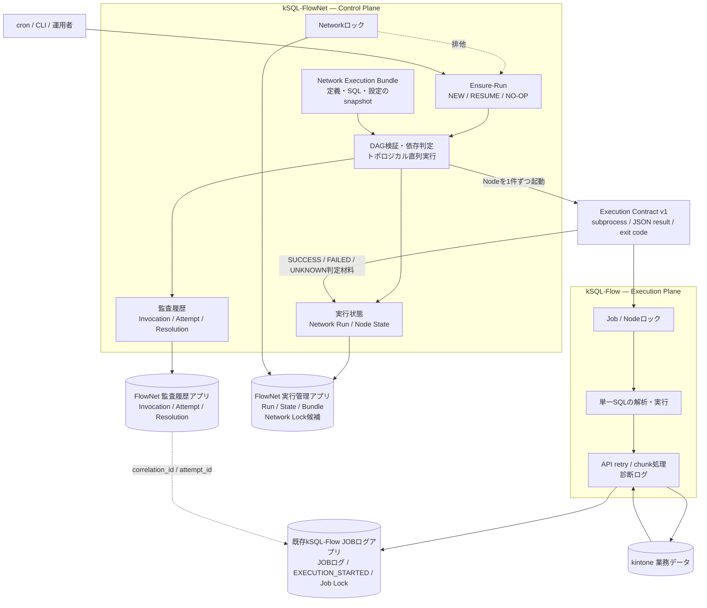

# kSQL-FlowNet 設計資料

このディレクトリは、kSQL-Flowを実行エンジンとして利用する上位Control Plane、kSQL-FlowNet（`ksql-flownet`）の設計資料を管理する。

文書状態はすべて提案段階である。Phase 0のcontract testとPhase 1の凍結ゲートが完了するまで、実装済みまたは保証済みとして扱わない。

## 推奨読順

1. [プロジェクト分離ADR](./architecture-separation-adr.md)

   なぜkSQL-Flow本体へ内蔵せず、別プロジェクトにするかを定義する。

2. [kSQL-Flow Execution Contract v1](./execution-contract-v1.md)

   Control PlaneとkSQL-FlowのCLI境界、JSON結果、終了コード、signal、互換性を定義する。

3. [現行kSQL-Flowの変更点](./current-ksql-flow-changes.md)

   Control Plane（kSQL-FlowNet）連携のためにkSQL-Flowへ追加するもの、変更しないもの、実装順を整理する。

4. [実装計画](./implementation-plan.md)

   Phase 0からPhase 1凍結までの作業順、依存関係、成果物、完了ゲート、テスト戦略を定義する。

5. [ジョブネット管理 Phase 1仕様](./job-network-phase1-spec.md)

   DAG、Network Run、snapshot、resume、状態、ロック、監査モデルを定義する。

6. [対応可能なジョブネット例](./job-network-examples.md)

   直列、分岐・合流、並列候補、失敗伝播、resumeの具体例を示す。

7. [Phase 1仕様レビュー](./phase1-spec-review.md)

   R-01〜R-10のレビュー履歴と、FDR `D-15`〜`D-25`および`D-28`へ反映した根拠を記録する。

8. [Phase 1 Freeze Decision Record](./phase1-freeze-decision-record.md)

   確定事項、提案、実機検証待ち、運用決定待ち、凍結ゲートを管理する。

9. [P2-01 アプリ起点リラン仕様](./p2-01-app-rerun-spec.md)

   操作要求アプリからのRERUN・STOP・RELEASE、claim、heartbeat、STALE規則を定義する。

10. [P2-01 実装計画](./p2-01-implementation-plan.md)

    M0〜M4の変更範囲、単体試験、実機受入、本番接続gateを管理する。

11. [P2-01 実機E2E受入記録](./test-results/p2-01-20260901/README.md)

    受入1〜9の実機結果と、運用へ反映すべき`job_id`長制約を記録する。

12. [P2-08 導出プラグイン仕様](./p2-08-activity-plugin-spec.md)

    「00_Run状況」のactivity表示、read-only境界、配布・受入基準を定義する。

13. [P2-08 実装計画](./p2-08-implementation-plan.md)

    M1〜M4の実装方式、テスト、本番適用手順を管理する。

14. [P2-08 M3実機受入記録](./test-results/p2-08-20260901/README.md)

    CLIと画面の照合、GET限定、実機で確定した制約、E2E cleanupの付随発見を記録する。

15. [P2-09 ボード操作要求仕様](./p2-09-board-request-spec.md)

    ボードからのRERUN・STOP・RELEASE起票、2セクション表示、状態別の操作導線を定義する。

16. [P2-09 実装計画](./p2-09-implementation-plan.md)

    M0〜M4の実装・検証範囲と、本番適用準備のgateを管理する。

17. [P2-09 M3実機受入記録](./test-results/p2-09-20260901/README.md)

    起票の一気通貫、LOCK_CONFLICT後の回収・再要求、UNKNOWN裁定、2セクション/pending表示の実機結果を記録する。

## 責務境界

| コンポーネント | 主な責務 |
| --- | --- |
| kSQL-Flow | SQL解析・実行、kintone API、リトライ、チャンク、Nodeロック、単一ジョブ結果 |
| kSQL-FlowNet | DAG、Network Run、snapshot、ensure-run、Networkロック、監査、DAG-aware resume |

Control Plane（kSQL-FlowNet）は「何を、どの順序で、再開可能か」を判断し、Execution Plane（kSQL-Flow）は「単一ジョブを安全に実行する」ことへ集中する。NodeロックはkSQL-Flowが所有し、Networkロックと業務上の状態・監査はkSQL-FlowNetが所有する。

## kintoneアプリ構成

Phase 0時点の第一候補は、FlowNet用の新規2アプリと既存kSQL-Flow JOBログアプリを組み合わせる構成である。

| アプリ | 主なレコード | 所有者 |
| --- | --- | --- |
| FlowNet 実行管理アプリ | Network Run、Node State、実行バンドル、Network Lock候補 | kSQL-FlowNet |
| FlowNet 監査履歴アプリ | Run Invocation、Node Attempt、Attempt Resolution、運用監査イベント | kSQL-FlowNet |
| 既存kSQL-Flow JOBログアプリ | JOB実行ログ、耐久`EXECUTION_STARTED`、Job Lock、相関フィールド | kSQL-Flow |

「1アプリ／2アプリ比較」はFlowNetが新設するアプリだけを指す。既存JOBログアプリは統合せず、Node AttemptとJOBログを`correlation_id`／`attempt_id`で関連付ける。Network Lockの配置を含む最終構成は、Phase 0の障害注入、API回数、ACL、revision競合、reconciliationの実測後に決定する。

## Phase概要

| Phase | 成果物 |
| --- | --- |
| Phase 0 | Execution Contract v1、通常runのJSON結果、correlation ID、capability、profile/job検査、耐久開始イベント、Network lock recovery、contract test |
| Phase 1 | kSQL-Flow executorだけを使う直列DAG、ensure-run、snapshot、resume、renewable Network lease、read-only status、監査 |
| Phase 2 | trigger rule、制御された並列化、resource pool、executor adapter拡張 |
| Phase 3 | 文・チャンク単位の再開、分散worker |
| Phase 4 | RBAC、承認、SLO、管理UI、災害復旧 |

ジョブネットの具体的な形とPhaseごとの実行方法は、[対応可能なジョブネット例](./job-network-examples.md)を参照する。

## 重要な非目標

- Phase 1で任意shell、Python、HTTP executorを提供しない。
- kSQL-Flowの既存`run-all`を削除しない。
- snapshotで外部データやkintoneの状態まで完全再現できるとは主張しない。
- kintoneの重複禁止制約を公式CAS保証とは表現しない。
- 未確認の実行を推測で`FAILED`または`SUCCESS`にしない。
