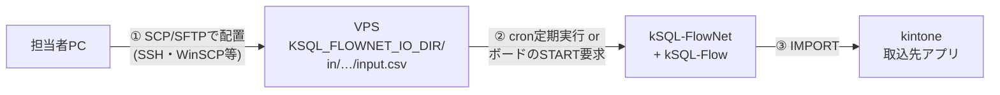
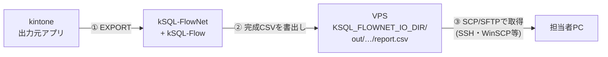

# CSV入出力の運用 — ファイルの配置と取り出し

network定義の `nodes[].inputs` / `nodes[].outputs` を使うCSV取込・出力について、**誰が・どこへ・どうやってCSVファイルを置き、どうやって取り出すか**の構成と手順を定める。機能仕様は[統合仕様書](./specification.md)、設計判断は internal/csv-io-implementation-plan.md を正とする。

## 1. 構成

**取込(CSV → kintone)**



**出力(kintone → CSV)**



- ファイル転送路は**既存のSSHだけ**を使う。本製品の設計方針(受信ポート開放なし・常駐サービスなし)を維持する
- SSHでの配置・取り出しは**二次対応者(サーバー管理者)の作業**。一次対応者はkintoneボードでの起票・状態確認のみを行う(既存の役割分担どおり)

## 2. サーバー準備(初回のみ)

1. IOルートを作成する。FlowNetが要求するのは「絶対パスの既存ディレクトリで、FlowNet実行ユーザーが読み書きできること」だけであり、root実行は要求しない。**CSV授受のためにroot鍵を配らない**よう、転送用アカウントを作ってIOルートだけに書込権限を与える:

   ```sh
   useradd -m -s /bin/bash csvxfer                  # 転送用アカウント(SSH鍵は本人分のみ)
   mkdir -p /opt/ksql/io/in /opt/ksql/io/out
   chown -R csvxfer:csvxfer /opt/ksql/io
   chmod 750 /opt/ksql/io                            # FlowNet実行ユーザーがrootなら読み書き可
   ```

   この所有権設定は`csvxfer`にIOルート外へ書き込ませないためのもので、ファイルシステム上に閉じ込めるものではない(通常のシェルにログインできる)。本番では`sshd_config`の`Match User csvxfer`に`ForceCommand internal-sftp`と`ChrootDirectory`を設定してSFTP専用にし、対話シェルや任意コマンドを許可しない。`ChrootDirectory`はroot所有・一般ユーザー書込み不可が必要なため、`/opt/ksql/io`を`csvxfer`所有のままchroot先にはできない。chroot先(例: `/srv/csvxfer`、root所有755)の配下に`csvxfer`が書込める`in/`と読取れる`out/`を置き、`KSQL_FLOWNET_IO_DIR`をそこに合わせる。FlowNet実行ユーザーがroot以外の場合は、そのユーザーをcsvxferグループへ加えるかACLで`in/`読取・`out/`書込を許可し、FlowNetが作った出力ファイルを`csvxfer`が読めるモード・グループになることを確認する。既存本番のように管理者がroot鍵でSSHする構成を続ける場合は、鍵を持つ人を二次対応者に限定する

2. FlowNetの環境ファイル(例: `/root/.ksql-flownet.env`)へ追加する:

   ```sh
   export KSQL_FLOWNET_IO_DIR=/opt/ksql/io          # 絶対パス・存在必須
   # export KSQL_FLOWNET_IO_RETENTION_DAYS=90       # 入力ファイルの保持期限(既定90日)
   ```

3. network定義へ `inputs` / `outputs` を宣言する(例):

   ```yaml
   nodes:
     - id: import_sales
       job_id: sales_import
       sql: jobs/sales_import.sql
       idempotent: true
       inputs:
         source: sales/{business_key}/{profile}/input.csv
     - id: export_report
       job_id: sales_report
       sql: jobs/sales_report.sql
       depends_on: [import_sales]
       idempotent: true
       outputs:
         report: sales/{business_key}/{run_id}/report.csv
   ```

   - `inputs` のプレースホルダ: `{business_key}` `{profile}`
   - `outputs` は加えて `{run_id}` `{node_id}` が使える。`{run_id}` を含めると**別Run(補正キー等)の出力が同じファイルを上書きしない**。ただし同一Runの `--rerun-from` は同じ `run_id` なので同一パスへ全量置換される(再実行履歴を残す仕組みではない)
4. バージョン前提: kSQL-Flow 0.8.0以上(取込)/0.9.0以上(出力)。capability不足はロック取得前に拒否される(fail-closed)
5. `validate` と対象networkの試験実行で経路を確認してから運用に載せる

## 3. 入力CSVを置く手順(取込)

1. **置き先のパスを確定する。** `in/` + inputsテンプレートのプレースホルダ展開:

   - 例: business_key=`monthly_sales@2026-09`、profile=`prod` →
     `/opt/ksql/io/in/sales/monthly_sales%402026-09/prod/input.csv`
   - **プレースホルダの値はpercent encodingされる。** 英数字と `-` `_` `~` 以外の文字(`@` `:` `.` 空白・日本語など)は `%XX` に変換される(`@` → `%40`。RFC 3986のunreservedより厳しく`.`も対象。テンプレート側に書いた`input.csv`の`.`は値ではないため変換されない)。記載どおりの生の `@` で置くと `INPUT_FILE_MISSING` になる。`plan` 等は実パスを表示しないため、記号を含むキーでは変換後のパスを確認する

2. **転送する。** Windowsからの例:

   ```powershell
   $dir = "/opt/ksql/io/in/sales/monthly_sales%402026-09/prod"
   ssh -i <SSH鍵> csvxfer@<VPS> "mkdir -p $dir"
   scp -i <SSH鍵> C:\work\input.csv "csvxfer@<VPS>:$dir/input.csv.part"
   ssh -i <SSH鍵> csvxfer@<VPS> "mv $dir/input.csv.part $dir/input.csv"
   ```

   上の`scp`・`ssh`例はシェルログイン可能な`csvxfer`を前提にしている。`internal-sftp`専用にした本番では`ssh`によるコマンド実行はできないため、SFTPクライアントの`mkdir`・`put`・`rename`を使う(chroot後はクライアントから見えるパスもchroot内の相対パスになる):

   ```text
   sftp> mkdir in/sales
   sftp> mkdir in/sales/monthly_sales%402026-09
   sftp> mkdir in/sales/monthly_sales%402026-09/prod
   sftp> put input.csv in/sales/monthly_sales%402026-09/prod/input.csv.part
   sftp> rename in/sales/monthly_sales%402026-09/prod/input.csv.part in/sales/monthly_sales%402026-09/prod/input.csv
   ```

   SFTPの`mkdir`には`-p`がないため階層を順に作る。既存ディレクトリへの`mkdir`をエラーにするクライアントもあるので、定型運用では初期ディレクトリの作成を管理者作業にし、日常操作を`put`と`rename`だけにしてよい。

   **完成名へ直接アップロードしない。** 転送途中にcronが発火すると、途中まで転送されたファイルをFlowNetが読み、そのsha256がbaselineになる。`.part`等の一時名で転送し、転送完了後に同一ディレクトリ内でrenameして公開する(同一ファイルシステム内のrenameは原子的で、cronは完成名しか参照しない)
3. **文字コードはSQLのIMPORT定義に合わせる**(UTF-8またはShift_JIS)。不一致はdecode失敗として実行時に拒否される
4. **配置してから起動する。** cron定期実行なら次回発火を待ち、随時ならボードのSTART要求(または`run-network`)で起動する
5. 完走はボード(Run状況)で確認する。Node Attemptの要約に取込ファイルのsha256・行数・encodingが記録される

### 取込の不変条件(重要)

- **Run開始後に完成パスのファイルを上書き・削除しない。** 初回読取時のsha256がbaselineとして記録され、失敗後のresume / rerun-fromで**再実行対象になる取込ノード**は同一バイトのファイルを要求する(`INPUT_FILE_MUTATED`で拒否。SUCCESS済みで保持されるノードは照合しない)。これは差し替えを検出して再開を拒否する仕組みであり、実行中のファイルをOSレベルでロックするものではない。初回読取中の上書きまでは防げないため、Run開始後は触らない運用が前提
- 内容を直したい場合は、**新しいbusiness_key(補正キー等)で新しいRunとして取り込む**
- 入力ファイルはresumeに備えて**Runが終端するまで元のパスへ保持**する。保持期限は**Run作成から既定90日**で、超過後のresumeは`INPUT_RETENTION_EXPIRED`で拒否される。`KSQL_FLOWNET_IO_RETENTION_DAYS`は自動削除の設定ではなく、期限超過Runの再開を拒否する判定値である。実ファイルの削除は別途運用する
- 取込SQLは重複禁止キーへの`ON DUPLICATE`パターン(仕様書参照)にしておくと、chunk途中失敗→resumeでも各キー1件へ収束する(実測済み)

## 4. 出力CSVを取り出す手順

1. 出力先は `out/` + outputsテンプレートの展開先:

   - 例: `/opt/ksql/io/out/sales/monthly_sales%402026-09/netrun_xxxx/report.csv`(§3と同じくプレースホルダ値はpercent encodingされる)

2. **完成したファイルだけが現れる**(atomic write)。途中失敗時に壊れた一時ファイルは残らず、既存ファイルも不変。Runが`SUCCESS`になってから取得する
3. 取得例(`scp`はシェルログイン可能な検証構成のホスト側パス。SFTP専用のchroot構成では`get out/…/report.csv`のようにchroot内のパスを指定する):

   ```powershell
   scp -i <SSH鍵> csvxfer@<VPS>:/opt/ksql/io/out/sales/monthly_sales%402026-09/netrun_xxxx/report.csv C:\work\
   ```

   ```text
   sftp> get out/sales/monthly_sales%402026-09/netrun_xxxx/report.csv
   ```

4. 内容の照合が必要な場合、Node Attempt要約の`output_files`(sha256・行数・encoding)と突き合わせる。検証データを変更しない実機試験では同一Runの`--rerun-from`で同一sha256になった。ただし`as_of`は時刻関数の基準を固定するもので、kintoneレコードのスナップショットではない。再実行までに参照データが変われば同一Runでも出力内容とsha256は変わり得る
5. 出力先(取引先システム等)が`cli-kintone`でkintoneへ取り込む場合もそのまま使える — kSQLのUTF-8出力は`cli-kintone record import`互換の値表現で出力される(実機検証済み)
6. 取得済みの出力ファイルの削除は任意。`{run_id}`を含むパス設計なら別Run間の上書きは起きないため残してもよい(同一Runのrerun-fromは同一パスを置換する — §2)

## 5. 安全規則とエラー早見

- 入出力パスは**IOルート配下に封じ込め**られる。ルート外を指すパス・symlink/junctionは拒否される
- 監査・結果JSONへ**CSVのセル値・絶対パスは記録されない**(相対情報とsha256のみ)
- APIトークンやSSH鍵をCSVと同じ場所に置かない

| エラーコード | 意味 | 対処 |
| --- | --- | --- |
| `INPUT_FILE_MISSING` | 展開先パスにファイルが無い | パス展開(business_key/profile)を確認して配置し、resume |
| `INPUT_FILE_MUTATED` | resume時にbaselineとバイト不一致 | 元ファイルを復元してresume。内容変更は新business_keyで |
| `INPUT_RETENTION_EXPIRED` | baselineが保持期限超過 | 新business_keyで再取込(古いRunは打ち切り裁定) |
| `INPUT_PATH_REJECTED` | ルート外・symlink等の不正パス | 定義テンプレートと実パスを是正 |
| `OUTPUT_PATH_REJECTED` | 出力先が封じ込め違反 | outputsテンプレートを是正 |
| capability拒否 | kSQL-Flow/engineが機能未対応 | サーバーのkSQL-Flowを0.8/0.9以上へ更新 |
