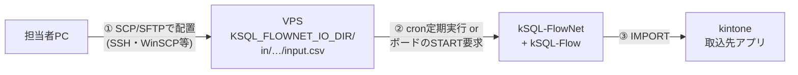
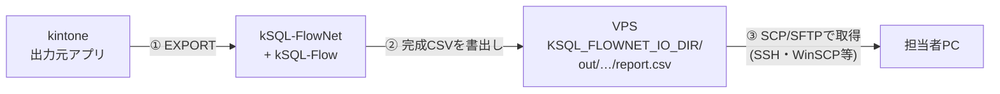

# CSV入出力の運用 — ファイルの配置と取り出し

network定義の `nodes[].inputs` / `nodes[].outputs` を使うCSV取込・出力について、**誰が・どこへ・どうやってCSVファイルを置き、どうやって取り出すか**の構成と手順を定める。機能仕様は[統合仕様書](./specification.md)、設計判断は internal/csv-io-implementation-plan.md を正とする。

## 1. 構成

**取込(CSV → kintone)**



**出力(kintone → CSV)**



出力CSVをそのまま別のkintoneアプリへ取り込むだけなら、③で取り出さずにVPS上から`cli-kintone record import`で直接取り込める(§4)。

- ファイル転送路は**既存のSSHだけ**を使う。本製品の設計方針(受信ポート開放なし・常駐サービスなし)を維持する
- SSHでの配置・取り出しは**二次対応者(サーバー管理者)の作業**。一次対応者はkintoneボードでの起票・状態確認のみを行う(既存の役割分担どおり)
- 出力CSVをkintoneへ戻す用途なら、ファイルを手元へ取り出さず**VPS上から`cli-kintone record import`で直接取り込む**経路もある(実機検証済み — §4)

## 2. サーバー準備(初回のみ)

1. IOルートを作成する(rootのみアクセス可を推奨):

   ```sh
   mkdir -p /opt/ksql/io/in /opt/ksql/io/out
   chmod 700 /opt/ksql/io
   ```

2. FlowNetの環境ファイル(例: `/root/.ksql-flownet.env`)へ追加する:

   ```sh
   export KSQL_FLOWNET_IO_DIR=/opt/ksql/io          # 絶対パス・存在必須
   # export KSQL_FLOWNET_IO_RETENTION_DAYS=90       # 入力ファイルの保持期限(既定90日)
   ```

3. network定義へ `inputs` / `outputs` を宣言する(例):

   ```yaml
   nodes:
     - id: import_sales
       job_id: sales_import
       sql: jobs/sales_import.sql
       idempotent: true
       inputs:
         source: sales/{business_key}/{profile}/input.csv
     - id: export_report
       job_id: sales_report
       sql: jobs/sales_report.sql
       depends_on: [import_sales]
       idempotent: true
       outputs:
         report: sales/{business_key}/{run_id}/report.csv
   ```

   - `inputs` のプレースホルダ: `{business_key}` `{profile}`
   - `outputs` は加えて `{run_id}` `{node_id}` が使える。**再実行ごとに別ファイルにしたい場合は`{run_id}`を含める**
4. バージョン前提: kSQL-Flow 0.8.0以上(取込)/0.9.0以上(出力)。capability不足はロック取得前に拒否される(fail-closed)
5. `validate` と対象networkの試験実行で経路を確認してから運用に載せる

## 3. 入力CSVを置く手順(取込)

1. **置き先のパスを確定する。** `in/` + inputsテンプレートのプレースホルダ展開:

   - 例: business_key=`monthly_sales@2026-09`、profile=`prod` →
     `/opt/ksql/io/in/sales/monthly_sales@2026-09/prod/input.csv`

2. **転送する。** Windowsからの例:

   ```powershell
   scp -i <SSH鍵> C:\work\input.csv root@<VPS>:/opt/ksql/io/in/sales/monthly_sales@2026-09/prod/input.csv
   ```

   WinSCP(SFTP)でも同じパスへ置けばよい。中間ディレクトリは事前に作る(`ssh ... mkdir -p`)か、SFTPクライアントで作成する
3. **文字コードはSQLのIMPORT定義に合わせる**(UTF-8またはShift_JIS)。不一致はdecode失敗として実行時に拒否される
4. **配置してから起動する。** cron定期実行なら次回発火を待ち、随時ならボードのSTART要求(または`run-network`)で起動する
5. 完走はボード(Run状況)で確認する。Node Attemptの要約に取込ファイルのsha256・行数・encodingが記録される

### 取込の不変条件(重要)

- **Run開始後にファイルを差し替えない。** 初回読取時のsha256がbaselineとして記録され、失敗後のresumeは**同一バイトのファイル**を要求する(`INPUT_FILE_MUTATED`で拒否)
- 内容を直したい場合は、**新しいbusiness_key(補正キー等)で新しいRunとして取り込む**
- 入力ファイルはresumeに備えて**Runが終端するまで元のパスへ保持**する。保持期限(既定90日)を過ぎたresumeは`INPUT_RETENTION_EXPIRED`で拒否される
- 取込SQLは重複禁止キーへの`ON DUPLICATE`パターン(仕様書参照)にしておくと、chunk途中失敗→resumeでも各キー1件へ収束する(実測済み)

## 4. 出力CSVを取り出す手順

1. 出力先は `out/` + outputsテンプレートの展開先:

   - 例: `/opt/ksql/io/out/sales/monthly_sales@2026-09/netrun_xxxx/report.csv`

2. **完成したファイルだけが現れる**(atomic write)。途中失敗時に壊れた一時ファイルは残らず、既存ファイルも不変。Runが`SUCCESS`になってから取得する
3. 取得例:

   ```powershell
   scp -i <SSH鍵> root@<VPS>:/opt/ksql/io/out/sales/monthly_sales@2026-09/netrun_xxxx/report.csv C:\work\
   ```

4. 内容の照合が必要な場合、Node Attempt要約の`output_files`(sha256・行数・encoding)と突き合わせる。同一Runの`--rerun-from`では同一sha256になることを実測済み
5. **kintoneへ戻すのが目的なら**、取り出さずにVPS上で取り込める:

   ```sh
   cli-kintone record import --base-url https://<subdomain>.cybozu.com \
     --app <アプリID> --api-token $TOKEN --update-key <一意キー> \
     --file-path /opt/ksql/io/out/.../report.csv
   ```

   (kSQLのUTF-8出力はcli-kintone互換の値表現で出力される — 実機検証済み)
6. 取得済みの出力ファイルの削除は任意。`out/`はFlowNetが上書きしないパス設計(`{run_id}`使用時)なら削除せず残してもよい

## 5. 安全規則とエラー早見

- 入出力パスは**IOルート配下に封じ込め**られる。ルート外を指すパス・symlink/junctionは拒否される
- 監査・結果JSONへ**CSVのセル値・絶対パスは記録されない**(相対情報とsha256のみ)
- APIトークンやSSH鍵をCSVと同じ場所に置かない

| エラーコード | 意味 | 対処 |
| --- | --- | --- |
| `INPUT_FILE_MISSING` | 展開先パスにファイルが無い | パス展開(business_key/profile)を確認して配置し、resume |
| `INPUT_FILE_MUTATED` | resume時にbaselineとバイト不一致 | 元ファイルを復元してresume。内容変更は新business_keyで |
| `INPUT_RETENTION_EXPIRED` | baselineが保持期限超過 | 新business_keyで再取込(古いRunは打ち切り裁定) |
| `INPUT_PATH_REJECTED` | ルート外・symlink等の不正パス | 定義テンプレートと実パスを是正 |
| `OUTPUT_PATH_REJECTED` | 出力先が封じ込め違反 | outputsテンプレートを是正 |
| capability拒否 | kSQL-Flow/engineが機能未対応 | サーバーのkSQL-Flowを0.8/0.9以上へ更新 |
