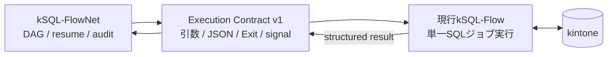

# 現行kSQL-Flowの変更点

- 文書状態: **PROPOSED**
- 対象: kSQL-FlowNetとの連携に必要なkSQL-Flow側の変更
- 基準バージョン: kSQL-Flow 0.6.0
- 詳細契約: [kSQL-Flow Execution Contract v1](./execution-contract-v1.md)
- 変更記録: 2026-08-30: `SQL_ERROR`のExit対応を3→1へ修正（kSQL-Flow公開仕様7.1との整合。kSQL-Flowからの疑義文書による再審議）

---

## 1. 結論

現行kSQL-FlowへDAG、Network Run、業務状態管理を内蔵しない。kSQL-Flowは単一ジョブのExecution Planeとして維持し、変更を**オーケストレータから安全に呼び出すためのversion付きCLI契約**に限定する。



SQL実行、kintone API、リトライ、チャンク、Jobロックは現行実装を利用する。DAG、snapshot、ensure-run、Networkロックは新プロジェクト側で実装する。

---

## 2. 必須変更

| 項目 | 現行 | 変更後 |
| --- | --- | --- |
| 通常runの結果 | 人間向けメッセージとExit Code | Execution Result v1 JSONを追加 |
| JSONオプション | `--json`はdry-run専用 | 通常run用`--result-json <path\|->`を追加 |
| 親子相関 | `batchId`中心 | `correlationId`と`attemptId`を受け取る |
| 実行識別 | 内部UUIDの`batchId` | 契約上の`executionId`を返す |
| エラー詳細分類 | 主に内部statusとExit Code | 安定した`resultCode`を返す |
| stdout | 進捗や結果を人間向けに出力 | JSONモードではJSON objectだけを出力 |
| Capability | 確認手段なし | `capabilities --json`を追加 |
| profile照合 | orchestrator向け取得手段なし | `describe-profile --json`を追加 |
| job検査 | 構造化された論理ID・非決定要素の取得手段なし | `inspect-job --json`を追加 |
| SQL開始証跡 | 最終結果とJOB開始状態を区別できない | 耐久`EXECUTION_STARTED`イベントを追加 |
| signal | 契約化されていない | graceful cancelと結果不明境界を定義 |
| 契約試験 | 現行CLIの引数・Exit試験 | JSON Schema、ID、Exit、signalを追加 |

### 2.1 CLIオプション

```bash
ksql-flow run \
  -f <snapshot-sql-path> \
  --profile <profile> \
  --config <config-path> \
  --as-of <ISO-8601> \
  --result-json - \
  --correlation-id <network-run-id> \
  --attempt-id <node-attempt-id> \
  --expected-job-id <job-id>
```

追加するオプション:

| オプション | 用途 |
| --- | --- |
| `--result-json <path\|->` | 通常runの構造化結果。`-`はstdout |
| `--correlation-id <id>` | Network Run等の親相関ID |
| `--attempt-id <id>` | Node Attemptの識別子 |
| `--expected-job-id <id>` | DAGの`job_id`。SQL論理job IDとの一致を実行前に検証 |

既存`--json`はdry-run専用のまま維持する。意味を変更して通常run用に流用しない。

### 2.2 構造化結果

現行`JobOutcome`にある次の値を利用してExecution Resultを構築する。

- job名、script名
- status、Exit Code
- 開始・終了日時
- 読取、書込、削除件数
- API呼出回数
- `lastWrittenKey`
- エラーメッセージ

追加または正規化が必要な値:

- `formatVersion`
- `contract`
- `correlationId`
- `attemptId`
- `executionId`
- `resultCode`
- `executionStarted`
- kSQL-Flow／SQL engine version
- エラーcategoryと安定code

初期実装では、単一runごとに生成済みの`batchId`を`executionId`として公開し、既存ログの`batch_id`も維持する案を推奨する。別IDを新設する場合は、発行時点とログ書込み失敗時の扱いを先に決定する。

### 2.3 stdoutとstderr

`--result-json -`指定時:

- stdoutはUTF-8、BOMなしのJSON object 1個と末尾改行だけとする。
- 進捗、警告、ヒントはstderrへ出す。
- ANSI escapeをstdoutへ出さない。
- stderrの文言を機械判定に使用しない。

`--result-json <path>`指定時は、一時ファイルへの書込み、flush、atomic renameによって途中JSONを完成結果として見せない。

### 2.4 相関IDと監査ログ

次の追跡を可能にする。

```text
Network Run
  └─ Node Attempt
       └─ kSQL-Flow executionId
            └─ JOB record / JSONL event
```

JOBログとJSONLへ可能な範囲で次を追加する。

- `correlation_id`
- `attempt_id`
- `execution_id`
- `job_id`
- `runner_execution_started_at`

これらは監査相関専用であり、認証、Jobロック、冪等キーには使用しない。kintoneログアプリへフィールドを追加する場合は、既存アプリの移行手順と旧schemaとの互換性を用意する。

### 2.5 Capability確認

```bash
ksql-flow capabilities --json
```

最低限、次を返す。

- kSQL-Flow version
- SQL engine version
- 対応するExecution Contract
- structured result対応
- correlation ID対応
- graceful cancel対応状況
- Jobロックprotocol

orchestratorは実行開始前に要求Capabilityを検証し、不一致ならNodeを起動しない。

### 2.6 profileとjobの検査

```bash
ksql-flow describe-profile --profile <profile> --config <path> --json
ksql-flow inspect-job -f <snapshot-sql-path> --profile <profile> --config <path> --json
```

`describe-profile`は秘密を除いた接続先、guest space、timezone、app ID、limitsを返す。`inspect-job`は論理`jobId`、構文検証結果、検出可能な非決定要素を返す。orchestratorはconfigを独自に解釈せず、これらの出力をsnapshotとmanifestの検証に使用する。

### 2.7 SQL開始の耐久証跡

orchestrator経由では、kSQL-Flowは最初のSQL文を開始する直前にkintone JOBログへ`EXECUTION_STARTED`をrevision付きで永続化し、成功応答を確認してからSQLを開始する。ローカルJSONLは補助証跡とし、別ホストからの復旧判断の正本にはしない。JOBログ更新を確認できない場合はfail-closedとし、orchestrator経由の`--lock local-only`を禁止する。

### 2.8 JOBログschema移行とforce-unlock回復契約

相関フィールドと`runner_execution_started_at`を既存JOBログアプリへ追加するため、旧schemaとの互換期間、app template version、既存レコードの未設定値、rollback手順を用意する。

Job lockのforce-unlockはkSQL-Flowが所有するversion付き回復契約として定義する。旧保持者停止確認を必須入力とし、対象lock、認証主体、確認者、理由、証拠参照、解除結果を機械可読に返す。応答消失時に解除済みか確認できなければfail-closedとする。FlowNetへJob lockレコードの直接変更を許可しない。

---

## 3. 状態とresultCodeの変換

既存の内部statusやログを一度に全面変更せず、Execution Contractへの出力境界で正規化する。

| 現行kSQL-Flow結果 | Contract `status` | `resultCode` | Exit |
| --- | --- | --- | --- |
| `SUCCESS` | `SUCCESS` | `OK` | 0 |
| `NO_DATA` | `SUCCESS` | `NO_DATA` | 0 |
| `ABORTED` | `FAILED` | `ASSERT_FAILED` | 2 |
| runner自身が検知した`TIMEOUT` | `FAILED` | `EXECUTION_TIMEOUT` | 3 |
| SQL実行エラー | `FAILED` | `SQL_ERROR` | 1 |
| API／認証エラー | `FAILED` | `API_ERROR` / `AUTH_ERROR` | 3 |
| ロック状態を安全に確定できない | `FAILED` | `LOCK_UNAVAILABLE` | 3 |
| 既存Jobロックとの競合 | `FAILED` | `LOCK_CONFLICT` | 5 |
| graceful cancel完了 | `CANCELLED` | `CANCELLED` | 3 |

kSQL-Flowプロセスが有効な結果JSONを返せない場合、kSQL-Flowが`UNKNOWN`を返したとは扱わない。JSONなし、破損、ID不一致、Exit不一致、強制終了は、orchestratorがNode Attemptを`UNKNOWN`へ遷移させる。

他プロセスがstale leaseを発見したケースは、runner自身が確定したtimeoutと区別する。旧プロセスの停止を確認するまで自動再実行しない。

---

## 4. Signalと停止制御

現行kSQL-FlowにはExecution Contractとして保証されたSIGINT／SIGTERM処理がないため、Phase 0で次を追加または実測する。

1. graceful signal受信後は、新しいSQL文と書込chunkを開始しない。
2. 実行中requestを安全に止められない場合は、完了またはtimeoutを待つ。
3. 結果とログを確定してからロックを解放する。
4. 停止確認済みなら`CANCELLED`結果を返す。
5. forced kill、ホスト消失、結果出力失敗は`UNKNOWN`の材料とする。

WindowsとUnixで停止動作が異なるため、両環境のcontract testが必要である。graceful cancel未実装の間はCapabilityを`false`として公開し、対応済みと偽らない。

---

## 5. Jobロックキー

Phase 0の初期段階では、現行の次の形式を維持する。

```text
{profile}:{job_id}
```

ここで`job_id`は現行kSQL-Flowの`job.name`に相当し、DAGの`node_id`とは別である。`J1:<base64url(SHA-256(...))>`形式は提案段階であり、今回の連携開始に必須ではない。

採用する場合は、次を同時移行する。

- 単体`ksql-flow run`
- `ksql-flow run-all`
- orchestrator経由のNode実行
- kintoneログアプリの既存ロックレコード
- stale回収とunlock
- ロック競合・互換性テスト

片方だけ変更すると、単体実行とジョブネット実行の相互排他が成立しない。Networkロックはorchestratorが所有し、kSQL-FlowのJobロックとは別に管理する。

---

## 6. 変更しない範囲

次の機能は現行kSQL-Flowに残し、ジョブネット対応のために再実装しない。

- SQLファイルの解析、検証、実行
- kintone APIの読書き
- HTTP retryとAPI上限
- statement／chunk処理
- 単一ジョブのJobロック
- JOBログ、statement／chunk診断ログ
- dry-runとdry-run用`--json`
- 現行`run-all`
- 既存の単一ジョブCLI利用方法

既存利用者がkSQL-FlowNetを導入しなくても、従来どおりkSQL-Flowだけを使用できることを互換性条件とする。

---

## 7. kSQL-Flowへ実装しないもの

次はkSQL-FlowNet側の責務である。

- DAG定義、循環検証、トポロジカル順
- Network Runとbusiness key
- Run Invocation、Node State、Node Attempt、Attempt Resolution
- Network Execution Bundleとsnapshot
- ensure-run、resume、rerun-from
- Networkロック
- DAG-aware依存判定
- `UNKNOWN`解決イベント
- archive、保持、承認、監査projection

---

## 8. 推奨実装順

| 順序 | 作業 | 完了条件 |
| --- | --- | --- |
| 1 | Execution Resultの型、JSON Schema、resultCodeを確定 | 正常・失敗結果を一意に検証できる |
| 2 | CLIオプションとstructured result出力 | stdout／fileの両方で結果を取得できる |
| 3 | correlation／attempt／execution IDのログ伝播 | Network RunからJOBログまで追跡できる |
| 4 | `describe-profile`と`inspect-job` | profile、job ID、非決定要素を構造化検証できる |
| 5 | capability command | orchestratorが開始前に互換性を判定できる |
| 6 | 耐久`EXECUTION_STARTED` | 結果欠損時にSQL開始可能性を安全側に判断できる |
| 7 | controlled failureの結果出力 | 検証、ASSERT、API、timeout、lockを分類できる |
| 8 | signalとcancel | Windows／Unixで停止境界を説明できる |
| 9 | contract testと回帰試験 | 既存run、run-all、dry-runを壊していない |
| 10 | JOBログschema移行とforce-unlock回復契約 | 旧schema互換、停止確認、応答消失時の照会を検証できる |

---

## 9. Phase 0受入基準

- [ ] `--result-json -`のstdoutにJSON以外が混入しない。
- [ ] path出力で途中JSONが完成結果として観測されない。
- [ ] JSONのExit Codeと実プロセスExit Codeが一致する。
- [ ] `correlationId`と`attemptId`が入力値と一致する。
- [ ] JOBログ／JSONLからNode Attemptを追跡できる。
- [ ] `SUCCESS`、`NO_DATA`、ASSERT、timeout、API失敗、ロック競合を安定分類できる。
- [ ] JSONなし、破損、ID不一致、Exit不一致をorchestratorが`UNKNOWN`にする。
- [ ] capability不一致ではSQLを実行しない。
- [ ] `describe-profile`不一致、`expected-job-id`不一致、未承認の非決定要素を実行前に拒否する。
- [ ] `node_id != job_id`でも単体runとorchestrator経由実行が同じJobロックで競合する。
- [ ] JOB `EXECUTION_STARTED`更新を確認できない場合にSQLを開始しない。
- [ ] `executionStarted`とresultCodeの矛盾を不正結果として拒否する。
- [ ] 既存`run-all`のExit Codeとresume動作が退行しない。
- [ ] WindowsとUnixでsignal／forced kill試験を実施する。
- [ ] JOBログアプリの相関フィールド追加が旧schema・既存レコードと共存し、rollbackできる。
- [ ] force-unlockが旧保持者停止確認なしでは拒否され、結果を機械可読に照合できる。

本受入基準を満たすまでは、Execution Contract v1を`ACCEPTED`または実装済みとして扱わない。
