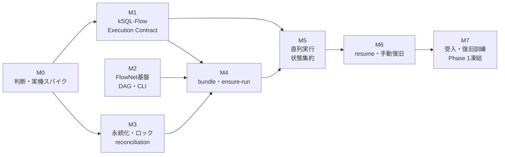

# kSQL-FlowNet 実装計画

- 文書状態: **PROPOSED**
- 対象: Phase 0導入準備およびPhase 1直列ジョブネット
- 作成日: 2026-08-29
- 製品: kSQL-FlowNet
- リポジトリ: `ksql-flownet`
- npmパッケージ: `@rex0220/ksql-flownet`
- CLI: `ksql-flownet`
- レビュー反映: 2026-08-29 ClaudeCodeレビュー（依存グラフ、capability、force-unlock、旧run-all移行、Network lease drain、status CLI、runtime停止確認、受入依存）

## 1. 目的

本計画は、[Phase 1仕様](./job-network-phase1-spec.md)を、安全性を検証しながら実装へ移すための作業順と完了条件を定義する。

実装は次の原則に従う。

- kSQL-Flowは単一ジョブのExecution Planeとして維持する。
- kSQL-FlowNetはDAG、Network Run、resume、監査を扱うControl Planeとする。
- Phase 0のExecution Contractが成立するまで、実ジョブを呼び出すPhase 1機能を完成扱いにしない。
- 未確定のADRを実装都合で黙って確定しない。スパイク結果を残して判断する。
- 不明な実行結果は`UNKNOWN`とし、推測で再実行しない。
- Phase 1は直列実行と`all_success`に限定する。
- 外部ジョブスケジューラは論理予定日時による起動だけを担当し、FlowNetはensure-runとDAG順序を担当する。Phase 1へcron式、常駐ポーリング、missed run補完を内蔵しない。

## 2. 正本と変更管理

| 対象 | 正本 |
| --- | --- |
| 製品境界・責務 | [プロジェクト分離ADR](./architecture-separation-adr.md) |
| kSQL-FlowとのCLI境界 | [Execution Contract v1](./execution-contract-v1.md) |
| kSQL-Flow側の変更 | [現行kSQL-Flowの変更点](./current-ksql-flow-changes.md) |
| Phase 1の機能・状態・受入基準 | [Phase 1仕様](./job-network-phase1-spec.md) |
| 未決事項と凍結条件 | [Freeze Decision Record](./phase1-freeze-decision-record.md) |

仕様と実装が一致しない場合は、コードへ合わせて仕様を上書きせず、FDRで再審議する。各マイルストーンの完了時に、正本、JSON Schema、テスト、CLI helpの差分を同じレビューで確認する。

## 3. 実装全体像



M1のkSQL-Flow変更とM2の純粋なDAG／CLI基盤は、Execution Result Schemaの草案と識別子規則を共有すれば並行して着手できる。ただしM1の完了とSchemaの確定はM0のSpike E完了後、M4の完了はM1のcapability／profile／job検査完成後とする。図の矢印はマイルストーンの完了依存を表し、着手可能時点とは区別する。

## 4. マイルストーン

### M0: 判断・実機スパイク

目的は、永続化、排他、bundle、運用権限を実装前に測定して決めることである。

作業:

1. FlowNetの1アプリ構成と2アプリ構成を同じ3ノードDAGで比較する。既存kSQL-Flow JOBログアプリは比較対象へ統合せず、全体構成では別アプリとして扱う。
2. Node Attempt追記後、Node State更新前後へ障害を注入する。
3. kintoneの重複禁止INSERTを複数プロセス、可能なら複数ホストで競合させる。
4. bundleのupload、download、SHA-256照合、破損、権限、上限候補サイズを測る。
5. 現行statusを発生原因付きfixtureから新status／result codeへ変換する。
6. canonical lock keyのtest vectorと旧キーからの移行方式を決める。
7. UNKNOWN解決の認証主体、証拠、承認、旧保持者停止確認を運用決定する。
8. Execution Result Schemaの草案を使ってSpike Eを行い、配布場所、version、互換規則を確定する。
9. Job lockのforce-unlockについて、所有者、kSQL-Flow側の回復契約、FlowNet監査、停止確認を決める。
10. Network lockのrenewable lease、heartbeat、lease token、stale判定、強制回収を、FlowNetプロセスkill、kintone一時断、Cloud Run Execution照会で検証する。

成果物:

- スパイクコードと再実行可能な手順
- API回数、payload、実行環境、障害注入結果
- FDR D-07〜D-14、D-22〜D-24、D-26、D-29の更新
- kintoneアプリ構成案、フィールド定義、ACL案。FlowNet新規アプリと既存kSQL-Flow JOBログアプリの所有境界、およびNetwork Lockの配置を含む。
- bundle保持・archive・復元方針

完了ゲート:

- `PROPOSED`、`VALIDATION_REQUIRED`、`OPERATIONS_REQUIRED`の各項目に、決定または明示的な後続ゲートがある。
- 未実測の排他挙動を保証として記述していない。
- Phase 1の永続スキーマを実装開始できる。

### M1: kSQL-Flow Execution Contract v1

対象リポジトリはkSQL-Flowである。既存`run`／`run-all`の互換性を維持しながら、Control Planeから安全に呼び出せる境界を追加する。

作業:

1. M0と並行してExecution Result型、JSON Schema、安定`resultCode`の草案を作り、Spike E後に確定する。
2. `--result-json`、`--correlation-id`、`--attempt-id`、`--expected-job-id`を追加する。`executionId`はkSQL-Flowが発行する出力値とし、FlowNetから入力しない。
3. stdout、stderr、結果ファイルの原子的な出力規則を実装する。
4. `capabilities --json`、`describe-profile --json`、`inspect-job --json`を追加する。
5. JOBログへ相関IDを伝播し、耐久`EXECUTION_STARTED`をSQL開始前に記録する。
6. ASSERT、timeout、API失敗、lock conflict、signalを安定分類する。
7. WindowsとUnixのgraceful／forced terminationをcontract testする。
8. kintone JOBログアプリへ相関フィールドを追加する移行手順と旧schema互換を実装する。
9. D-26で確定したJob lock recovery／force-unlock契約を実装する。

完了ゲート:

- [現行kSQL-Flowの変更点](./current-ksql-flow-changes.md)のPhase 0受入基準をすべて満たす。
- JSON欠損、破損、ID不一致、Exit Code不一致を呼出側が`UNKNOWN`と判定できる。
- 既存`run`、`run-all`、`dry-run`の回帰試験が通る。
- Execution Contract v1を`ACCEPTED`へ変更できる証拠が揃う。

### M2: kSQL-FlowNet基盤とDAG

外部I/Oへ依存しない純粋ロジックから実装する。

作業:

1. npm package、CLI entry point、build、lint、unit test、CIを構成する。
2. `network.yaml`のJSON Schemaとversion検証を実装する。
3. `network_id`、`node_id`、`job_id`、`business_key_policy`に加え、`network_lock.lease_duration_sec`と`network_lock.heartbeat_interval_sec`を検証する。両値は正の整数、`heartbeat_interval_sec < lease_duration_sec`、かつ`heartbeat_interval_sec <= lease_duration_sec / 3`を必須とする。
4. 未知キー、重複ID、存在しない依存、自己依存、未対応`trigger_rule`を拒否する。
5. Kahnのアルゴリズムで循環を検出する。
6. 定義順をtie-breakerにした安定トポロジカル順を生成する。
7. `scheduled_period`と`explicit`のbusiness key生成を実装する。

最初に提供するCLI:

```text
ksql-flownet validate <network>
ksql-flownet plan <network> [--scheduled-for <timestamp>]
ksql-flownet --version
ksql-flownet --help
```

完了ゲート:

- 直列、分岐・合流、複数開始点を決定的な順序へ変換できる。
- 循環、未知依存、重複、未対応値をSQL実行前に拒否する。
- `network_lock`の0、負数、heartbeatとleaseの同値、`lease_duration_sec / 3`超過を境界値試験で拒否し、有効な最小値と境界値を受理する。
- timezone、月跨ぎ、年跨ぎのbusiness key test vectorが通る。
- この段階の`plan`は外部状態を書き換えない。

### M3: 永続化、Networkロック、reconciliation

FDRで決定したkintone構成をrepository interfaceの背後へ実装する。

作業:

1. Network Run、Run Invocation、Node State、Node Attempt、Attempt Resolutionのrepositoryを実装する。
2. canonicalな`node_state_key`、`attempt_key`、Network lock keyを生成する。
3. revision付きNode State更新と`latest_attempt_no + 1`採番を実装する。
4. Networkロック取得後にRunを検索し、重複禁止INSERTを最終裁定として扱う。
5. INSERT応答消失、revision競合、履歴書込み成功後の状態更新失敗を再GET・照合する。
6. 一意に修復できない状態を`RECONCILIATION_REQUIRED`としてfail-closedにする。
7. Network Run集約をNetworkロック保持Invocationだけが更新できるようにする。
8. Network lockのrenewable leaseとheartbeatを実装し、状態更新・次Node起動前に現在の`lease_token`とrevisionを照合する。
9. heartbeat連続失敗または残余lease閾値でdrain modeへ移行し、新規Nodeを止め、実行中subprocessの完走後にleaseを再更新できた場合だけ結果を保存する。M3では制御可能なfake executorを使ってdrain protocolの状態遷移を検証する。

完了ゲート:

- 同一`profile + network_id + business_key`のRunを重複作成できない。
- attempt番号を重複または再利用しない。
- 二重書込みの各障害点から、決定論的に修復または停止できる。
- Network lock、Node State、Attemptのcanonical keyがtest vectorと一致し、repositoryレベルの競合試験が通る。
- 正常な長時間Runでheartbeatが継続し、旧`lease_token`を持つownerの更新が拒否される。
- heartbeat一時断では新規Nodeを開始せず、fake executor上の実行中処理を原則killせず、lease再更新不能時は状態を書かない。実kSQL-Flow subprocessを使うE2EはM7で検証する。

### M4: 不変bundleとensure-run

作業:

1. Networkロック取得前に`capabilities --json`を呼び、要求contract／feature／lock protocolを検証する。
2. capability結果をNetwork Run snapshotへ保存し、resume時にも現在値との互換性を検査する。
3. DAG定義、SQL本文、manifest、非秘密profile snapshotをbundleへ格納する。
4. canonical manifestとSHA-256を生成・検証する。
5. `describe-profile`と`inspect-job`でprofile、job ID、非決定要素を検査する。
6. `run-network`のNEW／RESUME／NO-OP／複数件fail-closed判定を実装する。
7. `max_active_runs`をNetworkロック内で判定する。
8. resume時は保存bundleだけを使い、作業ツリーへフォールバックしない。
9. archive済みまたはbundle取得不能のRunをresume不可にする。

完了ゲート:

- 作業ツリー変更後も保存SQLで同じRunを継続する。
- hash不一致、profile不一致、job ID不一致、未承認の非決定要素でSQLを開始しない。
- capability不一致ではNetworkロックを取得せず、Runを作成・更新しない。
- ensure-runの0件／未完了1件／完了1件／複数件試験が通る。
- bundle保持・archive・復元試験が通る。

### M5: トポロジカル直列実行

作業:

1. Run Invocationを開始し、各Nodeを安定トポロジカル順で評価する。
2. `all_success`を満たすNodeだけにNode Attemptを作成する。
3. snapshot SQLを一時領域へ展開し、kSQL-Flowをsubprocess起動する。
4. ID、timeout、signal、stdout／stderr、結果ファイルをExecution Contractどおり検証する。
5. `execution_started_at`とrunnerの`EXECUTION_STARTED`／`executionStarted`を区別して保存する。
6. 成功、失敗、lock conflict、不正結果、結果欠損をNode Stateへ反映する。
7. 依存失敗の子孫を`BLOCKED`にし、独立系統は継続する。
8. Network Run集約状態を決定表から算出する。
9. kSQL-Flowのchunk診断結果を`last_successful_chunk_no`、`last_written_key`等としてNode Attemptへ関連付ける。

完了ゲート:

- 3ノードの成功、中央失敗、複数開始点、分岐・合流が仕様どおり終了する。
- Phase 1では同時Node実行が発生しない。
- `LOCK_CONFLICT`でSQLを開始せず、Node Attemptを`CANCELLED / PREPARE_FAILED`で確定し、Attempt番号を保持してNode Stateを`WAITING`へ戻す。
- 単体kSQL-Flow実行と同じ`job_id`を使うNode lock E2E競合試験が通る。
- 不正または欠損したExecution Resultを安全側に`UNKNOWN`へ分類する。

### M6: resume、rerun、手動復旧

作業:

1. 同一Runを継続する`--resume`と`--resume-run`を実装する。
2. 成功済みNodeを保持し、新しいAttemptを作らない。
3. `--rerun-from`で指定Nodeと全子孫だけを対象にする。
4. 指定Node不在、子孫集合計算不能、終端`SUCCESS` Run、未解決`UNKNOWN`、非冪等対象を`--rerun-from`で拒否する。
5. `resolve-node`で認証主体、理由、証拠、承認、停止確認を記録する。
6. 元Attemptを変更せず、Attempt Resolutionを追記する。
7. 手動完遂と取消・補償を区別し、後者だけで`SUCCESS`へ進めない。
8. stale検知、旧保持者停止確認、突合、解決、resumeのrunbookを作る。
9. D-26の契約に従い、kSQL-Flowが所有するJob lockのforce-unlock結果をFlowNet監査イベントへ関連付ける。FlowNetがJob lockレコードを直接変更してはならない。
10. D-29に従う`force-unlock-network`を実装し、expected owner、revision、lease token、旧owner停止証拠を検証して`NETWORK_LOCK_FORCE_RELEASED`を記録する。Phase 1のbaselineでは、runbookに従って人が収集・入力した停止証拠を監査付きで検証できるものとし、自動adapterなしでもこの経路を成立させる。
11. `status --json`でNetwork lock、Run、Invocation、Node State、active Attempt、reconciliation状態と復旧識別子をread-onlyで返す。
12. FN-13が定義する停止証拠検証インターフェースへ接続する旧owner停止確認adapterとして、`local_pid`と`cloud_run_job_execution`を実装し、停止証拠の取得を自動化する。terminal状態だけを自動回収条件として受理する。

完了ゲート:

- resumeしても`run_id`が変わらず、`invocation_id`だけが増える。
- UNKNOWN経路だけが停止し、独立系統は継続する。
- 非冪等Nodeが自動再実行されない。
- 全手動操作に認証主体と証拠が残る。
- `status`がロックや実行状態を変更せず、force-unlock／resolve-nodeに必要な識別子を返す。
- Cloud Run Execution照会の権限不足、通信失敗、RUNNING／PENDING／未知状態でfail-closedになる。

判定(2026-08-30): 実機E2E 6/6合格でM6完了。証跡は`docs/test-results/m6-gate-20260830/`、復旧runbookは`docs/runbook-phase1-recovery.md`。Cloud Run照会ゲートはunit判定表+CLI fail-closed実機で判定(実GCP照会はD-29限定事項のままM7以降)。実機判定が製品バグ4件(DATETIME分精度round-trip×3、release×heartbeat競走)と機能ギャップ1件(受入25の孤児RUNNING裁定)を捕捉し、修正・回帰固定済み(FDR D-29の2026-08-30追記参照)。

### M7: 受入、移行、凍結

作業:

1. Phase 1仕様の28受入項目を自動試験または実機試験へ対応付ける。
2. 現行status移行fixtureを全件実行する。
3. kintone障害、ネットワーク断、応答消失、プロセスkillを注入する。
4. Windows／Unixのsubprocess停止試験を行う。
5. staleから旧保持者停止確認、突合、手動解決、resumeまで復旧訓練する。
6. app template、schema version、CLI help、runbook、残余リスクを確定する。
7. Freeze Decision Recordの凍結ゲートを閉じる。
8. 旧`run-all`は透過的にresume移行せず、必要な履歴だけを`legacy_batch_id`付き監査参照として取り込む移行手順を検証する。
9. JOBログアプリの相関フィールド追加と旧schema互換の移行試験を行う。
10. 切替時に未完了の旧`run-all`バッチが0件であることを確認し、存在する場合は終端まで待つか旧運用で明示停止・解決してから切り替える。
11. FlowNetプロセスkill後のNetwork lock回収、実行中Node照合、UNKNOWN解決、resumeまでを復旧訓練する。
12. 実kSQL-Flow subprocessを使い、kintone一時断時のdrain、heartbeat再更新、subprocess完走、Invocation終了を障害注入する。
13. heartbeatとruntime停止確認のAPI callを`control_plane_api_calls`として測定し、プラットフォーム上限への容量影響を記録する。

完了ゲート:

- 受入結果に、環境、コマンド、回数、結果、残余リスクが記録されている。
- FDRが`ACCEPTED`になり、Phase 1仕様が「凍結版」へ昇格する。
- 実装version、schema version、log app template versionが対応付いている。
- rollback／利用停止手順を含む運用runbookが承認されている。

## 5. 実装バックログ

| ID | Milestone | 作業単位 | 対象 | 依存 | 主な試験 |
| --- | --- | --- | --- | --- | --- |
| P0-00 | M0 | Execution Result Schema草案 | kSQL-Flow | なし | fixture、Exit Code草案 |
| P0-01 | M0 | 永続化構成スパイク | 両方 | なし | 1／2アプリ比較、障害注入 |
| P0-02 | M0 | lock実機契約 | 両方 | なし | 同時INSERT、再GET、fail-closed |
| P0-03 | M0 | bundle実機契約 | FlowNet | なし | size、hash、権限、archive |
| P0-04 | M0 | Execution Contract Spike E | 両方 | P0-00 | schema、開始marker、配布方式 |
| P0-05 | M0 | Job force-unlock責務決定 | 両方 | P0-02 | 所有者、停止確認、監査契約 |
| P0-06 | M0 | 現行status移行fixture | 両方 | なし | 発生原因別の移行表 |
| P0-07 | M0 | canonical lock key・移行方式 | 両方 | P0-02 | test vector、新旧protocol |
| P0-08 | M0 | UNKNOWN解決運用決定 | FlowNet | なし | 認証主体、承認、証拠、停止確認 |
| P0-09 | M0 | Network lock recovery Spike F | FlowNet | P0-02、P0-07 | heartbeat、一時断、kill、lease token、runtime確認 |
| KF-01 | M1 | Execution Result Schema確定 | kSQL-Flow | P0-00、P0-04 | schema、Exit Code整合 |
| KF-02 | M1 | structured result CLI | kSQL-Flow | KF-01 | stdout／file／controlled failure |
| KF-03 | M1 | capability・profile・job検査 | kSQL-Flow | KF-01 | mismatch、秘密除外 |
| KF-04 | M1 | durable start marker | kSQL-Flow | KF-02 | 応答消失、開始前crash |
| KF-05 | M1 | signal・回帰試験 | kSQL-Flow | KF-02 | Windows／Unix、run-all回帰 |
| KF-06 | M1 | Job lock recovery契約 | kSQL-Flow | P0-05 | force-unlock、停止確認、監査結果 |
| FN-01 | M2 | package・CLI基盤 | FlowNet | なし | build、help、version |
| FN-02 | M2 | network schema・DAG | FlowNet | FN-01 | validation、cycle、stable order、`network_lock`境界値 |
| FN-03 | M2 | business key | FlowNet | FN-02 | timezone、境界値 |
| FN-04 | M3 | repository・schema | FlowNet | P0-01 | CRUD、unique key、revision |
| FN-05 | M3 | Network lock・採番 | FlowNet | FN-04、P0-02、P0-07、P0-09 | 競合、応答消失、heartbeat |
| FN-06 | M3 | reconciliation | FlowNet | FN-04 | 各障害点、曖昧時停止 |
| FN-07 | M4 | executor preflight・bundle builder | FlowNet | FN-02、P0-03、KF-03 | capability、hash、snapshot、改ざん |
| FN-08 | M4 | ensure-run | FlowNet | FN-03、FN-05、FN-07 | NEW／RESUME／NO-OP／複数 |
| FN-09 | M5 | kSQL executor adapter | FlowNet | KF-05、FN-07 | contract異常、timeout、signal |
| FN-10 | M5 | sequential scheduler | FlowNet | FN-02、FN-06、FN-09 | 分岐・合流、BLOCKED |
| FN-11 | M6 | resume・rerun | FlowNet | FN-08、FN-10 | preserved Node、子孫集合 |
| FN-12 | M6 | resolve・Job force-unlock監査 | FlowNet | FN-06、KF-06、P0-08 | 不変Attempt、停止確認、権限、証拠 |
| FN-13 | M6 | Network lock強制回収 | FlowNet | FN-05、FN-06、P0-09 | 手動停止証拠、owner競合、kill、応答消失、UNKNOWN照合 |
| FN-14 | M6 | read-only status CLI | FlowNet | FN-04、FN-05、FN-06 | 状態一覧、復旧識別子、no-write |
| FN-15 | M6 | runtime停止確認adapter | FlowNet | FN-13、P0-09 | 停止証拠の自動取得、local PID、Cloud Run terminal、API障害 |
| QA-01 | M7 | Phase 1受入スイート | 両方 | KF-05、FN-11、FN-12、FN-13、FN-14、FN-15、P0-06 | 仕様28項目 |
| OPS-01 | M7 | 移行・復旧runbook | 両方 | QA-01 | 未完了batch確認、復旧訓練、rollback |

### 本番導入前タスク(2026-08-31討論合意。討論正本: `kintone-ops-roadmap-discussion.md`)

**進捗(2026-08-31)**: PRE-01/02/06はR3ラウンド完了(実機E2E m8-01〜03合格、証跡`docs/test-results/r3-pre-round-20260831/`、受入29〜31追加)。PRE-03/04も完了(一覧スクリプト+ops-first-response.md。**2026-08-31実機適用済み** — 01_要対応ノード/02_未完了Run/03_停止要求が先頭3一覧としてデプロイ確認)。**PRE-05完了(2026-08-31)**: 一括棚卸しの結果、定期運用中の唯一の業務「月次案件集計バッチ」(jobs/3本)は全ノード冪等で閉じており、初回導入の技術的選定基準を満たす(docs/pre-05-inventory.md)。承認者問題は初回導入の前提から外れた。**PRE全6件完了 — 残るはDq-4の最終確認(この業務を初回対象とするか)のみ**。

| ID | 作業単位 | 概要・設計条件 | 経緯 |
| --- | --- | --- | --- |
| PRE-01 | status activity導出 | `status --json`へ導出フィールド`activity`を追加(保存データ無変更・read-only拡張)。**PRE-06との相互作用により4値目STOPPED(意図停止と異常中断の画面区別)を検討 — 値定義と共有test vectorはPRE-02/06と同一FDRラウンドで一度に確定**(3値暫定定義: 討論§10.2、統合方針: 討論§13)。案A v1プラグインと同一vectorに合格することを受入条件とする | Dq-3の決着(案i不採用: killケースで書き手不在)+討論§13。担当者が「実行中」と誤読して待ち続ける事故の防止 |
| PRE-02 | 連続失敗ブレーキ(P2-03格上げ) | 同一ノードで同一failure_kindのFAILEDが末尾から連続N回で、明示フラグなしでは着手しない。カウントはAttempt履歴から(resume時の孤児裁定getAttempts結果を流用=API増なし。Node Stateスキーマ変更なし)。`CANCELLED / PREPARE_FAILED`(LOCK_CONFLICT等)は仕様§8.2どおり数えない。軽量FDR再審議を経て実装 | R2-4(無限attempt蓄積)。自動リトライ自体はcron+`--resume`で稼働済みであり、欠けているのはブレーキ側 |
| PRE-03 | 案A v0(確認ボード最小版) | 実行管理アプリの一覧設定のみ(コード無し): NODE_STATEのFAILED/UNKNOWN/BLOCKED一覧(blocked_by・status_reason表示)。**受入条件**: (a)一次対応1ページに「この一覧に出ない止まり方がある」(NODES_DEFERRED中断は全ノードWAITING/SUCCESSのまま)を明記、(b)PRE-01導入まではRun一覧を`status != SUCCESS`で併読する手順を記載 | P-2(小規模情シス担当への引き渡し条件)。案A v1(導出プラグイン)は初回導入後に判断 |
| PRE-04 | 一次対応1ページ | 二層構造(一次=情シス担当が画面で確認、二次=ベンダー/開発者)前提の1ページ手順(この状態ならこの操作/この連絡先)。既存runbook 2冊は二次対応者向けとして維持 | Q-Eの回答。全面改稿ではなく粒度の層を追加 |

| PRE-05 | 候補業務の非冪等棚卸し | 候補ネットワークの全ノードSQLを7項目基準(正本: kintone-ops-roadmap-discussion.md §11.2)で目視分類し、既存のidempotent宣言の正しさ自体を検証する(宣言誤りは自動リランの二重書込に直結)。見落とされやすいのは履歴追記のbare INSERTと集計の自己参照。キー指定DELETEは保守側分類とし個別緩和は実施時判断。結果はP2-05(自動分類)の入力仕様を兼ねる。**2段方式(2026-08-31外部評価で更新)**: (a)ユーザーが「定期実行で通知・請求を送らない業務」を2〜3本挙げる→(b)その分だけ7項目判定。全件棚卸しは(a)空振り時の手段 | **Dq-4のクリティカルパス**(討論§11)。全ノード冪等の業務が見つかれば承認者問題が初回導入の前提から外れる。PRE-01〜04と並行可 |
| PRE-06 | CLI起点の停止要求(cancel-run) | **置き場所はstate appレコードで確定(討論§13)**: 独立record_type CANCEL_REQUEST(orchestrator書込レコードへ相乗りしない)、run_id単位の状態機械REQUESTED→ACCEPTED→DONE/RELEASED(案Bプロトタイプ)。次ノード境界で検査、subprocess完走待ち、CANCELLED系正常終端。既定hold(RUN_ON_HOLDでresume拒否、cancel-run --releaseで解除 — cron自動resumeとの衝突防止)は審議対象。画面起点はP2-02に残す | P2-02前半の格上げ。**PRE-01/02と同一FDRラウンド** |

### 導入判断待ち事項(Dq-4 — **PRE-05完了待ち**。討論§11で「判断待ち」から「前提タスク待ち」へ更新)

- 初回本番導入の対象業務の選定。**技術的選定基準**: 非冪等ノードを含まないネットワークを初回対象に選ぶと、`--approved-by`(D-13の別主体承認)が要る場面自体が発生しない(討論§9.6)。通知・請求・外部連携を含む業務は2件目以降へ
- 承認者の割当(D-13)。一人体制では非冪等ノードのSUCCESS解決が構造的に詰まるため、**Phase 1の運用開始条件**。開発者を承認者に置く場合は実質ベンダーサポートでありSLAを決める
- 承認者不在時の縮退運用: (a)非冪等業務を対象外に (b)承認者2名登録 (c)非冪等の手動完遂を諦め業務側で再設計、の3択比較(討論§9.6)
- ベンダー(P-3)の関与範囲と責任分界点。案Bの受理範囲・案Cの成立可否がここで決まる

### Phase 2引き継ぎバックログ

| ID | 作業単位 | 概要 | 経緯 |
| --- | --- | --- | --- |
| P2-01 | アプリ起点リラン(案B) | kSQL-Flowのrerun_request同型の外付けポーラー方式。**専用のリラン要求アプリ**(実行管理アプリへは相乗りしない — 機械専用制約)へ要求を書き、run_id単位の状態機械(REQUESTED→ACCEPTED→DONE/REJECTED)で管理。要求者はkintoneシステムフィールド、相関は--requested-by埋め込み(形式固定)。ポーラーが検出→run-network --resume-run [--rerun-from]起動。受理範囲は安全性で固定(冪等FAILED/BLOCKEDの再開+PRE-06形式のRun単位停止)。FlowNet本体は変更なし | 2026-08-31討論で永続化モデルを更新(旧記載「実行管理アプリへ要求フィールド追加」は機械専用制約に反するため破棄)。PRE-06が要求モデルのプロトタイプ |
| P2-02 | ノード境界の停止要求(画面起点) | **CLI起点はPRE-06へ格上げ済み(2026-08-31)**。P2に残るのは要求アプリ起点(案Bと同時) | 2026-08-31外部評価R2-3→討論→vision改訂 |
| P2-03 | 連続失敗ブレーキ | **PRE-02へ格上げ済み(2026-08-31討論)**。backoff・宣言的ポリシー等の拡張のみPhase 2に残す | 2026-08-31外部評価R2-4→討論で本番導入前タスクへ |
| P2-04 | FlowNet側ノード上限時間 | ノード単位の実行上限時間をFlowNet側にも持たせる(現状はkSQL-Flowのbatch_timeout_secとrun-subprocessのkill経路に依存)。「子プロセスを信用しない」原則の層を閉じる | 2026-08-31外部評価R2-7 |
| P2-05 | `idempotent`の操作種別分類 | 冪等性判定の主軸を操作種別(キー指定UPSERT/bare INSERT/DELETE/外部副作用)の分類に置き、非決定要素検査を補助へ。kSQL-Flow側の解析能力が必要 | 2026-08-31外部評価R2-5。Phase 1は宣言+決定性補助検査(§4.2明確化済み) |
| P2-06 | bundle転送の有界リトライ | bundle upload/verify-downloadの5xx・通信断に有界リトライ(例: 3回/2秒backoff)を追加。fail-closed結果は不変で、偽の失敗だけを減らす | 2026-08-31実測: kintoneファイルAPIが数分間断続的に500/503を返し(records系は正常)、NEWがBUNDLE_UPLOAD_FAILEDで失敗。回復後の`--resume-run`で正常継続できることは確認済み(現行のfail-closed挙動は仕様どおり) |
| P2-07 | 検査例外承認の供給配線 | validateJobInspectionsは承認済み例外(ApprovedInspectionException)を受け取れるが、ensure-runは常に空配列で呼び出しており、network.yaml/CLIから例外を供給する経路が存在しない。KSQL1306が実際に検出されるジョブは現状承認不能で拒否される(fail-closedで危険ではないが機構が到達不能) | 2026-08-31初回導入計画の検証で発見。初回対象(月次案件集計)は例外不要のため導入は阻害しない |

## 6. テスト戦略

| 層 | 対象 | 実行方針 |
| --- | --- | --- |
| Unit | DAG、状態遷移、集約、key、business key | 外部I/Oなし。全分岐を高速実行 |
| Schema／Contract | YAML、Execution Result、capability | fixtureを両リポジトリで共有し互換性を検証 |
| Component | repository、bundle、executor adapter | kintone／subprocess境界を制御可能なfakeで検証 |
| Integration | 実kintone、実kSQL-Flow | 一意制約、添付、ACL、Job lockを実測 |
| Control Plane capacity | heartbeat、status、停止確認 | API call数、rate limit、長時間Runの容量を測定 |
| Fault injection | 書込み間、応答消失、kill、破損 | 各耐久境界で再実行し、重複実行がないことを確認 |
| Recovery drill | UNKNOWN、stale、archive | 人の確認と証拠記録を含むrunbookを実施 |

すべての不具合修正では、失敗を再現するテストを先に追加し、修正後の成功を確認する。静的検査だけでkintone実機やプロセス停止の保証を主張しない。

## 7. CIとレビューゲート

Pull Requestごとに最低限、次を実行する。

1. format／lint／typecheck
2. unit test
3. JSON Schema／fixture互換試験
4. CLI snapshotまたはhelp契約試験
5. 文書リンクとコード例検証
6. kSQL-Flow側変更では既存`run`／`run-all`回帰試験

実kintoneを使う試験、複数プロセス競合、Windows／Unix signal試験は、専用環境の統合ジョブとして分離する。統合ジョブを省略した変更は、実機検証済みとは扱わない。

## 8. 成果物配置

実装開始時に、少なくとも次の配置を用意する。具体的なmodule名はbootstrap時に確定する。

```text
ksql-flownet/
  docs/
    implementation-plan.md
    runbooks/
    test-results/
  schemas/
    network-definition.schema.json
  src/
    cli/
    dag/
    domain/
    persistence/
    bundle/
    executor/
    orchestration/
  tests/
    unit/
    contract/
    integration/
    fault-injection/
```

秘密情報、API token、実データをfixtureやbundleへ含めない。実機試験結果を保存するときも、profile snapshotとログを秘匿化する。

Execution Result Schemaの正本配置と配布方法は[Execution Contract v1](./execution-contract-v1.md) §13の決定に従う。kSQL-FlowNet側へ検証用copyまたは生成物を置く場合も、独立した正本にはせず、contract versionとhashで由来を検証する。

## 9. 着手順

直近の着手順は次とする。

1. M0のスパイク用fixture、測定表、判定テンプレートを作る。
2. kSQL-Flow側でExecution Result Schemaの草案を作り、M0 Spike E後に確定する。
3. kSQL-FlowNetのpackage／CLI／CIをbootstrapする。
4. 外部I/Oなしでnetwork schema、DAG validation、安定トポロジカル順を実装する。
5. M0結果をFDRへ反映し、永続化とlock実装へ進む。

日程と担当者は、M0の実測結果と利用可能な実機環境を確認して別途割り当てる。根拠のない工数や完了日を本計画では固定しない。

## 10. Phase 1完了の定義

次をすべて満たした時点でPhase 1実装完了とする。

- kSQL-Flow Execution Contract v1が受入済みである。
- kSQL-FlowNetの直列DAG、ensure-run、bundle、resume、監査が実装されている。
- Phase 1仕様の28受入項目とFDRの凍結ゲートが完了している。
- stale／UNKNOWNの復旧訓練が成功し、旧保持者停止確認がrunbookに含まれる。
- 既存kSQL-Flowの単一ジョブ、`run-all`、`dry-run`に重大な回帰がない。
- 未保証事項と残余リスクがリリース資料に記載されている。
