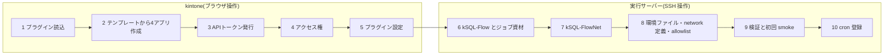

# kSQL-FlowNet 導入手順書

kintone と実行サーバーを 0 から準備し、ボードからの操作要求と cron の定期実行が動く状態(本番運用の開始点)までを 1 本の手順にまとめる。仕様の根拠は[統合仕様書](./specification.md)、配布物の詳細は [templates/README.md](../templates/README.md) と [plugin/README.md](../plugin/README.md) にある。サーバー側の作業を Claude Code に任せる場合の分担と指示文は [Claude Code 併用版](./installation-claude-code.md)を参照。

## 0. 全体の流れ



通信は実行サーバーから kintone への HTTPS 発信だけであり、kintone から実行サーバーへの接続はない。実行サーバー側の作業はすべて SSH で行う(仕様書 §2.2)。

## 1. 前提

| 項目 | 要件 |
| --- | --- |
| kintone | cybozu.com の kintone。アプリ作成権限と、システム管理(プラグイン・アプリテンプレートの読込)の権限を持つアカウント |
| 実行サーバー | Linux 1 台。Node.js 22 以上、git。kintone へ HTTPS で発信できること。kSQL-FlowNet の稼働用の待受ポート・固定 IP・ドメインは不要。管理用の SSH 接続経路は別途必要 |
| kSQL-Flow のジョブ資材 | [ksql-flow-template](https://github.com/rex0220/ksql-flow-template) から作った自分のリポジトリ(`ksql.config.json`・`.env`・`jobs/`)。kSQL-Flow はこのリポジトリの `npm install` で入る。業務アプリのトークン発行と SQL の `--dry-run` 検証は [kSQL-Flow README のクイックスタート](https://github.com/rex0220/ksql-flow#readme)に従う |
| 配布物 | アプリテンプレート `templates/ksql-flownet-apps-1.0.0.zip`、プラグイン `flownet-activity-plugin.zip`(GitHub Release 添付)、kSQL-FlowNet 本体(git clone または npm) |

JOBログアプリ(kSQL-Flow の実行ログ)は次のどちらかで用意する。

- **kSQL-Flow をこれから導入する**: テンプレートに含まれる JOBログアプリをそのまま使う(kSQL-Flow template v0.4 相当の相関フィールド込み)
- **既に kSQL-Flow を運用中**: 既存の JOBログアプリを使う。kSQL-Flow の `scripts/logapp_v04_upgrade.console.js` で相関フィールドを追加済みであることを確認し、手順 2 でテンプレートが作った JOBログアプリを削除して参照先を付け替える

## 2. kintone: プラグインの読込とアプリの作成

1. **システム管理 → プラグイン** で `flownet-activity-plugin.zip` を読み込む。テンプレートは実行管理アプリにプラグイン参照を含むため、テンプレートより先に読み込む
2. **システム管理 → アプリテンプレート** で `ksql-flownet-apps-1.0.0.zip` を登録する
3. 運用するスペース(またはポータル)の「アプリを作成 → テンプレートから作成」で「kSQL-FlowNet 1.0.0」を選ぶ。実行管理・監査履歴・操作要求・JOBログの 4 アプリが作られ、実行管理アプリの関連レコード 3 種は新しいアプリを指す
4. 4 アプリのアプリ ID(URL の `/k/<ID>/`)を控える。サーバーの環境ファイル(手順 8)で使う
5. 既存の JOBログアプリを使う場合だけ: 実行管理アプリの設定 → フォーム → 関連レコード `related_job_logs` の参照先アプリを既存アプリへ変更してアプリを更新し、テンプレートが作った JOBログアプリを削除する

テンプレートに含まれるもの・含まれないものは [templates/README.md](../templates/README.md#配布テンプレート正) を参照。フィールドアクセス権・API トークン・プラグイン設定値は含まれないので、以降の手順で設定する。

## 3. kintone: API トークン

各アプリの設定 → API トークンで発行する。**レコード削除権限はどのトークンにも不要**である。

| アプリ | 権限 | 使う主体 | 環境変数(手順 8) |
| --- | --- | --- | --- |
| 実行管理 | 閲覧・追加・編集 | kSQL-FlowNet CLI・ポーラー | `KSQL_FLOWNET_STATE_APP_ID` / `KSQL_FLOWNET_STATE_API_TOKEN` |
| 監査履歴 | 閲覧・追加・編集 | kSQL-FlowNet CLI・ポーラー | `KSQL_FLOWNET_AUDIT_APP_ID` / `KSQL_FLOWNET_AUDIT_API_TOKEN` |
| 操作要求 | 閲覧・編集(追加は付けない) | ポーラー | `KSQL_FLOWNET_REQUEST_APP_ID` / `KSQL_FLOWNET_REQUEST_API_TOKEN` |
| JOBログ | 閲覧 | kSQL-FlowNet(Attempt 照合) | `KSQL_FLOW_LOG_APP_ID` / `KSQL_FLOW_LOG_API_TOKEN` |
| JOBログ | 閲覧・追加・編集 | kSQL-Flow(ジョブ実行ログの書込) | ジョブ資材の `.env` の `KSQL_TOKEN_LOGS`(kSQL-Flow 側) |

各アプリでトークンを生成して権限を設定したら保存し、**「アプリを更新」**して運用環境へ反映する(更新するまでトークンは有効にならない)。トークン値は控えた端末からサーバーの環境ファイルへ直接転記する。リポジトリ・チャット・Console・文書へ貼らない。

## 4. kintone: アクセス権

アプリテンプレートはアクセス権を持ち出せないため、ここで設定する。

**操作要求アプリのフィールドアクセス権**: アプリの画面を開き、ブラウザの開発者ツール Console で [`templates/console/migrations/add-request-lifecycle-v2.console.js`](../templates/console/migrations/add-request-lifecycle-v2.console.js) を実行する(アプリ ID を入力)。フィールドと一覧はテンプレートで作成済みなので、スクリプトはフィールドアクセス権だけを適用してデプロイする。適用結果は次のとおり(仕様書 §3.4)。

| フィールド | 設定 |
| --- | --- |
| `request_state`、`claimed_at`、`claimed_host`、`claim_heartbeat_at`、`result_code`、`result_message` | Everyone 閲覧のみ(ポーラーが API トークンで書く。トークン書込はフィールドアクセス権の影響を受けない) |
| `cancel_requested` | 作成者 編集可、Everyone 閲覧のみ(起票者本人だけがボードから取消できる) |

**JOBログアプリのフィールドアクセス権**: アプリの画面を開き、Console で [`templates/console/set-joblog-field-acl.console.js`](../templates/console/set-joblog-field-acl.console.js) を実行する(アプリ ID を入力)。kSQL-FlowNet が Attempt の照合に使う相関 5 フィールド(`correlation_id`・`attempt_id`・`execution_id`・`job_id`・`runner_execution_started_at`)を Everyone 閲覧のみにする。kSQL-Flow ランナーの API トークン書込は影響を受けない。

**アプリのアクセス権(推奨)**:

| アプリ | 一次対応者(ボード利用者・アプリ管理者) | その他の利用者 |
| --- | --- | --- |
| 実行管理・監査履歴 | レコード閲覧 + アプリ管理 | 閲覧不要 |
| 操作要求 | レコード閲覧・追加・編集 + アプリ管理 | 閲覧不要 |
| JOBログ | レコード閲覧(アプリ管理は kSQL-Flow 運用者) | 閲覧不要 |

一次対応者はボードの利用者であると同時に、プラグイン設定(START 許可 CSV)や一覧・リマインダーを保守するアプリ管理者を兼ねる想定である。アプリ管理権限はレコードの編集権限を含まないため、実行管理・監査履歴のレコードは管理者でも編集できない(機械専用)。

操作要求アプリの一次対応者に**レコード編集**が要るのは、ボードの「取消」が既存レコードの `cancel_requested` を更新する操作であり、kintone のレコード更新にはアプリのレコード編集権限が必要だからである。編集できるフィールドはフィールドアクセス権で `cancel_requested`(作成者のみ)に絞られ、機械フィールドは閲覧のみのままになる。

実行管理・監査履歴は機械専用であり、人はレコードを編集・削除しない。操作要求も取消フラグの更新を除いて既存レコードは編集せず、常に新規追加で依頼する(仕様書 §8)。

## 5. kintone: プラグインの設定

実行管理アプリの設定 → プラグイン に kSQL-FlowNet Run状況プラグインが追加済みである(テンプレート由来)。歯車から設定を開く。

| タブ | 設定項目 | 値 |
| --- | --- | --- |
| 基本設定 | START を許可するネットワーク | 手順 8 の allowlist で `app_start: true` にする network を `ネットワーク名, network_id[, 入力モード[, business_key テンプレート]]` の CSV で 1 行ずつ。例: `月次集計(当月分の起動), monthly_summary, 定期`(手順 8 の例と同じ network) |
| 詳細設定 | 監査履歴アプリ ID・操作要求アプリ ID・JOBログアプリ ID | **空欄**のまま。実行管理アプリの関連レコードから自動検出される。別のアプリを指す場合だけ ID を入力する |

保存すると既定でアプリ設定が運用環境へ反映される(反映に失敗した場合はアプリ設定画面から「アプリを更新」する)。実行管理アプリの一覧「00_Run状況」を開き、空のボードと「新規実行」ボタンが表示されること、ブラウザ Console に `kSQL-FlowNet Run状況 plugin v1 loaded` が出ることを確認する。START 許可 CSV は表示用の写しであり、実行可否はサーバー側の allowlist が決める(仕様書 §7.4)。

## 6. サーバー: kSQL-Flow とジョブ資材

以下は root で SSH 接続して行う。配置は仕様書 §4.7 の推奨レイアウトに従う。

```
/opt/ksql/
├── ksql-flownet/                 # kSQL-FlowNet 本体(手順 7)
├── io/                           # CSV 入出力を使う場合だけ(csv-io-operations.md)
└── my-ksql-jobs/                 # ジョブ資材リポジトリ(cron・ポーラーの cwd)
    ├── ksql.config.json          # kSQL-Flow のプロファイル(実行ログ = JOBログアプリ)
    ├── .env                      # kSQL-Flow 用トークン(0600・git 管理外)
    ├── node_modules/@rex0220/ksql-flow/   # npm install で入る
    └── flownet/
        └── monthly-summary/          # flow ごとに 1 フォルダー
            ├── network.yaml
            └── jobs/20_deal_summary.sql   # network.yaml からの相対パス jobs/… で参照
/root/.ksql-flownet.env           # kSQL-FlowNet の環境変数(0600)
/root/flownet-request-allowlist.yaml
/var/log/ksql/                    # cron のログ
```

```sh
mkdir -p /opt/ksql /var/log/ksql /var/tmp/ksql-flownet
cd /opt/ksql
git clone <ジョブ資材リポジトリ> my-ksql-jobs
cd my-ksql-jobs
npm install
```

`ksql.config.json` の対象プロファイル(以下 `prod`)に、業務アプリと JOBログアプリを登録する。`実行ログ` の `id` は手順 2 の JOBログアプリ ID、`logApp` は `"実行ログ"` とする。トークンは `env:` 参照のままにし、値は `.env` に置く。

```sh
cp .env.example .env
chmod 600 .env
# .env に KSQL_TOKEN_LOGS(JOBログ 閲覧・追加・編集)と業務アプリのトークンを記入
node --env-file=.env node_modules/@rex0220/ksql-flow/dist/cli.js validate --check-logapp --profile prod
```

`OK: ログアプリ … 8.2 のフィールド定義を満たしています` が出れば kSQL-Flow 側の準備は完了である。

## 7. サーバー: kSQL-FlowNet 本体

```sh
cd /opt/ksql
git clone https://github.com/rex0220/ksql-flownet.git
cd ksql-flownet
npm ci
npm run build
node dist/cli/index.js --version
```

npm 公開版を使う場合は `npm install --global @rex0220/ksql-flownet` で `ksql-flownet` コマンドが入る。以降の `node /opt/ksql/ksql-flownet/dist/cli/index.js` は `ksql-flownet` に読み替える。

## 8. サーバー: 環境ファイル・network 定義・allowlist

### 8.1 環境ファイル `/root/.ksql-flownet.env`

`export` 形式で書き、root 所有 0600 にする。Windows で編集した内容を貼り付けると CRLF が混入して allowlist の読込に失敗するため、サーバー上で LF で保存する。

```sh
# /root/.ksql-flownet.env
export KSQL_FLOWNET_PROFILE=prod                        # ksql.config.json のプロファイル名
export KSQL_FLOWNET_BASE_URL=https://<subdomain>.cybozu.com
export KSQL_FLOWNET_STATE_APP_ID=<実行管理アプリID>
export KSQL_FLOWNET_STATE_API_TOKEN=<実行管理トークン>
export KSQL_FLOWNET_AUDIT_APP_ID=<監査履歴アプリID>
export KSQL_FLOWNET_AUDIT_API_TOKEN=<監査履歴トークン>
export KSQL_FLOW_LOG_APP_ID=<JOBログアプリID>
export KSQL_FLOW_LOG_API_TOKEN=<JOBログ閲覧トークン>
export KSQL_FLOWNET_REQUEST_APP_ID=<操作要求アプリID>
export KSQL_FLOWNET_REQUEST_API_TOKEN=<操作要求トークン(閲覧・編集)>
export KSQL_FLOWNET_REQUEST_ALLOWLIST_PATH=/root/flownet-request-allowlist.yaml
export KSQL_FLOW_BIN=node
export KSQL_FLOW_BIN_ARGS='["node_modules/@rex0220/ksql-flow/dist/cli.js"]'   # ジョブ資材リポジトリからの相対パス
export KSQL_FLOW_CONFIG=ksql.config.json
export KSQL_FLOW_WORKDIR=/var/tmp/ksql-flownet
export KSQL_FLOWNET_REQUESTED_BY=cron@<ホスト名>
```

```sh
chmod 600 /root/.ksql-flownet.env
```

CSV 入出力を使う network がある場合は `KSQL_FLOWNET_IO_DIR=/opt/ksql/io` を追加する([CSV入出力の運用](./csv-io-operations.md))。変数の一覧は仕様書 §2.2。

### 8.2 network 定義

ジョブ資材リポジトリに flow ごとのフォルダーを作り、`network.yaml` と SQL を置く(git 経由で配置し、サーバー上で直接編集しない)。SQL は `network.yaml` からの相対パスで参照する。

```yaml
# /opt/ksql/my-ksql-jobs/flownet/monthly-summary/network.yaml
schema_version: 1
network_id: monthly_summary
description: 月次集計
business_key_policy:
  type: scheduled_period
  period: month
  timezone: Asia/Tokyo
  format: "{network_id}@{yyyy}-{MM}"
max_active_runs: 1
network_lock:
  lease_duration_sec: 180
  heartbeat_interval_sec: 60
nodes:
  - id: deal_summary
    job_id: ms_deal_summary          # prod:ms_deal_summary が 64 文字以内
    sql: jobs/20_deal_summary.sql    # = /opt/ksql/my-ksql-jobs/flownet/monthly-summary/jobs/20_deal_summary.sql
    depends_on: []
    trigger_rule: all_success
    idempotent: true                 # ボードから START するには全ノード true
```

```sh
cd /opt/ksql/my-ksql-jobs
. /root/.ksql-flownet.env
node /opt/ksql/ksql-flownet/dist/cli/index.js validate flownet/monthly-summary/network.yaml
node /opt/ksql/ksql-flownet/dist/cli/index.js plan flownet/monthly-summary/network.yaml --scheduled-for 2026-09-01T00:00:00+09:00
```

`validate` は YAML・DAG・SQL ファイルの存在を read-only で検査し、`plan` は業務キーと実行順を表示する(仕様書 §4・§5.1)。

### 8.3 allowlist `/root/flownet-request-allowlist.yaml`

ボード・ポーラーから扱う network をすべて絶対パスで列挙する。ボードからの新規実行(START)を許すものだけ `app_start: true` を明示する(省略は `false`)。

```yaml
networks:
  - network_id: monthly_summary
    definition_path: /opt/ksql/my-ksql-jobs/flownet/monthly-summary/network.yaml
    app_start: true
```

```sh
chmod 600 /root/flownet-request-allowlist.yaml
```

### 8.4 定期実行の起動スクリプト

定期実行する flow ごとに 1 本、ジョブ資材リポジトリに置く(実行権限を付ける)。`--resume` 付きなので、同じ月に再発火しても完走済みなら NO-OP で終わる。

```sh
#!/bin/sh
# /opt/ksql/my-ksql-jobs/run_monthly_summary.sh
cd "$(dirname "$0")" || exit 1
SCHEDULED_FOR="${SCHEDULED_FOR:-$(TZ=Asia/Tokyo date +%Y-%m-01T00:00:00+09:00)}"
exec node --env-file=.env /opt/ksql/ksql-flownet/dist/cli/index.js \
  run-network flownet/monthly-summary/network.yaml \
  --resume --scheduled-for "$SCHEDULED_FOR" "$@"
```

```sh
chmod +x /opt/ksql/my-ksql-jobs/run_monthly_summary.sh
```

`--env-file=.env` でジョブ資材の `.env`(kSQL-Flow のトークン)を子プロセスへ渡す。kSQL-FlowNet 側の変数は cron 行で環境ファイルを `source` する(手順 10)。

## 9. サーバー: 検証と初回 smoke

すべて `/opt/ksql/my-ksql-jobs` を cwd にし、環境ファイルを `source` してから実行する。

```sh
cd /opt/ksql/my-ksql-jobs && . /root/.ksql-flownet.env
node --env-file=.env /opt/ksql/ksql-flownet/dist/cli/index.js poll-requests --check
```

`poll-requests --check` は allowlist の全 network 定義と操作要求アプリへの GET を検査する read-only の事前確認である。exit 0 になるまで cron を登録しない。

**初回の定期実行**(業務データへ書き込む。dry-run はないので、kSQL-Flow 側で `--dry-run` 検証済みの SQL だけを network に載せる):

```sh
./run_monthly_summary.sh
node /opt/ksql/ksql-flownet/dist/cli/index.js status monthly_summary --profile prod --json
```

exit 0 で `status` の Run が `SUCCESS` になり、ボード「00_Run状況」には表示されない(未終端 Run がない)ことを確認する。監査履歴アプリに Invocation・Attempt、JOBログアプリに相関 ID 付きのジョブログができている。

**操作要求の smoke**(起票・取消・ポーラーの書戻しの経路を、何も実行せずに確認する。手順 4 の権限を検証するため、管理者ではなく**一次対応者のアカウント**で行う):

1. 操作要求アプリの一覧「01_未処理要求」が空であることを確認する(他の未処理要求があると、次のポーラー実行がそれを処理する)
2. ボードの「新規実行」から、手順 5 で許可した network の START を起票する(補正モードで業務キーに `-smoke` 等を付ける)
3. ヘッダーの「処理待ちの START 要求」から直後に「取消」を押す
4. 操作要求アプリで該当レコードを再読込し、`request_state` が `REQUESTED`、`cancel_requested` が `取消` であることを確認する。**確認できなければポーラーを実行しない**(取消が効いていない要求は、ポーラーが受理すると新規実行になる)。取消が失敗する典型は手順 4 のレコード編集権限の不足である
5. ポーラーを 1 回手動実行する

```sh
node --env-file=.env /opt/ksql/ksql-flownet/dist/cli/index.js poll-requests
```

標準出力に `requested=1 claimed=0 … cancelled=1` が出て、操作要求レコードが `CANCELLED / CANCELLED_BY_REQUESTER` になれば合格である。Run は作られない。この smoke が確認するのは起票・取消・ポーラーの書戻しまでであり、allowlist による START の受理と子プロセスの起動は含まない。それらは運用開始後の最初の START(または手順 8 の `poll-requests --check` と初回の定期実行)で確認する。

## 10. サーバー: cron 登録

root の `crontab -e` で登録する。cron は 2 本で、定期実行は flow ごとに 1 行、ポーラーは全 network で 1 行(仕様書 §4.7)。発火時刻はサーバーのタイムゾーンに従う。cron の `PATH` は SSH シェルより短いため、`node` が `/usr/bin` 以外(nvm 等)にある場合は `which node` の絶対パスを 2 行と起動スクリプトの `node` に使う。

```cron
0 7 1 * * . /root/.ksql-flownet.env && /opt/ksql/my-ksql-jobs/run_monthly_summary.sh >> /var/log/ksql/flownet.log 2>&1
*/5 * * * * . /root/.ksql-flownet.env && cd /opt/ksql/my-ksql-jobs && node --env-file=.env /opt/ksql/ksql-flownet/dist/cli/index.js poll-requests >> /var/log/ksql/flownet-requests.log 2>&1
```

登録後、5 分待って `/var/log/ksql/flownet-requests.log` に `poll-requests: requested=0 …` の行が増えることを確認する。ボードからの起票は次のポーラー周期(最大約 5 分)で処理される。

## 11. 運用への引き継ぎ

| 役割 | 渡す文書 |
| --- | --- |
| 一次対応者(ボード利用者) | [一次対応 1 ページ](./ops-first-response.md) |
| 二次対応者(サーバー管理者) | [復旧 runbook](./runbook-recovery.md)、[CSV 入出力の運用](./csv-io-operations.md)、[スケジュール連携の運用パターン](./scheduling-patterns.md) |
| 更新・追補 | kSQL-FlowNet の更新は `git pull && npm ci && npm run build`(cron の発火間隙に行う)。プラグイン更新と切戻しは [plugin/README.md](../plugin/README.md)、既存アプリの追補は [templates/README.md](../templates/README.md) |

network 定義を変更・追加するときは、ポーラーを止めてから配置し、`validate` と `poll-requests --check` の後に再開する(復旧 runbook の network 定義配備の項)。
