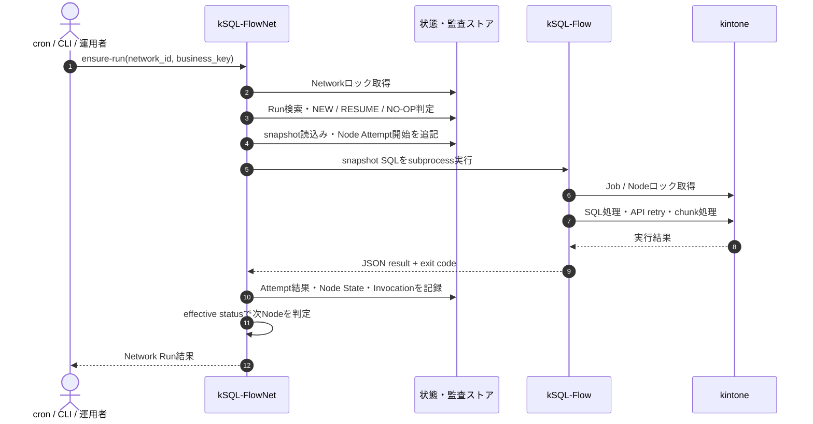

# ADR: kSQL-FlowとジョブネットControl Planeの分離

- 状態: **PROPOSED**
- 作成日: 2026-08-29
- 決定対象: リポジトリ、責務、実行境界、ロック所有権
- 製品表示名: **kSQL-FlowNet**
- リポジトリ名: `ksql-flownet`
- npmパッケージ: `@rex0220/ksql-flownet`
- CLIコマンド: `ksql-flownet`

---

## 1. 背景

kSQL-Flowは、単一SQLジョブの実行に加え、現行では`run-all`、`depends_on`、`--resume`、BATCHログ、バッチロックを持つ。小規模な順次バッチには現行機能で対応できる。

一方、今回設計するジョブネット管理は次を必要とする。

- Network Runとbusiness key
- Run Invocation、Node State、Node Attempt、Attempt Resolution
- SQL本文を含む不変snapshot
- ensure-runとDAG-aware resume
- Networkロック
- UNKNOWN解決と監査
- archive、保持、権限、承認

これらをkSQL-Flow本体へ入れると、SQL実行と業務オーケストレーションが同じリリース・データモデル・運用責任に結合する。

---

## 2. 決定

ジョブネット管理を、kSQL-Flow本体とは別の製品kSQL-FlowNetとして、リポジトリ`ksql-flownet`に実装する。

Phase 1では、kSQL-Flowとの境界をCLI subprocessとし、ライブラリimportを採用しない。境界の正本は[Execution Contract v1](../execution-contract-v1.md)とする。

kSQL-Flow本体に必要な具体的変更、互換維持範囲、実装順は[現行kSQL-Flowの変更点](./current-ksql-flow-changes.md)にまとめる。

Control Planeの公開CLIは`ksql-flownet`、Execution Planeの公開CLIは`ksql-flow`とする。`run-network`、`resolve-node`、ensure-run semanticsをkSQL-Flow本体へ追加しない。orchestratorは子プロセスとして`ksql-flow run`、`capabilities`、`describe-profile`、`inspect-job`を呼び出す。

### 2.1 製品名と概念名

| レベル | 確定名称 | 位置づけ |
| --- | --- | --- |
| 製品表示名 | **kSQL-FlowNet** | ブランド・製品ファミリーの正式名称 |
| リポジトリ名 | `ksql-flownet` | GitHubリポジトリとプロジェクト識別子 |
| npmパッケージ | `@rex0220/ksql-flownet` | スコープ付き公開パッケージ名 |
| CLIコマンド | `ksql-flownet` | Control Planeのプライマリコマンド |
| 概念名 | Network / Node / Network Run / ジョブネット | DAG、スキーマ、JSONフィールドで使用する概念 |

製品名変更は概念スキーマの変更ではない。`network_id`、`run_id`、`node_id`等は維持し、製品ブランドを埋め込んだフィールド名へ改名しない。

### kSQL-Flowに残す責務

- SQLファイルの解析・検証・実行
- kintone APIの読書き
- APIリトライ、上限制御、チャンク処理
- as-ofに対応する時刻関数評価
- 単一ジョブのローカル／分散ロック
- resolved profileとSQL論理job IDの機械可読な検査
- SQL開始直前の耐久`EXECUTION_STARTED`イベント
- JOB実行ログ、statement／chunk診断ログ
- 機械可読な単一ジョブ結果
- 現行`run-all`による軽量バッチ

### kSQL-FlowNetへ置く責務

- DAG定義、循環検証、安定トポロジカル順
- Network Runとbusiness key
- Run Invocation、Node State、Node Attempt、Attempt Resolution
- Network Execution Bundle
- ensure-run、`--resume-run`、`--rerun-from`
- Networkロック
- DAG-aware resume
- UNKNOWNの解決、承認、監査
- business key生成、`max_active_runs`、手動完遂イベント
- archive、保持、projection reconciliation

---

## 3. 既存run-allの位置付け

現行`run-all`を削除しない。既存利用者向けの軽量・ローカルな順次バッチとして互換性を維持する。

| 選択肢 | 適する用途 |
| --- | --- |
| `ksql-flow run` | 単一ジョブ、手動実行、他システムからの実行 |
| `ksql-flow run-all` | 小規模、同一ディレクトリ、既存の簡易依存・resumeで十分な運用 |
| `ksql-flownet` | business key、厳密なsnapshot、UNKNOWN、監査、承認、Network resumeが必要な運用 |

高度なジョブネット機能を`run-all`と新プロジェクトの両方へ実装しない。機能重複と意味論の分岐を防ぐため、エンタープライズ向け拡張は新プロジェクト側だけで行う。

---

## 4. 実行境界



Control PlaneはDAGと業務Runを管理するが、kSQL-Flow内部のSQL実行やJobロックを代行しない。境界を越える情報はExecution Contract v1でversion管理する。

Phase 1でライブラリimportを避ける理由:

- kSQL-Flowの内部型、例外、設定オブジェクトへ依存しない。
- Node.jsや依存パッケージのversionを独立させられる。
- 将来、kSQL-Flowの内部実装を変更してもCLI契約を維持できる。
- subprocessのsignal、timeout、stdout/stderrを障害境界として試験できる。

将来ライブラリ方式を追加する場合は、内部moduleを直接importせず、CLIと同じrequest/result schemaを使う公開adapter APIを別途version管理する。

---

## 5. ロック所有権

| ロック／判断 | 所有者 |
| --- | --- |
| Networkロック | kSQL-FlowNet |
| Network leaseのheartbeat・stale検出 | kSQL-FlowNet |
| Network lockの強制回収・監査 | kSQL-FlowNet |
| owner runtimeの停止確認 | kSQL-FlowNet |
| Job／Nodeロック | kSQL-Flow |
| kSQL-Flowローカルロック | kSQL-Flow |
| Node leaseのstale検出 | kSQL-Flow |
| InvocationのLOCK_CONFLICT記録 | kSQL-FlowNet |
| 業務上のUNKNOWN解決 | kSQL-FlowNet |

上位層がNodeロックを再実装しない。単体`ksql-flow run`とジョブネット経由の実行が同じJobロックで競合することを契約試験する。

Jobロックは同じ論理`job_id`の重複実行に対する最終防波堤である。ただし、異なるNodeの順序、Network Run集約、Node State整合性は保証しない。Network lockのtoken照合と状態更新が別レコード操作であるためTOCTOU窓は残り、Jobロックを理由にNetwork fencingを省略してはならない。この窓を残余リスクとして障害注入結果とrunbookへ記録する。

kSQL-FlowがLOCK_CONFLICTを返した場合、事前作成したNode Attemptを`CANCELLED / PREPARE_FAILED`で確定し、Node Stateをrevision付きで`WAITING`へ戻し、Invocationへ競合を記録する。attempt番号はsubprocess起動試行として保持する。競合した別実行の結果をNetwork Runの成功として流用しない。

---

## 6. Snapshot境界

orchestratorは次をまとめてNetwork Execution Bundleとして保存する。

```text
bundle/
  network.yaml
  manifest.json
  jobs/
    A.sql
    B.sql
    C.sql
```

### Control Plane snapshot

- network定義
- node依存
- trigger rule
- business key
- as-of
- replay policy
- 非秘密の接続先識別情報

### Execution artifact

- SQL本文
- dialect
- kSQL-Flow要求version／capability
- 実行に影響する非秘密設定
- ファイルごとのSHA-256

秘密情報はbundleへ保存しない。実行時の認証資格情報を使用し、接続先やアプリIDがsnapshotと一致するか検証する。

snapshotが固定するのはコードと実行設定であり、kintone上のデータ、外部API応答、権限変更、`@`なしのサーバー評価時刻関数までは固定しない。

---

## 7. Executor拡張

Phase 1のexecutorは`ksql-flow`だけとする。

```yaml
nodes:
  - id: aggregate_customer
    executor:
      type: ksql-flow
      sql: jobs/aggregate_customer.sql
```

内部構造としてexecutor interfaceを設けてもよいが、任意shell、Python、HTTP、SFTP、Cloud Run等は実装しない。

汎用executorは、allowlist、secret受渡し、sandbox、stdout/stderr上限、signal、冪等性、補償、実行環境管理を別仕様で定義した後に追加する。

---

## 8. 結果

### 利点

- kSQL-Flowの既存利用者と軽量性を維持できる。
- SQL実行の障害とDAG制御の障害を分離できる。
- 両プロジェクトのversionとrelease cadenceを独立させられる。
- Control PlaneのデータモデルをkSQL-Flowログ互換性から切り離せる。
- 将来executorを拡張できる。

### コスト

- 2プロジェクト間の互換表とcontract testが必要になる。
- subprocess、signal、部分出力、version不一致を扱う必要がある。
- kSQL-FlowログとNode Attemptをcorrelation IDで結ぶ必要がある。
- security fixやschema変更時に協調releaseが必要になる場合がある。
- 既存`run-all`との機能差を継続的に説明する必要がある。

分離は、永続化の二重書込み、kintoneの一意制約への依存、lease回収の残余リスクを自動的に解消しない。これらはFreeze Decision Recordで引き続き管理する。

---

## 9. 棄却案

### kSQL-Flow本体へ内蔵

単一ジョブ実行とControl Planeが同じデータモデル・releaseに密結合するため不採用。

### kSQL-Flowの内部moduleを直接import

別プロジェクト化しても内部型・依存関係に密結合するため、Phase 1では不採用。

### 現行run-allを削除

既存ユーザーへの破壊変更となり、小規模用途の簡便性を失うため不採用。

### 最初から汎用オーケストレータにする

任意コード実行、secret、sandbox、補償等の範囲が急増するため不採用。

---

## 10. 受入条件

- [ ] Execution Contract v1を確定する。
- [ ] kSQL-Flowの通常runがstructured resultを返せる。
- [ ] orchestratorとkSQL-Flowのversion／capability不一致を開始前に拒否できる。
- [ ] correlation IDでNetwork Run、Node Attempt、kSQL-Flow JOBログを追跡できる。
- [ ] `describe-profile`と`inspect-job`でconfig内部形式へ依存せずsnapshot、job ID、非決定要素を検証できる。
- [ ] JOBログの耐久`EXECUTION_STARTED`でSQL開始可能性を監査できる。
- [ ] Ctrl+C／SIGTERM／強制終了の状態変換をcontract testで確認する。
- [ ] `node_id != job_id`でも単体実行とorchestrator経由実行が同じJobロックで競合する。
- [ ] `run-network`と`resolve-node`が`ksql-flownet`だけに存在し、既存`ksql-flow run-all --resume`の意味を変更しない。
- [ ] snapshot SQLが実行され、現在の作業ツリーへフォールバックしない。
- [ ] FlowNetプロセスkill後も、旧owner停止確認、lease token照合、監査付き`force-unlock-network`によりNetwork lockを安全に回収できる。
- [ ] heartbeat障害時に新しいNodeを開始せず、実行中subprocessを原則継続し、lease再更新を確認できない状態では実行状態を書かない。
- [ ] `status --json`が復旧識別子をread-onlyで返し、Cloud Run Job Executionのterminal状態だけを自動停止確認として受理する。
- [ ] 既存`run-all`の回帰試験が通る。
- [ ] READMEで3つの実行方式の選択基準を説明する。

全条件完了後、このADRを`ACCEPTED`へ変更する。
