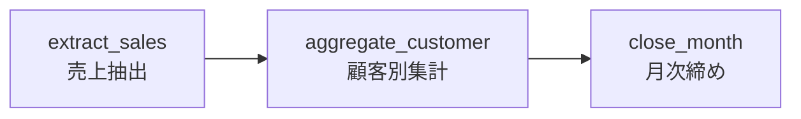
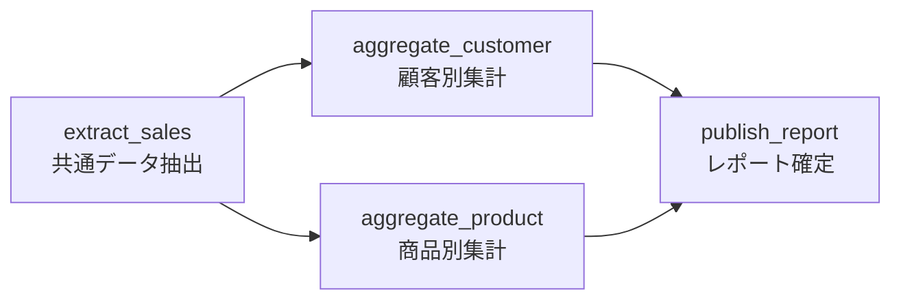
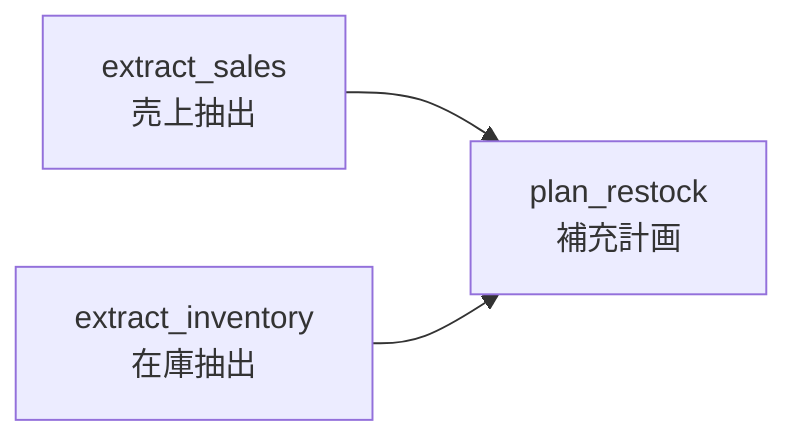
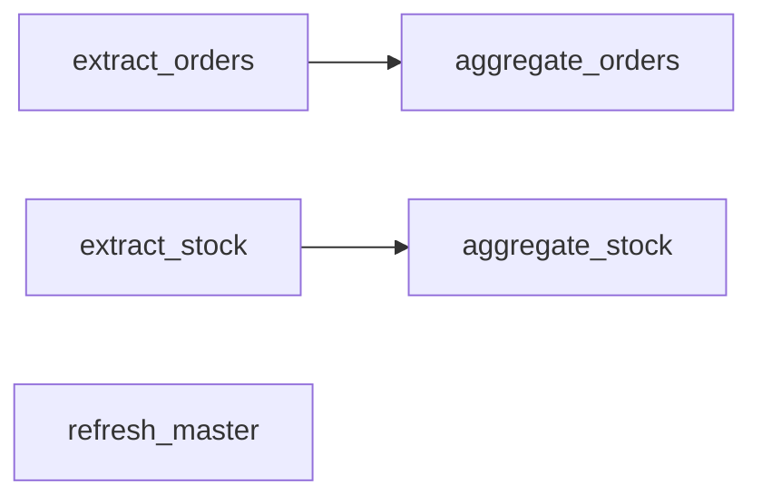
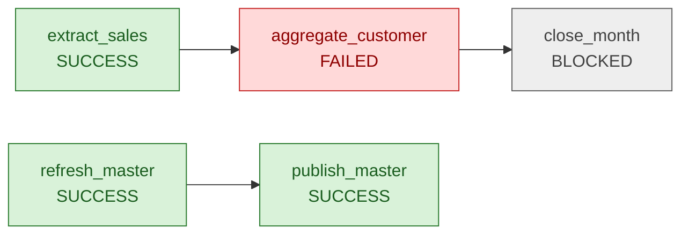
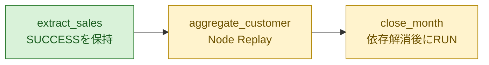

# 対応可能なジョブネット例

- 文書状態: **PROPOSED**
- 対象: kSQL-FlowNetのDAG構成例

各例の`network_lock`値は構文例であり、製品既定値ではない。leaseとheartbeatの確定値はPhase 0のNetwork lock recovery試験で決定する。
- 前提: Phase 1は安定トポロジカル順による直列実行、Phase 2で独立ノードの実並列を追加

---

## 1. 対応範囲

ジョブネットは`depends_on`で有向非巡回グラフ（DAG）として定義する。直列、複数の開始点、分岐、合流、複数系統を表現できる。

ただし、**グラフ上で並列化できること**と、**実行時に同時並行で処理すること**は分けて扱う。

| 構成 | DAGでの表現 | Phase 1の実行 | Phase 2の実行予定 |
| --- | --- | --- | --- |
| 直列 | 対応 | 直列 | 直列 |
| 独立した複数開始点 | 対応 | 定義順で直列 | リソース制約内で並列 |
| 分岐（fan-out） | 対応 | 実行可能ノードを定義順で直列 | 独立ノードを並列 |
| 合流（fan-in） | 対応 | 全依存成功後に実行 | 全依存成功後に実行 |
| 複数の独立系統 | 対応 | 安定トポロジカル順で直列 | 系統間を並列化可能 |
| 条件分岐 | Phase 1対象外 | 不可 | trigger ruleと条件式を別仕様化 |
| ループ／循環 | 非対応 | DAG検証で拒否 | 非対応 |
| 動的ノード生成 | Phase 1対象外 | 不可 | 将来検討 |

Phase 1で複数ノードが同時に実行可能になった場合は、定義順をtie-breakerとする。並列候補を含むDAGも実行できるが、同時には起動しない。

各nodeはDAG上の`id`と、kSQL-FlowがSQLから解決する`job_id`を持つ。両者は異なる名前にできるが、`job_id`はSQLの論理job IDと一致し、単体実行と共通のNodeロック生成に使用される。

---

## 2. 直列ジョブネット

抽出、集計、締め処理を順番に実行する最小構成。



```yaml
schema_version: 1
network_id: monthly_close
business_key_policy:
  type: scheduled_period
  period: month
  timezone: Asia/Tokyo
  format: "{network_id}@{yyyy}-{MM}"
max_active_runs: 1
network_lock:
  lease_duration_sec: 300
  heartbeat_interval_sec: 60
nodes:
  - id: extract_sales
    job_id: extract_sales
    sql: jobs/extract_sales.sql
    depends_on: []
    trigger_rule: all_success
    idempotent: true

  - id: aggregate_customer
    job_id: aggregate_customer
    sql: jobs/aggregate_customer.sql
    depends_on: [extract_sales]
    trigger_rule: all_success
    idempotent: true

  - id: close_month
    job_id: close_month
    sql: jobs/close_month.sql
    depends_on: [aggregate_customer]
    trigger_rule: all_success
    idempotent: true
```

実行順は常に`extract_sales → aggregate_customer → close_month`となる。

---

## 3. 分岐と合流（fan-out / fan-in）

共通の抽出結果から複数の集計を作り、両方が成功した後にレポートを確定する。



```yaml
schema_version: 1
network_id: sales_report
business_key_policy:
  type: explicit
max_active_runs: 1
network_lock:
  lease_duration_sec: 300
  heartbeat_interval_sec: 60
nodes:
  - id: extract_sales
    job_id: extract_sales
    sql: jobs/extract_sales.sql
    depends_on: []
    trigger_rule: all_success
    idempotent: true

  - id: aggregate_customer
    job_id: aggregate_customer
    sql: jobs/aggregate_customer.sql
    depends_on: [extract_sales]
    trigger_rule: all_success
    idempotent: true

  - id: aggregate_product
    job_id: aggregate_product
    sql: jobs/aggregate_product.sql
    depends_on: [extract_sales]
    trigger_rule: all_success
    idempotent: true

  - id: publish_report
    job_id: publish_report
    sql: jobs/publish_report.sql
    depends_on: [aggregate_customer, aggregate_product]
    trigger_rule: all_success
    idempotent: true
```

Phase 1では、定義順に`extract_sales → aggregate_customer → aggregate_product → publish_report`と直列実行する。Phase 2では、`aggregate_customer`と`aggregate_product`を安全条件とリソース上限の範囲で並列実行できる。`publish_report`は両方が`SUCCESS`になるまで開始しない。

---

## 4. 独立した複数開始点

売上と在庫を別々に抽出し、両方の結果を使って補充計画を作る。



```yaml
schema_version: 1
network_id: restock_plan
business_key_policy:
  type: explicit
max_active_runs: 1
network_lock:
  lease_duration_sec: 300
  heartbeat_interval_sec: 60
nodes:
  - id: extract_sales
    job_id: extract_sales
    sql: jobs/extract_sales.sql
    depends_on: []
    trigger_rule: all_success
    idempotent: true

  - id: extract_inventory
    job_id: extract_inventory
    sql: jobs/extract_inventory.sql
    depends_on: []
    trigger_rule: all_success
    idempotent: true

  - id: plan_restock
    job_id: plan_restock
    sql: jobs/plan_restock.sql
    depends_on: [extract_sales, extract_inventory]
    trigger_rule: all_success
    idempotent: true
```

Phase 1では2つの開始ノードを定義順で実行する。Phase 2では両者を並列化できるが、`plan_restock`の開始条件は変わらない。

---

## 5. 複数の独立系統

1つのNetwork Runに、依存関係を持たない複数の処理系統を定義できる。



Phase 1では安定トポロジカル順で全ノードを1件ずつ実行する。Phase 2では系統間を並列化できる。ただし、同じkintoneアプリや同じJobロックなど競合するリソースを持つノードは、DAG上で独立していても同時実行できるとは限らない。

---

## 6. 失敗時の伝播

Phase 1のtrigger ruleは`all_success`だけである。直接または間接の依存ノードが失敗した経路は`BLOCKED`となる。一方、依存関係のない系統は実行を継続できる。



Network Run全体は成功扱いにならない。resume時は成功済みノードを再実行せず、失敗ノードの安全性を確認してノード全体を再実行する。

---

## 7. Resumeの例

前回の実行結果が次の場合を考える。

| Node | 前回状態 | resume時の扱い |
| --- | --- | --- |
| `extract_sales` | `SUCCESS` | 状態を保持し、新しいAttemptを作らない |
| `aggregate_customer` | `FAILED` | `idempotent = true`なら再実行候補 |
| `close_month` | `BLOCKED` | 上流成功後に実行 |



`UNKNOWN`または`idempotent = false`のノードは自動再実行しない。根拠を伴う解決イベントまたは業務固有の補償手順を必要とする。

---

## 8. Phase 1で扱わない構成

次の構成はDAGの意味論、安全条件、監査モデルを追加で定義するまで受理しない。

- 実行結果やデータ値に基づく条件分岐
- `all_done`や`none_failed`など`all_success`以外のtrigger rule
- ループ、循環依存、終了条件付き反復
- 実行中にノード数が変わる動的DAG
- 任意shell、Python、HTTPなど`ksql-flow`以外のexecutor
- リソース上限を定義しない無制限並列実行

未実装の値を`all_success`や直列実行へ暗黙変換せず、定義検証時にfail-closedで拒否する。
