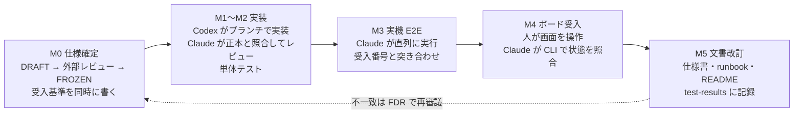

<!-- タイトル: 【kSQL-FlowNet #10】AI 協働編: Codex が実装し Claude がレビューする開発
- 連載 #10(最終回)(#1: https://qiita.com/rex0220/items/24470d6223c1b4ed4031、#2: https://qiita.com/rex0220/items/2308e4ccf5a363680d31、#3: https://qiita.com/rex0220/items/45f04c2748570953629b、#4: https://qiita.com/rex0220/items/45a086c83cb1dd992aeb、#5: https://qiita.com/rex0220/items/b182371cfafea79af2da、#6〜#9: 未公開)
- タグ案: kintone, AI, ClaudeCode, Codex, 開発プロセス
- 画像なし(mermaid と表で構成)
- 公開前条件(完了 2026-09-07): 検証スペースの 4 アプリを削除し、表示されたトークンはアプリ削除で失効。R5 記録に追記済み
-->

連載の最終回は、kSQL-FlowNet をどう作ったかです。開発者は 1 人で、期間は仕様の初回コミットから v1.0.0 公開まで 10 日でした。その間に実装したのは Codex、レビューと実機検証を担当したのは Claude Code、仕様の外部レビューは Gemini と ChatGPT、kintone の操作と最終判断は人です。「AI がすごい」話ではなく、 **何を AI に任せ、何を人が握り、AI 同士の相互チェックをどう組んだか** を書きます。素材はリポジトリの `docs/internal/` に残した仕様・決定記録・レビュー裁定表です。

**この回で分かること**

- 役割分担と、仕様 → 実装 → レビュー → 実機 → 文書 の 1 周の回し方
- 「正本第一」の運用。実装に合わせて仕様を黙って直さず、決定記録(FDR)で再審議する
- 複数の AI によるレビューの裁定表。採用 231 件・不採用 15 件・保留 3 件を、正本と実装で真偽を確認して決めた
- AI が間違えた場面と、そこから作った規律

**前提**

- #1 の全体像を読んでいる。#9 の検証の話とつながります

## 役割分担

| 役割 | 担当 | 具体的に |
| --- | --- | --- |
| 仕様・決定・最終判断 | 人 | 何を作るか、何を作らないか、凍結の承認、初回本番 Run の承認 |
| kintone の管理操作・秘密情報 | 人 | アプリ作成、テンプレート登録、プラグイン読込、API トークン発行と転記、npm publish、Qiita 投稿 |
| 実装 | Codex(`codex exec`) | 仕様と受入基準を渡してブランチ上で実装。git 操作はさせない |
| レビュー・実機検証・正本管理 | Claude Code | 実装を正本と突き合わせてレビュー、単体・実機 E2E の実行、受入記録、ブランチ管理とマージ、文書改訂 |
| 仕様の外部レビュー | Gemini・ChatGPT | 凍結前の仕様と公開文書を、実装セッションとは別の視点で批判的に読む。裁定は Claude Code、採否表は人が確認する |
| 実装根拠による交差レビュー | Codex(実装とは別の実行) | 仕様を実装ファイル・テスト・行番号と突き合わせて批判する |
| 隣のリポジトリ | 別セッションの Claude Code | kSQL-Flow 側の変更(Execution Contract、CSV 取込)は kSQL-Flow のリポジトリで別セッションが担当。依頼と返信は日付付きの文書で往復 |

ポイントは **実装者とレビュー担当を別の AI にした** ことです。同じモデル・同じ文脈で実装とレビューを続けると、前提や思い込みが相関するリスクがあります。別の AI に役割を分けても独立性が保証されるわけではありませんが、異なる観点を入れやすくなります。Codex が書いた実装を Claude Code が正本(仕様書・決定記録・Execution Contract)と突き合わせ、逆に Claude Code が起案した仕様を Codex が実装ファイルの行番号付きで批判する、という交差にし、最終的な裁定は正本・実装・実測の証拠に基づいて人が確認しました。

秘密情報を人が握ったまま Claude Code が実機 E2E を実行できたのは、トークンの置き場所を分けたからです。人が書込可トークンを OS のユーザー環境変数へ設定し、Claude Code は値を読まずに固定済みのテストスクリプトを起動します。結果は秘匿化後の JSON で確認します。Claude Code は認証済みの処理を実行しますが、トークン値そのものは扱いません。これはトークン値をプロンプト・ツール出力・リポジトリへ出さないための運用上の分離であり、同じユーザー権限で動く AI プロセスから技術的に読取不能にする隔離ではありません。実行コマンドを固定し、環境変数の列挙や環境ファイルの読取りを禁止する規律と組み合わせています。

## 1 周の回し方

P2 系の機能追加(アプリ起点の再実行、ボードからの操作要求、任意キーの START、要求ライフサイクル v2、CSV 入出力)は、すべて同じ 5 段で回しています。



仕様には受入基準(受入 1、受入 2、…)を番号付きで書き、E2E スクリプトと受入記録がその番号を参照します。#9 の「受入 8b は E2E、8c・8d・8f は単体」という線引きは、この番号があるから書けます。

途中で学んだチェック項目が 1 つあります。仕様に条件を足したら受入基準へ同時に足す。次のスプリントでは逆方向の漏れ(受入は足したが作業分割に反映していない)が見つかり、チェック項目に「受入追加 = 作業分割へ同時反映」を足しました。仕様書の M0 の行にそのまま書いてあります。

## 正本第一: 実装に合わせて仕様を直さない

実装計画にこう書きました。

> 仕様と実装が一致しない場合は、コードへ合わせて仕様を上書きせず、FDR で再審議する。

FDR(Phase 1 凍結決定記録)は D-01〜D-30 の 30 件の判断を `DECIDED` / `PROPOSED` / `VALIDATION_REQUIRED` / `OPERATIONS_REQUIRED` の状態付きで持ち、凍結ゲート 28 項目のチェックボックスにはそれぞれ証跡(スパイク結果や E2E の記録)へのポインタが入っています。棄却した案も 8 件残しました(resume ごとに新しい Run を作る、Attempt を上書きして UNKNOWN を消す、など)。凍結後の変更は「凍結後の再審議記録」を通します。

状態が動いた例を 1 つ。D-26(ジョブロックの回収は kSQL-Flow が行い、kSQL-FlowNet は停止確認と監査だけ)は、起案日には `PROPOSED` のままにし、翌日に kSQL-Flow 側のリポジトリから M1 完了報告の返信文書を受け取ってから `DECIDED` にしました。AI が「たぶんこうなる」で確定させないための手続きです。

FDR の冒頭には自制の一文があります。

> 未実測事項を保証として扱わず、未決事項がある状態で「リスクを完全に排除した」と表現しない。

AI は自信のある文章を書きます。だから、書いてよい強さを先に決めておきます。

## レビューを採否表で裁定する

Gemini・ChatGPT のレビューは人がチャットに貼り、Codex のレビューは `codex exec` で走らせて `docs/internal/*-review-*.md` に出します。Claude Code は裁定者です。指摘ごとに `src/`・`tests/`・仕様書で真偽を確認し、採否表を残し、各レビュー巡の採用分を裁定単位で 1 コミットにまとめて反映します。

| # | 指摘 | 裁定 | 反映・根拠 |
| --- | --- | --- | --- |

この 4 列がすべての裁定表の形です。2026-09-07 時点で `docs/internal/` の裁定表を数えると、 **採用 231・不採用 15・保留 3** でした。不採用には必ず理由を書きます。

不採用の例です。レビュアーが間違えていて、正本と実装が正しかったものです。

| 指摘 | 裁定 | 根拠 |
| --- | --- | --- |
| 補正モードで対象期間と業務キーの両方を渡すと `KEY_POLICY_MISMATCH` になるのでは | 不採用(表は正しい) | 仕様書 §6.5: 補正は両方必須。片方だけなら `AS_OF_UNDEFINED`。`KEY_POLICY_MISMATCH` は任意キーの network に対象期間を付けた場合 |
| percent encoding の非変換文字に `.` が含まれるのでは(RFC 3986) | 不採用(記事が正) | 実装は数字・英字・`-`・`_`・`~` だけを非変換にし、`.` は `%2E` にする。RFC より厳しい |
| `RUN_ALREADY_EXISTS` は正規の理由コードか | 不採用(確認済み) | `src/orchestration/ensure-run.ts` と `src/requests/request-result.ts` に実装された正式名 |

採用が仕様を変えた例です。

| 指摘 | 裁定 | 何が変わったか |
| --- | --- | --- |
| Gemini 第 1 巡「stale lock は CLOSE を妨げない」を一度採用したが、Codex 第 1 巡が `acquire()` の実装を行番号付きで示し、既存ロックが RUNNING なら期限を見ずに `LOCK_CONFLICT` になると指摘 | 採用(v4 で訂正) | 「stale lock は自動奪取しない。`REJECTED / LOCK_CONFLICT`。force-unlock 後に再 CLOSE」へ。Gemini の採用行を撤回と明記 |
| 終端 Run への CLI STOP は `RUN_ALREADY_TERMINAL` で hold を作れず、受入 8c は E2E で再現できない | 採用 | hold の競合を三者順序に書き直し、受入 8c をリポジトリ注入の単体へ、8e を追加(#9) |
| 導入手順書の一次対応者の権限「閲覧・追加」では取消(既存レコードの PUT)ができない | 採用 | 文書の誤りではなく権限方針の欠落だった。仕様書 §8.1・templates/README・plugin/README を揃え、一次対応者相当アカウントでの取消 smoke をリリース前チェックに追加 |

1 つ目が、実装者とレビュー担当を分けた効果です。Claude Code が Gemini の指摘を実装を確認せずに採用し、Codex が実装を見て覆しました。P2-16(要求ライフサイクル v2)の仕様は Gemini 1 巡・ChatGPT 1 巡・Codex 3 巡(不可 → 不可 → 条件付き可)を経て DRAFT v1 から v6 まで進み、凍結しました。

Codex のレビューは根拠列に `src/persistence/network-lock.ts:190-210` のような実装ファイルと行番号が必ず入り、総評が「FROZEN 可否: 不可」から始まります。仕様を書いた側には厳しいですが、行番号があるので裁定が速い。

この連載の記事も同じ型で作っています。各回の下書きを ChatGPT がレビューし、裁定表を `docs/internal/qiita-review-<回>-<日付>.md` に残し、記事と正本が同じ欠陥を共有していれば正本も直しました。#8 の「kintone にトランザクションがない」を「任意の処理範囲を覆うトランザクション境界がない」へ直したときは、仕様書 §5.3 の同じ文も直しています。

## AI が間違えた場面と、そこから作った規律

うまくいった話だけでは役に立たないので、失敗を 3 つ書きます。

**プラットフォームを疑う前に自分の呼出しを検証する。** M5 の実機 E2E で、Claude Code は「kintone の records.json が断続的に 200 と空を返す」と報告しました。人の返答は「これまでそのような事象は無い。呼び出し方に問題があるのでは」。真因は 2 つとも自分側でした。ハーネスが `started_at` の昇順に依存していたが、kintone の DATETIME は分精度で同一分内の順序は不定(自分たちの FDR に記録済みの実測事実)。そして自作の診断プローブが HTTP エラーを `?? []` で握りつぶす fail-open 実装でした。製品には fail-closed を課しておいて、自分の道具には課していなかった。以後、「プラットフォームがおかしい」仮説はステータス検査つきの最小再現と既存の実測知見との突き合わせを経てからしか口にしない、を規律にしました。この標語はビジョン文書の「進め方の原則」に入っています。

**トークン値を AI に見せない。** クリーンインストール検証で、テスト用アプリのトークンを含むファイルを AI が読み、値がツール出力に表示されました。本番のトークンは含みませんでしたが、表示された検証用トークンは漏えい扱いとし、検証用アプリを役目が終わった時点で削除して失効させ、その対応を記録に残しました。`.env-*` も `.gitignore` に追加しましたが、`.gitignore` が防ぐのは誤コミットであって、AI によるファイル読取りではありません。秘密値は作業リポジトリの外か人が管理するプロセス環境に置き、固定したスクリプトへ環境変数として渡します。導入手順書の Claude Code 併用版は、この前提で書いています。AI が作る環境ファイルは値が空の雛形で、値の転記は人が SSH でエディタを開いて行う。ファイルを読むときは変数名だけを報告する。

**`git add` は明示パスのみ。** `-A` で退避ファイルを巻き込んだ事故があり、履歴から除去しました。以後、ステージは明示パスと `git status` の確認だけです。

3 つとも、Claude Code のメモリ(リポジトリ外)と、ジョブ資材リポジトリの `CLAUDE.md` に貼る規約断片に入れました。規約断片は[導入手順書の Claude Code 併用版](https://github.com/rex0220/ksql-flownet/blob/v1.0.0/docs/installation-claude-code.md)の末尾にあります。抜粋します。

```markdown
- **トークン値を扱わない。** 環境ファイルは値を空にした雛形だけを作り、値の転記は人が行う。
  ファイルを読むときは変数名だけを報告し、値をチャット・ログ・コミットへ出さない
- `git add` は明示パスのみ。`.env`・鍵・環境ファイルを追加しない
- **cron を登録する前に `poll-requests --check` が exit 0 であること**を報告し、非 0 なら止まる
- 初回の定期実行(`run-network`)は業務データへ書き込む。人の指示があるときだけ実行し、dry-run 済みの SQL 以外を network に載せない
```

併用版には「期待する報告」の表もあり、AI の報告がその表と一致しなければ次の手順へ進みません。AI に任せる範囲を広げるほど、報告の形を先に決めておく必要があります。

## 数字で見る

| 項目 | 値 |
| --- | --- |
| 期間 | 2026-08-29 〜 2026-09-07(10 日) |
| コミット | 463(1 日平均 46) |
| コミット種別 | `docs:` 219、Merge 66、`feat:` 63、`fix:` 37、`chore:` 28、`test:` 25、`style:` 18、その他 7 |
| 行数 | `src/` 16,956、`tests/` 37,148、`docs/` 27,253(うち `docs/internal/` 24,322) |
| 内部文書 | 63 本(仕様 7、レビュー裁定 23、決定記録 1、計画・検討メモ・記事下書きなど 32) |
| 決定・受入 | FDR の判断 30 件、凍結ゲート 28 項目、Phase 1 受入 28 / 28 |
| テスト | 単体 579 件、E2E 関連ファイル 62 本(実行するシナリオ 44 本、support・fixture・ドライバ 18 本) |

コミットの半分近くが文書で、テストの行数は製品コードの 2 倍です。AI に実装を任せると、コードを書く時間より「何を作るか」「正しいと言える根拠は何か」を書く時間が支配的になります。それが正しい配分だったと思っています。

## 人が握ったもの

- **秘密情報の発行・保管・失効判断**: API トークン、SSH 鍵、プラグイン署名鍵。値を AI への入力や出力に載せない。認証済みスクリプトは値を表示せずに利用する
- **kintone の管理操作**: アプリ作成、権限設定、プラグイン読込。AI は手順を書き、確認項目を設計し、結果を記録する
- **本番への書込みの承認**: 初回本番 Run、cron 登録、npm publish、Qiita 投稿
- **裁定の最終確認**: 採否表は Claude Code が作るが、仕様の意味が変わる採用は人が承認する
- **言葉**: 「一次対応者は運用上アプリ管理者にする」「記事には比較評価だけを書く」「将来案は backlog へ」のような、設計と文書の方針

AI が担ったのは、正本と実装の照合、実機での確認、記録の作成、そして「言ってよい強さ」を守った文章です。

## まとめ

- 実装者とレビュー担当を別の AI にし、正本(仕様・決定記録・契約)で照合する。同じモデル・同じ文脈に由来する思い込みの相関を減らす
- 仕様と実装が食い違ったら、実装に合わせず決定記録で再審議する。凍結後の変更は記録を通す
- 複数の AI のレビューは裁定表で受ける。採用 231・不採用 15・保留 3。不採用と保留には正本と実装に基づく理由を書く
- AI の失敗は規律にして、メモリと `CLAUDE.md` の規約に入れる。「プラットフォームを疑う前に自分の呼出しを検証」「トークン値を扱わない」「`git add` は明示パス」
- 秘密情報・kintone 操作・本番書込みの承認・最終判断は人が握る

連載はここまでです。#1 の全体像から始めて、導入(#2)、network 定義(#3)、運用(#4)、スケジュール(#5)、障害対応(#6)、CSV(#7)、設計(#8)、検証(#9)、そして作り方(#10)でした。

- リポジトリ: https://github.com/rex0220/ksql-flownet
- npm: https://www.npmjs.com/package/@rex0220/ksql-flownet
- 導入手順書(Claude Code 併用版): https://github.com/rex0220/ksql-flownet/blob/v1.0.0/docs/installation-claude-code.md
- #1 全体像: https://qiita.com/rex0220/items/24470d6223c1b4ed4031
