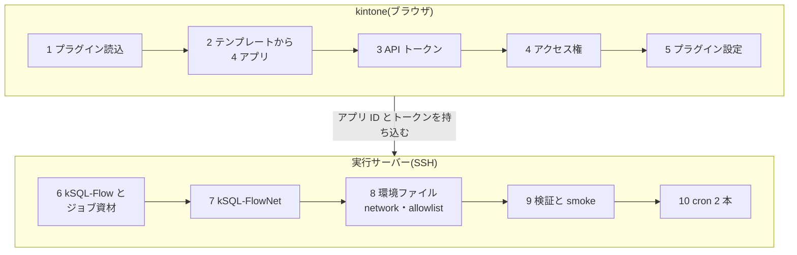

<!-- タイトル: 【kSQL-FlowNet #2】導入編: kintone とサーバーを 0 から運用開始まで
- 連載 #2(#1: https://qiita.com/rex0220/items/24470d6223c1b4ed4031)
- タグ案: kintone, SQL, Node.js, バッチ処理
- 画像は `画像URL_*` の行を差し替える(検証スペースのテストデータで撮影。実アプリ ID・ドメイン・トークンを写さない)
-->

[#1](https://qiita.com/rex0220/items/24470d6223c1b4ed4031)は kSQL-FlowNet が何を解決するかを書きました。今回は **何も入っていない kintone とサーバーに、ボードからの操作要求と cron の定期実行が動くところまで** を通します。手順の正は[導入手順書](https://github.com/rex0220/ksql-flownet/blob/main/docs/installation.md)で、この記事はその流れと、実際にやってみて詰まった箇所です。

**この回で分かること**

- kintone 側(5 手順)とサーバー側(準備+5 手順)で、それぞれ何を作るか
- API トークンとアクセス権をどう分けるか
- 操作要求の動作確認を「ジョブを実行しない smoke」で済ませる方法

**前提**

- kintone のスタンダードコースまたはワイドコース(プラグインと外部 API を利用できる契約)で、アプリ作成とシステム管理ができるアカウント
- Linux サーバー 1 台(Node.js 22 以上、git、SSH)。kintone へ HTTPS で出られればよく、kSQL-FlowNet 用の待受ポートは不要。管理用の SSH を除き、外部からの受信ポートは開けない。この記事では ConoHa VPS の 1 GB プラン + Ubuntu 24.04 を使います
- [kSQL-Flow](https://github.com/rex0220/ksql-flow) のジョブ資材リポジトリ([ksql-flow-template](https://github.com/rex0220/ksql-flow-template) から作ったもの)。既にジョブが動いていれば、その JOBログアプリをそのまま使えます

この記事では、CLI・プラグイン・アプリテンプレートをすべて **v1.0.0** でそろえます。新しい版を使う場合は、その版の [Release](https://github.com/rex0220/ksql-flownet/releases) にある導入手順を確認してください。

## 全体の流れ



kintone 側が先です。サーバー側の環境ファイルに 4 アプリの ID とトークンを書くからです。

## kintone 側

### 1. プラグインを読み込む

システム管理 → プラグインで、[GitHub Release](https://github.com/rex0220/ksql-flownet/releases/tag/v1.0.0) の `flownet-activity-plugin.zip` を読み込みます。 **テンプレートより先** です。テンプレートは実行管理アプリにプラグイン参照を含んでいて、先に読み込んでおくとインポートしただけでプラグインが付きます。

### 2. テンプレートから 4 アプリを作る

システム管理 → アプリテンプレートに `ksql-flownet-apps-1.0.0.zip` を登録し、運用するスペースで「アプリを作成 → テンプレートから作成」を選びます。実行管理・監査履歴・操作要求・JOBログの 4 アプリが一度にでき、実行管理アプリの関連レコード 3 種は新しいアプリを指した状態になります。


4 アプリの ID(URL の `/k/<ID>/`)を控えます。既に kSQL-Flow を運用中で JOBログアプリがある場合は、実行管理アプリの関連レコード `related_job_logs` の参照先を既存アプリに付け替え、テンプレートが作った JOBログは削除します。

### 3. API トークン

各アプリで発行し、 **発行後に「アプリを更新」** します(更新するまで有効になりません)。削除権限はどのトークンにも不要です。

| アプリ | 権限 | 使う主体 |
| --- | --- | --- |
| 実行管理 | 閲覧・追加・編集 | kSQL-FlowNet |
| 監査履歴 | 閲覧・追加・編集 | kSQL-FlowNet |
| 操作要求 | 閲覧・編集(追加は付けない) | ポーラー |
| JOBログ | 閲覧 | kSQL-FlowNet(Attempt の照合) |
| JOBログ | 閲覧・追加・編集 | kSQL-Flow(ジョブ実行ログの書込) |

JOBログだけ 2 本あるのは、書くのは kSQL-Flow、照合のために読むのは kSQL-FlowNet、と主体が違うからです。トークン値はサーバーの環境ファイルへ直接転記し、リポジトリやチャットには貼りません。

### 4. アクセス権

アプリテンプレートはアクセス権を持ち出せないので、ここだけ手で設定します。といっても Console スクリプトを 2 本実行するだけです。

- 操作要求アプリの画面で [`add-request-lifecycle-v2.console.js`](https://github.com/rex0220/ksql-flownet/blob/v1.0.0/templates/console/migrations/add-request-lifecycle-v2.console.js) を実行 → 機械が書く 6 フィールドは Everyone 閲覧のみ、取消フラグ `cancel_requested` は作成者だけ編集可
- JOBログアプリの画面で [`set-joblog-field-acl.console.js`](https://github.com/rex0220/ksql-flownet/blob/v1.0.0/templates/console/set-joblog-field-acl.console.js) を実行 → 相関 5 フィールドを Everyone 閲覧のみ


アプリのアクセス権は、導入・保守を行う管理者と、運用開始後にボードを使う一次対応者で分けます。導入管理者は、手順 3 で API トークンを発行するため 4 アプリすべてのアプリ管理権限が必要です。さらに手順 4 では操作要求・JOBログ、手順 5 では実行管理の設定を変更します。

| アプリ | 導入・保守管理者 | 一次対応者 |
| --- | --- | --- |
| 実行管理 | 閲覧・アプリ管理 | 閲覧 |
| 監査履歴 | 閲覧・アプリ管理 | 閲覧 |
| 操作要求 | 閲覧・追加・編集・アプリ管理 | 閲覧・追加・編集 |
| JOBログ | 閲覧・アプリ管理 | 必要に応じて閲覧 |

筆者の運用では、START 許可の一覧を保守する担当者だけが実行管理アプリの管理権限を持ちます。 **操作要求にレコード編集が要る** のは、ボードの「取消」が既存レコードの取消フラグを更新する操作だからです。ここは実際に非管理者アカウントで取消できることを確認しました(後述)。

### 5. プラグイン設定

実行管理アプリの設定 → プラグイン → 歯車。詳細設定のアプリ ID は **空欄のまま** (関連レコードから自動検出されます)。基本設定の「START を許可するネットワーク」に、サーバー側で許可する network を 1 行ずつ書きます。

```
月次集計(当月分の起動), monthly_summary, 定期
```

保存すると運用環境へ反映されます。実行管理アプリの一覧「00_Run状況」を開き、空のボードと「新規実行」ボタンが出れば kintone 側は完了です。


## サーバー側

### サーバーの準備(ConoHa VPS の例)

この記事の検証と筆者の本番は ConoHa VPS の 1 GB プランです。kSQL-FlowNet も kSQL-Flow も Node.js のプロセスが cron から短時間動くだけで、今回の network と検証データではメモリ 1 GB で足りました。必要量は kSQL-Flow が読み込む件数や SQL の処理内容で変わるので、本番投入前に RSS と実行時間を確認してください。

| 項目 | 値 |
| --- | --- |
| プラン | ConoHa VPS 1 GB(メモリ 1 GB / CPU 2 コア / SSD 100 GB) |
| OS | Ubuntu 24.04 LTS |
| ログイン | SSH 公開鍵(root またはsudo可のユーザー)。kintone 側から入ってくる通信はないので、受信は SSH だけ開ける |
| タイムゾーン | `Asia/Tokyo`(cron の発火時刻に効く) |
| Node.js | 22 系を NodeSource の apt リポジトリから導入(`/usr/bin/node` に入るので cron からもそのまま見える) |
| 費用 | 時間課金で月額上限 1,065 円(税込)。長期契約の割引(まとめトク)なら 12 か月契約で月 488 円(税込)。いずれも 2026 年 9 月時点の[公式料金ページ](https://vps.conoha.jp/pricing/)の表示で、キャンペーン価格は含めていません |


既にプラグインと外部 API を利用できる kintone 契約がある場合、追加のランニングコストはこの VPS 代だけです。kintone 側はアプリ 4 つとプラグインを既存の契約内に置くので追加費用はなく、kSQL-FlowNet・kSQL-Flow は MIT ライセンスの npm パッケージです。

初期設定は次のとおりです。Node.js は NodeSource の apt リポジトリを鍵付きで登録して入れます(NodeSource は `setup_22.x` スクリプト方式を非推奨にしています)。

```sh
timedatectl set-timezone Asia/Tokyo
apt update && apt install -y ca-certificates curl gnupg git ufw
ufw allow OpenSSH && ufw enable

mkdir -p /etc/apt/keyrings
curl -fsSL https://deb.nodesource.com/gpgkey/nodesource-repo.gpg.key \
  | gpg --dearmor -o /etc/apt/keyrings/nodesource.gpg
echo "deb [signed-by=/etc/apt/keyrings/nodesource.gpg] https://deb.nodesource.com/node_22.x nodistro main" \
  > /etc/apt/sources.list.d/nodesource.list
apt update && apt install -y nodejs
node --version   # v22.x
```

VPS は作って終わりではありません。Ubuntu のセキュリティ更新を定期的に適用し、Node.js 22 のサポート終了前に次の LTS へ更新します。

ConoHa のコントロールパネル側では、セキュリティグループで SSH(22)だけを許可し、それ以外の受信は閉じておきます。kintone への通信は外向きの HTTPS(443)なので、受信の許可は要りません。SSH はパスワード認証を無効にして鍵のみにしておくと安全です。

#### 初期設定を Claude Code に任せる

サーバー側の作業は、作業 PC の Claude Code に SSH 経由で実行させることができます。人がやるのは ConoHa のコントロールパネルでの操作(VPS の作成、SSH 鍵の登録、セキュリティグループで 22 番だけ許可)と、IP アドレスと鍵ファイルの場所を伝えることだけです。

Claude Code を kSQL-Flow のジョブ資材リポジトリで開き、次を貼り付けます。

```
実行サーバー root@<IP>(鍵 ~/.ssh/<鍵ファイル>)に SSH で接続し、次の初期設定を行って。
1. timedatectl でタイムゾーンを Asia/Tokyo にする
2. apt update と ca-certificates・curl・gnupg・git・ufw の導入、ufw で OpenSSH だけ許可して有効化
3. NodeSource の apt リポジトリ(署名鍵を /etc/apt/keyrings に置く方式)から Node.js 22 を導入
4. node --version、git --version、timedatectl、ufw status の結果を報告して
コマンドは実行前に 1 つずつ見せて。パスワードやトークンは扱わないこと。
```

Claude Code の権限設定は、各コマンドの実行前に承認を求める状態にして作業します。表示された接続先とコマンドを確認してから承認します。実行後の報告が `v22.x` / `Asia/Tokyo` / `OpenSSH ALLOW` になっていれば、以降の手順 6〜10 も同じ要領で任せられます(手順ごとの指示文は[Claude Code 併用版の導入手順](https://github.com/rex0220/ksql-flownet/blob/main/docs/installation-claude-code.md)にあります)。トークン値はプロンプトへ貼らず、人が SSH 先のエディタで転記します。AI に SSH 操作を許可する以上、環境ファイルなど秘密ファイルを読むコマンドは承認しない運用も必要です。

以下は、構成を追いやすくするために検証用の VPS へ root で導入した例です。本番では SSH 用の管理ユーザーとジョブ実行専用のユーザーを分け、root による定期実行は避けることを勧めます。配置はこの形です。

```
/opt/ksql/
├── ksql-flownet/            # 本体(npm -g でも可)
└── my-ksql-jobs/            # ジョブ資材リポジトリ(cron・ポーラーの cwd)
    ├── ksql.config.json     # kSQL-Flow の接続先(実行ログ = JOBログアプリ)
    ├── .env                 # kSQL-Flow 用トークン(0600)
    └── flownet/monthly-summary/network.yaml と jobs/*.sql
/root/.ksql-flownet.env      # kSQL-FlowNet の環境変数(0600)
/root/flownet-request-allowlist.yaml
```

### 6. kSQL-Flow とジョブ資材

```sh
mkdir -p /opt/ksql /var/log/ksql /var/tmp/ksql-flownet
cd /opt/ksql && git clone <ジョブ資材リポジトリ> my-ksql-jobs && cd my-ksql-jobs
npm ci   # package-lock.json どおりに入れる(無ければ npm install)
cp .env.example .env && chmod 600 .env   # KSQL_TOKEN_LOGS などを記入
node --env-file=.env node_modules/@rex0220/ksql-flow/dist/cli.js validate --check-logapp --profile prod
```

`OK: ログアプリ … 8.2 のフィールド定義を満たしています` が出れば、kSQL-Flow はテンプレートの JOBログアプリを認識しています。

### 7. kSQL-FlowNet

```sh
npm install --global @rex0220/ksql-flownet@1.0.0
ksql-flownet --version   # 1.0.0
which ksql-flownet       # /usr/bin/ksql-flownet(cron に書く絶対パス)
```

### 8. 環境ファイル・network 定義・allowlist

環境ファイルは `export` 形式で root 所有 0600。 **サーバー上で LF で保存** します(Windows から貼り付けると CRLF が混入し、allowlist が読めなくなります。実際にやりました)。

```sh
# /root/.ksql-flownet.env(抜粋)
export KSQL_FLOWNET_PROFILE=prod
export KSQL_FLOWNET_BASE_URL=https://<subdomain>.cybozu.com
export KSQL_FLOWNET_STATE_APP_ID=<実行管理アプリID>
export KSQL_FLOWNET_STATE_API_TOKEN=<実行管理トークン>
# … 監査履歴・JOBログ・操作要求も同様(全 21 変数の一覧は仕様書 §2.2)
export KSQL_FLOWNET_REQUEST_ALLOWLIST_PATH=/root/flownet-request-allowlist.yaml
export KSQL_FLOW_BIN=node
export KSQL_FLOW_BIN_ARGS='["node_modules/@rex0220/ksql-flow/dist/cli.js"]'
export KSQL_FLOW_CONFIG=ksql.config.json
export KSQL_FLOW_WORKDIR=/var/tmp/ksql-flownet
```

network 定義は前回の YAML と同じです。`validate` と `plan` はローカルで完結する検査で、ここで YAML・DAG・SQL の存在と業務キーを確認します。

```sh
cd /opt/ksql/my-ksql-jobs && . /root/.ksql-flownet.env
ksql-flownet validate flownet/monthly-summary/network.yaml
ksql-flownet plan flownet/monthly-summary/network.yaml --scheduled-for 2026-09-01T00:00:00+09:00
```

```
Valid network definition: flownet/monthly-summary/network.yaml
Business key: monthly_summary@2026-09
Execution plan:
1. intake_gate | job_id=intake_count | idempotent=true | depends_on=-
2. deal_summary | job_id=deal_summary | idempotent=true | depends_on=intake_gate
```

allowlist はボード・ポーラーから扱う network を絶対パスで列挙し、ボードから新規実行してよいものだけ `app_start: true` を明示します(省略は `false`)。

```yaml
networks:
  - network_id: monthly_summary
    definition_path: /opt/ksql/my-ksql-jobs/flownet/monthly-summary/network.yaml
    app_start: true
```

### 9. 検証と smoke

cron を登録する前に、read-only の事前確認を通します。

```sh
cd /opt/ksql/my-ksql-jobs
. /root/.ksql-flownet.env

node --env-file=.env /usr/bin/ksql-flownet poll-requests --check
# poll-requests check: ok networks=1 request_app=readable
```

cron へ登録する定期実行用スクリプトを手動で 1 回流し、Run が `SUCCESS` になることと、監査履歴・JOBログに相関 ID 付きのレコードができることを見ます。

```sh
./run_monthly_summary.sh --json
# {"outcome":"NEW","run_id":"netrun_…","aggregate_status":"SUCCESS",…}
ksql-flownet status monthly_summary --profile prod --json
```

#### ジョブを動かさず、操作経路だけを smoke する

次に **操作要求の smoke** です。ボードから START を起票して直後に取消し、ポーラーを 1 回手で回します。何も実行せずに、起票 → 取消 → ポーラーの書戻しの経路だけを確認できます。

1. 操作要求アプリの「01_未処理要求」が空であることを確認
2. 一次対応者のアカウントでボードの「新規実行」から START を起票(補正モードで業務キーに `-smoke` を付ける)
3. 直後に「取消」
4. 操作要求レコードが `REQUESTED` かつ `取消` になっていることを確認してから、ポーラーを 1 回実行

```sh
node --env-file=.env /usr/bin/ksql-flownet poll-requests
# poll-requests: requested=1 claimed=0 completed=0 cancelled=1 invalid=0 stale=0 skipped=0
```

要求レコードが `CANCELLED / CANCELLED_BY_REQUESTER` になり、Run は増えていなければ合格です。


### 10. cron 2 本

root の `crontab -e` で登録します。発火時刻はサーバーのタイムゾーンに従います(network 定義の `timezone` は業務キーの導出用です)。

```cron
PATH=/usr/local/sbin:/usr/local/bin:/usr/sbin:/usr/bin:/sbin:/bin
0 7 1 * * . /root/.ksql-flownet.env && cd /opt/ksql/my-ksql-jobs && flock -n /run/lock/flownet-monthly.lock ./run_monthly_summary.sh >> /var/log/ksql/flownet.log 2>&1
*/5 * * * * . /root/.ksql-flownet.env && cd /opt/ksql/my-ksql-jobs && flock -n /run/lock/flownet-poller.lock node --env-file=.env /usr/bin/ksql-flownet poll-requests >> /var/log/ksql/flownet-requests.log 2>&1
```

cron の `PATH` は対話シェルより短いので、先頭で明示し、CLI は `which ksql-flownet` で確認した絶対パスで書きます。`flock -n` は前回の起動が 5 分以内に終わらなかったときの多重起動を避けるためのものです(kSQL-FlowNet 自体も Network ロックと要求の claim で二重実行を防ぎますが、ポーラーのプロセスを重ねない方が単純です)。

5 分待って `flownet-requests.log` に `poll-requests: requested=0 …` が増えれば、運用開始の状態です。`/var/log/ksql/*.log` は `>>` で追記され続けるので、logrotate で週次・12 世代・圧縮などの設定を入れておきます(設定例は[導入手順書 §10](https://github.com/rex0220/ksql-flownet/blob/main/docs/installation.md)にあります)。

## 実際にやって詰まった箇所

導入手順書だけを見て検証用のスペースとサーバーで通したときのメモです。いずれも手順書へ反映済みです。

- **`status` には `--profile` が要る**: 手順書の例に抜けていて、そのまま打つと `--profile is required` で止まった
- **環境ファイルの CRLF**: 別ファイルから行を複写したら CRLF が混入し、`file` コマンドで気づいた。LF に直して解決
- **非管理者の取消**: フィールドアクセス権(作成者=編集可)だけでは足りず、アプリのレコード編集権限が必要。手順書の推奨アクセス権を「閲覧・追加・編集」に直した
- **cron の `PATH`**: この記事の NodeSource 構成では `/usr/bin/node` を使うので `PATH` の明示で足りる。nvm など別の場所へ導入した場合は、cron の `PATH` だけでなく環境ファイルの `KSQL_FLOW_BIN` にも `which node` で確認した絶対パスを設定する

## 次回

#3 network 定義編。手元の kSQL-Flow ジョブを network.yaml に束ねるときの、`network_id` と `business_key` の決め方、ゲートの置き方、冪等の宣言基準を書きます。

- 導入手順書: https://github.com/rex0220/ksql-flownet/blob/main/docs/installation.md
- サーバー側を Claude Code に任せる場合: https://github.com/rex0220/ksql-flownet/blob/main/docs/installation-claude-code.md
- 環境変数の一覧: 仕様書 §2.2 https://github.com/rex0220/ksql-flownet/blob/main/docs/specification.md
