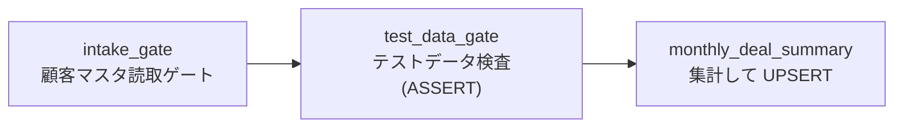
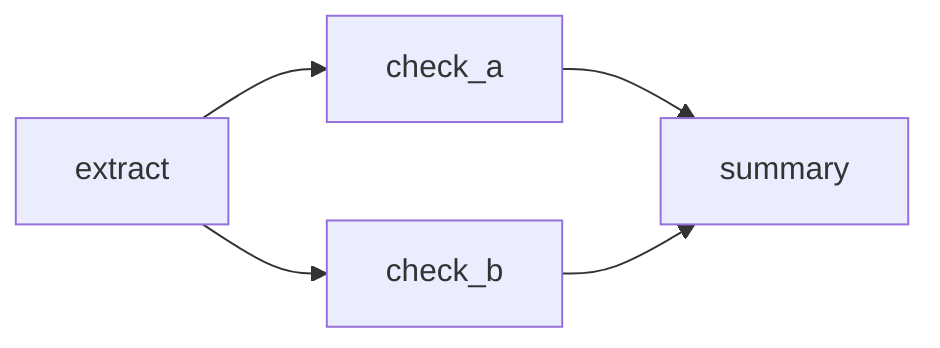
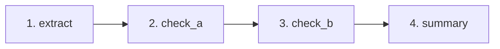
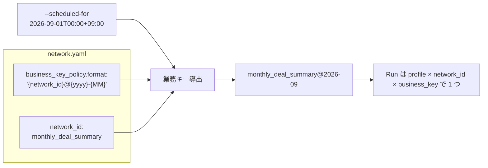

<!-- タイトル: 【kSQL-FlowNet #3】network 定義編: 既存の kSQL-Flow ジョブを DAG にする
- 連載 #3(#1: https://qiita.com/rex0220/items/24470d6223c1b4ed4031、#2: https://qiita.com/rex0220/items/2308e4ccf5a363680d31)
- タグ案: kintone, SQL, YAML, DAG
-->

[#1](https://qiita.com/rex0220/items/24470d6223c1b4ed4031) で全体像、[#2](https://qiita.com/rex0220/items/2308e4ccf5a363680d31) で導入を書きました。今回は **手元にある kSQL-Flow のジョブ(SQL ファイル)を、どう network.yaml に束ねるか** です。仕様の正は[統合仕様書 §4](https://github.com/rex0220/ksql-flownet/blob/v1.0.0/docs/specification.md)(v1.0.0)で、この記事は「決めること」と「決め方」に絞ります。

**この回で分かること**

- YAML の 3 つの識別子(`network_id` / `business_key` / ノードの `id` と `job_id`)にそれぞれ何を書くか
- 先頭に「ゲート」を置く理由と、`idempotent: true` と書いてよいジョブの条件
- `validate` と `plan` で何が検査され、何が検査されないか

**前提**

- kSQL-Flow で単独実行できる SQL ジョブが 1 本以上ある(`-- @ksql name:` ヘッダ付き)
- #2 の手順 6〜8 まで済んでいる(ジョブ資材リポジトリと kSQL-FlowNet が入り、環境ファイルがある)

## 題材: 月次案件集計

kSQL Flow 連載で使ってきた「案件管理を会社別に集計して顧客管理へ UPSERT する」月次ジョブを、3 ノードの network にします。SQL は既に 3 本あります。

| SQL | `@ksql name` | 何をするか | 書込 |
| --- | --- | --- | --- |
| `jobs/00_intake_count.sql` | `intake_count` | 顧客マスタが読めることを確認するだけの軽量ゲート | なし |
| `jobs/10_test_data_gate.sql` | `test_data_gate` | テスト案件にマイナス売上があれば `ASSERT` で異常停止 | なし |
| `jobs/monthly_deal_summary.sql` | `monthly_deal_summary` | 当月受注予定を会社別に集計し、顧客管理へ会社名キーで UPSERT | あり(UPSERT) |

kSQL-Flow だけで動かしていたときは、この 3 本を `run-all` の並び順と `@ksql depends_on` で制御していました。network にすると、順序・失敗時の停止・再開・記録が kSQL-FlowNet の仕事になります。

## network.yaml

```yaml
# flownet/monthly-summary/network.yaml
schema_version: 1
network_id: monthly_deal_summary
description: 当月受注予定の案件を会社別に集計し顧客管理へ UPSERT する月次バッチ
business_key_policy:
  type: scheduled_period
  period: month
  timezone: Asia/Tokyo
  format: "{network_id}@{yyyy}-{MM}"
max_active_runs: 1
network_lock:
  lease_duration_sec: 300
  heartbeat_interval_sec: 60
nodes:
  - id: intake_gate
    job_id: intake_count
    sql: ../../jobs/00_intake_count.sql
    depends_on: []
    trigger_rule: all_success
    idempotent: true # 読取ゲートのみ・書込なし
  - id: test_data_gate
    job_id: test_data_gate
    sql: ../../jobs/10_test_data_gate.sql
    depends_on: [intake_gate]
    trigger_rule: all_success
    idempotent: true # 読取 ASSERT のみ・書込なし
  - id: monthly_deal_summary
    job_id: monthly_deal_summary
    sql: ../../jobs/monthly_deal_summary.sql
    depends_on: [test_data_gate]
    trigger_rule: all_success
    idempotent: true # 会社名キー UPSERT で毎回全対象を書き直す
```



### DAG とは

network は DAG(有向非巡回グラフ)です。ノードを点、`depends_on` を「依存先 → 自分」の矢印としたとき、矢印をたどって元のノードに戻る経路(循環)がないグラフを指します。kSQL-FlowNet はこの形しか受け付けず、`validate` は自己依存・未知ノードへの依存・循環を拒否します。

DAG にすると、実行順が矢印から一意に決まります。「依存先がすべて終わってから自分が動く」ように並べた順序を **トポロジカル順** と呼び、上の 3 ノードなら `intake_gate → test_data_gate → monthly_deal_summary` の 1 通りです。分岐・合流があると並べ方が複数ありえます。



この図は依存関係を表したもので、`check_a` と `check_b` が同時に動くという意味ではありません。両者は互いに依存しないので、どちらを先に動かしても正しい順序ですが、kSQL-FlowNet は並列には動かさず、 **YAML の `nodes` に書いた順** で 1 ノードずつ直列に進めます。`nodes` に `check_a` を先に書いていれば、実際の実行順はこうなります。



`check_b` を先に書けば 2 と 3 が入れ替わります。同じ定義なら常に同じ順になるので、`plan` の出力(後述)で実行順を確認できます。`summary` は `check_a` と `check_b` の両方が SUCCESS になってから起動し(`trigger_rule: all_success`)、どちらかが FAILED なら起動しません。

つまり定義者が決めるのは「何が何に依存するか」だけで、「何番目に動くか」は書きません。順序を変えたいときは矢印(`depends_on`)を変えます。

この YAML で決めたことを、上から順に見ていきます。

## 決めること 1: `network_id` と `business_key`

役割が違います。

| 識別子 | 意味 | 誰がいつ決めるか | 一致させる場所 |
| --- | --- | --- | --- |
| `network_id` | 処理(DAG)の名前 | 定義者が YAML に 1 度 | allowlist の `network_id`、プラグインの START 許可 CSV、操作要求の `network_id`、`status <network_id>` |
| `business_key` | その処理の 1 回分(対象期間・対象データ)の名前 | 定期: `--scheduled-for` から `format` で自動導出。補正・任意: 起票者が指定 | Run の一意性(`profile × network_id × business_key`)、Run 一覧、JOBログの相関、CSV パス |



決め方の目安です。

- `network_id` は英数字とアンダースコアの短い名前。 **変えると別 network 扱い** になり、既存の Run と結びつかなくなるので、最初に決めたら変えません
- `business_key` に network 名を含める義務はありません(一意性は network ごとに判定されます)。それでも `{network_id}@` を前置するのは、Run 一覧・JOBログ・CSV パスでは `business_key` しか見えないからです。複数 network を運用すると `2026-09` だけでは何の Run か分かりません
- `period` は `month` か `day`。`format` に使えるプレースホルダーは `{network_id}` `{yyyy}` `{MM}` `{dd}` だけです
- 定期実行しない(対象期間の概念がない)処理は `type: explicit` にし、起動のたびに `--business-key` を渡します。取込ファイル名をキーにする、といった使い方です

## 決めること 2: ノードの `id` と `job_id`

ノードは「1 つの SQL ファイルを 1 回の kSQL-Flow ジョブとして実行する単位」です。SQL の中に何文あっても 1 ノードで、文単位には分かれません。識別子は 3 つあります。

| 識別子 | 役割 | 決め方 |
| --- | --- | --- |
| `id` | DAG 内の名前。`depends_on` の参照先で、実行管理アプリの Node State や監査履歴の Attempt に `node_id` として残る | 役割が分かる名前(`intake_gate`、`deal_summary`)。ボードのエラー要約に `validate: ASSERT_FAILED` のように出るので、人が読む前提で付ける |
| `job_id` | kSQL-Flow 側のジョブ名。SQL ヘッダの `-- @ksql name:` と **一致必須** | SQL 側が正。既存ジョブを流用するなら SQL の名前をそのまま書く |
| `sql` | 実行するファイル(YAML からの相対パス) | network 専用の SQL は `jobs/` 配下、複数 network で共用する SQL は共有 `jobs/` を `../../jobs/…` で参照 |

`job_id` には 1 つ制約があります。kSQL-Flow のジョブロックのキーが `profile:job_id` で、 **64 文字(UTF-16 単位)以内** という実測上限があります。`prod:monthly_deal_summary` は 25 文字なので余裕ですが、長い名前を付けるときは注意してください。この超過は `validate` では検出されず、実行時に `VALIDATION_ERROR` になります。

`id` と `job_id` を同じにしてもかまいません。分けているのは、`id` は DAG の中での役割名、`job_id` は kSQL-Flow のジョブ名、と別の名前空間だからです。上の例では `intake_gate`(役割)と `intake_count`(ジョブ)のように分けています。

## 決めること 3: ゲートを先頭に置く

network の先頭 2 ノードは何も書きません。読み取って条件を検査し、満たさなければ `ASSERT` で止めるだけです。これを「ゲート」と呼んでいます。

- **業務異常で止める**: `test_data_gate` はテスト案件にマイナス売上があれば `ASSERT` 違反で FAILED になり、後続の集計は起動しません。集計 SQL の中にも同じ `ASSERT` はありますが、ゲートを別ノードにすると **どこで止まったかが Node State に残り**、ボードのエラー要約に `test_data_gate: ASSERT_FAILED` と出ます
- **対象 0 件は正常スキップ**: 集計 SQL の `EXIT SUCCESS IF … = 0` は「異常ではないが書くものがない」ケースで、ノードは SUCCESS(結果コード `NO_DATA`)になります。`ASSERT`(異常停止・アラート対象)と `EXIT SUCCESS IF`(正常スキップ・アラートなし)の使い分けは kSQL Flow 連載の #8 と同じです
- **上流 network の結果を待つゲート**: 「日次取込が今日の分を終えてから月次を動かしたい」のような network をまたぐ順序は、kSQL-FlowNet では表現できません(network 間の依存は未対応)。代わりに下流の先頭に「上流の結果データが揃っているか」を検査するゲートを置き、揃っていなければ FAILED にして、上流完了後にリランします(fail-closed)。パターンは #5 で扱います

## 決めること 4: `idempotent: true` と書いてよい条件

`idempotent` は全ノード必須のフィールドで、kSQL-FlowNet はこれを **定義者の宣言として信じます**。システムが冪等性を検証するわけではありません。宣言は 3 か所で使われます。

| 場面 | `true` のとき | `false` のとき |
| --- | --- | --- |
| 失敗後の resume / ボードのリラン | 失敗ノードから再実行する | 実行済みの `false` ノードが再実行対象に含まれると resume 自体が拒否される。人が `resolve-node` で証跡付きに解決してから続行する |
| ボードからの START | 全ノードが `true` の network だけ許可(三重ゲートの 1 つ) | その network は cron か CLI からしか起動できない |
| UNKNOWN(結果 JSON が読めない)の扱い | 冪等でも自動再実行はしない。`resolve-node` で人が解決する | 同左 |

`true` と宣言できるのは、同じ業務キーで再実行しても、重複追記・二重送信・重複加算のような **累積する副作用を起こさず、その Run の入力に対する正しい状態へ収束できる** ジョブです。終了結果(SUCCESS / FAILED)が毎回同じことではありません。異常データを直してからゲートを再実行すれば結果は FAILED から SUCCESS に変わりますが、副作用がないので `true` で構いません。判断の目安です。

- 読取と `ASSERT` / `EXIT SUCCESS IF` だけ → 副作用がないので `true`
- 重複禁止フィールドをキーにした `UPSERT` で、同じ対象を同じ値へ収束させる → `true`(上の集計 SQL がこれです。Run の `as_of` に固定された入力を毎回全件 UPSERT するので、再実行しても同じ状態に戻ります)
- `INSERT` で追記する、`UPDATE … SET x = x + 1` のように現在値に依存する、外部へ通知を送る → 副作用が累積するので `false`
- `@NOW()` など as-of 由来の時刻関数は、Run の `as_of` に固定されるので冪等性を崩しません。`@` なしの `TODAY()` は kintone 側で評価されるため崩します(kSQL-Flow の検証で警告が出ます)

迷ったら `false` にしておき、失敗時は人が判断する側に倒します。`false` のノードがある network でも、cron や CLI から新規 Run を起動できます。ただし resume で `false` ノードの再実行が必要になる場合は拒否されるので、実行結果を確認し、`resolve-node` で証跡付きに解決してから後続を再開します。また、全ノードが `true` ではないため、ボードからの START 対象にはできません。

## 決めること 5: ロックの時間と同時 Run 数

```yaml
max_active_runs: 1
network_lock:
  lease_duration_sec: 300
  heartbeat_interval_sec: 60
```

- `network_lock` は network 単位の実行排他です。実行中は `heartbeat_interval_sec` ごとにロックの期限を延ばし続けるので、`lease_duration_sec` は **heartbeat が途絶えたあともロックを保持する猶予** であって、ノードの実行時間より長くする必要はありません。通信遅延や一時停止で誤って失効しない余裕を持たせつつ、プロセス停止後の復旧を遅らせすぎない値にします。heartbeat は lease の 3 分の 1 以下にし、この例の 300 秒 / 60 秒では 5 回分の余裕があります。プロセスが落ちても、lease 失効後は次の起動がロックを取得できます(ロックの取得と Run の resume は別の処理です)
- `max_active_runs` は **並列度ではありません**。「未完了の Run(業務キー違い)をいくつ持てるか」で、実行は常に直列です。月次で前月の失敗 Run を残したまま当月を動かしたい、という場合だけ 2 以上にします

## 検査する: `validate` と `plan`

```sh
cd /opt/ksql/my-ksql-jobs && . /root/.ksql-flownet.env
ksql-flownet validate flownet/monthly-summary/network.yaml
ksql-flownet plan flownet/monthly-summary/network.yaml --scheduled-for 2026-09-01T00:00:00+09:00
```

```
Valid network definition: flownet/monthly-summary/network.yaml
Business key: monthly_deal_summary@2026-09
Execution plan:
1. intake_gate | job_id=intake_count | idempotent=true | depends_on=-
2. test_data_gate | job_id=test_data_gate | idempotent=true | depends_on=intake_gate
3. monthly_deal_summary | job_id=monthly_deal_summary | idempotent=true | depends_on=test_data_gate
```

| 検査するもの | 検査しないもの |
| --- | --- |
| YAML のスキーマ(未知のフィールド・重複キーは拒否)、`depends_on` の参照先と循環、`business_key_policy` の整合、SQL ファイルの存在と読取可能 | SQL の構文・アプリ定義との整合(kSQL-Flow の `validate -f` で行う)、`job_id` と `@ksql name` の一致(実行時に `KSQL_FLOW_EXIT_MISMATCH`)、ジョブロックキーの 64 文字 |

`plan` は kintone API を呼び出さず、SQL を解析・実行もしません。業務キーと DAG の実行順を表示します。定義を変えたら `validate` → `plan` → kSQL-Flow 側の `validate -f` と `--dry-run`、の順で確認します。

## 置き場所と変更の流し方

```
my-ksql-jobs/
├── jobs/                          # 複数 network で共用する SQL
│   ├── 00_intake_count.sql
│   ├── 10_test_data_gate.sql
│   └── monthly_deal_summary.sql
└── flownet/
    └── monthly-summary/
        ├── network.yaml            # network_id: monthly_deal_summary
        └── jobs/                   # この network 専用の SQL(あれば)
```

- 1 network = 1 YAML。ボード・ポーラーから使う network は allowlist に絶対パスで登録します
- 定義と SQL は git で配置し、サーバー上で直接編集しません。 **Run は作成時に定義と SQL を bundle として保存する** ので、配置後に SQL を変えても、途中まで進んだ既存 Run の resume は保存時の SQL で続きます
- 定義と SQL を変更するときは、ポーラーと対象 network の定期 cron を一時停止するか、次の発火時刻と重ならない時間に配置します。配置後に `validate`、`plan`、kSQL-Flow の `validate -f`、`poll-requests --check` を通してから起動経路を再開します。作成済みの Run は保存された bundle を使うため、配置後のファイルには影響されません

## まとめ

| 決めること | 決め方 |
| --- | --- |
| `network_id` | 処理の名前。最初に決めたら変えない |
| `business_key_policy` | 定期なら `scheduled_period`(`{network_id}@{yyyy}-{MM}`)、期間の概念がなければ `explicit` |
| ノードの `id` / `job_id` / `sql` | `id` は役割名、`job_id` は SQL の `@ksql name`、`sql` は相対パス。`profile:job_id` は 64 文字以内 |
| ゲート | 先頭に読取専用の検査ノード。異常は `ASSERT`、対象なしは `EXIT SUCCESS IF` |
| `idempotent` | 再実行しても累積する副作用を起こさず、正しい状態へ収束できるときだけ `true`。迷えば `false` |
| ロック | heartbeat は lease の 1/3 以下。lease は一時的な遅延への余裕と、障害後の復旧時間のバランスで決める(ノードの実行時間には依存しない) |

## 次回

#4 運用編。ボードの 3 セクションの読み方、START の 3 モード、取消・リラン・停止・解除・クローズの使い分け、結果コードの早見を書きます。

- 統合仕様書 §4(network 定義、v1.0.0): https://github.com/rex0220/ksql-flownet/blob/v1.0.0/docs/specification.md
- #2 導入編: https://qiita.com/rex0220/items/2308e4ccf5a363680d31
- #1 全体像: https://qiita.com/rex0220/items/24470d6223c1b4ed4031
