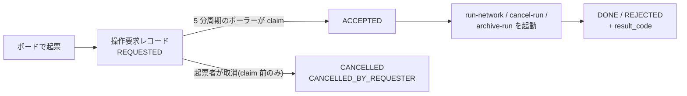

<!-- タイトル: 【kSQL-FlowNet #4】運用編: ボードから動かす
- 連載 #4(#1: https://qiita.com/rex0220/items/24470d6223c1b4ed4031、#2: https://qiita.com/rex0220/items/2308e4ccf5a363680d31、#3: https://qiita.com/rex0220/items/45f04c2748570953629b)
- タグ案: kintone, SQL, バッチ処理, 運用
- 画像は #1 で使ったボード・ダイアログのキャプチャを再利用。追加で撮るなら `画像URL_*` の行を差し替える
-->

[#3](https://qiita.com/rex0220/items/45f04c2748570953629b) までで network が動く状態になりました。今回は **運用担当者(一次対応者)が毎日何を見て、何を押し、何を押してはいけないか** です。正本は[一次対応 1 ページ](https://github.com/rex0220/ksql-flownet/blob/v1.0.0/docs/ops-first-response.md)で、この記事はその考え方と画面の対応を説明します。

**この回で分かること**

- ボードの 4 つのセクションと、activity 4 値の読み方
- START / RERUN / STOP / RELEASE / CLOSE の使い分けと、ボタンがいつ出るか
- 起票してから結果が返るまでに何が起きるか。`DONE` が「成功」ではない理由

**前提**

- #2 の導入が済み、ボード(実行管理アプリの「00_Run状況」)が表示できる
- 一次対応者のアカウントに、実行管理・監査履歴の閲覧と、操作要求の閲覧・追加・編集がある(#2 のアクセス権)

## 運用担当者がやること・やらないこと

kSQL-FlowNet の運用は「見る」と「依頼する」の 2 つだけです。

| やること | どこで |
| --- | --- |
| Run の状態を見る | ボード「00_Run状況」、実行管理アプリの一覧 |
| 操作を依頼する(新規実行・リラン・停止・解除・クローズ) | ボードのボタン → 操作要求アプリにレコードが 1 件できる |
| 依頼の結果を見る | ボードの pending 表示、操作要求アプリの `request_state` / `result_code` |

| やらないこと | 理由 |
| --- | --- |
| 実行管理・監査履歴・JOBログのレコードを編集・削除する | 機械専用。編集すると本体の書込みが失敗し、状態が壊れる |
| 既存の要求レコードを編集して再依頼する | 依頼は常に新しいレコード。編集で状態を変える経路はない |
| 復旧コマンド(`resolve-node`、`force-unlock-network` など)を自分で打つ | 二次対応者(サーバー管理者)の作業。証跡付きで行う |
| 結果が `STALE` や不明の依頼を、別レコードで繰り返す | 実行済みか未実行かを照合してからでないと二重実行になりうる |

## 毎朝の確認(2 分)

実行管理アプリで 3 つを見ます。

1. **「00_Run状況」ボード**: 進行中の Run と、終了済みで対応が必要な Run
2. **「01_要対応ノード」一覧**: 行があるか
3. **「02_未完了Run」一覧**: 昨夜のうちに終わっているはずの Run が残っていないか

01 が空でも安心しないでください。途中で中断したまま全ノードが「待機」のケースは 01 に出ません。だから 02 も見ます。

## ボードの読み方

| セクション | 何が出るか | 見るポイント |
| --- | --- | --- |
| START要求 | 処理待ちの START と、最近の完了・拒否 | 自分が起票した処理待ちには「取消」が出る。取消済みは操作要求アプリの「03_取消済み」へ |
| 進行中の Run | 未終端(SUCCESS / FAILED / CANCELLED / UNKNOWN 以外)の Run | **activity**(下表)で「本当に動いているか」を見る |
| 終了済み・対応が必要な Run | FAILED / CANCELLED / UNKNOWN の Run(クローズ済みは除く) | エラー概要(どのノードが何で止まったか)と、押せるボタン |
| 最近の終了 Run | 直近 10 件 | 昨夜の定期実行が SUCCESS で終わっているか |

「RUNNING」は「実行中」ではなく「未完了」の意味です。本当に動いているかは activity が示します。

| activity | 意味 | 対応 |
| --- | --- | --- |
| `LIVE`(緑) | ロックの所有者がこの Run で、lease が生きている。実行中 | **待つ(触らない)** |
| `IDLE`(灰) | まだ開始していない | 定期起動を待つ |
| `STOPPED`(黄) | 停止要求による hold 中 | 止めた本人に確認。解除は「解除要求」 |
| `INTERRUPTED`(赤) | 上のどれでもない。中断の疑い(プロセス停止など) | **まずリラン要求を 1 回**。結果が `OK` 以外なら Run ID を添えて二次対応者へ |

activity はブラウザが実行管理アプリのロック情報から導出します。画面と CLI で判断が割れたときは、サーバーで打つ `status --json` が正です。判定時刻(ボード右上)が古いときは「再読込」を押します。

## 5 つの操作と、ボタンがいつ出るか

| 操作 | 使う場面 | 起きること |
| --- | --- | --- |
| **START**(新規実行) | まだ Run がない業務実行単位を作る(定期の前倒し、補正、任意キー) | ポーラーが `run-network` を新規起動。同じ業務キーの Run があれば、完走済みは NOOP、未完了は拒否 |
| **RERUN**(リラン要求) | INTERRUPTED を再開する、原因を直した FAILED を再開する | 失敗ノードから再開。成功済みノードは再実行しない |
| **STOP**(停止要求) | 未完了の Run を安全な区切りで止める | **実行中の SQL は止まらない**。次のノード境界で hold がかかる |
| **RELEASE**(解除要求) | STOP の hold を外す | 解除するだけで再開しない。次の定期 cron やリラン要求で再開する |
| **CLOSE**(クローズ要求) | FAILED / CANCELLED をリランせずに片付ける | Run は ARCHIVED になり **二度と再開できない**。再集計は別の補正キーで START |

ボタンは Run の状態と activity から決まります。迷ったら、出ているボタンが「いま許される操作」です。

| Run の状態 | 出るボタン |
| --- | --- |
| 未完了 + LIVE | 停止要求 |
| 未完了 + STOPPED | 解除要求 |
| 未完了 + INTERRUPTED | リラン要求 |
| FAILED / CANCELLED、hold あり | 「停止hold」バッジと解除要求(先に解除してからリラン) |
| FAILED / CANCELLED、hold なし | リラン要求とクローズ要求 |
| UNKNOWN | ボタンなし。「Run ID をコピーして二次対応者へ連絡」だけ |

UNKNOWN は「結果を確認できない」状態で、触ると危険です。冪等なノードでも自動再実行はされず、二次対応者が証跡付きで解決します(#3 の `idempotent` の項)。

## START の 3 モード

| モード | 入力 | できる Run | 使う場面 |
| --- | --- | --- | --- |
| 定期キー | network + 対象期間 | `monthly_summary@2026-09` のような定期キーの Run | 定期実行を前倒しで動かす。既に成功済みなら NOOP |
| 補正 | network + 対象期間 + 業務キー | `monthly_summary@2026-09-correction-1` のような別キーの Run | 成功済みの月を作り直す。対象期間は `as_of` に使われる |
| 任意キー | network + 業務キー | `type: explicit` の network の Run | 取込ファイル名などをキーにする処理 |

選択肢に出る network は、プラグイン設定の START 許可 CSV から来る表示用の一覧です。実際に起動できるかはサーバー側の allowlist(`app_start: true`)と network 定義(全ノード `idempotent: true`)が決めます(三重ゲート)。一覧にない network を「その他(自由入力)」で起票しても、サーバーで `NETWORK_NOT_ALLOWED` になります。

## 起票してから結果が返るまで

- ポーラーは 5 分間隔なので、起票から処理開始まで最大 5 分ほどかかります
- 処理待ち(REQUESTED)の間は、起票者本人だけがボードの「取消」で取り下げられます。ACCEPTED になったら取り消せません。動き出した Run を止める役割は STOP です
- **`DONE` は「依頼の処理が終わった」であって、Run の成功ではありません。** RERUN や START の Run が成功したかは、ボードの Run の状態で確認します

## 結果コードの読み方(よく出るもの)

| result_code | 意味 | 一次対応 |
| --- | --- | --- |
| `OK` | 依頼どおり実行した | Run の状態をボードで確認 |
| `NOOP_ALREADY_SUCCESS` | 同じ業務キーの Run が成功済み | 何もしない。作り直すなら補正キーで START |
| `RUN_ALREADY_EXISTS` | 同じ業務キーの未完了 Run がある | START ではなく、その Run にリラン要求 |
| `RETRY_BRAKE` | 同じ失敗が 3 回続いたので自動再試行を止めている | SQL かデータの修正が要る。二次対応者へ |
| `STOP_REQUESTED` / `RELEASED` | 停止 hold をかけた / 外した | STOP は次のノード境界で効く |
| `RUN_ARCHIVED` | CLOSE 完了 | 対応完了 |
| `LOCK_CONFLICT` | ロック競合 | **同じ依頼を繰り返さない**。二次対応者へ |
| `STALE` | 実行したかどうかを確定できない | **再依頼禁止**。要求 ID と Run ID を二次対応者へ |
| `CANCELLED_BY_REQUESTER` | claim 前に取り消した | 何も実行していない |

全コードは[統合仕様書 §6.7](https://github.com/rex0220/ksql-flownet/blob/v1.0.0/docs/specification.md)にあります。共通のルールは 2 つです。`OK` 以外の同じ依頼を繰り返さない。`STALE` と UNKNOWN は照合が終わるまで何もしない。

## 二次対応者へ連絡するときに伝えること

1. どの一覧の、どの行か(スクリーンショットが確実)
2. Run ID(行に表示。UNKNOWN の行にはコピーボタンがある)
3. 業務への影響(締切があるか)

## まとめ

- 毎朝はボードと 01・02 一覧の 3 か所。「RUNNING」は未完了の意味で、動いているかは activity で見る
- 操作は 5 つ。出ているボタンが「いま許される操作」。UNKNOWN は触らず連絡
- 依頼は要求レコードとして残り、`DONE` は依頼の完了であって Run の成功ではない
- `OK` 以外の同じ依頼を繰り返さない。`STALE` と UNKNOWN は照合待ち

## 次回

#5 スケジュール連携編。複数の network を定刻にどう並べるか、network をまたぐ順序をシェルスクリプトと ASSERT ゲートでどう作るか、営業日判定をどこに置くかを書きます。

- 一次対応 1 ページ(正本): https://github.com/rex0220/ksql-flownet/blob/v1.0.0/docs/ops-first-response.md
- 統合仕様書 §6(操作要求とポーラー)・§7(ボード): https://github.com/rex0220/ksql-flownet/blob/v1.0.0/docs/specification.md
- #3 network 定義編: https://qiita.com/rex0220/items/45f04c2748570953629b
