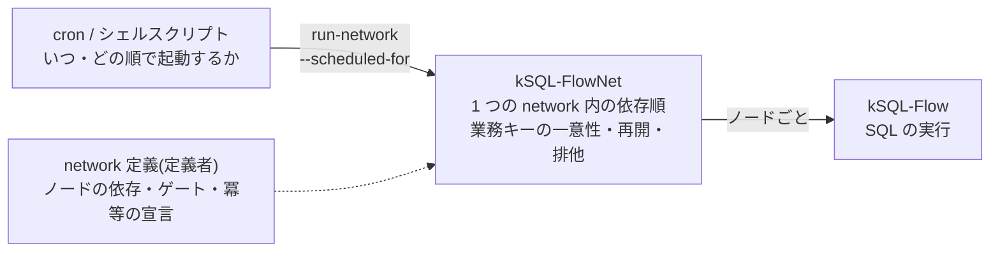
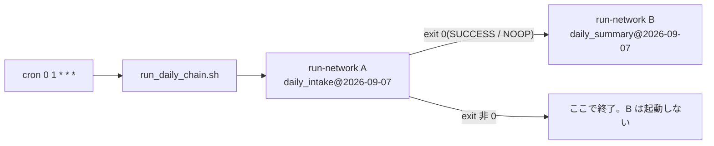

<!-- タイトル: 【kSQL-FlowNet #5】スケジュール連携編: cron と network の分担
- 連載 #5(#1: https://qiita.com/rex0220/items/24470d6223c1b4ed4031、#2: https://qiita.com/rex0220/items/2308e4ccf5a363680d31、#3: https://qiita.com/rex0220/items/45f04c2748570953629b、#4: https://qiita.com/rex0220/items/45a086c83cb1dd992aeb)
- タグ案: kintone, SQL, cron, バッチ処理
- 画像なし(mermaid とコードで構成)
-->

[#3](https://qiita.com/rex0220/items/45f04c2748570953629b) で network を 1 つ定義し、[#4](https://qiita.com/rex0220/items/45a086c83cb1dd992aeb) でボードから動かしました。network が 2 つ以上になると、次に決めるのは **どれをいつ、どの順で動かすか** です。kSQL-FlowNet はスケジューラを持たず、network をまたぐ依存関係も表現しません。今回は、その割り切りの理由と、cron・シェルスクリプト・ゲートで連携を組む 3 つのパターンです。正本は[スケジュール連携の運用パターン](https://github.com/rex0220/ksql-flownet/blob/v1.0.0/docs/scheduling-patterns.md)です。

**この回で分かること**

- cron が決めること・kSQL-FlowNet が保証すること・定義者が書くことの境界
- 「A が終わってから B」を network をまたいで作る 2 つの方法(直列連結スクリプトと先行完了ゲート)
- 営業日判定をどこに置くか、そして「上流から操作要求を書く」を採らない理由

**前提**

- #3 の network が cron で動いている(#2 の手順 10)
- 2 つ目以降の network を追加しようとしている

## 分担: cron・kSQL-FlowNet・定義者



| 誰が | 決めること | 決めないこと |
| --- | --- | --- |
| cron・シェルスクリプト | 定刻、network 間の起動順、営業日などの起動条件 | network 内のノード順、二重実行の防止 |
| kSQL-FlowNet | 1 つの network 内のノード順、同じ業務キーの Run は 1 つ、失敗からの再開、network 単位の排他 | 定刻の管理、network 間の依存、未実行期間の自動補完 |
| 定義者(network.yaml) | ノードの依存、ゲート、`idempotent` の宣言、業務キーの形 | 何番目に動くか(依存から決まる) |

なぜ本体にスケジューラや network 間トリガーを持たせないのか。理由は 3 つです。

- 常駐スケジューラを作ると、それ自体の監視と再起動が新しい仕事になる。OS の cron はサービスとして管理でき、監視対象を増やさない。ただし cron はサーバー停止中に過ぎた発火を補完しないので、未実行期間はボードで検知し、対象日時を指定して手動で流す(後述の `SCHEDULED_FOR`)
- 「次回発火時刻」「待ちキュー」のような揮発状態の置き場所(kintone かローカルか)が要らない。状態は kintone 上の Run・ロック・操作要求だけで、kSQL-FlowNet は呼ばれた時点の状態を見て裁定する one-shot の CLI に徹する
- network 間トリガーを内蔵すると Control Plane の入口が増え、fail-closed の境界が広がる

## 現場で必要になる連携

| ケース | 何が起きるか | 使うパターン |
| --- | --- | --- |
| A. 遅延による衝突 | 01:00 の前処理 A が長引き、02:00 起動の後処理 B(A の成果物が前提)が先に動く | 1(直列連結)。保険として 2(ゲート) |
| B. 業務カレンダー | 「第 3 営業日」「祝日を除く月曜」は cron 式で表せない | 3(スクリプトで判定) |
| C. 即時連鎖 | A が SUCCESS になった直後に B を動かしたい(cron の時刻差で待つのは無駄) | 1(直列連結) |

## パターン 1: シェルスクリプトで直列連結(推奨)

cron から `run-network` を直接呼ばず、複数の network を順に呼ぶスクリプトを 1 本置きます。`run-network` は成功・NOOP で exit 0、それ以外は非 0 なので、`set -e` だけで「A が成功したときだけ B」になります。

```bash
#!/bin/bash
# /opt/ksql/my-ksql-jobs/run_daily_chain.sh
set -euo pipefail
. /root/.ksql-flownet.env          # kSQL-FlowNet の環境変数(#2 の手順 8)
cd "$(dirname "$0")"               # ジョブ資材リポジトリを cwd に
FLOWNET=/usr/bin/ksql-flownet
TARGET="${SCHEDULED_FOR:-$(TZ=Asia/Tokyo date +%Y-%m-%dT00:00:00+09:00)}"

# A: 前処理。非 0 ならここで止まり、B は起動しない
node --env-file=.env "$FLOWNET" run-network flownet/daily-intake/network.yaml --resume --scheduled-for "$TARGET"

# B: A が exit 0(SUCCESS、または完走済みの NOOP)のときだけ、すぐに実行
node --env-file=.env "$FLOWNET" run-network flownet/daily-summary/network.yaml --resume --scheduled-for "$TARGET"
```

cron はこの 1 行です(#2 と同じく `flock -n` で、手動実行と重なったときの多重起動を防ぎます)。

```cron
0 1 * * * flock -n /run/lock/flownet-daily-chain.lock /opt/ksql/my-ksql-jobs/run_daily_chain.sh >> /var/log/ksql/flownet-daily-chain.log 2>&1
```



このパターンの性質です。

- cron 行は 1 本になり、「A はたぶん 1 時間で終わるだろう」という見込みの時間差が要らなくなる(ケース A・C)
- A が完走済みで NOOP でも B は進む。B も完走済みなら NOOP。同じ日に再発火しても安全
- A が失敗した日は B が起動しない。A をボードからリランして成功させても、B は翌日の cron まで動かない。 **当日中に B も動かしたいなら同じスクリプトを手動で流す**(A は NOOP、B が実行される)
- 翌日以降に前日分を流し直すときは対象日を渡す: `SCHEDULED_FOR="2026-09-06T00:00:00+09:00" ./run_daily_chain.sh`。渡さないと実行日の業務キーになり、前日分の B は動かない
- A と B の業務キーを揃えるため、両方の `business_key_policy` は同じ `period`(この例では `day`)にする。周期が違うなら次のパターン 2 を併用する
- 失敗の検知は運用に組み込む。A が非 0 で止まると stderr にエラーが出る。cron ホストに MTA かメールリレーを設定していれば `MAILTO` で届くが、素の VPS では外部へメールを送れないことが多いので、その場合は外部監視や通知スクリプトを別に用意する。あわせて、ボードの「終了済み・対応が必要な Run」で A の FAILED を見つけてリランする流れ(#4)とセットにする

## パターン 2: 下流 network の先頭に「先行完了ゲート」を置く

#3 の「ゲートを先頭に置く」の応用です。下流 network の最初のノードを `ASSERT` だけの SQL にし、先行の結果が揃っていなければ FAILED に倒します(fail-closed)。上流が終わったあとにボードからリランすれば続行できます。

**2a. 業務データで判定する(推奨)**: 上流が書き込んだ業務アプリの状態を直接見ます。kSQL-Flow の設定を増やさずに済み、上流の成果物そのものを見るので、Run の記録より実態に近い判定になります。

```sql
-- @ksql name: ds_gate_intake
-- @ksql timeout: 60
-- @ksql dialect: 1
ASSERT (
  SELECT COUNT(*) FROM LAPP_日次実績
  WHERE 取込日 = @TODAY()
) > 0, '先行の日次取込データがありません';
```

`@TODAY()` などの時刻関数は、実行時刻ではなく **Run の `as_of`(対象期間)** を基準に評価されます。翌日にリランしても「対象日の分があるか」という判定は変わりません。

ただし `COUNT(*) > 0` を完了条件にできるのは、「正常完了なら必ず 1 件以上あり、途中で止まったときに部分的な書込みが残らない」ことを業務上保証できる場合だけです。0 件が正常な日がある、上流が途中まで書いて止まりうる、という業務では、上流が全処理の最後にだけ書く **完了マーカー** を検査します。

```sql
ASSERT (
  SELECT COUNT(*) FROM LAPP_取込完了管理
  WHERE 対象日 = @TODAY() AND 状態 = 'COMPLETE'
) = 1, '先行の日次取込が完了していません';
```

**2b. 実行管理アプリの Run 状態で判定する(変種)**: 実行管理アプリを kSQL-Flow の profile に閲覧専用トークンで登録し、上流 network の Run が対象月に SUCCESS で存在することを検査します。

```sql
-- @ksql name: mc_gate_upstream_run
-- @ksql timeout: 60
-- @ksql dialect: 1
-- 主条件: 対象月の上流 Run が SUCCESS で存在する(未起動・失敗・不明はここで止まる)
ASSERT (
  SELECT COUNT(*) FROM LAPP_FLOWNET_STATE
  WHERE record_type = 'NETWORK_RUN'
    AND network_id = 'monthly_intake'
    AND status = 'SUCCESS'
    AND as_of >= @MONTH_START() AND as_of < @NEXT_MONTH_START()
) >= 1, '先行 monthly_intake の対象月の SUCCESS Run がありません';
```

「未完了の Run がない」だけを条件にすると、上流がまだ一度も起動していない(cron 遅延・スクリプト失敗)場合に素通りします。 **「対象期間の SUCCESS が存在する」を主条件にする** のがポイントです。この条件は対象月の補正 Run の SUCCESS も通します(通常 Run でも補正 Run でも、対象月の正常な成果があればよい、という意図です)。定期キーの Run だけを見たいなら `business_key` も照合します。時刻関数に翌日境界を返すものがないため、日次粒度の 2b は書けません。日次は 2a で判定します。2b は実行プレーンが Control Plane のアプリを読む形になるので、閲覧専用トークンに限定します。

ゲートは「動くべきでないときに止める」保険です。起動順そのものはパターン 1 か cron の時刻で作ります。

## パターン 3: 業務カレンダーの判定

「第 3 営業日」は cron 式で表せません。毎日発火する cron から呼ぶスクリプトの先頭で判定し、対象日でなければ何もせず exit 0 します。

```bash
#!/bin/bash
# /opt/ksql/my-ksql-jobs/run_monthly_close.sh — cron: 毎日発火
set -euo pipefail
. /root/.ksql-flownet.env
cd "$(dirname "$0")"
TARGET="${SCHEDULED_FOR:-$(TZ=Asia/Tokyo date +%Y-%m-01T00:00:00+09:00)}"
# 営業日カレンダーは kintone のカレンダーアプリ、またはサーバー上の CSV から判定する
# 手動補完(MANUAL_BACKFILL=1)のときだけ判定を省略する
if [ "${MANUAL_BACKFILL:-0}" != "1" ]; then
  if node --env-file=.env scripts/is-third-business-day.mjs; then
    :
  else
    rc=$?
    if [ "$rc" -eq 10 ]; then
      echo "対象日ではないためスキップ"; exit 0
    fi
    echo "営業日判定に失敗しました: exit=$rc" >&2
    exit "$rc"
  fi
fi
node --env-file=.env /usr/bin/ksql-flownet run-network flownet/monthly-close/network.yaml \
  --resume --scheduled-for "$TARGET"
```

未実行の月を手動で補完するときは、`MANUAL_BACKFILL=1 SCHEDULED_FOR="2026-08-01T00:00:00+09:00" ./run_monthly_close.sh` のように実行します。手動補完で「今日が第 3 営業日か」を判定すると実行できないため、`MANUAL_BACKFILL=1` を明示してカレンダー判定を省略し、対象月は必ず `SCHEDULED_FOR` で指定します。`SCHEDULED_FOR` があれば自動で判定を省く作りにもできますが、専用のフラグにしておくと「カレンダー制約を意図的に外した」操作がログと手順に残ります。

判定スクリプトの終了コードは 3 つに分けます。`0` = 対象日、`10` = 対象日ではない、それ以外 = 判定処理の異常(カレンダーアプリの API エラー、認証失敗、CSV の破損など)。「対象日ではない」と「判定できなかった」を分けるのは、判定不能を正常スキップにすると月次処理が静かに欠落するからです。異常時は非 0 で止め、cron のログで気づけるようにします。

判定を network の先頭ノード(カレンダーアプリへの `ASSERT`)に置く方法もありますが、対象日でない日に毎日 FAILED の Run が積み上がります。スクリプト側で判定して「何もしない」方が運用が静かです。

## 採らないパターン: 上流のジョブから操作要求アプリへ START を書く

「A の最終ノードで操作要求アプリに B の START レコードを INSERT し、ポーラーに拾わせる」案は採りません。

- 操作要求アプリは **人の操作を受ける入口** です。機械が起票すると人の操作と区別できなくなります
- API トークンで作成したレコードの作成者は kintone の仕様上 `Administrator` になり、「誰が起動したか」の相関が失われます
- 得られる効果(A 成功後に B を起動)はパターン 1 で、監査(誰が起動したか)は Invocation の `requested_by` で、どちらも既存の機能で足ります

## 使い分け

| やりたいこと | パターン |
| --- | --- |
| 同じ日・同じ月の A → B を確実な順序で動かす | 1(直列連結) |
| A 完了の瞬間に B を動かす | 1(直列連結) |
| 周期が違う上流(日次)の結果が揃ってから下流(月次)を動かす | cron の時刻差 + 2a(業務データゲート) |
| 上流が失敗・未完了のまま下流が動くのを防ぐ | 2a または 2b(ゲート) |
| 営業日・祝日を考慮して起動する | 3(スクリプトで判定) |

cron の行数は「定期起動する単位」ごとに 1 行です。network ごとでも、複数 network を束ねたスクリプトごとでもかまいません。ポーラーは全体で 1 本のままです。

## まとめ

- cron は「いつ・どの順で」、kSQL-FlowNet は「同じ業務キーの Run を 1 つに保ち、network 内を依存順に実行・再開する」、定義者は「依存・ゲート・冪等」を受け持つ
- network をまたぐ順序はシェルスクリプトの直列連結で作る。exit code と `set -e` で「A が成功したときだけ B」
- 周期が違う・保険をかけたいときは、下流の先頭に「対象期間の成果物がある」ゲートを置いて fail-closed にする
- 営業日判定はスクリプト側で、「対象日でない」と「判定できない」を終了コードで分ける。上流から操作要求を書く経路は作らない

## 次回

#6 障害対応編。失敗・UNKNOWN・ロック残留のときに二次対応者が何を見て何をするか。`status --json`、証跡付きの復旧コマンド、CLOSE の不可逆性、stale lock の回収手順です。

- スケジュール連携の運用パターン(正本): https://github.com/rex0220/ksql-flownet/blob/v1.0.0/docs/scheduling-patterns.md
- #4 運用編: https://qiita.com/rex0220/items/45a086c83cb1dd992aeb
- #3 network 定義編: https://qiita.com/rex0220/items/45f04c2748570953629b
