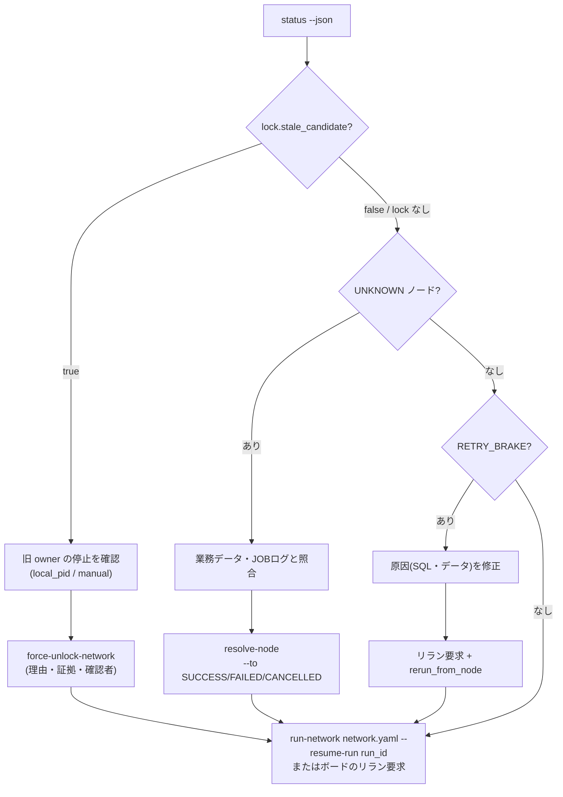

<!-- タイトル: 【kSQL-FlowNet #6】障害対応編: 判定できないときに止まる設計
- 連載 #6(#1: https://qiita.com/rex0220/items/24470d6223c1b4ed4031、#2: https://qiita.com/rex0220/items/2308e4ccf5a363680d31、#3: https://qiita.com/rex0220/items/45f04c2748570953629b、#4: https://qiita.com/rex0220/items/45a086c83cb1dd992aeb、#5: 未公開)
- タグ案: kintone, SQL, バッチ処理, 運用, 障害対応
- 画像なし(mermaid とコードで構成)
-->

[#4](https://qiita.com/rex0220/items/45a086c83cb1dd992aeb) で一次対応者は「UNKNOWN と STALE は触らず連絡」と書きました。今回はその連絡を受けた **二次対応者(サーバー管理者)が何を見て、何をするか** です。kSQL-FlowNet は判定できないときに止まる(fail-closed)ので、障害対応とは「止まった理由を証跡で確定し、証跡付きで前に進める」作業になります。正本は[復旧 runbook](https://github.com/rex0220/ksql-flownet/blob/v1.0.0/docs/runbook-recovery.md)です。

**この回で分かること**

- 「止まる」状態の 4 種類(FAILED / RETRY_BRAKE / UNKNOWN / stale lock)と、それぞれの復旧経路
- `status --json` の何を見て判断するか
- 復旧コマンドが理由ファイルと証拠参照を必須にしている理由
- CLOSE が途中で失敗したとき、何が保証され何を人が補うか

**前提**

- #2 の導入が済み、サーバーに SSH できる
- 復旧コマンドを打つ環境に `KSQL_FLOWNET_SERVICE_PRINCIPAL` と `KSQL_FLOWNET_REQUESTED_BY` を自分の認証主体で設定してある。cron の定期実行では前者はホスト、後者は `cron@<host>` だが、復旧コマンドは人が打つので両方とも操作者本人にする(runbook の規定)。どちらも監査に残り、自由記述の主体入力は存在しない

## 「止まる」には 4 種類ある

同じ「動いていない」でも、システムが何を知っていて何を知らないかで対応が変わります。

| 状態 | システムが知っていること | 誰が動かすか |
| --- | --- | --- |
| FAILED(冪等ノード) | どのノードが何で失敗したか(結果 JSON がある) | 一次対応者がボードからリラン。原因がデータなら直してからリラン |
| FAILED + RETRY_BRAKE | 同じ失敗が 3 回続いた | 原因を直したうえで、二次対応者が対象ノードを指定してリラン |
| UNKNOWN | ノードを起動したが結果を確認できない(結果 JSON がない、プロセスが消えた) | 二次対応者が業務データと JOBログを照合し、`resolve-node` で証跡付きに解決 |
| stale lock(INTERRUPTED) | ロックの所有者が heartbeat を止めた。生きているかは分からない | 二次対応者が旧プロセスの停止を確認し、`force-unlock-network` で回収 |



図は判断の順序です。ロックの回収 → UNKNOWN の解決 → ブレーキの解除 → 再開、の順に進みます。

## まず `status --json` を見る

画面(ボード)は補助表示で、復旧の判断は CLI の出力を正とします。

```sh
cd /opt/ksql/my-ksql-jobs && . /root/.ksql-flownet.env
ksql-flownet status monthly_deal_summary --profile prod --run-id netrun_… --json
```

見る場所は 4 つです。

| フィールド | 見ること |
| --- | --- |
| `lock` | `owner_instance_id`(`local-pid://<host>/<pid>`)、`lease_expires_at`、`stale_candidate`。`null` ならロックは解放済み |
| `runs[].node_states[]` | どのノードが `UNKNOWN` / `FAILED` か、`status_reason` に `RETRY_BRAKE:` があるか |
| `runs[].reconciliation.inconsistencies[]` | 実行管理・監査履歴・JOBログの食い違い |
| `runs[].recovery_identifiers` | 復旧コマンドに渡す識別子。 **ここからコピーし、手で打たない** |

`stale_candidate: true` は「lease が切れている」という **候補** であって、プロセスが止まった証明ではありません。kintone の DATETIME は分精度なので、lease の失効判定には 60 秒の保守余裕が足してあります。この値だけを根拠にロックを回収してはいけません。

## 復旧 1: stale lock の回収

プロセスが kill された、ホストが落ちた、電源が切れた。こういうときは Network ロックが残り、次の起動は `LOCK_CONFLICT` で拒否されます(ボードのリラン要求も同じです)。回収は 3 段階です。

**1. 旧 owner の停止を確認する。** `owner_instance_id` が `local-pid://<host>/<pid>` なら、同じホスト上で PID が存在しないこと(ESRCH)を確認します。PID が存在する場合は、それが旧プロセス本人とは限りません(PID の再利用)。プロセスの開始時刻とコマンドライン、ホストの再起動時刻も証拠に含めます。別ホストからは自動確認できないので、対象ホストにログインするか、プロセス一覧・コンソールログなどで人が確認して証拠を残します。

**2. 証跡付きで回収する。**

```sh
ksql-flownet force-unlock-network monthly_deal_summary \
  --profile prod \
  --expected-owner-invocation-id <status の recovery_identifiers の値> \
  --reason-file /tmp/reason.txt \
  --evidence-ref "INC-2026-0907" \
  --stop-confirmed-by "<停止を確認した人の識別子>" \
  --stop-evidence-ref "ps 出力の保管先" \
  --stop-method local_pid
```

コマンドは自分でも検証します。lease がまだ生きていれば `LEASE_STILL_ACTIVE`、owner が違えば `OWNER_MISMATCH`、確認中にロックが更新されれば `HEARTBEAT_ADVANCED`(旧 owner は生きている)で、いずれも解放せず exit 1 です。成功すると `NETWORK_LOCK_FORCE_RELEASED` の監査が 1 件残ります。

**3. 再開する。** 次のコマンドか、一次対応者にボードのリラン要求をもう一度押してもらいます。第 1 引数は `status` と違って network ID ではなく **定義ファイルのパス** です。

```sh
ksql-flownet run-network flownet/monthly-summary/network.yaml --resume-run <run_id>
```

再開時に **孤児裁定** が走ります。旧プロセスが残した RUNNING の Attempt を JOBログと相関 ID で突合し、終端のログ(SUCCESS / FAILED)があればその結果を採用、見つからなければ UNKNOWN に移します。強制回収そのものは Attempt を SUCCESS にも FAILED にもしません。

実機の受入では、kill 直後のリラン要求が `LOCK_CONFLICT` で拒否され、回収後の 2 回目がジョブログの証拠による孤児裁定を経て SUCCESS まで完走しました。

## 復旧 2: UNKNOWN の解決

UNKNOWN は「ノードを起動したが結果を確認できない」状態です。結果 JSON が壊れている、プロセスが途中で消えた、JOBログに終端ログがない、といったときに立ちます。ここで kSQL-FlowNet は自動では何もしません。冪等なノードでも再実行しません。「もう一度流せば直るはず」は、書込みが半分終わっている可能性を無視しているからです。

解決は人が **業務データと JOBログを照合して** 決めます。

```sh
ksql-flownet resolve-node --run-id netrun_… --node-id deal_summary \
  --to SUCCESS --manual-completion \
  --reason-file /tmp/reason.txt --evidence-ref "照合結果の保管先" \
  --stop-confirmed-by "<停止を確認した人の識別子>" --stop-evidence-ref "…"
```

| 解決先 | 使う場面 | 条件 |
| --- | --- | --- |
| `SUCCESS --manual-completion` | 業務データを見て、処理が実際に完了していたと確認できた | 非冪等ノードなら、実行者とも起票者とも別の `--approved-by` が必須 |
| `FAILED` | 未実行だった、または部分的な書込みを補償して再実行できる状態へ戻した | 冪等性とリラン条件を確認してから再開する |
| `CANCELLED --compensation` | 補償したうえで、この Run では処理を打ち切る | SUCCESS にはできない。下流を進めない解決 |

`FAILED` へ解決しただけで安全に再実行できるわけではありません。部分書込みがあったなら補償(元の状態へ戻す)を終えてから解決し、非冪等ノードは実行済みだと resume が拒否されるので、`resolve-node` での裁定とリラン条件を先に確認します。理由ファイルと証拠参照が必須なのは、「なぜそう判断したか」を後から追えるようにするためです。解決の内容は監査履歴に `ATTEMPT_RESOLUTION` として残ります。

## 復旧 3: RETRY_BRAKE の解除

同じ種類の失敗が 3 回続くと、そのノードには `RETRY_BRAKE` が付き、通常のリランや定期 resume では再実行されなくなります。決定的に失敗する SQL を毎晩流し続けて Attempt を積み上げない、という安全装置です。

解除は「原因を直してから、対象ノードを指定してリラン」です。ボードなら詳細画面のリラン要求で `rerun_from_node` にブレーキ対象のノード ID を入れます。CLI なら次の形です。指定したノードとその子孫が、成功済みでも再実行されます。

```sh
ksql-flownet run-network flownet/monthly-summary/network.yaml \
  --resume-run <run_id> --rerun-from <node_id>
```

原因を直さずに解除すると 4 回目の失敗が積まれるだけなので、まず SQL・入力データ・接続設定のどれが原因かを JOBログのエラーで確定します。

## 復旧 4: CLOSE が途中で失敗したとき

CLOSE(`archive-run`)は Run を不可逆に ARCHIVED にし、監査を書き、ロックを解放します。この 3 つは順に行われるので、途中で失敗すると「どこまで終わったか」が結果コードに出ます。

| 結果コード | 保証されていること | 人が補うこと |
| --- | --- | --- |
| `RUN_ARCHIVED` | 3 つとも完了 | なし |
| `RUN_ARCHIVED_AUDIT_PENDING` | Run は ARCHIVED。監査が未確定 | runbook 所定の監査補完手順で 1 件だけ補完する(下記) |
| `RUN_ARCHIVED_LOCK_UNRELEASED` | Run は ARCHIVED、監査も完了。ロックが残った | 停止確認 → `force-unlock-network`。再 CLOSE は不要 |
| `ARCHIVE_UNCONFIRMED` | 書込の応答が消え、ARCHIVED か ACTIVE か不明 | `status --json` で `lifecycle_status` を見て分岐。ACTIVE ならロック解放を確認して新しい CLOSE 要求、ARCHIVED なら監査の有無を確認 |
| `LOCK_CONFLICT` | 何も変えていない | stale lock を回収してから新しい CLOSE 要求 |

監査の補完は、通常は禁止している「監査履歴アプリへの人の書込み」の唯一の例外です。任意の内容を画面から追加するのではなく、runbook の「CLOSE(archive-run)の復旧」に従います。要求の `result_message` にある元の `event_id` をそのまま使い(新しい ID を作らない)、同じ `event_id` の `RUN_ARCHIVED` が存在しないことを再確認してから、`record_type = OPERATION_AUDIT`、`result_code = RUN_ARCHIVED`、`record_key = OP:<event_id>`、`reason` に所定の JSON(`event_id`・`run_id`・`previous_status`・`run_revision_before`・`requested_by`・`service_principal` など)を入れて 1 件だけ追記します。値は要求レコードと Run の更新前後から確定し、推測で埋めません。

「再 CLOSE すれば直る」とは限らないところがポイントです。`RUN_ARCHIVED_AUDIT_PENDING` で再 CLOSE しても `RUN_ALREADY_ARCHIVED` になるだけで監査は補完されません。結果コードが「どこまで終わったか」を示しているので、その先だけを人が補います。

## STALE 要求の照合

ポーラーが要求を claim したあと、実行したかどうか・結果がどうだったかを確定できなかったとき、要求は `REJECTED / STALE` になります。 **未実行という意味ではありません。** 一次対応者に再依頼させず、二次対応者が照合します。

1. 要求レコードの `run_id`、`claimed_at`、`claimed_host`、`claim_heartbeat_at` を控える
2. `status --run-id … --json` で Invocation、Node State、activity、ロック owner を見る
3. 監査履歴の `requested_by = app-request:<要求ID>:…` と、claim 時刻以後の Invocation、JOBログの `attempt_id` を突合する
4. 実行済みならその結果を正として業務データまで確認する。未実行を証明できたときだけ、新しい要求の起票を判断する

START の STALE も同じで、「claim 以後に新しい Run が出ていないか」を先に見ます。出ていればその Run を追跡し、再起票はしません。

## やってはいけないこと

- **lease 超過だけを理由にロックを回収する。** 遅いだけの生きたプロセスからロックを奪うと二重実行になります。停止確認が先です
- **UNKNOWN をリランで押し通す。** 書込みが半分終わっている可能性があります。照合してから解決します
- **実行管理・監査履歴のレコードを直接編集して状態を変える。** 復旧コマンドは revision による排他と監査を伴います。例外は runbook が指定する監査レコードの手動補完だけです
- **JOBログのロックを FlowNet 側から触る。** ジョブロックは kSQL-Flow のもので、`inspect-lock` → `force-unlock-job` で回収し、その結果 JSON を `record-job-unlock` で FlowNet の監査に関連付けます

## まとめ

- 止まり方は 4 種類。FAILED はリラン、RETRY_BRAKE は原因修正 + 対象指定リラン、UNKNOWN は照合 + `resolve-node`、stale lock は停止確認 + `force-unlock-network`
- 判断は `status --json` が正。`stale_candidate` は候補であって証明ではない
- 復旧コマンドは理由・証拠・確認者を必須にし、監査に残る。手で状態を書き換える経路は作らない
- CLOSE の部分失敗は結果コードが「どこまで終わったか」を示す。再 CLOSE ではなく、その先だけを補う
- STALE は未実行の意味ではない。照合が終わるまで再依頼しない

## 次回

#7 CSV 入出力編。サーバー上の CSV を network で読む・書く。IO ルートの封じ込め、sha256 による入力の固定、`@` の percent encoding、CSV の置き方と取り出し方です。

- 復旧 runbook(正本): https://github.com/rex0220/ksql-flownet/blob/v1.0.0/docs/runbook-recovery.md
- 統合仕様書 §5.5〜§5.7(status・復旧コマンド・archive-run): https://github.com/rex0220/ksql-flownet/blob/v1.0.0/docs/specification.md
- #4 運用編: https://qiita.com/rex0220/items/45a086c83cb1dd992aeb
