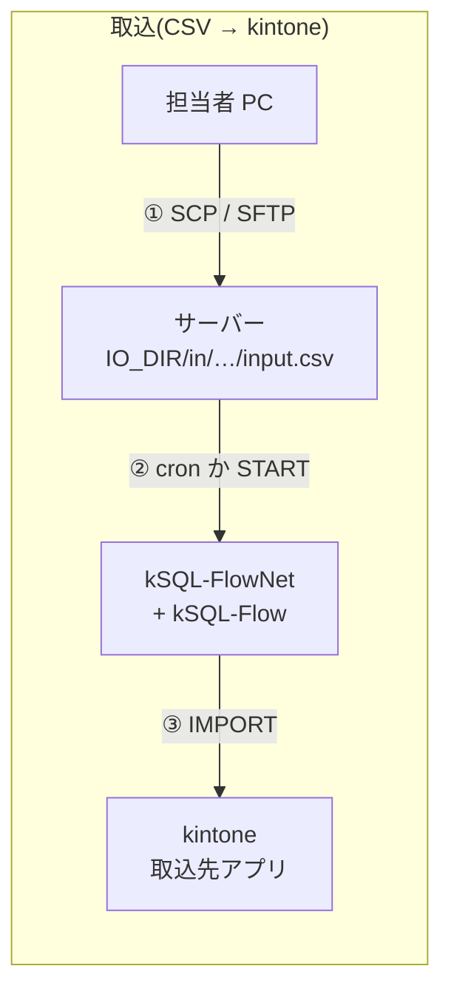
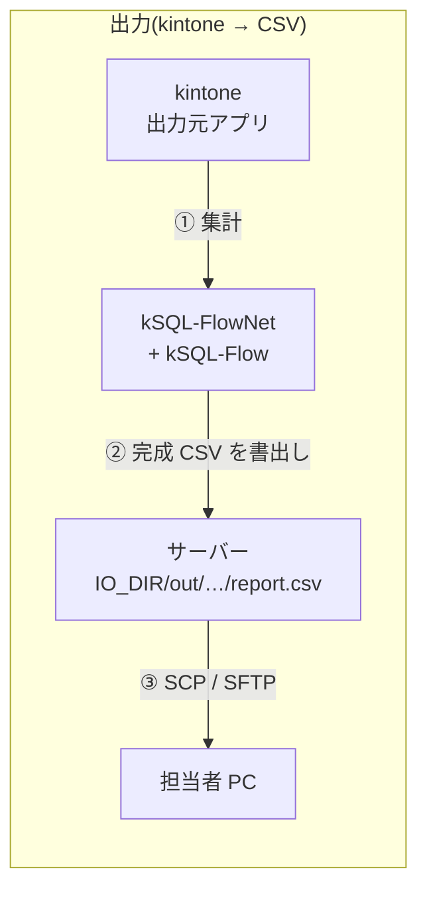
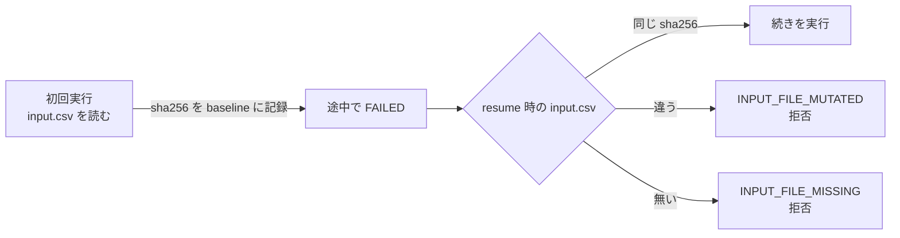

<!-- タイトル: 【kSQL-FlowNet #7】CSV 入出力編: サーバー上の CSV を network で読む・書く
- 連載 #7(#1: https://qiita.com/rex0220/items/24470d6223c1b4ed4031、#2: https://qiita.com/rex0220/items/2308e4ccf5a363680d31、#3: https://qiita.com/rex0220/items/45f04c2748570953629b、#4: https://qiita.com/rex0220/items/45a086c83cb1dd992aeb、#5・#6: 未公開)
- タグ案: kintone, SQL, CSV, バッチ処理
- 画像なし(mermaid とコードで構成)
-->

ここまでの回は kintone の中だけで完結する network でした。今回は **サーバー上の CSV を取り込む・CSV に書き出す** network です。取引先から届くファイルを kintone に入れる、kintone の集計結果をファイルで渡す、という現場の要件に対して、kSQL-FlowNet が何を封じ込め、何を人に任せるかを書きます。正本は[CSV 入出力の運用](https://github.com/rex0220/ksql-flownet/blob/v1.0.0/docs/csv-io-operations.md)と[統合仕様書 §4.5](https://github.com/rex0220/ksql-flownet/blob/v1.0.0/docs/specification.md)です。

**この回で分かること**

- CSV がどこに置かれ、誰が置き、誰が取り出すか(転送路は SSH だけ)
- network 定義の `inputs` / `outputs` と、SQL の `IMPORT` / 名前付きシンクの対応
- 入力ファイルを sha256 で固定する理由と、`@` が `%40` になる罠
- 失敗したときに何が保証されるか(壊れた出力は現れない、差し替えられた入力では同じ Run を再開できない)

**前提**

- #2 の導入が済んでいる
- kSQL-Flow が 0.8.0 以上(取込)/ 0.9.0 以上(出力)。足りない版では network ロックを取る前に拒否されます(fail-closed)

## 構成: 転送路は SSH だけ





- ファイルの受け渡しは **既存の SSH だけ** です。アップロード用の受信 API や共有フォルダーは作りません(#1 の「受信ポートを開けない」方針をそのまま守ります)
- SSH でファイルを置く・取る作業は **サーバー管理者(二次対応者)** の仕事です。一次対応者はボードでの起票と状態確認だけ、という役割分担も変わりません

## サーバーの準備(初回だけ)

IO ルートを 1 つ決め、環境ファイルに書きます。kSQL-FlowNet が要求するのは「絶対パスの既存ディレクトリで、実行ユーザーが読み書きできる」ことだけです。

```sh
useradd -m -s /bin/bash csvxfer                 # CSV 転送用アカウント(SSH 鍵は本人分のみ)
mkdir -p /opt/ksql/io/in /opt/ksql/io/out
chown -R csvxfer:csvxfer /opt/ksql/io
chmod 750 /opt/ksql/io
```

```sh
# /root/.ksql-flownet.env に追加
export KSQL_FLOWNET_IO_DIR=/opt/ksql/io
# export KSQL_FLOWNET_IO_RETENTION_DAYS=90     # 入力ファイルの保持期限(既定 90 日)
```

CSV を置く人に root の鍵を配らないために転送用アカウントを分けています。入力ファイルを置くのも出力を取るのもこのアカウントです。ただし、この所有権設定は `csvxfer` に IO ルートの外へ **書き込ませない** ためのもので、ファイルシステム上に閉じ込めるものではありません(通常のシェルにログインできる)。本番では SSH を SFTP 専用に制限し(`sshd_config` の `Match User csvxfer` に `ForceCommand internal-sftp` と `ChrootDirectory`)、対話シェルや任意コマンドを許可しない構成にします。`ChrootDirectory` に指定するディレクトリは root 所有・一般ユーザー書込み不可にする必要があるので、`/opt/ksql/io` を `csvxfer` 所有のまま chroot 先にはできません。chroot 先(例: `/srv/csvxfer`、root 所有 755)の配下に、`csvxfer` が書き込める `in/` と読み取れる `out/` を置き、IO ルートをそこに合わせます。

この例は #2 と同じく kSQL-FlowNet を root で動かす構成で、root は `750` のディレクトリを読み書きできます。実行専用ユーザーを分ける本番構成では、実行ユーザーを `csvxfer` グループに入れるか ACL で `in/` の読取と `out/` の書込を許可し、kSQL-FlowNet が作った出力ファイルを `csvxfer` が読めるモードとグループになることを確認します。

## network 定義: `inputs` と `outputs`

ノードに `inputs`(取込元)と `outputs`(書出し先)を宣言します。値は IO ルートからの相対パスのテンプレートです。

```yaml
nodes:
  - id: import_sales
    job_id: sales_import
    sql: jobs/sales_import.sql
    depends_on: []
    trigger_rule: all_success
    idempotent: true
    inputs:
      source: sales/{business_key}/{profile}/input.csv
  - id: export_report
    job_id: sales_report
    sql: jobs/sales_report.sql
    depends_on: [import_sales]
    trigger_rule: all_success
    idempotent: true
    outputs:
      report: sales/{business_key}/{run_id}/report.csv
```

| 宣言 | 展開先 | 使えるプレースホルダー |
| --- | --- | --- |
| `inputs` | `<IO_DIR>/in/` + テンプレート | `{business_key}` `{profile}` |
| `outputs` | `<IO_DIR>/out/` + テンプレート | `{business_key}` `{profile}` `{run_id}` `{node_id}` |

`source` と `report` は **名前** で、SQL 側から同じ名前で参照します。テンプレートには `{network_id}` がないので、複数 network で IO ルートを共有するなら、パスの先頭(この例では `sales/`)か業務キー(#3 の `{network_id}@…`)で network を区別します。

`outputs` に `{run_id}` を含めておくと、補正キーなど別の Run の出力が同じファイルを上書きしません。同じ Run を `--rerun-from` で再実行したときは同じ `run_id` なので、同じパスに全量を置き換えます(再実行の履歴を残す仕組みではありません)。

## SQL 側: `IMPORT` と名前付きシンク

取込は `IMPORT INTO` 文で、`inputs` の名前(`source`)を指定します。

```sql
-- @ksql name: sales_import
-- @ksql timeout: 600
-- @ksql dialect: 1

IMPORT INTO LAPP_売上明細 (伝票番号, 会社名, 売上)
FROM CSV source ENCODING UTF-8
ON DUPLICATE (伝票番号)
ON ERROR SKIP INTO #err;

ASSERT (SELECT COUNT(*) FROM #err) = 0, '取り込めない行があります';
```

- `ENCODING` は置くファイルに合わせます(UTF-8 か Shift_JIS)。不一致はデコード失敗として実行時に拒否されます
- `ON DUPLICATE (重複禁止キー)` で、同じ伝票番号は更新になります。chunk の途中で失敗して resume しても、各キーが 1 件に収束します(実測済み)。これが取込ノードを `idempotent: true` と宣言できる根拠です
- 取り込めない行は `#err` に逃がし、`ASSERT` で 0 件を要求します。1 行でも弾かれたらノードは FAILED になり、後続は動きません

出力は、`outputs` の名前と同じ名前の一時テーブルを作ります。名前付きシンクなので、SQL の末尾に確認用の SELECT を足しても出力は変わりません。

```sql
-- @ksql name: sales_report
-- @ksql timeout: 600
-- @ksql dialect: 1

CREATE TEMP TABLE #report AS
SELECT 会社名, COUNT(*) AS 件数, SUM(売上) AS 売上合計
FROM LAPP_売上明細
WHERE 受注予定日 >= @MONTH_START() AND 受注予定日 < @NEXT_MONTH_START()
GROUP BY 会社名
ORDER BY 会社名;
```

kSQL-FlowNet は `outputs` を絶対パスに解決し、kSQL-Flow に `--export-csv report=<パス>` として渡します。kSQL-Flow は `#report` の内容を UTF-8 の CSV として、 **完成したものだけ** そのパスに現れる形で書きます(一時ファイルに書いてから rename)。途中で失敗しても壊れたファイルは残らず、既存のファイルも変わりません。

## 入力 CSV を置く

置き先は「`in/` + テンプレートの展開結果」です。ここに罠が 1 つあります。

```
business_key = monthly_sales@2026-09、profile = prod のとき
/opt/ksql/io/in/sales/monthly_sales%402026-09/prod/input.csv
```

**プレースホルダーの値は percent encoding されます。** 英数字と `-` `_` `~` 以外(`@` `:` `.` 空白、日本語)は `%XX` になります(RFC 3986 の unreserved より厳しく、`.` も対象です。テンプレートに書いた `input.csv` の `.` は値ではないので変わりません)。`@` は `%40` です。テンプレートどおりに生の `@` でディレクトリを作ると `INPUT_FILE_MISSING` になります。`plan` は実パスを表示しないので、記号を含む業務キーでは変換後のパスを自分で組み立てます。

```powershell
$dir = "/opt/ksql/io/in/sales/monthly_sales%402026-09/prod"
ssh -i <鍵> csvxfer@<サーバー> "mkdir -p $dir"
scp -i <鍵> C:\work\input.csv "csvxfer@<サーバー>:$dir/input.csv.part"
ssh -i <鍵> csvxfer@<サーバー> "mv $dir/input.csv.part $dir/input.csv"
```

上の `scp` と `ssh` の例は、検証用にシェルへログインできる `csvxfer` を前提にしています。本番で `internal-sftp` 専用にした場合は `ssh` によるコマンド実行はできないので、SFTP クライアントの `mkdir`・`put`・`rename` を使います。chroot 後はクライアントから見えるパスも chroot 内の相対パスになります。

```text
sftp> mkdir in/sales/monthly_sales%402026-09/prod
sftp> put input.csv in/sales/monthly_sales%402026-09/prod/input.csv.part
sftp> rename in/sales/monthly_sales%402026-09/prod/input.csv.part in/sales/monthly_sales%402026-09/prod/input.csv
```

完成名へ直接アップロードしないのがポイントです。転送の途中で cron が発火すると、途中まで転送されたファイルを kSQL-FlowNet が読み、その sha256 が baseline になってしまいます。`.part` のような一時名で転送し、転送が終わってから **同じディレクトリ内で rename** して公開します(同一ファイルシステム内の rename は原子的で、cron は完成名しか見ません)。

置いてから起動します。cron の定期実行なら次の発火を待ち、随時ならボードの START(補正または任意キー)か `run-network` です。完走はボードで確認します。Node Attempt の要約に、取り込んだファイルの sha256・行数・エンコーディングが残ります。

## 入力の差し替えは sha256 で検出され、同じ Run では再開できない

取込で一番重要な規則です。

- **Run が始まったら完成パスのファイルを上書き・削除しない。** 最初に読んだときの sha256 が baseline として記録され、失敗後の resume や rerun-from で **再実行対象になる取込ノード** は同じバイト列のファイルを要求します。違えば `INPUT_FILE_MUTATED` で拒否します(SUCCESS 済みで保持されるノードは照合しません)。これは差し替えを **検出して再開を拒否する** 仕組みで、実行中のファイルを OS レベルでロックするものではありません。初回の読取中に上書きされた場合まで防ぐ実装ではないので、Run 開始後は触らない、という運用が前提です
- 内容を直したいなら、 **新しい業務キー(補正キー)で新しい Run** として取り込みます
- 入力ファイルは Run が終端するまで元のパスに置いたままにします。保持期限は Run 作成から既定 90 日で、超過後の resume は `INPUT_RETENTION_EXPIRED` で拒否します。この期限は **自動削除の設定ではありません**。期限を過ぎた Run の再開を拒否するための判定値で、実ファイルの削除は別に運用します

なぜここまで固定するのか。resume は「失敗したノードから続きを実行する」操作です。続きを実行するときに入力が変わっていたら、前半と後半で違うデータを取り込んだ Run ができます。それを「同じ Run」として記録するわけにはいかない、というのが理由です。



## 出力 CSV を取り出す

出力先は「`out/` + テンプレートの展開結果」で、percent encoding は入力と同じです。

```powershell
scp -i <鍵> csvxfer@<サーバー>:/opt/ksql/io/out/sales/monthly_sales%402026-09/netrun_xxxx/report.csv C:\work\
```

- Run が `SUCCESS` になってから取得します。完成したファイルだけが現れるので、途中の状態を掴む心配はありません
- 内容の照合が必要なら、Node Attempt の要約にある `output_files`(sha256・行数・エンコーディング)と突き合わせます。検証データを変更しない実機試験では、同じ Run の `--rerun-from` で同じ sha256 になりました。ただし `as_of` が固定するのは時刻関数の基準であって、kintone レコードのスナップショットではありません。再実行までに参照データが変われば、同じ Run でも出力内容と sha256 は変わります
- 出力 CSV は `cli-kintone record import` と互換の値表現なので、別の kintone にそのまま取り込む用途にも使えます(実機検証済み)
- 取得済みファイルの削除は任意です。`{run_id}` を含むパスなら別 Run 間で上書きされないので残しても構いません

## 安全規則

- 入出力パスは **IO ルートの配下に封じ込め** られます。ルート外を指すパス、`..`、symlink は `INPUT_PATH_REJECTED` / `OUTPUT_PATH_REJECTED` で拒否され、kSQL-Flow は起動されません
- 監査と結果 JSON に **CSV のセル値と絶対パスは記録されません**(相対情報と sha256 だけ)。kintone 側に CSV の中身が漏れる経路を作らないためです
- API トークンや SSH 鍵を CSV と同じ場所に置かない

| エラー | 意味 | 対処 |
| --- | --- | --- |
| `INPUT_FILE_MISSING` | 展開先にファイルがない | パス(percent encoding 込み)を確認して配置し、resume |
| `INPUT_FILE_MUTATED` | resume 時に baseline とバイト不一致 | 元のファイルを戻して resume。内容を変えるなら新しい業務キーで |
| `INPUT_RETENTION_EXPIRED` | baseline が保持期限超過 | 新しい業務キーで再取込。古い Run は打ち切り裁定 |
| `INPUT_PATH_REJECTED` / `OUTPUT_PATH_REJECTED` | IO ルート外・symlink など | テンプレートと実パスを是正 |
| capability 拒否 | kSQL-Flow が機能未対応 | サーバーの kSQL-Flow を 0.8 / 0.9 以上へ |

## まとめ

- CSV の転送路は SSH だけ。置く・取るのはサーバー管理者、起票と確認は一次対応者
- `inputs` / `outputs` は IO ルートからの相対テンプレート。SQL 側は `IMPORT … FROM CSV source` と `#report` の名前で対応する
- プレースホルダーの値は percent encoding される(`@` → `%40`)
- 入力は `.part` で転送して rename で公開。差し替えは sha256 で検出され、同じ Run では再開できない。直したいなら新しい業務キーで新しい Run
- 出力は完成したものだけが現れ、既存ファイルは壊れない。`{run_id}` を含めれば別 Run と衝突しない

## 次回

#8 設計編。なぜ kintone のアプリを状態ストアにできるのか。機械専用アプリ、業務キーの一意性を担保する `record_key`、リースロック、分精度・64 文字・offset 上限という kintone の制約をどう設計で吸収したか。

- CSV 入出力の運用(正本): https://github.com/rex0220/ksql-flownet/blob/v1.0.0/docs/csv-io-operations.md
- 統合仕様書 §4.5(inputs / outputs): https://github.com/rex0220/ksql-flownet/blob/v1.0.0/docs/specification.md
- #3 network 定義編: https://qiita.com/rex0220/items/45f04c2748570953629b
