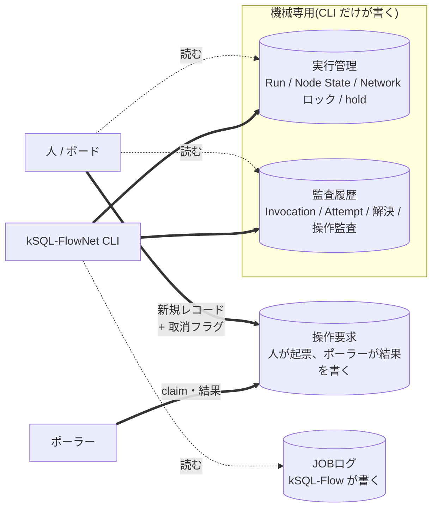
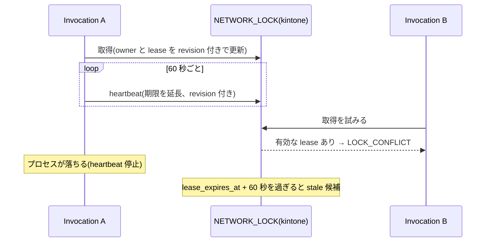

<!-- タイトル: 【kSQL-FlowNet #8】設計編: 機械専用アプリと業務キーの一意性
- 連載 #8(#1: https://qiita.com/rex0220/items/24470d6223c1b4ed4031、#2: https://qiita.com/rex0220/items/2308e4ccf5a363680d31、#3: https://qiita.com/rex0220/items/45f04c2748570953629b、#4: https://qiita.com/rex0220/items/45a086c83cb1dd992aeb、#5〜#7: 未公開)
- タグ案: kintone, SQL, 設計, 分散システム
- 画像なし(mermaid と表で構成)
-->

ここまでは「使う」回でした。#8〜#10 は「裏側」の回です。今回は **なぜ kintone のアプリを Control Plane の状態ストアにできるのか** を書きます。kintone には任意の処理範囲をまとめるトランザクション境界がなく(`bulkRequest` には失敗時のロールバックがありますが、添付ファイルの一時アップロードから Run・Node State・Invocation の生成までを RDB のように一括コミットはできません)、日時は分精度で、一意制約は 64 文字まで、offset を使った走査は 10,000 件で止まります。この条件で「同じ業務キーの Run は 1 つ」「二重起動しない」「途中で落ちても続きから再開できる」を成り立たせた設計判断です。正本は[統合仕様書 §3・§5・§8](https://github.com/rex0220/ksql-flownet/blob/v1.0.0/docs/specification.md)です。

**この回で分かること**

- 4 アプリを「誰が書くか」で分けた理由
- Run の一意性を担保する `record_key` と、NEW の勝者を原子的に決めて残りを自己修復する手順
- Network ロックをリース(期限付き)にした理由と、`stale_candidate` を証明として扱わない理由
- kSQL-Flow との境界(Execution Contract)で、実行結果をどう確定するか

**前提**

- #3 と #4 を読んでいる(Run・ノード・業務キー・activity の言葉を使います)

## 状態ストアとしての kintone の制約

kintone を RDB のように使おうとすると、次にぶつかります。設計はこの表に対する答えです。

| 制約 | 影響 | 設計での吸収 |
| --- | --- | --- |
| 任意の処理範囲を覆うトランザクションがない | bundle・Run・Node State・Invocation をまとめて確定できない | 重複禁止 INSERT を確定点にし、前後の処理を再開時の自己修復で補う |
| 文字列の一意制約は 64 文字まで | 業務キーをそのまま一意キーにできない | `profile + network_id + business_key` の SHA-256 を base64url にした 46 文字を `record_key` にする |
| DATETIME は分精度 | 秒以下の順序を証明できない | lease と stale 判定に 60 秒の保守余裕を足す。順序の根拠には `revision` を使う |
| offset は 10,000 件まで、1 回の GET は 500 件 | 全件走査ができない | `$id` の keyset pagination。ポーラーは 1 周 100 件(上限 500)だけ読む |
| レコードの楽観ロックは `revision` だけ | 条件付き更新がない | すべての更新に `revision` を付け、競合は `REVISION_CONFLICT` として fail-closed |
| 非 unique の文字列 `=` 検索はトークン一致 | `business_key = "x"` が部分一致しうる | 検索結果を JavaScript 側で厳密一致し直す |

## 4 アプリを「誰が書くか」で分ける



アプリを機能ではなく **書き手** で分けています。実行管理と監査履歴は CLI だけが書き、人は読むだけ。人の意思は操作要求アプリへの新規レコードとしてだけ受け取り、ポーラーがそれを読んで CLI を起動し、結果を同じレコードに書き戻します。

こう分けると、状態の整合性を守る責任が CLI 1 か所に集まります。人が実行管理アプリのレコードを編集して状態を変える経路がないので、「画面で直したら本体の書込みが失敗した」という事故が起きません。逆に言えば、実行管理アプリは人が見て分かる形にする必要がなく、`record_key` のような機械向けの列を持てます。

監査履歴はアプリケーション契約上の追記専用です。CLI は既存の監査レコードを更新せず、Invocation(起動 1 回)、Attempt(ノード実行 1 回)、解決(UNKNOWN を人が裁定した記録)、操作監査(強制解放・クローズ)を新しいレコードとして積みます。人には閲覧だけを許可し、通常運用で書き換える経路を閉じています。ただし、kintone 自体を改ざん不能な WORM ストレージとして扱うものではありません。

## Run の一意性: `record_key` と重複禁止 INSERT

「同じ業務キーの Run は 1 つ」は、アプリ側の設定だけで実現しています。実行管理アプリの `record_key` は重複禁止の文字列 1 行フィールドで、Run のキーは次のように作ります。

```
R1:<SHA-256(profile \0 network_id \0 business_key) を base64url にしたもの>
```

- 3 つの識別子は NFC 正規化し、`:` と NUL と予約値 `__net__` を禁止し、128 文字以内に制限する
- SHA-256 をパディングなしの base64url にすると 43 文字なので、接頭辞込みで **常に 46 文字**。kintone の一意制約 64 文字に必ず収まる
- 生の業務キーを一意キーにしない。128 文字の業務キーはそのままでは入らないし、Node State(`S1:`)や Attempt(`A1:`)も同じ形で一意にしたいため

同じキーで 2 つのプロセスが同時に Run を作ろうとしても、重複禁止 INSERT は片方しか通りません。通らなかった側は `RUN_ALREADY_EXISTS` として引き下がります。これが二重起動防止の最後の砦で、Network ロック(後述)は「その前に気づくための仕組み」です。

## NEW の勝者を原子的に決め、残りを自己修復する

Run を作るには、bundle のアップロード・Run レコード・ノードごとの Node State・Invocation と、複数の書込みが要ります。kintone はこれをまとめてコミットできません。そこで NEW 全体を原子的にするのではなく、 **重複禁止の Run INSERT を線形化点として「この業務キーの Run を作る勝者」を 1 つに決め** 、その後の Node State と Invocation は途中で止まっても次回の `--resume` で補完できるようにしています。

| 順序 | 処理 | 途中で失敗したら |
| --- | --- | --- |
| 1 | bundle(network.yaml・SQL)を添付としてアップロード | Run は未作成。添付はどのレコードにも関連付かず、FlowNet の状態は作られない |
| 2 | **Run レコードを重複禁止 INSERT** | ここで初めて Run が存在する(勝者が確定する)。以後は「既存 Run」 |
| 3 | 添付を読み戻して sha256 を検証し、各ノードの Node State(`WAITING`)を作る | 不足分は次回の `--resume` が同じ関数で補完する。既存の Node State が bundle と食い違えば `RUN_SNAPSHOT_MISMATCH` で拒否 |
| 4 | Invocation を作って実行開始 | Invocation がなくても Run は `CREATED` のまま残り、次回の `--resume` で通常どおり作られる |

手順 2 の後で落ちた Run は `status --json` の `reconciliation.inconsistencies[]` に出ます。人はそれを見て `--resume` で続けるか、打ち切るかを決めます。「途中で落ちたら壊れる」のではなく「途中で落ちたら未完成の Run として見える」設計です。

bundle を Run に保存するのも同じ理由です。resume は保存時の定義と SQL で続きを実行するので、配置後にファイルを変えても既存 Run は影響を受けません(#3)。定義の sha256 と解決済み profile の sha256 も Run に残るので、「どの定義で動いたか」が後から追えます。

## Network ロック: 期限付きリースと heartbeat

同じ network を同時に 2 つ動かさないための排他です。実行管理アプリの `NETWORK_LOCK` レコード 1 件をロックとして使います。



- ロックは **リース(期限付き)** です。持ち主が heartbeat で延長し続け、止まれば期限切れになります。プロセスが kill されてもロックが永久に残らないためです
- 更新はすべて `revision` 付きの楽観ロックで、書く直前に owner を再確認します。途中で他者が触っていれば `REVISION_CONFLICT` になります
- `lease_expires_at` は分精度で保存されるので最大 59 秒切り捨てられます。stale 判定と強制解放の検査は **60 秒を足した保守的な値** で行います
- `stale_candidate: true` は「期限が切れている」という事実だけで、持ち主が止まった証明ではありません。遅いだけの生きたプロセスからロックを奪うと二重実行になるので、強制解放には停止確認(PID・証拠・確認者)を必須にしています(#6)

Network 単位の排他を保証する主役は Network ロックです。ロックが未作成なら重複禁止 INSERT、既存なら owner を確認したうえで `revision` 付き更新を行います。同じ状態を見た複数のプロセスが同時に取得を試みても、成功するのは 1 つだけです。確認から更新までに状態が変われば、古い `revision` による更新は `REVISION_CONFLICT` で拒否されます。`record_key` は同じ業務キーの Run の重複を、kSQL-Flow のジョブロックは同じジョブの重複実行を止める追加の防御で、それぞれ保護する範囲が違います(Network ロックの代替ではありません)。lease が失効しても、別のプロセスへ自動的に所有権を移しません。`stale_candidate` として止め、旧プロセスの停止を確認した後にだけ強制解放します。解放後に旧 owner が heartbeat や状態更新を試みても、owner の不一致または古い `revision` によって拒否されます。実行中だったジョブの結果は、ジョブロック・結果 JSON・JOBログで照合し、確定できなければ `UNKNOWN` として止めます(#6)。

## Run の状態はノード状態の集約

Run レコードに `status` は保存しますが、独立に遷移させる値ではありません。Node State が変わるたびに、共通の集約関数で再計算した値だけを書き込みます(上の行ほど優先)。

| Node State に | Run の状態 |
| --- | --- |
| `UNKNOWN` がある | `UNKNOWN` |
| `RUNNING` がある | `RUNNING` |
| `FAILED` / `BLOCKED` がある | `FAILED` |
| `CANCELLED` がある | `CANCELLED` |
| 全部 `SUCCESS` | `SUCCESS` |
| それ以外(`WAITING` / `SKIPPED` だけ) | 未開始なら `CREATED`、開始済みなら `RUNNING` |

この方式にしているのは、resume や解決のあとで Run の状態を「更新し忘れる」余地をなくすためです。ノードを 1 つ解決すれば Run の状態は自動的に変わります。UNKNOWN が最優先なのは、1 ノードでも結果不明なら Run 全体を「確定できない」と扱うためです(fail-closed)。

STOP は Run の状態を変えません。次のノード境界で Invocation が閉じ、Run は `RUNNING` のまま activity が `STOPPED` になります。「止まっている」と「終わっている」を混ぜないためです。

## kSQL-Flow との境界: Execution Contract

kSQL-FlowNet はノードごとに kSQL-Flow を子プロセスとして起動します。この境界を [Execution Contract v1](https://github.com/rex0220/ksql-flownet/blob/v1.0.0/docs/execution-contract-v1.md) として固定しています。

- kSQL-FlowNet は `--correlation-id`(Run)、`--attempt-id`、`--expected-job-id`、`--result-json` を渡す。kSQL-Flow は SQL の `@ksql name` が `expected-job-id` と一致しなければ実行しない
- kSQL-Flow は結果 JSON(exit code、読取・書込件数、エラー)を書き、JOBログにも相関 ID 付きでレコードを残す
- kSQL-FlowNet は **結果 JSON と JOBログの両方** を照合して Attempt を確定する。結果 JSON がなく JOBログにも終端がなければ `UNKNOWN`
- JOBログには「SQL の実行を始めた」時点の耐久証跡(`runner_execution_started_at`)がある。結果 JSON が消えても「始まったかどうか」だけは分かるので、UNKNOWN の裁定材料になる

境界を CLI 引数・結果 JSON・相関 ID 付き JOBログの契約に限定しているので、kSQL-Flow は kSQL-FlowNet を知らずに動き、kSQL-FlowNet は kSQL-Flow の内部(SQL の解析やチャンク処理)を知らずに済みます。#6 の孤児裁定(kill 後に残った RUNNING の Attempt を JOBログで突合する)も、この契約があるから成り立ちます。

## 設計判断のまとめ

| 判断 | 理由 |
| --- | --- |
| アプリを書き手で分ける(CLI 専用の実行管理・監査履歴、人とポーラーが共有する操作要求。JOBログは kSQL-Flow が書く) | 整合性の責任を CLI に集め、人の編集で壊れる経路をなくす |
| `record_key` は識別子の SHA-256(46 文字) | 64 文字の一意制約に必ず収め、重複禁止 INSERT を二重起動防止の砦にする |
| NEW は重複禁止 INSERT で勝者だけを原子的に決め、残りは自己修復 | 一括コミットできない kintone で「途中で落ちても未完成の Run として見える」を作る |
| Network ロックは期限付きリース + heartbeat + revision 付き楽観ロック | 落ちたプロセスのロックを回収可能にしつつ、生きているプロセスからは奪わない。record_key とジョブロックは範囲の違う追加防御 |
| stale は候補であって証明ではない | 二重実行より「人が確認するまで止まる」を選ぶ |
| Run 状態はノード状態の集約、UNKNOWN 最優先 | 更新し忘れをなくし、結果不明を確定扱いしない |
| kSQL-Flow との境界は CLI 引数・結果 JSON・相関 ID 付き JOBログ | 双方が相手の内部を知らずに済み、結果 JSON と JOBログの照合で結果を確定できる |

## 次回

#9 検証編。「二重起動しない」「取消は claim 前だけ効く」を、実機の kintone でどう証明したか。フォールト注入(claim の直前で止める barrier)、E2E ハーネスの安全境界、P2-16 の受入記録です。

- 統合仕様書 §3(アプリ構成)・§5.3(ensure-run)・§8(セキュリティ境界)・§9(制約): https://github.com/rex0220/ksql-flownet/blob/v1.0.0/docs/specification.md
- Execution Contract v1: https://github.com/rex0220/ksql-flownet/blob/v1.0.0/docs/execution-contract-v1.md
- #3 network 定義編: https://qiita.com/rex0220/items/45f04c2748570953629b
