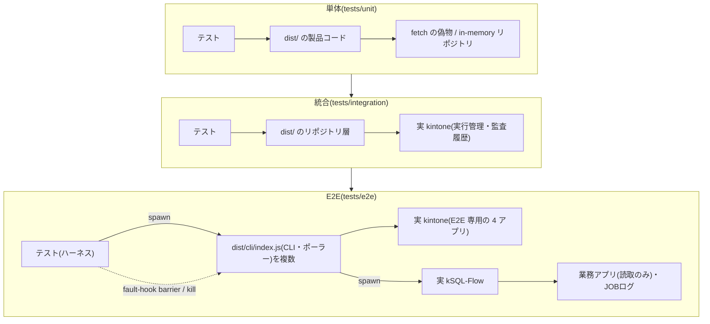
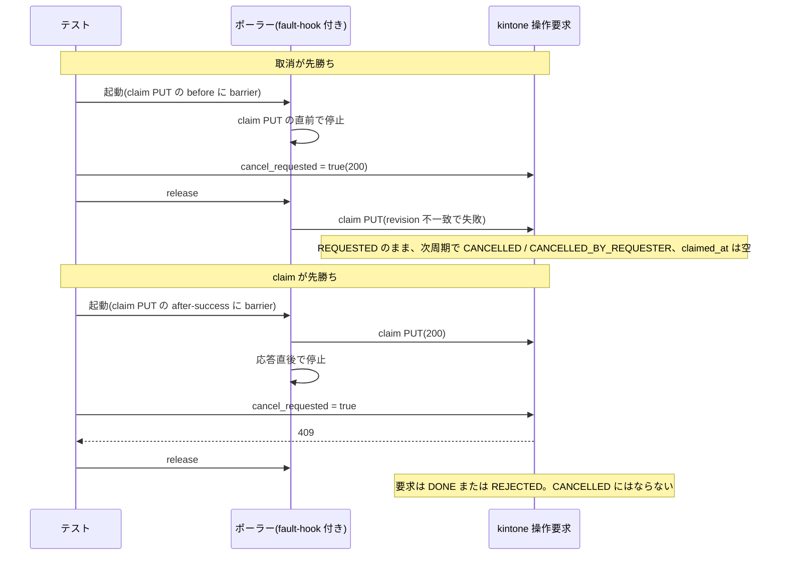

<!-- タイトル: 【kSQL-FlowNet #9】検証編: 実機 E2E とフォールト注入
- 連載 #9(#1: https://qiita.com/rex0220/items/24470d6223c1b4ed4031、#2: https://qiita.com/rex0220/items/2308e4ccf5a363680d31、#3: https://qiita.com/rex0220/items/45f04c2748570953629b、#4: https://qiita.com/rex0220/items/45a086c83cb1dd992aeb、#5〜#8: 未公開)
- タグ案: kintone, テスト, E2E, 分散システム
- 画像なし(mermaid とコードで構成)
-->

#4 と #6 で「取消は claim 前だけ効く」、#8 で「同じ業務キーの Run は 1 つ」「二重起動しない」と書きました。今回は **それらを実機の kintone でどう確認したか** です。単体テストは自分で書いたモックに対して合格するだけで、重複禁止フィールドが本当に 2 件目を弾くか、2 つのポーラーが同じ要求を同時に掴んだときに何が起きるかは、実物の kintone と実物のプロセスでしか分かりません。正本は[tests/e2e/README.md](https://github.com/rex0220/ksql-flownet/blob/v1.0.0/tests/e2e/README.md)と `docs/internal/test-results/` の受入記録です。

**この回で分かること**

- テストの 3 層(単体・統合・E2E)と、それぞれが何を確認できるか
- E2E ハーネスの安全境界。本番と業務アプリに触れない仕組みをコードで強制する
- 競合を「引き当てる」から「止める」へ。fault-hook の barrier で HTTP リクエストの直前・直後にプロセスを止める
- 実機で確定した事実と、E2E に持ち込めない競合を単体へ落とした判断

**前提**

- #6 と #8 を読んでいる(claim、lease、UNKNOWN、`revision` の言葉を使います)

## 3 層のテストと確認できること

| 層 | 相手 | 確認できること | 実行 |
| --- | --- | --- | --- |
| 単体(`tests/unit`、62 ファイル 579 件) | fetch の偽物と in-memory リポジトリ | 状態機械・分類器・境界条件の網羅 | `npm test`。CI(GitHub Actions、ubuntu、Node 22 / 24)で毎 push |
| 統合(`tests/integration`、13 本) | 実 kintone の実行管理・監査履歴アプリにリポジトリ層から直接書く | 重複禁止フィールドと 409 / 400 の実挙動が最終裁定者であること | 手動 |
| E2E(`tests/e2e`、シナリオ 44 本) | 実 kintone + 実 kSQL-Flow 子プロセス + 複数プロセス | CLI・ポーラー・ロック・lease を通した end-to-end の一意性 | 手動・直列。並列実行は禁止 |

3 層が触るものを図にします。上ほど速く網羅的で、下ほど本物に近くなります。



単体は状態機械と分類器を網羅し、統合は kintone が実際に返す応答(重複禁止違反、409 / 400)に対してリポジトリ層の契約を固定し、E2E は CLI・ポーラー・kSQL-Flow という複数プロセスの相互作用を見ます。fault-hook と kill が働くのは E2E の CLI プロセスに対してだけです。

単体テストも `src/` ではなく `dist/` の製品コードを import します(`pretest` で必ず build する)。E2E も `dist/cli/index.js` を spawn するので、テストが見ているのは配布物と同じコードです。

CI で走るのは単体だけです。統合と E2E は実 kintone とトークンが要るため、人が手元で直列に流し、結果 JSON と受入記録を `docs/internal/test-results/` に残します。

## 安全境界: 本番と業務アプリに触れない

E2E は実物の kintone に書きます。だから「どこに書いてよいか」を README の約束ではなく、ハーネスの assert で強制しています。

| 層 | 何を止めるか | どこで |
| --- | --- | --- |
| 本番環境の拒否 | 本番の JOBログアプリ ID と `prod` プロファイルを起動前に拒否 | `tests/e2e/support.mjs` の `requireM5Environment()` |
| 本番 ID の拒否 | 本番の実行管理・監査履歴・JOBログのアプリ ID、本番の job_id を Set で持ち、一致したら停止。更新用トークンと読取専用トークンが同じ値なら停止 | `tests/e2e/p2-01-support.mjs` |
| 識別子の接頭辞 | network_id・node_id・job_id・要求の `reason`・サービス主体名・ポーラーのホスト名まで `KSQL_FLOW_TEST_` で始まることを assert | 同上 |
| 書込先の限定 | fixture の SQL は `SELECT` / `ASSERT` / `CREATE TEMP TABLE` だけ。業務アプリは読取専用。書くのは E2E 専用の実行管理・監査履歴・操作要求・JOBログだけ | `tests/e2e/README.md` |

```js
const logAppId = positiveInteger(environment, "KSQL_E2E_LOG_APP_ID");
assert.notEqual(logAppId, <本番JOBログアプリID>, "E2Eは本番ログアプリを使用できません");
const profile = environment.KSQL_FLOWNET_PROFILE?.trim() || "e2e";
assert.notEqual(profile, "prod", "E2Eはprodプロファイルを使用できません");
```

接頭辞で 1 つだけ工夫があります。kSQL-Flow のジョブロックキーは `{profile}:{job_id}` で 64 UTF-16 単位が上限なので、job_id には scope 全体ではなく `KSQL_FLOW_TEST_` + scope の SHA-256 先頭 8 桁を前置し、60 文字以下であることを assert しています。

清掃も強制です。各シナリオは `finally` で自分が作った `KSQL_FLOW_TEST_` のレコードと作業ディレクトリを消し、 **清掃に失敗したら合格を取り消します** 。要求レコードの削除は `reason` が実行 scope で始まるものに限定し、JOBログは kSQL-Flow 所有の証跡なので読取専用トークンで照合するだけで削除 API を呼びません。

## 競合窓を「引き当てる」から「止める」へ

「二重起動しない」を実機で確認するには、2 つのプロセスを **本当に同じ瞬間** に同じレコードへ向かわせる必要があります。タイミング頼みでは再現しないので、3 段階で決定化しました。

| 段階 | やり方 | 限界 |
| --- | --- | --- |
| 1. 引き当てる | ジョブロック競合(`m5-lock-conflict`)は先に長時間読取の holder を起動し、network を後から起動する。順序が逆転したら最大 3 回やり直す | 3 回とも逆転すれば不合格。競合を観測できなかった回も不合格 |
| 2. 到達を待つ | holder の JOBログが `RUNNING` になったのをポーリングで確認してから network を起動する | 「ロックを持っている」までは保証できるが、HTTP の 1 リクエスト単位では止められない |
| 3. 止める | fault-hook の barrier で、kintone への特定の PUT の直前(`before`)または 2xx 応答直後(`after-success`)にプロセスを止め、テスト側が release ファイルを置くまで待たせる | 止められるのは kSQL-FlowNet 自身の fetch だけ(意図した制限) |

### fault-hook の仕組み

fault-hook は `NODE_OPTIONS=--import` で子プロセスに読み込ませる ES module です。製品コードには一切手を入れていません。

- **自分だけを包む**: `process.argv[1]` が `dist/cli/index.js` と一致するときだけ `globalThis.fetch` を差し替えます。孫プロセスの kSQL-Flow は無傷です
- **制御ファイル**: `pass` / `block` / `block-writes` の文字列か、`{ "mode", "barriers": [...] }` の JSON。`block` は対象ホストへの全 fetch を `TypeError("fetch failed")` にします(#6 の通信断 `NETWORK_LEASE_INTERRUPTED` はこれで再現)
- **barrier の一致条件**: URL パスの正規表現、メソッド、JSON body の `app`・`id`・`record` 直下のフィールド名の有無。「操作要求アプリのレコード N への `claimed_at` を含む PUT」のように 1 リクエストを特定できます
- **release**: 絶対パスのファイルが現れるまで 100 ms 間隔で待ち、120 秒でタイムアウト
- **1 回だけ発火**: 同じ barrier は 1 プロセスで 1 度しか止まりません。到達ログの件数が 1 件であることも assert し、「意図した 1 か所で止まった」を証拠にします

```js
for (const barrier of matching.filter(({ phase }) => phase === "before")) {
  if (fired.has(barrier.id)) continue;
  fired.add(barrier.id);
  barrierLog(barrier, requestInfo);
  await wait(barrier.release); // release ファイルが現れるまで待つ
}
const response = await originalFetch(input, init);
```

到達ログには barrier ID・phase・メソッド・パス・時刻(after-success なら応答ステータスも)だけを書き、クエリ・ヘッダー・body・API トークンは保存しません。

barrier を置いている PUT は 3 か所です。

| フィールド | 止まる書込み | 使うシナリオ |
| --- | --- | --- |
| `claimed_at` | ポーラーが要求を claim する PUT(操作要求アプリ) | 取消 vs claim |
| `heartbeat_at` | Network ロックの heartbeat PUT(実行管理アプリ)。ロック取得後にしか出ないので「ロック保持中」の根拠になる | CLOSE vs 再開 |
| `finished_at` | ノード Attempt を確定する PUT(監査履歴アプリ) | 実行中 Run への CLOSE 拒否 |

### 取消 vs claim を両方向で固定する

#6 で「取消は claim 前だけ効く」と書きました。これを 1 本のシナリオで両方向とも確定させます。



```js
const lateCancellation = await putCancelRequested(settings, claimFirst);
assert.equal(lateCancellation.status, 409);
...
assert.ok(["DONE", "REJECTED"].includes(terminal.requestState));
assert.notEqual(terminal.requestState, "CANCELLED");
```

claim 先勝ちで取消が 409 になるのは、取消の PUT がボードの取消ダイアログと同じく `revision` 付きだからです(#6)。barrier なしでこの 409 を狙って出すのは事実上不可能でした。

### CLOSE vs 再開

`heartbeat_at` の `after-success` で「再開プロセスが Network ロックを持っている」状態を作り、そこへ `archive-run`(CLOSE)を撃ちます。

```js
assert.equal(closeWhileLocked.output?.outcome, "REJECTED");
assert.equal(closeWhileLocked.output?.code, "LOCK_CONFLICT");
assert.equal(closeWhileLocked.output?.lock_released, true);
```

ここで `lock_released: true` は、競合相手のロックを解放したという意味ではありません。CLOSE 処理が自分のロックを残していないことを示す結果フィールドで、ロック取得に失敗した CLOSE は最初から何も持っていないので `true` になります。再開プロセスのロックはそのまま維持されます。

release 後の CLOSE は `ARCHIVED` で監査 `RECORDED`、以後の `--resume-run` は `RUN_NOT_RESUMABLE` で Attempt が増えないことまで assert します。#6 の「CLOSE は不可逆」の実機証拠です。

## 実機で確定した事実

barrier 以外のシナリオも含め、受入条件として実機で確認した事実を表にします。E2E が示すのは列挙した実行条件での成立で、任意のタイミングに対する形式的な証明ではありません。「敗者のコード」は実物の kintone が返したものです。

| 主張 | シナリオ | 何をするか | assert |
| --- | --- | --- | --- |
| 同じ業務キーの Run は 1 つ | `m3-run-uniqueness`(統合) | 同一業務キーの `createRun()` を `Promise.allSettled` で 2 本同時発行 | 成功 1・失敗 1。敗者は kintone の `400 CB_VA01`(重複禁止違反)を実観測し、安定コード `DUPLICATE_RECORD` へ裁定。`NETWORK_RUN` は 1 件 |
| 同時 START でも Run は 1 つ | `p2-11-03-duplicates` | 同一業務キーの START 要求 2 件、ポーラー 2 プロセス | `NETWORK_RUN` 1 件。一方が `DONE`、他方は `REJECTED / LOCK_CONFLICT` か `RUN_ALREADY_EXISTS`。完走後に処理された場合は `NOOP_ALREADY_SUCCESS` |
| 同じ要求の claim は一方だけ | `p2-01-05-claim-stale` | 1 件の RERUN 要求にポーラー 2 プロセス | 2 つのポーラーの `claimed=` を並べると `[0, 1]`。Invocation はちょうど +1 |
| 敗者コードが揺れても契約は揺れない | `m3-canonical-key-conflict`(統合) | 同一 `node_state_key` の同時 INSERT と同時 UPDATE | 永続化 1 件。UPDATE の敗者は kintone が `409 GAIA_CO02` と `400 GAIA_DA02` のどちらを返しても `REVISION_CONFLICT` |
| 落ちたプロセスは UNKNOWN で隔離 | `m5-kill-unknown` | JOBログの実行開始マーカーを確認してから、対象 `--attempt-id` を持つ kSQL-Flow 子プロセスだけを kill | 当該ノードと Run は `UNKNOWN`、独立系統は `SUCCESS`、下流は `BLOCKED`(`blocked_by` に当該ノード) |
| 停止確認なしにロックは奪えない | `m6-04-force-unlock-drill` | 30 秒 lease の Run を kill し、停止証拠(確認者・停止方法・証拠参照)を用意したうえで `force-unlock-network` | kill 済みでも lease 生存中は `LEASE_STILL_ACTIVE`、owner 違いは `OWNER_MISMATCH`。lease 失効後に停止証拠付きで実行した場合だけ `RELEASED` となり、監査 `NETWORK_LOCK_FORCE_RELEASED` が確認者・停止方法・証拠参照付きで 1 件残る。待ち時間は lease 30 秒 + 分精度の保守判定 60 秒 |
| 通信断で状態を壊さない | `m7-02-kintone-drain` | 制御ファイルを `block` にして kintone を全遮断 | `NETWORK_LEASE_INTERRUPTED`。非回復時は state・audit の全レコード `revision` 不変。JOBログ側は `SUCCESS`(遮断したのが kSQL-FlowNet だけである証拠) |
| 同じ失敗は 3 回で止まる | `m8-02-retry-brake` | 決定的に失敗するノードを初回 + resume 2 回 | 4 回目の resume は Attempt を作らず `RETRY_BRAKE:…x3`。明示 `--rerun-from` は解除 |
| stale は自動で再 claim しない | `p2-11-05-stale-regression` | Run を完走させた後、claim して処理は終わったが要求への結果反映前にポーラーが消えた状態(`ACCEPTED`、heartbeat が 10 分前)を再現 | stale 裁定では既存の Run・Invocation は増えず、要求だけが `REJECTED / STALE`。その後に人が同じ業務キーで START を起票しても、既存の SUCCESS Run へ収束して `NOOP_ALREADY_SUCCESS` |

一意性の最終裁定者は kintone の重複禁止フィールドです。統合テストが生のエラーコードまで assert しているのは、リポジトリ層の「安定コードへ畳む」契約が実物の応答に対して成り立つことを固定するためです。

## E2E で再現しないものは単体へ、単体を実機の代用にしない

すべての競合を実機で再現するわけではありません。技術的に組めないものと、費用対効果で単体を選んだものがあります。P2-16(要求ライフサイクル v2)の受入では 3 つを単体へ落としました。

| 受入 | 内容 | E2E にしなかった理由 | 担保 |
| --- | --- | --- | --- |
| 8c | CLOSE と hold 作成の三者順序(STOP が非終端 Run を読む → Run が終端化 → CLOSE が hold なしを確認 → STOP が hold を作る → CLOSE が ARCHIVED を書く)。結果は ARCHIVED + hold で、RELEASE で解除でき、resume は拒否 | 終端 Run への CLI STOP は `RUN_ALREADY_TERMINAL` で拒否されるので、「終端化の後に STOP が hold を作る」順序を実プロセスでは組めない | リポジトリ注入で順序を固定した単体 |
| 8d / 8f | 監査書込失敗の結果契約(`ARCHIVED` + `audit: PENDING` + `ARCHIVE_AUDIT_FAILED`)と、lease 中断・応答喪失の時点別裁定 7 通り | 実 kintone に「監査 INSERT だけ失敗させる」注入点がない | 監査リポジトリに失敗を注入する単体 |
| UNKNOWN Run への CLOSE 拒否 | `RUN_UNKNOWN_NOT_CLOSABLE` | kill と stale 回収を組み合わせる必要があり直列 E2E に収まらない | 単体 |

逆方向も明文化しています。README の一文です。

> 静的・単体合格を上記実機受入の代用にはしません。

`resume_allowed=false`、ARCHIVED、UNKNOWN、不正フィールドといった実機固有でない境界は単体で判定し、claim 競合・ロック競合・kill のような実機固有の境界は実機でしか合格にしない、という線引きです。

## 受入記録の残し方

受入は `docs/internal/test-results/<件名-日付>/README.md` に、環境(プロファイル・コミット)、実行順、結果、発見と修正、実測で確定した事項を書きます。結果 JSON は名前に `TOKEN` / `SECRET` / `PASSWORD` を含む環境変数の値を秘匿化し、実アプリ ID と要求 `reason` 本文を保存しません。

P2-16 の実機 E2E では発見が 2 件ありました。どちらもハーネス側で、製品側ではないと記録しています。

- **分精度**: 監査の `resolved_at`(DATETIME、分切り捨て)と `reason` JSON の `archived_at`(秒付き)を厳密比較していた。分精度比較へ修正
- **三者競合**: 実行中 Run への CLOSE 拒否を検査している最中に、バックグラウンドの Run がタイミング次第で終端し、「監査完全不変」の検査に Attempt 確定の PUT が混入した。`finished_at` の `before` barrier で Attempt 確定を止めてから検査する形へ修正

つまり barrier は製品の競合を再現するためだけでなく、 **テスト自身の競合を消す** ためにも使っています。

E2E シナリオは全 44 本です。リリースゲート(R2)では、直前の変更(要求ライフサイクル v2)の影響がある 18 本(操作要求 6・START 5・ライフサイクル 5・m 系の代表 2)を直列に流して全合格、単体 579 件全合格でした。CSV 系 8 本を含む残りは再実行していません。CSV 系は合格済みのコードから `src/io` と kSQL-Flow 契約に変更がないことを `git diff --stat` で確認し、その判断を記録に書きました。「全部流し直した」より「何を流さず、なぜか」が書いてあるほうが、後から読む人には役に立ちます。

## 手元で動かす

E2E 用の npm script は意図的にありません。人が直列に実行します。

```powershell
npm ci
npm run build
. .\tests\e2e\setup-env.ps1
node tests\e2e\p2-16-01-cancel-before-claim.mjs
node tests\e2e\p2-16-04-close.mjs
node tests\e2e\p2-16-03-terminal-hold-release.mjs
node tests\e2e\p2-16-05-close-rerun-race.mjs
node tests\e2e\p2-16-02-cancel-claim-race.mjs
```

- `setup-env.ps1` は値を持ちません。`.env` と OS の環境変数から読み、プロファイルを `e2e` に固定します。書込可トークンは OS 環境変数にだけ置きます
- 必要な環境変数の名前は `tests/e2e/env.e2e.example` にあります。E2E 専用の実行管理・監査履歴・操作要求・JOBログの 4 アプリと、業務アプリの読取専用トークンです
- barrier は 120 秒でタイムアウトします。到達待ちの間に制御ファイルや子プロセスを手で触らないでください
- `m7-04` は Windows 専用です。`m5-kill-unknown` も Windows のプロセス操作で子プロセスを特定します。CI や非 Windows 環境では実行しません

## まとめ

- 単体は網羅、統合は kintone の実挙動、E2E は複数プロセスの end-to-end。確認したいことごとに層を選ぶ
- 安全境界は README ではなく assert で強制する。本番 ID・`prod`・接頭辞なしの識別子・清掃失敗はすべて不合格
- 競合は引き当てるのではなく止める。fault-hook の barrier は製品コードに触れず、自分の fetch だけを 1 リクエスト単位で止める
- 「二重起動しない」の最終裁定者は kintone の重複禁止フィールド。敗者コードが揺れても安定コードへ畳む契約を実機で固定した
- 実機で再現できない競合は単体へ落とし、単体合格を実機受入の代用にしない。どちらの方向も明文化する

## 次回

#10 AI 協働編。Codex が実装し、Claude が正本と突き合わせてレビューし、Gemini / ChatGPT の外部レビューを裁定表で採否を決める。1 人 + AI で仕様 → 実装 → 検証を回した開発の実際です。

- tests/e2e/README.md(安全境界・実行順・受入対応表): https://github.com/rex0220/ksql-flownet/blob/v1.0.0/tests/e2e/README.md
- fault-hook の実装: https://github.com/rex0220/ksql-flownet/blob/v1.0.0/tests/e2e/fault-hook-core.mjs
- #6 障害対応編・#8 設計編: 公開後にリンク
