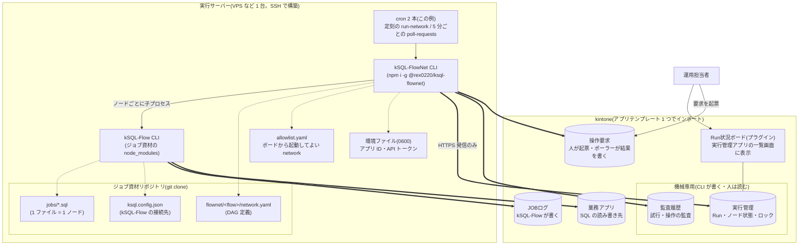
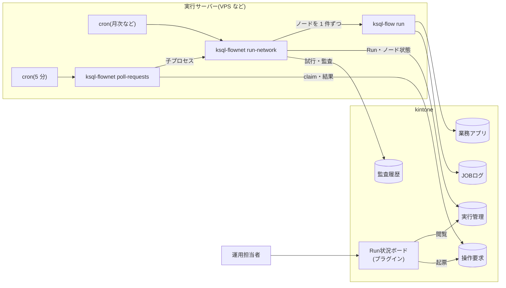
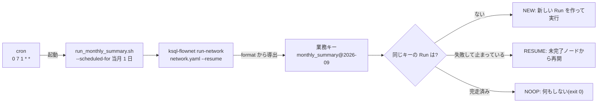

<!-- kintone のバッチを「ジョブの網」として運用する — kSQL-FlowNet 
- タグ: kintone, SQL
-->

[kSQL-Flow](https://github.com/rex0220/ksql-flow) は、kintone の複数アプリを SQL で JOIN・集計し、一括 UPSERT できる CLI ランナーです(SQL 1 本が 1 ジョブ)。使い始めると、次に困るのは「ジョブが増えたあと」です。A が終わってから B、B が失敗したら C は動かさない、月初に動かなかった分をあとから安全に流し直す、失敗した回だけ途中から再開する。こうした **ジョブ同士の関係と実行の記録** は、cron とシェルスクリプトでは早々に手に負えなくなります。

その部分だけを引き受ける **実行管理層(Control Plane)** として **kSQL-FlowNet** を作り、1.0.0 を公開しました。

- npm: https://www.npmjs.com/package/@rex0220/ksql-flownet
- GitHub: https://github.com/rex0220/ksql-flownet
- 導入手順書: https://github.com/rex0220/ksql-flownet/blob/main/docs/installation.md

## 何を解決するか

| 困りごと | kSQL-FlowNet の答え |
| --- | --- |
| ジョブの順序と依存を cron の時刻差で表現している | YAML で **network(DAG)** を定義し、依存先が終わってから次を起動する |
| 同じ月の処理が二重に走った / 途中で落ちた回をどこから流し直すか分からない | 同一 network・同一**業務キー**(例: `monthly_summary@2026-09`)に対して Run は 1 つ。完走済みなら NO-OP、失敗なら成功済みノードを飛ばして未完了分を再開 |
| 何がいつ動いてどう終わったか、あとから追えない | **kintone アプリに記録**する。Run とノードの状態は実行管理、試行と監査は監査履歴、運用担当者の操作とその結果は操作要求アプリに残る |
| 運用担当者がサーバーにログインしないと再実行できない | kintone の**ボードプラグイン**からリラン・停止・解除・新規実行を依頼できる。サーバー側のポーラーが 5 分ごとに拾う |

kSQL-Flow(SQL の実行)と kSQL-FlowNet(実行の管理)の分担はこうです。

| 領域 | kSQL-FlowNet | kSQL-Flow |
| --- | --- | --- |
| 実行単位 | network / Run / Node / Attempt | 単一 SQL ジョブ |
| 定義 | network YAML と DAG | SQL ファイル |
| 順序制御 | 依存関係を判定して直列起動 | 担当しない |
| 排他 | network 単位のロック | ジョブ単位のロック |
| 再開 | Run の状態に基づく | 担当しない |
| 永続化 | 実行管理・監査履歴・操作要求アプリ | JOBログ・業務データ |

## 全体の構成

登場するものは「実行サーバーに置くもの」と「kintone に作るもの」の 2 群だけです。まず何がどこにあるかを示します。



| 場所 | 置くもの | 誰が書くか |
| --- | --- | --- |
| 実行サーバー | kSQL-FlowNet CLI、kSQL-Flow CLI、ジョブ資材(network.yaml・SQL・kSQL-Flow 設定)、環境ファイル、allowlist、cron 2 本 | サーバー管理者が SSH で配置(定義と SQL は git 経由) |
| kintone: 実行管理・監査履歴 | Run とノードの状態、ロック、試行、操作の監査 | kSQL-FlowNet CLI だけ。人は閲覧 |
| kintone: 操作要求 | リラン・停止・解除・新規実行・クローズの依頼と結果 | 人が起票(ボードまたは操作要求アプリ)、ポーラーが結果を書く |
| kintone: JOBログ | 1 ジョブ 1 回の実行ログ | kSQL-Flow |
| kintone: 業務アプリ | 集計元・更新先 | kSQL-Flow(SQL のとおり) |
| kintone: プラグイン | 実行管理アプリの「00_Run状況」ビューに描画されるボード | 設定はアプリ管理者 |

## 動きの流れ

通常実行時の通信は**実行サーバーから kintone への HTTPS 発信だけ**です。kintone からサーバーへの接続はなく、Webhook も常駐 API もないので、kSQL-FlowNet のための受信ポート・公開ドメインは要りません。別途必要になるのは、サーバー管理用の SSH 経路と、kintone 側で IP アドレス制限を使う場合の固定送信元 IP だけです。



人が更新するのは原則として操作要求アプリだけです。実行管理と監査履歴は CLI だけが書き込み、人はボードや一覧から参照します。

## network の定義

1 network = 1 YAML。ノードは「1 つの SQL ファイルを 1 回の kSQL-Flow ジョブとして実行する単位」で、`depends_on` で順序を表します。実行は依存関係(DAG)に従ってトポロジカル順に **1 ノードずつ直列**に進みます。並列ワーカーで分散実行する仕組みではありません。

```yaml
schema_version: 1
network_id: monthly_summary
description: 月次集計
business_key_policy:
  type: scheduled_period
  period: month
  timezone: Asia/Tokyo
  format: "{network_id}@{yyyy}-{MM}"
max_active_runs: 1
network_lock:
  lease_duration_sec: 180
  heartbeat_interval_sec: 60
nodes:
  - id: intake_gate
    job_id: intake_count
    sql: jobs/00_intake_count.sql      # 件数ゲート(読取のみ)
    depends_on: []
    trigger_rule: all_success
    idempotent: true
  - id: test_data_gate
    job_id: test_data_gate
    sql: jobs/10_test_data_gate.sql    # テストデータ混入ゲート(ASSERT)
    depends_on: [intake_gate]
    trigger_rule: all_success
    idempotent: true
  - id: deal_summary
    job_id: deal_summary
    sql: jobs/20_deal_summary.sql      # 集計して UPSERT
    depends_on: [test_data_gate]
    trigger_rule: all_success
    idempotent: true
```

ポイントは 2 つです。

- **業務キーが Run を決める。** cron から `--scheduled-for 2026-09-01T00:00:00+09:00` で起動すると、`format` から `monthly_summary@2026-09` が導出されます。同じキーで再起動しても完走済みなら何もしません(NO-OP)。失敗した回を同じキーで再開すると、**成功済みノードは再実行せず、未完了ノードを DAG の依存関係に従って実行**します。9 月分を作り直したいときは `monthly_summary@2026-09-correction-1` のような別キーで新しい Run を作ります
- **ゲートを先頭に置く。** 上の例では集計の前に「件数がある」「テストデータが混ざっていない」を SQL の `ASSERT` で検査しています。満たさなければそこで FAILED になり、集計は走りません。fail-closed が基本方針です

## スケジュールの仕組み

kSQL-FlowNet はスケジューラを持ちません。定刻の起動は OS の cron が担い、cron は「いつ」を決めるだけで「何を・どのキーで」は network 定義と起動時刻から決まります。以下はサーバーのタイムゾーンを `Asia/Tokyo` に設定した例です。cron の発火時刻は network 定義の `timezone`(業務キーの導出に使う)ではなく、OS / cron 側のタイムゾーンに従います。

```cron
# 毎月 1 日 7:00 に月次集計を起動(起動スクリプトが当月 1 日を --scheduled-for に渡す)
0 7 1 * * . /root/.ksql-flownet.env && /opt/ksql/my-ksql-jobs/run_monthly_summary.sh >> /var/log/ksql/flownet.log 2>&1
# 5 分ごとに操作要求アプリを見に行くポーラー(全 network 共通で 1 本)
*/5 * * * * . /root/.ksql-flownet.env && cd /opt/ksql/my-ksql-jobs && ksql-flownet poll-requests >> /var/log/ksql/flownet-requests.log 2>&1
```



ボードの START は別の新規起動経路です。ポーラーは START に `--resume` を付けずに `run-network` を起動し、同じ業務キーの Run が既にあれば完走済みなら NOOP、未完了なら拒否(`RUN_ALREADY_EXISTS`)します。既存 Run の再開には START ではなくリラン要求を使います。

この形にすると、次の性質が cron 側の工夫なしに手に入ります。

- **同じ月に cron が再発火しても安全**: `--resume` 付きなので、完走済みの Run に対しては NOOP で終わる。サーバー再起動後の取りこぼし確認のために手で再実行しても二重集計にならない
- **失敗した月も同じ起動方法で再開できる**: 同じ `--scheduled-for` を指定して再実行すると、既存 Run の成功済みノードを飛ばし、未完了ノードから再開する(翌月の cron は翌月のキーで動くので、前月分を自動では再開しない)。ボードからは対象 Run にリラン要求を起票できる
- **未実行の過去分は日付を渡すだけ**: `SCHEDULED_FOR=2026-07-01T00:00:00+09:00 ./run_monthly_summary.sh` のように対象期間を明示すると、該当月の業務キーで Run が作られる。既に完走済みなら NOOP になり、再計算したい場合は別の補正キーを使う(書込先が単一スロットの集計は上書きに注意)
- **定刻以外の起動はボードから**: 補正キー付きの START 要求を起票すると、ポーラーが同じ `run-network` を起動する。cron の行を増やす必要はない

network を複数持つ場合、定刻起動の cron は network ごと、または複数の network を連携させるシェルスクリプトごとに設定します。ポーラーは全体で 1 本です。「A が終わってから B」を network をまたいで表現したいときは、A と B を順に呼ぶシェルスクリプトを 1 本置き、`run-network` の exit code(成功・NOOP は 0、それ以外は非 0)を使い、`set -e` で後続を止めます。詳しくは[スケジュール連携の運用パターン](https://github.com/rex0220/ksql-flownet/blob/main/docs/scheduling-patterns.md)にまとめています。

## 運用はボードから

実行管理アプリの「00_Run状況」ビューにプラグインが描画するボードです。


- 動いている Run と、失敗して対応が必要な Run が分かれて見えます
- 行のボタンから**リラン要求・停止要求・解除要求・クローズ要求**を出せます。押した瞬間に何かが動くのではなく、操作要求アプリにレコードが 1 件できて、サーバーのポーラーが次の周期(最大 5 分)で処理します
- 「新規実行」からは、サーバー側で許可された network だけを **START** できます


起票した要求は、ボードの該当 Run の行に「処理待ち」として起票者・理由つきで表示され、ポーラーが受け取るまでは起票者本人が取り消せます。誰が・いつ・何を依頼し、結果がどうだったかは操作要求アプリに残ります。


## 導入の流れ(ダイジェスト)

詳細は[導入手順書](https://github.com/rex0220/ksql-flownet/blob/main/docs/installation.md)にあります。kintone 側 5 手順、サーバー側 5 手順です。

1. **kintone**: プラグイン zip を読み込む → アプリテンプレートから 4 アプリを作る → API トークン → アクセス権(同梱の Console スクリプト) → プラグイン設定
2. **サーバー**: kSQL-Flow のジョブ資材を clone → `npm i -g @rex0220/ksql-flownet` → 環境ファイル・network 定義・allowlist → `validate` と `poll-requests --check` → 初回実行 → cron 2 本

サーバー側の手順は Claude Code に任せる想定の[併用版](https://github.com/rex0220/ksql-flownet/blob/main/docs/installation-claude-code.md)も用意しました。トークン値だけは人が転記します。

## 設計上の判断

作りながら決めたことをいくつか。

- **スケジューラを持たない。** cron の代わりになる常駐プロセスを作ると、それ自体の監視と再起動が新しい仕事になります。定刻の起動は OS の cron に任せ、kSQL-FlowNet は「呼ばれたときに、1 つの network 内の依存関係を守って正しく 1 回だけ動く」ことに集中しました。network 間の依存管理は対象外で、複数の network を定刻に順番に起動する場合はシェルスクリプトから直列に呼びます([スケジュール連携のパターン](https://github.com/rex0220/ksql-flownet/blob/main/docs/scheduling-patterns.md))
- **直列実行。** DAG の分岐は定義できますが、ノードは 1 件ずつ動きます。kintone の API 制限とジョブロックを考えると、並列化で得るものより失敗時の分かりやすさを優先しました
- **機械専用アプリ。** 実行管理と監査履歴は CLI だけが書き、人は読むだけ。人の操作は操作要求アプリを経由して受け付けます。リラン・停止・解除・新規実行は要求レコードとして追加し、実行管理レコードを直接編集して状態を変える経路は設けません。例外はポーラーが受理する前の要求の取消だけで、これは要求レコードの取消フラグを起票者本人が立てる操作です
- **START の三重ゲート。** ボードから新規実行できるのは、①操作要求アプリに追加できる人が、②サーバーの allowlist で `app_start: true` と明示された network を、③全ノードが冪等と宣言された定義で、の 3 条件が揃ったときだけです。`idempotent: true` はシステムが証明するものではなく、ジョブ定義者が再実行時の安全性を確認したうえで行う宣言です。画面側の設定は表示用で、許可の正はサーバーにあります
- **fail-closed。** 判定できないときは動かさない・更新しない。結果 JSON が読めなければ UNKNOWN として人の判断を待ち、自動で再実行しません

## 1.0.0 で確認したこと

公開前に、実機の kintone と Linux サーバーで次の経路を確認しています。単体テスト 579 件のほかに、実機 E2E シナリオ 26 本(操作要求・START・ライフサイクル・CSV 入出力・ロック回復)を直列で流し、本番相当の VPS では、8 月末から月次 Run と 5 分周期のポーラーを継続稼働させています。

- 月次 Run の新規起動と正常完了、同じ業務キーでの再起動が NO-OP になること
- 中間ノード失敗後のリランで、成功済みノードを再実行しないこと
- 同時起動で Run が重複作成されないこと(ロックと業務キーの一意制約)
- ボードからの START が、許可されていない network や非冪等な定義で拒否されること
- ポーラー受理前の要求取消と、受理後は取消できないこと
- 導入手順書だけを見た通しセットアップ(テンプレート → プラグイン → サーバー → cron)

## 制約

- kSQL-Flow 0.7 以降、Node.js 22 以上、kintone(cybozu.com)
- kintone の DATETIME は分精度なので、秒以下の順序証明には使っていません
- ジョブロックのキー(`profile:job_id`)は 64 文字以内
- ボードプラグインは PC 画面専用

## リンク

- 導入手順書: https://github.com/rex0220/ksql-flownet/blob/main/docs/installation.md
- 統合仕様書: https://github.com/rex0220/ksql-flownet/blob/main/docs/specification.md
- 一次対応 1 ページ(ボードの見方と操作): https://github.com/rex0220/ksql-flownet/blob/main/docs/ops-first-response.md
- kSQL-Flow: https://github.com/rex0220/ksql-flow
- kSQL(kintone-sql-tools): https://github.com/rex0220/kintone-sql-tools

MIT ライセンス、現状有姿(as-is)での公開です。
