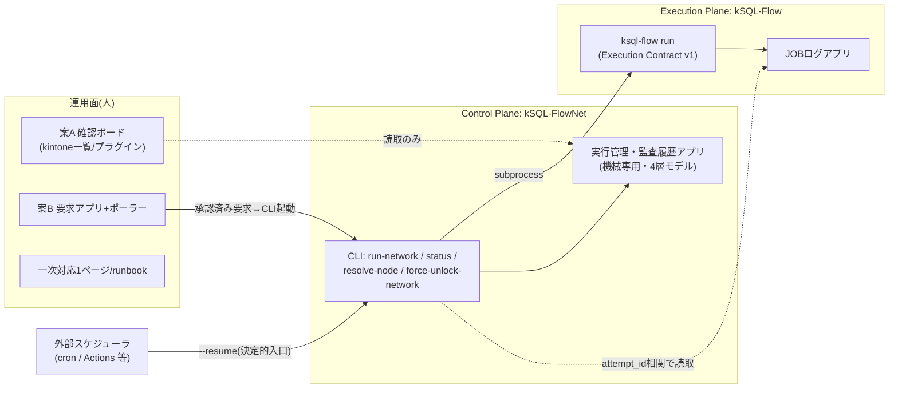

# kSQL-FlowNet 全体構想仕様

- 文書状態: **VISION**(構想の統合整理。規範ではない)
- 作成日: 2026-08-31
- 位置づけ: Phase 1凍結までの決定・実装・討論の全成果を1つの構想として統合し、以降の投資判断の入口とする。**Phase 1の意味論の正本は凍結版仕様とFDRであり、本書は上書きしない。** 本書と正本が食い違う場合は正本が勝ち、本書を直す
- 主な入力: [Phase 1仕様(凍結版)](./job-network-phase1-spec.md)、[FDR(ACCEPTED)](./phase1-freeze-decision-record.md)、[受入マトリクス](./acceptance-phase1.md)、[運用UI討論](./kintone-ops-roadmap-discussion.md)、[実装計画](./implementation-plan.md)

---

## 1. 何を作っているのか(1段落)

**kintone上の業務バッチ(kSQL-Flowジョブ)を、依存関係のあるジョブネットとして「安全に止まり、安全に再開できる」形で運用する製品**である。実行エンジン(kSQL-Flow)には手を入れず、その外側にControl Plane(kSQL-FlowNet)を置き、DAG実行・同一Run継続resume・4層監査・排他・復旧をCLIで提供する。運用の入口はkintone画面(確認ボード→要求アプリ)へ段階的に広げ、最終的には「小規模な情シス担当が一人でも、夜間の失敗が朝には自動で直っているか、直っていなければ画面で気づいて安全に指示できる」状態を目指す。

## 2. 全体像 — 3つの面と2つの境界



**境界1(実行契約)**: FlowNet⇔kSQL-FlowはCLI subprocess+Execution Contract v1のみ。ライブラリ結合しない。Job lockはkSQL-Flow所有で、FlowNetは停止確認と結果の監査関連付けだけを行う(D-26)。

**境界2(責務境界)**: 起動時刻・missed run・catch-upは外部スケジューラ、ensure-runとDAG順序はFlowNet(D-30)。常駐プロセスはFlowNetの外に置く(ポーラーも同様)。

**設計制約(全構想共通)**: 実行管理アプリは機械専用とし、人は書かない(人の編集は$revisionを進め、orchestratorの書込みをfail-closedさせる)。人が書く場所は必ず別アプリにする。

## 3. 現在地(2026-08-31)

- **Phase 0・Phase 1完了・凍結**: FDR ACCEPTED、受入28/28合格(unit 270+、実機E2E m5×6/m6×6/m7×5)。実装0.1.0 / schema_version 1
- 実機ゲート主義の実績: 実機E2Eが商用前に製品欠陥7件+機能ギャップ2件を捕捉・修正(DATETIME分精度round-trip×3、release×heartbeat競走、孤児裁定欠落、drain配線欠落、放棄Invocation残置ほか)
- 凍結後の再審議1件完了(R2-1: rerun-from拒否条件の精緻化)。外部評価2系統との討論で運用UI構想を合意(Dq-4のみ前提タスク待ち)
- npm公開はリリース検証完了までprivate維持(公開時MIT+publishConfig切替)

## 4. オーサリングモデル構想(定義を書く人)

**運用より先に決めるべき層である。** 小規模情シス担当にとって、ボタンを押すことよりも`network.yaml`とSQLを書き、各ノードの`idempotent`を正しく宣言することのほうがはるかに大きな要求であり、**宣言を誤ると自動リランで二重書込みが起きる — オーサリングの品質が運用の安全性を直接決める**。

| 場面 | 誰が書くか | 品質保証 |
| --- | --- | --- |
| 初回導入の定義 | 開発者(将来はベンダー)が書いて渡す | PRE-05の7項目棚卸しがそのまま初回の安全確認を兼ねる |
| 導入後のジョブ追加・変更 | 情シス担当が書いてよい。ただし**`idempotent`宣言の妥当性レビューを二次対応者が行うことを導入前提とする** | レビューのチェックリストは討論§11.2の7項目基準(自動化はP2-05まで人力)。`validate`/`plan`で構文・DAG・business keyを機械検査 |
| 実行中Runへの影響 | なし(構造上の保護) | 不変バンドルにより、作業ツリーの編集は既存Runに一切影響しない。変更は次のNEW Runから効く |

**導入前提(明文)**: ジョブネット定義の追加・変更は、`idempotent`宣言のレビュー(二次対応者)を通過するまで本番profileへ載せない。これは案A/Bの整備より製品の成否に効く。

## 4.5 運用モデル構想

**想定運用**: 中小企業の小規模情シス担当(一人〜少人数)+必要に応じてITベンダー/開発者の二次サポート。

**注意: 下表の3層は到達点(案B導入後)の姿である。** 初回導入時点(day-1)の一次層は「見て、気づいて、連絡する」までであり、操作手段を持たない — したがって**二次対応者はday-1から必須**で、ベンダー未定の現状ではそれは開発者本人である(§5の「開発者張り付き期間」と同じことの別表現)。

| 層 | 誰が | 何で | day-1(初回導入時点) | 到達点(案B導入後) |
| --- | --- | --- | --- | --- |
| 自動 | cron+`--resume` | 外部スケジューラ | 冪等FAILEDの自動再試行+ブレーキ(PRE-02) | 同左 |
| 一次 | 情シス担当 | kintone画面(案A) | 異常の確認とエスカレーションのみ | 冪等FAILED/BLOCKEDの再開指示(案B) |
| 二次 | 開発者(将来ベンダー) | CLI(実行環境) | resolve-node、force-unlock-network、cancel-run(PRE-06)、非冪等系の復旧、**定義レビュー(§4)** | 同左 |

**承認者の原則**: 非冪等ノードのSUCCESS解決は別主体の`--approved-by`必須(D-13)。承認者は「実行環境でCLIを叩ける主体」であり、kintone上のユーザーではない。一人体制での回避は「初回導入対象を全ノード冪等の業務にする」(PRE-05で判定)。ベンダーを承認者に置く場合は実行環境アクセスの設計がSLAより先。

**停止確認の原則**: 人がCLIで行う`manual`停止確認は凍結仕様どおり有効。**無人経路(ポーラー・ボタン起点)から回収系を呼ぶ場合のみ機械確認(`local_pid`/`cloud_run_job_execution`)に限定**する。

## 5. 導入ロードマップ(討論合意版)

```text
[1] PRE-01 activity導出 + PRE-02 ブレーキ + PRE-06 cancel-run ← 実装(小)。着手可能
[2] PRE-03 案A v0(一覧設定) + PRE-04 一次対応1ページ          ← 引き渡し条件
 ∥  PRE-05 非冪等棚卸し(2段方式)                              ← Dq-4のクリティカルパス(並行)
[3] 初回本番導入(1業務・1ネットワーク)+ Dq-4確定 + 撤退条件の事前合意
[4] 実測(判定閾値は着手前に合意しておく)
[5] 案B(要求アプリ+ポーラー) / P2-02後半(画面起点の停止要求)
[6] 並列化・trigger_rule拡張等 — 実行時間が問題になってから(需要ドリブン)
[7] 案C(承認付き復旧) — ベンダー関与が確定した場合のみ検討。それまで設計しない
```

(番号は本書で振り直した通し番号。討論§4.4の旧番号`[0']`〜とは対応がずれる)

### 本番導入前タスク(PRE)の要点

| ID | 内容 | 設計条件の正本 |
| --- | --- | --- |
| PRE-01 | `status --json`へ`activity: LIVE / IDLE / INTERRUPTED`導出を追加。保存データ無変更・FDR審議不要。「実行中と誤読して待ち続ける」事故の防止 | 3値定義・共有test vector: 討論§10.2 |
| PRE-02 | 同一ノード・同一failure_kindの連続FAILED N回で明示フラグなしでは着手しない。Attempt履歴からカウント(API増なし)。LOCK_CONFLICT系は数えない(仕様§8.2)。軽量FDR再審議 | 討論§10.2 |
| PRE-03 | 案A v0: 実行管理アプリの一覧設定のみで異常Node State一覧。受入条件に「この一覧に出ない止まり方(NODES_DEFERRED中断)」の明記を含む | 討論§9.7 |
| PRE-04 | 一次対応1ページ(この状態ならこの操作/この連絡先)。既存runbook 2冊は二次対応者向けとして維持 | 討論Q-E |
| PRE-05 | 候補業務SQLの非冪等棚卸し(7項目基準)+既存`idempotent`宣言の妥当性検証。**2段方式**: (a)人が「定期実行で通知・請求を送らない業務」を2〜3本挙げる→(b)その分だけ7項目判定。全件棚卸しは(a)が空振りした場合の手段(P2-05入力仕様という副産物はDq-4決着後でも価値が減らない) | 判定基準: 討論§11.2 |
| PRE-06 | **CLI起点の停止要求**(`cancel-run`)。次ノード境界で検査し、実行中subprocessは完走を待って新ノードを起動せず、Invocationを`CANCELLED`系で正常終端する(新しい状態値なし)。「今日は止めたい」がkill→UNKNOWN→resolve-nodeの最高コスト経路に落ちる穴をday-1前に塞ぐ。**画面起点(要求アプリ)は案Bと同時([5])に分離**。軽量FDR再審議(PRE-02と同一ラウンド)。停止要求の置き場所(実行ホストのローカルフラグ vs CLIが書くstate appレコード=別ホスト可・監査可)は審議で決定 | P2-02から前半を格上げ(2026-08-31外部評価) |

### 初回導入の選定基準と撤退条件(Dq-4の判断材料)

**選定基準**:

1. **全ノード冪等で閉じられる業務を選ぶ**(承認者問題が前提条件から外れる)。通知・請求・外部連携・履歴追記・採番・集計の自己参照を含む業務は2件目以降へ
2. 承認者の割当は非冪等業務を載せる時点までに決める(開発者に置くなら実質ベンダーサポートとしてSLAを定める)
3. 開発者張り付き期間を設ける(初回導入自体が最大のリスク)

**撤退条件(着手前に合意しておく)**: 張り付き期間中に次のいずれかが起きたら、移行runbookの切戻し手順(旧run-all運用へ復帰。FlowNetのstate/auditは監査として保持)を実行し、原因をFDR再審議で処理してから再導入する。

- 二重書込みまたはデータ不整合が1件でも発生した(`idempotent`宣言誤りを含む)
- resolve-node/force-unlockを要する事象が張り付き期間中に高頻度で発生し、一次対応1ページで運用が回らないと判断した
- 業務側の締切をFlowNet起因で落とした

## 6. kintone運用UI構想(3つの面)

| 面 | 内容 | FlowNet改修 | 状態 |
| --- | --- | --- | --- |
| 案A v0 | 一覧設定のみの確認ボード(異常Node State) | なし | PRE-03起票済み |
| 案A v1 | 導出プラグイン(activity=INTERRUPTED含む「対応が必要なRun」一覧)。CLIと共有test vectorで縛る | なし | 初回導入後に判断 |
| 案B | リラン要求専用アプリ+cron一発ポーラー。受理範囲は**安全性で固定**(冪等FAILED/BLOCKEDの再開のみ。二次対応者が誰かで変わらない)。要求はフラグでなく状態機械(REQUESTED→ACCEPTED→DONE/REJECTED)、要求者はシステムフィールド、相関は`--requested-by "kintone:<request_id>:<更新者コード>"`(stopgap、形式は先に固定) | なし | 実測後([5]) |
| 案C | 承認付き復旧(UNKNOWN/非冪等FAILEDの画面フロー) | あり | **ベンダー関与確定まで設計しない**。判定閾値(例: ATTEMPT_RESOLUTION月N件)は着手前に合意 |

不変条件: (1)実行管理アプリに人は書かない (2)指示は状態機械で再発火しない (3)要求者はシステムフィールド (4)無人経路の停止確認は機械確認に限定(manualはCLI経路でのみ有効)。

## 7. Phase 2以降の機能構想

正本のPhase定義(仕様「Phase別概要」)を維持する。Phase 2以降は**需要ドリブン**であり、着手条件を先に決める。

| Phase | テーマ | 主な内容 | 着手条件 |
| --- | --- | --- | --- |
| Phase 2 | DAG表現力と制御された並列化 | `none_failed`/`all_done`、条件分岐、リトライポリシー拡張(backoff等)、並列実行、リソースプール、cancel伝播(P2-02) | 初回本番の実測で実行時間が締切を圧迫、または業務が直列表現で書けなくなったとき |
| Phase 3 | 精密な途中再開と分散実行 | 文・チャンク単位の再開、単調カーソル、分散ワーカー、claim/lease | ノード全体リプレイの再計算コストが実測で問題化したとき |
| Phase 4 | エンタープライズ運用 | RBAC、承認付き復旧(案Cの本来形)、監査エクスポート、SLO、管理UI、DR | 複数組織/複数環境の統制要求が実在したとき |

### Phase 2バックログ(起票済み)との対応

| ID | 内容 | 備考 |
| --- | --- | --- |
| P2-01 | アプリ起点リラン(外付けポーラー) | 案Bの実装形。FlowNet本体無改修 |
| P2-02 | ノード境界の停止要求(画面起点) | **CLI起点はPRE-06へ格上げ済み**。P2に残るのは要求アプリ起点(案Bと同時) |
| P2-03 | 連続失敗ブレーキ | **PRE-02へ格上げ済み**。backoff等の拡張のみP2に残る |
| P2-04 | FlowNet側ノード単位上限時間 | 「子プロセスを信用しない」層を閉じる |
| P2-05 | `idempotent`の操作種別分類(自動化) | PRE-05の棚卸し結果が入力仕様になる |
| P2-06 | bundle転送の有界リトライ | 実測済みのファイルAPI断続5xx対策(偽の失敗削減) |

## 8. 進め方の原則(このプロジェクトの型)

1. **正本第一・FDR再審議**: 凍結後の意味論変更は必ずFDR再審議(提案→承認→仕様→実装→実機→証跡→REFLECTED)。実装都合で仕様を黙って直さない
2. **実機ゲート主義**: unitで固定し、実機E2Eで判定する。「読取は嘘をつく、耐久レコードが裁定」「fail-closed」「プラットフォームを疑う前に自分の呼出しを検証」
3. **役割分担**: 実装はCodex、レビュー・実機判定・正本管理はClaude Code。外部評価(Claude/Gemini)との相互討論を大きな節目に挟み、事実確認つきで反映する
4. **測定してから作る**: Phase 2以降と案B/Cは、着手前に判定閾値を合意し、実測が閾値を超えてから作る
5. **追加は自由、意味変更は重い**: フィールド追加・read-only出力追加は軽く、既存値の意味変更は移行規則を伴う(本番導入後は特に)

## 9. 未決事項(すべて所在つき)

| 項目 | 状態 | 次の一手 |
| --- | --- | --- |
| Dq-4(初回導入の対象業務・承認者・ベンダー) | **PRE-05待ち** | (a)ユーザーが候補業務2〜3本を挙げる→(b)担当CCが7項目判定。空振り時のみ全件棚卸し |
| 定義追加時のレビュー体制(§4) | 導入前提として明文化済み | 初回導入計画に「二次対応者による`idempotent`宣言レビュー」を運用手順として組み込む |
| 実運用のlease値・Cloud Run実照会・複数ホスト | FDR限定事項 | 導入時にrunbookで確認 |
| npm公開 | リリース検証待ち | 初回導入の安定稼働後に判断 |
| 案Cの判定閾値N | 未合意 | 案B着手前に合意 |

## 10. 変更管理

本書は構想の統合整理であり、決定はFDR・実装計画・討論文書で行う。大きな節目(初回導入完了、Phase 2着手判断)で本書を改訂し、`実装計画`のPRE/P2表と常に整合させる。
