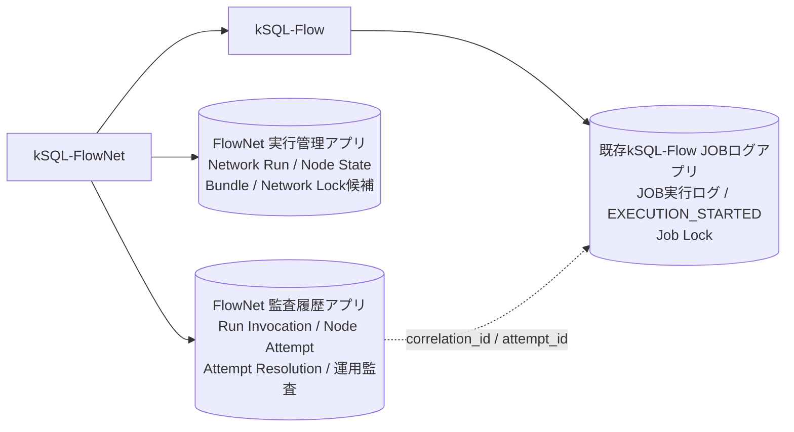

# kSQL-FlowNet Phase 1 Freeze Decision Record

- 状態: **ACCEPTED**(2026-08-31凍結。承認記録: `spikes/fdr-update-proposal-2026-08-31-freeze.md`)
- 対象: ジョブネット管理 Phase 1
- 作成日: 2026-08-29
- Accepted への昇格条件: 本書「12. 凍結ゲート」をすべて満たすこと(2026-08-31全項目充足)
- version記録: 実装 `@rex0220/ksql-flownet` 0.1.0 / レコード構成 schema_version 1 / JOBログ相関 kSQL-Flow M1(対応表: `templates/README.md`)
- 受入試験結果: `docs/acceptance-phase1.md`(28/28)、証跡 `docs/test-results/`(m3〜m7ゲート)
- 復旧訓練記録: m6-04実機ドリル(`docs/test-results/m6-gate-20260830/`)、手順正本 `docs/runbook-phase1-recovery.md`・`docs/runbook-phase1-migration.md`
- 凍結後の変更: 実装都合で本書・仕様を黙って変更せず、FDR再審議手続きによる(記録: 「13. 凍結後の再審議記録」)
- 読み方の注意: 本文中の日付付き追記にある「`PROPOSED`を維持する」等の文言は**追記時点の履歴**であり、各判断の現在状態は「2. 判断の一覧」表と本ヘッダが正である
- 関連仕様: [ジョブネット管理仕様書](./job-network-phase1-spec.md)
- 実行境界: [kSQL-Flow Execution Contract v1](./execution-contract-v1.md)
- 分離判断: [プロジェクト分離ADR](./architecture-separation-adr.md)
- レビュー根拠: [Phase 1仕様レビュー](./phase1-spec-review.md)

---

## 1. 目的

本書は、ジョブネット管理仕様書の「14. 凍結前に残る確認事項」を、次の4種類に分けて管理するArchitecture Decision Recordである。

- `DECIDED`: Phase 1の意味論として採用する
- `PROPOSED`: 推奨案はあるが、実装スパイクまたはレビュー完了前
- `VALIDATION_REQUIRED`: kintone実環境での検証が必要
- `OPERATIONS_REQUIRED`: 保持、権限、移行、復旧の運用決定が必要

本書が`PROPOSED`の間、元仕様は「設計凍結候補」のままとする。未実測事項を保証として扱わず、未決事項がある状態で「リスクを完全に排除した」と表現しない。

---

## 2. 判断一覧

| ID | 状態 | 論点 | 推奨判断 |
| --- | --- | --- | --- |
| D-01 | `DECIDED` | 業務実行と起動の単位 | 同じ業務は同一Network Runを継続し、起動はRun Invocationとして追記 |
| D-02 | `DECIDED` | `--resume` | resume-onlyではなくensure-run semanticsとする |
| D-03 | `DECIDED` | Networkロック粒度 | Phase 1は意図的に`profile + network_id`単位で直列化 |
| D-04 | `DECIDED` | UNKNOWNの履歴 | 元Attemptを上書きせず、Attempt Resolutionを追記 |
| D-05 | `DECIDED` | 実行バンドル | Network Runへ関連付け、resume可能な間は取得可能に保つ |
| D-06 | `DECIDED` | 現行status移行 | status名ではなく現行の発生原因から新status/result_codeへ対応付け |
| D-07 | `DECIDED` | 永続化の正本 | Node Stateをスケジューラの正、Node Attemptを物理実行の耐久履歴とする(2026-08-31凍結時確定、受入4/16/22実証) |
| D-08 | `DECIDED` | アプリ構成 | FlowNetの実行管理／監査2アプリと既存kSQL-Flow JOBログアプリの構成を第一候補とし、FlowNet 1アプリ案とスパイク比較（2アプリ構成を採用） |
| D-09 | `DECIDED` | 二重書込み | SQL開始前ゲートとrevision付き照合・修復プロトコルを採用(2026-08-31確定、M3/M4ゲート+m6-04/m7-02障害注入実証) |
| D-10 | `DECIDED` | canonical lock key | `N1:` / `J1:`等のversion付きbase64url SHA-256形式 |
| D-11 | `DECIDED` | 重複禁止INSERT競合 | 複数プロセス・可能なら複数ホストの実機contract testを実施 |
| D-12 | `DECIDED` | bundle保持 | 保持はRunレコードと同寿命(削除しない=監査保持)。復元はSpike B実測の添付再取得手順。容量閾値見直しはPhase 2(2026-08-31決定) |
| D-13 | `DECIDED` | Node手動解決権限 | 認証主体は環境変数(配備単位割当)、非冪等SUCCESSは別主体`--approved-by`必須、全操作監査必須。担当者割当は導入時運用設定(2026-08-31決定) |
| D-14 | `DECIDED` | 新旧ロック移行 | 段階移行なし。業務(ジョブ群)単位で一括切替し新旧並走を残さない。同一job_idの防波堤はkSQL-Flow所有Node lockが新旧共通で担う(2026-08-31決定) |
| D-15 | `DECIDED` | CLI所有境界 | Control Planeは`ksql-flownet`、Execution Planeは`ksql-flow` |
| D-16 | `DECIDED` | Nodeとjobの識別 | `node_id`と`job_id`を分離し、Nodeロックは`job_id`から生成 |
| D-17 | `DECIDED` | profile照合 | kSQL-Flowの`describe-profile --json`を正とし、orchestratorはconfigを独自解釈しない |
| D-18 | `DECIDED` | 手動復旧とSKIPPED | 元Attemptを不変とし、手動完遂だけSUCCESSへ解決。SKIPPEDはPhase 1予約値 |
| D-19 | `DECIDED` | 終端Run再実行 | 終端SUCCESS Runの`--rerun-from`を禁止し、correction Runを作る |
| D-20 | `DECIDED` | business key | scheduled periodから決定的に生成し、`max_active_runs`既定1 |
| D-21 | `DECIDED` | 停止スコープ | UNKNOWN／非冪等失敗の子孫だけを停止し、独立系統は継続 |
| D-22 | `DECIDED` | SQL開始証跡 | kSQL-Flowの耐久`EXECUTION_STARTED`と最終`executionStarted`を分離 |
| D-23 | `DECIDED` | idempotent検査 | `inspect-job --json`でjob IDと検出可能な非決定要素をbundle作成時に検査 |
| D-24 | `DECIDED` | 採番と集約更新 | Node State revision採番、canonical key、単一Invocation集約更新 |
| D-25 | `DECIDED` | 製品命名と概念名 | 製品表示名をkSQL-FlowNet、repo／CLIを`ksql-flownet`、npmを`@rex0220/ksql-flownet`とし、Network／Node等の概念名は維持 |
| D-26 | `DECIDED` | force-unlock所有境界 | Job lockはkSQL-Flowが回復し、FlowNetは直接変更せず停止確認と結果を監査する |
| D-27 | `DECIDED` | 旧run-all移行 | `batch_id`を`run_id`へ変換せず、必要時だけ`legacy_batch_id`付き監査参照として取り込む |
| D-28 | `DECIDED` | read-only CLI | `validate`、`plan`、`status`を外部状態を変更しないControl Planeコマンドとして提供する |
| D-29 | `DECIDED` | Network lock recovery | FlowNet所有のrenewable leaseとし、heartbeat、lease token、停止確認、監査付き`force-unlock-network`を定義 |
| D-30 | `DECIDED` | 外部ジョブスケジューラ境界 | 外部は論理予定日時による起動、FlowNetはensure-runとDAG順序を担当し、Phase 1ではcron機能を内蔵しない |

---

## 3. 確定するコア意味論

### D-25: 製品名と概念名の分離

製品ブランドと、DAG・永続化スキーマで使う概念名を分離する。

| レベル | 確定名称 |
| --- | --- |
| 製品表示名 | kSQL-FlowNet |
| リポジトリ名 | `ksql-flownet` |
| npmパッケージ | `@rex0220/ksql-flownet` |
| CLIコマンド | `ksql-flownet` |
| 概念名 | Network / Node / Network Run / ジョブネット |

`network_id`、`run_id`、`node_id`等の公開スキーマ・JSONフィールドは、製品名変更を理由に改名しない。文書では製品を指す場合に「kSQL-FlowNet」、コマンド・パッケージ・リポジトリを指す場合にそれぞれのコード表記を使う。

### D-26: force-unlock所有境界

Job lockの所有者はkSQL-Flowのままとし、FlowNetがlockレコードを直接更新・削除してはならない。force-unlockはkSQL-Flowのversion付き回復契約として定義し、旧保持者停止確認を必須にする。FlowNetは認証主体、確認者、理由、証拠、対象、時刻、kSQL-Flow側の結果をNetwork監査へ関連付ける。具体的なCLI、result schema、Exit Code、応答消失時の照会手順がcontract testを通るまでD-26は`PROPOSED`とする。

2026-08-29の追記。参照: `spikes/d-lock-contract/measurements.md`、`spikes/d-lock-contract/results/2026-08-29T10-43-16.516Z-lock-contention.json`。

現行kSQL-FlowのJob lock通常解放は、レコードDELETEではなく、終端status更新、`job_key`の空文字クリア、元キーの`job_key_done`への退避を単一UPDATEで行う。実装根拠は `ksql-flow/src/logapp.ts` の `finishRecord()` である。したがって、本番サービストークンへレコード削除権限を付与しない構成を可能にし、Job lockを含む監査アプリには削除権限を付与しないことを推奨する。

これは通常解放方式の追記であり、D-26のforce-unlock所有境界、旧保持者停止確認、監査、応答消失時のfail-closedを置き換えない。`PROPOSED` を維持する。

#### 2026-08-30決定記録

参照: kSQL-Flow `docs/kSQL-FlowからkSQL-FlowNetへの返信-20260830-M1完了報告.md` §3、§4 D-26、`docs/internal/m1_verification_record_20260830.md`。

回復契約を`inspect-lock`と`force-unlock-job`の2コマンドに固定する。後者は`--reason`、`--confirmed-by`、`--evidence-ref`の停止確認3入力をAPI呼出前に必須検査し、検索時identityを同一record IDのGETで再確認して、そのrevisionを指定した単一UPDATEだけで解放・監査記録する。machine-readableな安定outcome／Exitは、`RELEASED`／`NOT_FOUND`／`NOT_RUNNING`をExit 0、入力不備を1、`UNCONFIRMED`を3、`CONFLICT`を5とする。応答消失後は同一record IDの`job_key_done`と`log_detail`が今回の監査内容に一致する場合だけ`RELEASED`とし、409後に他者が解放して監査内容が一致しない場合は`NOT_RUNNING`とする。以上をもって所有境界とkSQL-Flow側回復契約を確定し、D-26を`DECIDED`とする。Supersededはない。

残るFlowNet監査関連付けはFN-12で実装する。RUNNING実recordに対する`RELEASED`／`CONFLICT`の実機再現も残るため、§12のD-26ゲートは未チェックを維持する。

### D-27: 旧run-allからの移行境界

旧`run-all --resume`／`--resume-batch`の`batch_id`をPhase 1の`run_id`へ変換しない。旧実行にはbusiness key、不変bundle、Node Stateがないため、同じ業務Runとして安全に継続できない。必要な履歴は`legacy_batch_id`を持つ監査専用データとして参照可能にしてよいが、resume判定へ使用しない。移行後の業務は新しいNetwork Runとして開始する。

### D-28: read-only CLI

`ksql-flownet validate`は定義検証、`ksql-flownet plan`は定義検証に加えてbusiness keyと安定トポロジカル順の表示を行う。`ksql-flownet status`はNetwork lock、Run、Invocation、Node State、active Attempt、reconciliation状態と復旧操作に必要な識別子を返す。3コマンドはNetworkロックを取得せず、Run、Invocation、Node State、Node Attemptを作成・更新しない。`status`は停止を推測せず、秘密情報を出力しない。

### D-29: Network lock recovery所有境界

Network lockはkSQL-FlowNetが所有する。kSQL-FlowはNetwork lockを取得、更新、解放してはならない。

Network lockはジョブネット全体の想定所要時間を固定リースとして使用せず、heartbeatで更新するrenewable leaseとする。Node実行の`batch_timeout_sec`をNetwork leaseへ流用しない。network定義に`network_lock.lease_duration_sec`と`network_lock.heartbeat_interval_sec`を持たせ、少なくとも次を満たす。

- `heartbeat_interval_sec < lease_duration_sec`
- 推奨上限は`heartbeat_interval_sec <= lease_duration_sec / 3`
- FlowNetはkSQL-Flow subprocess実行中もheartbeatを継続する
- heartbeat更新は現在の`lease_token`とrevisionが一致する場合だけ許可する

Network lockには`lock_key`、`owner_invocation_id`、`owner_instance_id`、`lease_token`、`acquired_at`、`heartbeat_at`、`lease_expires_at`、revisionを記録する。FlowNetはNode State更新、Network Run集約更新、次Nodeのsubprocess起動前に、自身の`lease_token`が現在のlockと一致することを確認する。一致しない旧ownerは処理を継続してはならない。

#### heartbeat障害時のdrain protocol

heartbeatが規定回数連続で失敗するか、確認できる残余leaseが安全閾値以下になった時点で、Invocationはローカル制御状態`LEASE_UNCERTAIN`へ入り、drain modeへ移行する。以降は新しいNodeを起動しない。実行中のkSQL-Flow subprocessは原則としてkillせず完走を待つ。自ら強制終了して`UNKNOWN`を作るのは、明示的cancel等の別契約が要求する場合に限定する。

期限超過後もlockレコードのtokenが自分と一致するだけでは、Node State、Network Run集約、Invocation終端を更新してはならない。同じ`lease_token`とrevisionでheartbeatを再更新し、成功応答または再GETで更新成功を確認できた場合だけ、実行中subprocessの結果を永続化できる。結果を保存した後も同じInvocationで次Nodeへ進まず、Invocationを`CANCELLED / NETWORK_LEASE_INTERRUPTED`で終端し、次回ensure-runへ継続を委ねる。

heartbeat再更新を確認できない、または別owner／tokenへ変わっている場合は状態を書き込まない。subprocessの結果ファイルとkSQL-Flow耐久ログをreconciliation材料として保持し、結果を一意に確定できなければNode Attemptを`UNKNOWN`として解決する。

`lease_expires_at`超過はstale候補であり、旧ownerの停止証明ではない。自動回収は、同一ホストPID不在または実行基盤が提供するexecution終了状態など、旧owner停止を確認できる場合だけ許可する。別ホストからの回収では時刻超過だけを停止確認の代用にしない。

Phase 1では停止確認adapterとして少なくとも`local_pid`と`cloud_run_job_execution`を実装する。Cloud Runの場合は`owner_instance_id`へExecutionの完全なresource nameを記録し、Cloud Run Admin API v2のExecution取得結果が成功・失敗・キャンセルのterminal状態である場合だけ停止済みと認める。RUNNING、PENDING、権限不足、通信失敗、未知状態はfail-closedとする。API仕様は[Cloud Run Executions get](https://docs.cloud.google.com/run/docs/reference/rest/v2/projects.locations.jobs.executions/get)を正とし、実行主体に`run.executions.get`だけを含む最小権限を付与する。VPS ownerを別ホストから自動確認できない場合は手動回収を維持する。

heartbeatと停止確認が消費するkintone／外部API callは、kSQL-FlowのNode実行用`max_api_calls`へ含めない。ただしプラットフォーム全体の上限は消費するため、`control_plane_api_calls`として別計測し、heartbeat用の容量を優先確保する。API予算超過を理由にheartbeatを停止してはならない。rate limitまたは到達不能はdrain protocolを発動する。

#### 排他強度と残余リスク

Network lockのtoken照合とNode State等の更新は別レコード操作であり、照合から更新までのTOCTOU窓を完全には除去できない。Job lockは同じ論理`job_id`の重複実行に対する最終防波堤だが、異なるNodeの順序、Network Run集約、Node State整合性は保証しない。このためJob lockを理由にNetwork fencingを省略してはならない。TOCTOU窓はPhase 1の残余リスクとして記録し、障害注入結果とともにrunbookへ残す。

監査付き書込み操作として次を定義する。

```bash
ksql-flownet force-unlock-network <network_id> \
  --profile <profile> \
  --expected-owner-invocation-id <invocation_id> \
  --reason-file <path> \
  --evidence-ref <uri>
```

実行主体は認証環境から取得する。強制回収前に対象lockを再取得し、expected owner、revision、`lease_token`、stale候補、旧owner停止証拠、新しいheartbeatまたはownerがないことを確認する。競合、応答消失、再GET不一致、停止確認不能ではfail-closedとする。

`NETWORK_LOCK_FORCE_RELEASED`監査イベントへ、network、profile、lock key、以前のownerとlease token、認証主体、確認者、理由、証拠、停止確認方法、時刻、結果、回収後revisionを記録する。強制回収はNode Attemptを自動的に`FAILED`または`SUCCESS`へ変更しない。実行中Nodeがあった場合は開始証跡とJob lockを照合し、必要に応じて`UNKNOWN`として解決してからresumeする。

D-29は、lease設定値、heartbeat、stale判定、lease tokenによる旧owner排除、force-unlockの競合・応答消失を実機と障害注入で確認するまで`PROPOSED`とする。

2026-08-29の追記。参照: `spikes/d-lock-contract/measurements.md`、`spikes/d-lock-contract/results/2026-08-29T10-43-16.516Z-lock-contention.json`。

FlowNet所有のNetwork lockでも、通常解放プロトコルは一意キークリアUPDATE方式を第一候補とする。終端・解放情報と一意キーのクリアをrevision付き単一UPDATEにまとめ、通常運用ではDELETEを要求しない。強制回収時も、expected owner、revision、lease token、旧owner停止証拠の確認という既存契約を維持する。

Spike Aでこの方式を実装し、正常解放、revision競合、応答消失、再GET裁定、削除権限なしのサービストークンでの動作を測定する。D-29のrenewable lease、heartbeat、drain、強制回収判断を置き換えず、`PROPOSED` を維持する。

2026-08-29の実測補正。参照: `spikes/a-app-layout/measurements.md`、`spikes/a-app-layout/results`。

前回追記した「一意キークリアUPDATE方式」をSpike Aで実測した結果、必須かつ重複禁止の文字列フィールドを空文字へ更新する解放は`CB_VA01`で拒否された。したがって通常解放は、次のいずれかをアプリ設計の前提とする。

1. lockの一意キーフィールドを非必須として、終端・解放情報とキーのクリアをrevision付き単一UPDATEで確定する。
2. 必須キーを維持する場合は、現在キーを退避フィールドへ保存し、一意キーフィールドを衝突しないユニークtombstoneへ書き換え、`RELEASED` statusと解放時刻をrevision付き単一UPDATEで確定する。

修正後のSpike Aでは2のtombstone方式でNEW、中間失敗、resume、reconciliation、revision競合、監査到達不能の各対象lockを解放できた。この追記は前回方針の撤回・置換ではなく、「クリア」が成立するschema条件を実測で精緻化する補正である。D-29のrenewable lease、heartbeat、drain、旧owner停止確認、強制回収契約は変更せず、残りの障害注入が未完了のため`PROPOSED`を維持する。

2026-08-29、選択肢(a)の承認に基づき、D-29の実測記録と限定条件を次のとおり追記する。

#### 実行コマンド

results JSONは実行コマンド文字列を保持していないため、以下はREADMEに記載された再実行形式である。force-unlockの停止証拠参照は、実行事実として確認できる`spike://f/...`までを記し、秘密値やデータソースにない値を補完しない。

```powershell
node --env-file=.env spikes/f-network-lock-recovery/scripts/lease-lifecycle.mjs
node --env-file=.env spikes/f-network-lock-recovery/scripts/stale-detection.mjs
node --env-file=.env spikes/f-network-lock-recovery/scripts/lease-token-fencing.mjs
node --env-file=.env spikes/f-network-lock-recovery/scripts/drain-mode.mjs
node --env-file=.env spikes/f-network-lock-recovery/scripts/force-unlock-network.mjs --stop-evidence-ref "spike://f/..." --reason "<記録済み理由>" --service-principal "<認証主体>" --confirmed-by "<確認者>"
```

force-unlockの初回実行は`--stop-evidence-ref`欠落により「停止証拠必須」エラーで拒否され、fail-closedを実機確認した。2回目は停止証拠参照`spike://f/...`を渡して合格した。初回拒否はresults JSONを生成せず、API処理へ進んでいない。停止証拠の内容をadapterが実照会した結果ではない。

#### 環境・回数

- 実施日: 2026-08-29（JST）
- 環境: `LAPTOP5` / `win32` / Node.js `v24.14.0` / `devenxyfi.cybozu.com`
- results: 2026-08-29T14:34〜14:36 UTCに記録された5件、すべて`passed: true`
- 反復: lease lifecycle 1回、stale detection 1回、fencing 1回、drain 2分岐、force-unlock 3 case。加えてforce-unlockのCLI事前拒否1回。
- 設定: lease 6秒 / heartbeat 2秒。比率規則を維持した縮小値であり、実運用値ではない。

#### シナリオ別結果

| シナリオ | 数値・分岐 | 結果 | 出典 |
| --- | --- | --- | --- |
| lease / heartbeat / 長時間Run代替 | 疑似subprocess `5276.8794 ms`、heartbeat 2回、間隔`2005.7992 ms` / `2734.3747 ms` | subprocess中もrenewを継続し、exit 0、tombstone解放成功 | `2026-08-29T14-34-16.545Z-lease-lifecycle.json` |
| heartbeat API容量 | heartbeat範囲4 calls、`0.7580237668497788 calls/s`（表示値0.758 calls/秒）、実行全体6 calls | `control_plane_api_calls`として分離計測 | 同上 |
| kill / stale | heartbeat age `26800 ms`、observer GET 1、lock write 0 | stale候補化するが、停止未確認では回収しないfail-closed | `2026-08-29T14-34-27.123Z-stale-detection.json` |
| fencing二重防御 | シナリオ全体7 calls | 再GETで`LEASE_TOKEN_MISMATCH`、旧revision PUTで409 / `GAIA_CO02`。旧ownerのState更新・次Node起動を拒否 | `2026-08-29T14-34-29.738Z-lease-token-fencing.json` |
| drain回復 | 注入2回、12 calls、State write 1、新規Node 0 | 結果保存後`RECOVERED_AND_CANCELLED` | `2026-08-29T14-34-43.894Z-drain-mode.json`（`recovered`） |
| drain未回復 | 注入3回、10 calls、State write 0、新規Node 0 | 結果を書かず材料保持、`RECONCILIATION` | 同上（`unrecovered`） |
| force-unlock契約 | owner不一致 / revision不一致 / 応答消失の3 case、全体11 calls、監査1 call | 不一致は解放・監査なし。応答消失は再GETで`RELEASE_CONFIRMED`時だけtombstone解放し、監査1件、回収後revision 2 | `2026-08-29T14-36-07.558Z-force-unlock-network.json` |
| 停止証拠必須 | CLI事前拒否1回 + 証拠参照付き合格1回 | 欠落時は「停止証拠必須」でAPI処理前に拒否。`spike://f/...`付きだけ合格 | 補足実行事実、および上記force-unlock結果 |

5件すべてで通常解放の`unique-tombstone-update`が成功した。これは必須・重複禁止キーを空文字にせず、衝突しないtombstoneへrevision付き単一UPDATEする方式の動作記録である。

参照results:

- `spikes/f-network-lock-recovery/results/2026-08-29T14-34-16.545Z-lease-lifecycle.json`
- `spikes/f-network-lock-recovery/results/2026-08-29T14-34-27.123Z-stale-detection.json`
- `spikes/f-network-lock-recovery/results/2026-08-29T14-34-29.738Z-lease-token-fencing.json`
- `spikes/f-network-lock-recovery/results/2026-08-29T14-34-43.894Z-drain-mode.json`
- `spikes/f-network-lock-recovery/results/2026-08-29T14-36-07.558Z-force-unlock-network.json`

#### 残余リスクと限定条件

1. lease duration、heartbeat interval、連続失敗閾値の実運用値を、API予算とRun時間分布から決定する。
2. Cloud Run停止確認adapterの判定表はモックunit testで固定済みだが、実GCP Execution照会は未実施である。
3. 複数ホストでの旧owner停止確認と回収は未実施である。
4. 実運用スケール値による長時間Runは未実施である。今回の「正常な長時間Run」は5.2768794秒の疑似subprocessによる縮小値代替である。
5. 実subprocessでのdrainは未実施である。今回の到達不能はfetchラッパー注入であり、kintone実障害ではない。
6. schema v2で`acquired_at`、`owner_instance_id`、`NETWORK_LOCK_FORCE_RELEASED`等の監査event codeを含む専用フィールドを固定する必要がある。今回は既存schemaの代替フィールドを使用した。
7. lease token照合と別レコードのState更新間にはTOCTOU窓が残る。
8. 回収後のNode Attempt照合と、未確定時の`UNKNOWN`化は未実施である。

#### 凍結ゲートD-29との対応

現行ゲートは「正常な長時間RunでNetwork leaseを維持し、heartbeat障害時はdrainし、FlowNetプロセスkill後はruntime停止確認と監査を伴って安全に回収できる」である。

| ゲート文言 | 実測との対応 | 判定上の限定 |
| --- | --- | --- |
| 正常な長時間RunでNetwork leaseを維持 | 疑似subprocess 5.2768794秒中にheartbeat 2回を継続 | lease 6秒 / heartbeat 2秒の縮小値代替。実運用スケール長時間Runではない。 |
| heartbeat障害時はdrain | 回復／未回復の両分岐で`LEASE_UNCERTAIN`、新規Node 0。保存可否も仕様どおり分岐 | fetchラッパー注入であり実subprocess・kintone実障害ではない。 |
| FlowNetプロセスkill後 | kill simulationでheartbeat age 26.8秒、stale候補化、停止未確認なら回収拒否 | 実process kill、複数ホストは未実施。 |
| runtime停止確認 | 停止証拠参照欠落をCLIで拒否し、参照付きだけforce-unlockを許可 | 参照内容の同一ホストPID / Cloud Run実照会は未実施。 |
| 監査を伴って安全に回収 | expected値不一致をfail-closed、応答消失後の再GET確定時だけtombstone解放・監査1件 | 回収後Attempt照合・`UNKNOWN`化は未実施。 |

「正常な長時間Run」は、lease 6秒 / heartbeat 2秒の縮小値と5.2768794秒の疑似subprocessによる実測で代替した。この限定を受容し、実運用値の決定、実Cloud Run照会、複数ホスト、実運用スケールの長時間Run、実subprocess drain、schema v2専用フィールド、回収後Attempt照合を後続管理する条件で、プロトコル全測定分岐の成立をもってD-29を`DECIDED`とする。D-14は未実施のままであり、本判断では変更しない。Supersededはない。

2026-08-30の追記(M6ゲート実機判定)。参照: `docs/test-results/m6-gate-20260830/`(公式実行6/6合格)、`docs/runbook-phase1-recovery.md`。

M6ゲートE2E(devenxyfi実機、実kSQL-Flow subprocess、実process tree kill)で次を確定した。

1. **kintone DATETIMEのround-trip照合禁止を契約化する。** DATETIMEフィールドは分精度で保存され、書込んだISO時刻の秒・ミリ秒は読み戻しで失われる。同一性は一意キー(record_key)で確定し、内容照合はキーが運ばない主張(resolved_outcome等)に限る。完全時刻の照合が必要な値はテキスト(JSON詰め)側へ保存する。この違反による実バグ2件(Attempt Resolution照合、force-unlock応答消失裁定)を修正した。
2. **lease失効判定は切り捨て上限+60秒の保守判定とする。** 保存`lease_expires_at`は最大59秒過去へ切り捨てられるため、`stale_candidate`と`LEASE_STILL_ACTIVE`は`lease_expires_at + 60秒`超過で判定する。回収適格が真の失効から最大59秒遅れる(fail-closed方向)。
3. **release契約の頑健化。** lock解放は自プロセスheartbeatとのrevision競走で間欠失敗し得た(実測2回)。lease監視の停止を解放より先に行い、解放PUTの409時は再GETで`lease_token`が自分のものである場合に限り最新revisionで1回だけ再試行する。他者によるtoken変更・tombstone化は従来どおりfail-closed。
4. **回収後Attempt照合とUNKNOWN化(残余リスク8)を実装・実測した。** resume時、旧invocationの孤児RUNNING Attemptをジョブログ(attempt_id相関、時刻順序比較なし)で突合し、終端ログはその結果を適用、照合不能は`UNKNOWN`(`NO_EXECUTION_RESULT`)、ログ読取失敗は裁定せず停止する。kill→lease生存中拒否→失効→owner不一致拒否→`local_pid`停止確認(ESRCH)→tombstone回収→`NETWORK_LOCK_FORCE_RELEASED`監査→孤児UNKNOWN化→resolve-node→resume完走、をstatusの復旧識別子のみで通した(復旧runbook経路の成立)。
5. 実測環境値: API呼出~35ms/call(devenxyfi)、kSQLバッチ上限は20文・temp table 16個(長時間ジョブの構成制約)。

残余リスク1(実運用値)・2(実Cloud Run照会)・3(複数ホスト)・6(schema v2)は変更なし。4・5は「実process kill・実subprocess・実kintone」で上書きされた(実運用スケールの長時間Runのみ未実施)。8は解消。復旧手順の正本は`docs/runbook-phase1-recovery.md`とする。

2026-08-31の追記(QA-01実機判定)。参照: `docs/acceptance-phase1.md`(受入28/28済)、`docs/test-results/m7-qa01-20260831/`。

1. **受入26のdrain配線を実装・実機注入で確認した。** node実行中のcontrol-plane到達不能(ジョブログ読取・結果永続化を含む)は即時abortせず`LEASE_UNCERTAIN`へ遷移し、2秒間隔・`lease_duration_sec`上限でlease再確認(GET→PUT)をリトライする。再確認成功時のみ結果を保存し、Invocationを`CANCELLED / NETWORK_LEASE_INTERRUPTED`で終端する。上限まで不能なら状態を書かず終了する(m7-02: 回復系・非回復系の両分岐を実kSQL-Flow subprocessで実測)。API裁定エラー(409等)は従来どおり即時fail-closed。
2. **放棄Invocationのreconciliation終端を実装した(spec 424行後段)。** resume時、孤児Attempt裁定に続き、旧invocationの未終端レコードを`CANCELLED / NETWORK_LEASE_INTERRUPTED`+`INVOCATION_FINALIZED`監査でrevision fencing付き終端する(m7-04 SIGBREAK実機で確認)。
3. control_plane_api_calls計測をm7-03証跡へ記録した(通常Run・status・force-unlock fail-closedのURL分類別呼出数)。
4. lease再確認は内部的にGET($id解決)→PUTの2段であり、遮断観測・監視設計ではGET段の失敗も到達不能として扱う。

### D-30: 外部ジョブスケジューラとの責務境界

Phase 1のkSQL-FlowNetはcron式、カレンダースケジュール、常駐ポーリング、missed runの自動補完を所有しない。cron、Cloud Scheduler、GitHub Actions、Windows Task Scheduler等を外部Triggerとして扱い、起動時刻、missed run、catch-up、起動リトライの回数・間隔は外部スケジューラが管理する。

定期実行のTriggerは対象期間を表す論理予定日時を`--scheduled-for`へ渡す。同一予定実行を再送またはリトライするときは同じ値を再使用し、リトライ時の現在日時へ置き換えない。FlowNetはその値とnetwork定義からbusiness keyを決定的に生成し、ensure-runとNetworkロックによってNEW／RESUME／NO-OPを判定する。

backfillとcorrectionは暗黙的なcatch-upにせず、明示的なbusiness keyを持つ別の業務実行とする。FlowNet内部のDAG schedulerはNode Stateに基づく依存判定と実行順序を担当し、Phase 1では直列実行する。外部スケジューラと内部DAG schedulerを同一の責務として実装しない。

### D-01: 同一Network Run継続

1つの`profile + network_id + business_key`を1つの業務実行とする。resumeしても`run_id`を変えない。

- CLI・cron等の起動はRun Invocationとして毎回追記する。
- ノードの物理実行はNode Attemptとして毎回採番する。
- 成功済みノードは`SUCCESS`のまま保持し、REUSEレコードを複製しない。
- 定義やas-ofを変える場合は別のbusiness keyで新しいRunを作る。

### D-02: ensure-run semantics

`--resume`はresume-onlyではなく、業務キーに対する冪等なensure-run操作とする。

```text
Networkロック取得
        ↓
profile + network_id + business_keyを検索
        ↓
0件       → NEW
未完了1件 → RESUME
完了済1件 → NO-OP / Exit 0
複数件    → データ不整合 / fail-closed
```

検索してからロックを取ってはならない。0件確認と新規作成の間に別プロセスが入るTOCTOU競合を避けるため、Networkロック取得を先に行う。

初版では「定期実行、ポーラー、`--resume`では`business_key`を明示必須」とした。この入力規則はD-20でSupersededとし、定期実行は`--scheduled-for`とnetwork定義からorchestratorがbusiness keyを生成する。backfill、correction、`business_key_policy.type = explicit`では引き続き明示必須とする。純粋な手動NEWだけは、未指定時にorchestratorが`<network>@manual-<timestamp>`形式を生成してよい。

### D-03: Phase 1のNetworkロック粒度

Phase 1は、同じprofile・networkの異なるbusiness keyも意図的に直列化する。

```text
scope = profile + network_id
```

この制限は安全側の仕様である。business key単位の並行実行は、共有アプリ、Nodeロック、API消費量、同じ更新先に対する意味論を定義したPhase 2以降で検討する。

### D-04: UNKNOWN解決履歴

`status = UNKNOWN`となったNode Attemptは書き換えない。後日の調査結果は独立したAttempt Resolutionとして追記する。

```json
{
  "event_type": "ATTEMPT_RESOLVED",
  "attempt_id": "attempt_...",
  "resolved_outcome": "SUCCESS",
  "evidence_ref": "reconciliation://monthly-close/2026-08/001",
  "service_principal": "ksql-prod-operator",
  "requested_by": "operator@example.jp",
  "approved_by": "supervisor@example.jp",
  "resolved_at": "2026-08-29T10:00:00Z"
}
```

`requested_by`や`approved_by`を自由記述のCLI引数だけで確定してはならない。認証された主体または承認ワークフローから取得する。

### D-05: 実行バンドルとarchive

実行バンドルはRun InvocationではなくNetwork Runへ関連付ける。

実行結果と保管状態を混ぜない。

```json
{
  "execution_status": "SUCCESS",
  "lifecycle_status": "ACTIVE",
  "resume_allowed": true
}
```

- `execution_status`: `CREATED` / `RUNNING` / `SUCCESS` / `FAILED` / `CANCELLED` / `UNKNOWN`
- `lifecycle_status`: `ACTIVE` / `ARCHIVED`
- `resume_allowed = true`のRunは、bundle本体を取得・検証できなければならない。
- bundleを物理削除し、復元可能な外部保管先もないRunは`ARCHIVED`かつ`resume_allowed = false`とする。
- 外部退避する場合はobject version、SHA-256、取得先、定期的な復元確認を保存する。
- archiveしても`execution_status`を`ARCHIVED`へ上書きしない。

### D-06: 現行statusの移行規則

現行statusの名称だけでなく、発生原因と既存`log_detail`から移行する。

| 現行状態・原因 | 新Node State | 新result_code | 備考 |
| --- | --- | --- | --- |
| `SUCCESS` | `SUCCESS` | `OK` | 正常完了 |
| `NO_DATA` | `SUCCESS` | `NO_DATA` | 正常な対象0件。下流の`all_success`を満たす |
| `ABORTED` | `FAILED` | `ASSERT_FAILED` | 現行ではASSERT条件違反。user cancelではない |
| `FAILED` | `FAILED` | 実エラー種別 | `SQL_ERROR` / `API_ERROR` / `AUTH_ERROR`等へ分類 |
| ランナー自身が検知した`TIMEOUT` | `FAILED` | `EXECUTION_TIMEOUT` | ランナーが中断結果を認識している |
| 別実行によるstale回収の`TIMEOUT` | `UNKNOWN` | `LEASE_EXPIRED` | 旧実行の完走・部分適用を確定できない |
| `SKIPPED (filtered)` | 作成しない | Invocationに`LEGACY_FILTERED` | 旧run-allの選抜外として監査移行し、resume可能なPhase 1 Node Stateへ変換しない |
| `SKIPPED (dependency: x)` | `BLOCKED` | `DEPENDENCY_FAILED` | 依存不成立による未着手 |
| `SKIPPED (stop-on-error)` | `CANCELLED` | `BATCH_STOPPED` | グローバル停止方針による未着手 |
| `SKIPPED (batch-timeout)` | `CANCELLED` | `BATCH_TIMEOUT` | バッチ全体停止による未着手 |
| `SKIPPED (LOCKED)` | `WAITING`のまま | Invocationに`LOCK_CONFLICT` | そのNetwork Runのsnapshotでは未実行 |
| 外部からの明示停止 | `CANCELLED` | `USER_CANCELLED` | 認証主体を記録 |

`SKIPPED (LOCKED)`となった単体ジョブの結果を、Network Runの成功として流用しない。snapshot、as-of、business keyが同じとは限らないためである。下流は上流が未確定として待機する。

2026-08-29、現行ログをread-onlyで431件取得した（GET 2回）。`status`を持つ429件の分布は`SUCCESS` 244件、`ABORTED` 70件、`NO_DATA` 66件、`FAILED` 29件、`SKIPPED` 16件、`TIMEOUT` 4件で、観測した全statusはD-06 fixtureでカバーされ、fixtureにない想定外statusは0件だった。参照: `spikes/c-status-migration/results/2026-08-29T13-02-37.002Z-inspect-real-logs.json`、`spikes/c-status-migration/fixtures.yaml`、`tests/unit/status-migration.test.mjs`。

fixture側の`CANCELLED`は現行実ログに存在しない。特に`explicit_external_stop`の入力`current_status: CANCELLED`は今回の実データに実在しない値である。「外部からの明示停止」行の入力定義は、移行ツール実装時に実データ根拠で再確認し、必要ならfixture修正候補とする。

`record_type`と`log_detail`は実ログに同名フィールドとして存在するが、`timeout_source`と`actor`はフィールドとして存在せず導出値である。移行ツールは、stale回収などを示す`log_detail`の記録文言と`record_type`等から発生源・主体を導出し、確定できない場合はfail-closedにする必要がある。`job_key`と`job_key_done`も実在し、キー退避による現行ロック解放プロトコルのフィールド構成を確認した。

---

## 4. 永続化モデルの提案

### D-07: Source of Truth

Phase 1では本格的なイベントソーシングを採用しない。

- `Node State`: スケジューラが着手可否を判断する現在状態の正
- `Node Attempt`: 実際に物理実行を開始したか、どう終了したかを示す耐久履歴
- `Run Invocation`: 起動条件、選抜、保持、起動結果の履歴
- `Attempt Resolution`: UNKNOWNを後から解決した監査イベント

Node StateはAttemptだけから完全再構築できるとはみなさない。`WAITING`、`BLOCKED`、`SKIPPED`、trigger rule判定、cancel伝播には、DAG snapshotとInvocation判断が必要だからである。

Node Attemptも「一度作成したら一切更新しないイベント」ではない。次の限定的なlifecycle更新をrevision付きで許可する。

```text
RUNNING (execution_started_at = null)
        ↓ 実行開始直前
RUNNING (execution_started_at = timestamp)
        ↓ 終端確定
SUCCESS / FAILED / CANCELLED / UNKNOWN
```

終端確定後は変更しない。事後判定はAttempt Resolutionへ追記する。

### D-08: アプリ構成

第一候補は、FlowNet用の新規2アプリと既存kSQL-Flow JOBログアプリを組み合わせる構成とする。ここでいう「1アプリ／2アプリ比較」はFlowNetが新設する永続化アプリだけを対象とし、kSQL-Flowが所有する既存JOBログアプリを数に含めない。



#### 実行管理アプリ

- Network Run
- Node State
- 実行バンドル
- Network Lock（第一候補。最終配置はPhase 0スパイクで確定）
- 現在状態の検索、一覧、通知、スケジューリング

#### 監査履歴アプリ

- Run Invocation
- Node Attempt
- Attempt Resolution
- Network Lock強制回収などの運用監査イベント
- 追記履歴、監査、長期保持

#### 既存kSQL-Flow JOBログアプリ

- JOB実行ログと耐久`EXECUTION_STARTED`
- `correlation_id`、`attempt_id`等の相関フィールド
- kSQL-Flowが所有するJob Lock

既存JOBログアプリはFlowNetの新規アプリへ統合しない。FlowNetからJob Lockレコードを直接変更せず、Node AttemptとJOBログは相関IDで追跡する。

Node Stateはサブテーブルではなく、`run_id + node_id`ごとの独立レコードとする。

ただし、FlowNetの2アプリ化とNetwork Lockの配置は実装スパイク後に確定する。次をFlowNet 1アプリ内の別record type案と比較する。

- API呼出し数
- アクセス権分離
- revision競合
- `attempt_key`重複、Attempt INSERT成功応答消失、Node State更新失敗後のreconciliation
- 部分書込みからの復旧
- 検索・一覧・通知
- archiveと保持期間
- テンプレート配布・移行コスト
- Network Lockを実行管理アプリへ含めた場合の競合、ACL、回収操作

「アプリ数が多いほど必ずAPI呼出しが増える」は採用理由にしない。実際のAPI数は書込みプロトコルとレコード件数で測る。

#### 2026-08-29決定記録

FlowNetの永続化は「実行管理アプリ＋監査履歴アプリ」の2アプリ構成を採用する。既存kSQL-Flow JOBログapp 4249は数に含めず、所有境界も変更しない。既存の第一候補と比較要件を削除・置換せず、次の実測結果を決定根拠として追記する。

- 実施日: 2026-08-29（JST）
- 環境: `LAPTOP5`／`win32`／Node.js `v24.14.0`／`devenxyfi.cybozu.com`
- app ID: 対象12件の結果JSONには未収録。layoutのroleは記録されているが、データソース外からIDを補完しない
- 参照: `spikes/a-app-layout/measurements.md`、`spikes/a-app-layout/results`
- 実行コマンド:

```powershell
node --env-file=.env spikes/a-app-layout/scripts/scenario-new-success.mjs
node --env-file=.env spikes/a-app-layout/scripts/scenario-mid-failure.mjs
node --env-file=.env spikes/a-app-layout/scripts/scenario-resume.mjs
node --env-file=.env spikes/a-app-layout/scripts/scenario-reconciliation.mjs
node --env-file=.env spikes/a-app-layout/scripts/scenario-state-revision-conflict.mjs
node --env-file=.env spikes/a-app-layout/scripts/scenario-audit-unreachable.mjs
```

修正後の合格実行は`spikes/a-app-layout/results/2026-08-29T12-12-42.573Z-scenario-new-success.json`から`2026-08-29T12-13-59.390Z-scenario-audit-unreachable.json`までの6件である。初回の発見記録6件は同ディレクトリの11-53〜11-54の結果を参照する。

##### シナリオ別実測値

| シナリオ（測定行）     | 1app: API / request / response / ms | 2app: API / request / response / ms              | 結果                                                     |
| ---------------------- | ----------------------------------- | ------------------------------------------------ | -------------------------------------------------------- |
| NEW成功（A-01）        | 24 / 9,943 / 474 / 8,431.290        | 24 / 9,943 / 474 / 6,696.618                     | 両案合格                                                 |
| 中間Node失敗（A-02）   | 20 / 8,521 / 400 / 5,330.768        | 20 / 8,521 / 400 / 4,978.675                     | 両案合格                                                 |
| resume（A-03）         | 35 / 13,331 / 670 / 9,995.259       | 35 / 13,331 / 670 / 10,127.551                   | 両案合格                                                 |
| reconciliation（A-04） | 15 / 6,398 / 17,284 / 5,415.157     | 15 / 6,398 / 11,255 / 3,990.549                  | 両案とも1件検出・1件修復、追加API 4、fail-closedなし     |
| revision競合（A-05）   | 10 / 4,713 / 4,547 / 2,863.352      | 10 / 4,713 / 3,094 / 3,251.896                   | 両案とも409検出・再GET 1回・fail-closed                  |
| 監査到達不能（A-06）   | 非適用、API 0                       | API 8 / request 4,936 / response 173 / 2,073.587 | 2appは合成障害注入後にSQL／後続処理を開始せずfail-closed |

##### 決定根拠

- A-01〜A-05のAPI呼出数とrequest bytesは両案で完全に同一であり、「アプリ数が増えるとAPIも増える」は成立しなかった。FDRの現行注意書きと整合する。
- クエリ系response bytesは2appが小さい。1appの異なるrecord typeで混在する68フィールドを、2appの実行管理クエリは返さない。
- reconciliationとrevision競合防御は両案で同等に成立した。
- 監査履歴の長期保持、ACL分離、アクセス権分離は2appの構造的利点である。

##### 残余の手動確認

ACL分離の実地確認、通知、一覧・検索の使い勝手、archive運用と保持期間、テンプレート配布・移行コスト、Network LockのACL・回収操作は未実測（手動確認待ち）である。特にACL実地、通知、archive運用、テンプレート配布を残余項目として記録する。

##### FN-04／FN-05向け実装ノート

- canonicalな一意キーと解放tombstoneは、kintoneの一意キーフィールドの64文字制約内に収める。長い入力は規定のdigest形式へ正規化する。

### D-09: 二重書込みプロトコル

#### 実行開始

```text
1. Networkロックを取得する。Nodeロックはorchestratorが取得せず、後段のkSQL-Flow subprocessへ委ねる
2. Node Stateのstatus、revision、active_attempt_idを取得
3. Node Stateの`latest_attempt_no + 1`を候補とし、`run_id + node_id + attempt_no`からcanonicalな`attempt_key`を生成
4. Node AttemptをRUNNINGで作成
   - execution_started_at = null
   - state_revision_before = 2で取得したrevision
5. Node Stateをrevision付きでRUNNINGへ更新
   - active_attempt_id = attempt_id
6. Node Attemptへexecution_started_atをrevision付きで設定
7. kSQL-Flowを起動する。kSQL-FlowがNodeロックを取得し、JOBログの耐久`EXECUTION_STARTED`更新成功を確認
8. 1〜7がすべて成功した場合だけSQLの最初の文を実行
```

5に失敗した場合はSQLを実行しない。Attemptを`CANCELLED / PREPARE_FAILED`で確定する。6の完了を確認できない場合も実行せず、照合対象にする。

kSQL-Flowが有効な`LOCK_CONFLICT`を返した場合もSQLは未実行である。Node Attemptを`CANCELLED / PREPARE_FAILED`で確定し、Node Stateをrevision付きで`WAITING`へ戻す。attempt番号はsubprocess起動試行として保持し、削除・再利用しない。

6の成功直後、kSQL-Flowの耐久`EXECUTION_STARTED`前にプロセスが失われた場合も、起動失敗を別の耐久証跡で確定できなければ安全側に`UNKNOWN`とする。7の成功後はSQL開始の可能性があるため必ず`UNKNOWN`とし、「書込みがなかった」と推測して自動再実行しない。

#### 実行終了

```text
1. Node Attemptをterminal状態へrevision付きで確定
2. Node Stateをrevision付きで同じterminal状態へ更新
   - active_attempt_idが対象attempt_idと一致すること
3. 両方の確定を確認してからNodeロックを解放
```

AttemptがterminalでNode StateがRUNNINGのままなら、次回起動前のreconciliationでAttemptの結果をStateへ反映する。

Node StateがterminalなのにAttemptがRUNNING、active attemptが複数、revision系列が逆転している場合はデータ不整合としてfail-closedする。自動的に成功扱いしない。

#### reconciliation

各Network Runの起動時、DAG評価前に次を検査する。

- `Node State.active_attempt_id`が存在するか
- active AttemptのstatusとStateが整合するか
- terminal Attemptの後に古いStateが残っていないか
- 1ノードに複数のRUNNING Attemptがないか
- UNKNOWN ResolutionがStateへ反映済みか
- Network Run集約状態がNode State集合と一致するか

安全に一意修復できるものだけ自動修復し、それ以外は`RECONCILIATION_REQUIRED`として停止する。自動修復も監査イベントへ記録する。

#### 2026-08-29実測進捗

参照: `spikes/a-app-layout/measurements.md`、`spikes/a-app-layout/results`。

2026-08-29のSpike Aで、NEWの開始から終了、意図した中間Node失敗、失敗後のresume、Attempt terminal更新後かつNode State更新前の障害からのreconciliation、Node Stateのrevision競合、2appの監査アプリ到達不能を実測した。reconciliationは両案とも不整合1件を検出し、追加API 4回で1件を修復した。revision競合は両案とも`GAIA_CO02` (409)を検出し、再GET後にfail-closedした。監査到達不能はfetch wrapperによる合成障害注入でありkintone実挙動の観測ではないが、2appは監査書込み失敗後にSQL／後続処理を開始しなかった。

Attempt INSERT成功応答消失など、D-09が要求する全障害点の注入は未完了である。残りはM3実装時の試験で完了させるため、D-09と対応する凍結ゲートは`PROPOSED`／未チェックを維持する。

##### FN-04／FN-05向け実装ノート

- FN-04のrepository層はフィールド型ごとのクエリ演算子制約を吸収する。dropdownは`=`でなく`in`を使用し、否定は`not in`を使用する。Spike Aでは`=`が`GAIA_IQ03`で拒否された。
- FN-05を含むlock更新実装は、必須かつ重複禁止キーへの空文字UPDATEに依存しない。非必須キー設計または「退避フィールド＋ユニークtombstone＋`RELEASED` status」のrevision付き単一UPDATEを使用する。

---

## 5. Canonical lock keyの提案

### D-10: キー形式

Networkキーの候補:

```text
N1:<base64url-no-padding(SHA-256(canonical input))>
```

canonical input:

```text
UTF-8("N1\0" + NFC(profile) + "\0" + NFC(network_id))
```

SHA-256のbase64url表現はpaddingなし43文字で、`N1:`を含む合計は46文字となる。

規則:

- profile、network_id、node_id、job_idにNULを許可しない。
- UnicodeはNFCへ正規化する。
- 大文字小文字を区別する。
- hash algorithm、encoding、canonicalizationを`N1`のversion契約に含める。
- canonical inputの構成要素と実際のlock keyをログに保存する。

Nodeキーをhash化する場合は、`profile + NUL + job_id`をcanonical inputとし、ジョブネット側と単体`run`側を同じ`J1:`アルゴリズムへ同時移行する。`node_id`はDAG上の識別子でありNodeロックの生成材料にしない。片方だけ変更すると相互排他が成立しない。

既存batchロック`{profile}:__batch__`も、必要なら`B1:`として移行対象に含める。

2026-08-29の追記。参照: `spikes/d-lock-contract/measurements.md`。

重複禁止フィールドは実機で64文字まで入力でき、超過時は400 `CB_VA01`、`Enter less than 65 characters.` となることを再確認した。D-10のN1案は `N1:` 3文字とpaddingなしbase64url SHA-256 43文字の合計46文字であり、この実測制限内に収まる。

この記録はキー長の適合性だけを補強する。canonical bytesのtest vector、J1移行、新旧lock protocol移行は未実測である。

2026-08-29、canonical lock keyのbytes契約とキーversionを固定test vectorとして記録した。`vectors.json`のmetadataは、contract version `N1/J1`、SHA-256、`base64url without padding`、UTF-8、Unicode NFC、canonical input `<version>\0<NFC(profile)>\0<NFC(identifier)>`、生成キー長46文字、NFC正規化後identifier上限128文字を定義している。参照: `tests/fixtures/canonical-lock-key/vectors.json`、`tests/unit/canonical-lock-key.test.mjs`、`src/domain/canonical-lock-key.ts`。

固定vectorは有効9件と拒否6件である。有効vectorにはNetwork/Job、ASCII/日本語、NFC/NFD同値、大文字小文字の区別、128文字境界を含む。拒否vectorには空値、区切り文字、予約値、NUL、129文字境界超過を含み、安定したerror codeと対象componentを固定している。

Node.js標準`crypto`だけを使い、実装関数を経由せずmetadataどおりにcanonical bytesを組み立てて全9件を独立再計算した結果、expected keyとの不一致は0件だった。実装は`src/domain/canonical-lock-key.ts`にあり、固定vector全件・NFC同値・case sensitivity・拒否ケースを`tests/unit/canonical-lock-key.test.mjs`で検証する。

以上によりD-10を`DECIDED`とし、対応する凍結ゲートを閉じる。ただし、J1への実データ移行と新旧lock protocol切替はD-14の範囲であり未実施である。D-14は別項目として未完了のまま残す。

#### 2026-08-30キーファミリ追加記録

D-10のversion付きcanonical keyファミリを、lock identityのN1/J1から、永続record identityのS1/A1/R1まで明示的に拡張する。R1はNetwork Run identityであり、canonical inputは`R1\0NFC(profile)\0NFC(network_id)\0NFC(business_key)`、出力は46文字である。S1はNode State、A1はNode Attemptを識別する。

これはN1/J1を置き換える判断ではない。N1/J1はlock identity、S1/A1/R1はrecord identityとして併存する。R1追加にSupersededはない。参照: `docs/test-results/m3-gate-20260830/`、`src/persistence/kintone/design-notes.ts`、`tests/fixtures/canonical-record-key/vectors.json`、`tests/fixtures/canonical-lock-key/vectors.json`。

### D-14: 新旧versionの切替

新旧キーは互いに競合しないため、旧ランナーと新ランナーを無計画に混在させてはならない。Phase 0で次のいずれかを決定する。

1. 全起動元を止め、旧RUNNINGがないことを確認して一括切替する。
2. 移行期間中、新ランナーが旧キーと新キーの両方を固定順序で取得する。
3. ログアプリに最低lock protocol versionを置き、旧ランナーを開始前に拒否する。

二重取得を選ぶ場合は、全コマンドで同じ取得順序を使用し、deadlock回避と片側取得後のロールバックを試験する。

2026-08-31の決定(凍結)。**案1(一括切替)を採用**し、D-14を`DECIDED`とする。段階移行・二重取得・最低version拒否は実装しない。切替は業務(ジョブ群)単位で行い、切替前に未完了の旧run-allバッチ0件を確認し、同一業務の新旧並走を残さない(手順正本: `docs/runbook-phase1-migration.md`)。同一`job_id`に対する最終防波堤はkSQL-Flow所有のNode lockが新旧共通で担う(m5-lock-conflictで実証)。

---

## 6. kintone重複禁止制約への依存

### D-11: 契約表現

次の表現を使用する。

> kintoneの重複禁止制約によるINSERT競合判定を、分散ロック取得の最終裁定として利用する。

「kintoneがCASを公式提供する」「同時INSERTは必ず1件だけ成功することを公式保証する」とは表現しない。

400応答だけでロック競合と断定しない。既存の防御方針を維持する。

```text
INSERT 400
   ↓
同じlock keyを再GET
   ├─ RUNNING holderを確認 → LOCK_CONFLICT
   └─ 確認不能・別原因      → LOCK_UNAVAILABLE / fail-closed
```

### Phase 0 contract test

- barrier同期した2以上のプロセス
- 可能なら異なるホスト・異なる作業ディレクトリ
- 同じlock keyで多数回反復
- 1成功、残り拒否、永続レコード重複0件を確認
- 400後のGETでholderを確認できること
- 成功応答消失、GET遅延、通信断を模擬
- stale回収後に旧保持者が復帰する経路を確認
- `finishRecord()`と回収更新のrevision競合を確認
- ローカルロックあり／なしの経路を分けて記録

試験成功は検証環境での観測であり、公式保証への格上げではない。環境、時刻、回数、レスポンス、残余リスクを記録する。

2026-08-29、kintone検証環境で重複禁止INSERTのcontract testを実施した。結果は検証環境での観測であり、kintoneの公式保証ではない。重複禁止INSERTを分散ロック取得の最終裁定として採用できると判断する。

実行環境は `LAPTOP5 / Windows (win32) / Node v24.14.0 / devenxyfi.cybozu.com / app 4257`、単一ホスト、ローカルロックなしである。results JSONは実行コマンド文字列を保持していないため、以下はJSONと同じworker数・反復数を再現するコマンドとして記録する。

```bash
node --env-file=.env spikes/d-lock-contract/scripts/lock-contention.mjs
node --env-file=.env spikes/d-lock-contract/scripts/lock-contention.mjs --workers 3 --iterations 10
node --env-file=.env spikes/d-lock-contract/scripts/response-loss.mjs
node --env-file=.env spikes/d-lock-contract/scripts/revision-conflict.mjs
node --env-file=.env spikes/d-lock-contract/scripts/stale-reclaim.mjs
```

反復と結果:

- 2 worker × 10反復: INSERT成功10、400 `CB_VA01`拒否10、永続重複0、API 50回、Σ `durationMs` = 10,224.8544 ms、合格
- 3 worker × 10反復: INSERT成功10、400 `CB_VA01`拒否20、永続重複0、API 70回、Σ `durationMs` = 14,482.3754 ms、合格
- 400となった全30件は同じkeyを再GETし、`count=1` とRUNNING holderを確認して `LOCK_CONFLICT` と裁定
- 成功応答消失: API 3回、786.1514 ms。再GETで同一holderを確認し `ACQUIRED_BY_REGET`、合格
- revision競合: API 6回。finish-record更新は200、旧revisionのreclaimer更新は409 `GAIA_CO02`、再GETでfinish-recordを確認、合格
- stale回収後の旧保持者復帰: API 6回。旧revision更新は409 `GAIA_CO02`、再GETでreclaimerとlease identity保持を確認、合格
- 初回2 worker × 10反復ではロック裁定は成功10・拒否10・重複0だったが、cleanup DELETEが全10件403 `GAIA_NO01` となり削除権限不足を発見した。この実行は `passed=false` であり、上記合格集計には含めない

参照results:

- `spikes/d-lock-contract/results/2026-08-29T10-43-16.516Z-lock-contention.json`
- `spikes/d-lock-contract/results/2026-08-29T10-52-31.819Z-lock-contention.json`
- `spikes/d-lock-contract/results/2026-08-29T10-52-32.766Z-response-loss.json`
- `spikes/d-lock-contract/results/2026-08-29T10-52-34.357Z-revision-conflict.json`
- `spikes/d-lock-contract/results/2026-08-29T10-52-35.719Z-stale-reclaim.json`
- `spikes/d-lock-contract/results/2026-08-29T11-05-59.901Z-lock-contention.json`

残余リスクは、複数ホスト、高並列、ネットワーク分断、GET遅延、再GET確認不能分岐が未実測であること。D-14の新旧lock移行は未実施であり、本判断では閉じない。

#### 2026-08-30並行updateKey PUT観測記録

同一revisionを使った2本の並行`updateKey` PUTでは、敗者応答は決定的ではなかった。反復中に409 `GAIA_CO02`と400 `GAIA_DA02`の両方を実測した。途中経過`docs/test-results/m3-gate-20260830/2026-08-30T03-46-02.704Z-m3-canonical-key-conflict.json`は409 `GAIA_CO02`、最終公式`docs/test-results/m3-gate-20260830/2026-08-30T03-47-15.876Z-m3-canonical-key-conflict.json`は400 `GAIA_DA02`を記録する。

`GAIA_DA02`の実メッセージは次のとおりである。

> Failed to save the changes because the database could not be locked. Please wait a while and try again.

GAIA_DA02はDBロック競合の一時エラーでありretryableな性格を持つ。ただし、製品は400だけでrevision競合と断定したり、無条件に再PUTしたりしない。同じrecordを再GETし、revision前進を確認できた場合だけ`REVISION_CONFLICT`と裁定する。対象消失、再GET失敗、または確認不能時はremote errorとしてfail-closedにする。逐次実行で意図的に古いrevisionをPUTした経路は、実測上常に409 `GAIA_CO02`だった。

これはD-11の既存原則「400応答だけで競合と断定しない」の新しい実例であり、Supersededはない。`src/persistence/kintone/design-notes.ts`の`UPDATE_KEY_DA02_REQUIRES_REREAD`とも一致する。参照: `docs/test-results/m3-gate-20260830/`、`src/persistence/kintone/design-notes.ts`、`tests/fixtures/canonical-record-key/vectors.json`、`tests/fixtures/canonical-lock-key/vectors.json`。

---

## 7. bundle保持の運用決定

### D-12: 決めること

- kSQL-Flow独自のbundle上限
- kintone添付の実測可能サイズ
- upload/download/hash検証時間
- Runをresume可能とする期間
- 外部immutable storageの有無
- archive後の監査保持期間
- 削除権限と承認
- 定期的な復元試験

10MiBは製品側の暫定候補にできるが、kintoneの公式上限として扱わない。Phase 0で実測し、通常bundleの分布と運用余裕から決める。

最低規則:

> `resume_allowed = true`のRunについて、検証済みbundleを取得不能にする削除を禁止する。

2026-08-29、同じ検証環境とapp 4257で、4KiB / 1MiB / 10MiBを各1回roundtripし、全件でZIP自己検証とSHA-256一致を確認した。API呼出数は各6回、計18回。10MiBではupload 4,301.0974 ms（約4.3秒）、download 7,431.3807 ms（約7.4秒）であり、10MiBはkSQL-FlowNet独自上限候補として実用域と判断する。これはkintoneの公式上限を示さない。

正常download後の1 byteローカル改ざんでは、API 7回のシナリオでhash不一致を検知し、`CORRUPTION_DETECTED_FAIL_CLOSED` となった。

bundle取得契約には、`POST /k/v1/file.json` の `fileKey` が添付専用であることを明記する。添付後にレコードを再GETし、添付フィールド内の新しい `fileKey` を取得してdownloadしなければならない。

実行条件を再現するコマンド（results JSONは実行コマンド文字列を保持しない）:

```bash
node --env-file=.env spikes/b-bundle/scripts/bundle-roundtrip.mjs
node --env-file=.env spikes/b-bundle/scripts/bundle-corruption.mjs
```

参照results:

- `spikes/b-bundle/results/2026-08-29T11-04-00.864Z-bundle-roundtrip.json`
- `spikes/b-bundle/results/2026-08-29T11-04-03.307Z-bundle-corruption.json`

未実施のため残す項目は、添付差替え・削除権限の確認、archive先からの復元、resume可能期間と保持期間の運用、外部immutable storage、監査保持、定期復元試験、通常bundleを含む複数サイズ分布の統計、取得不能時のfail-closedである。

#### 2026-08-30 bundle添付プロトコル前提

`POST /k/v1/file.json`でuploadした`fileKey`は1回限りであり、同じ`fileKey`を2回目のレコード添付に使用すると404 `GAIA_BL01`となった。したがってFN-07のbundle添付プロトコルは、添付操作ごとに新しいuploadを行い、新しい`fileKey`を消費することを前提とする。同一bundle bytesを再添付するときも、過去のupload `fileKey`を再利用しない。

これはbundle容量、保持期間、archive、復元の運用判断を閉じるものではない。D-12は`OPERATIONS_REQUIRED`を維持し、bundle添付プロトコルの前提だけを追記する。Supersededはない。参照: `docs/test-results/m3-gate-20260830/`、`src/persistence/kintone/design-notes.ts`、`tests/fixtures/canonical-record-key/vectors.json`、`tests/fixtures/canonical-lock-key/vectors.json`。

#### 2026-08-31の決定(凍結)

D-12を`DECIDED`とする。bundle容量はSpike B実測(10MiB実用域、通常bundleは数KB〜数十KB)を基準とし、独自上限候補10MiBを維持する。**保持はRunレコードと同寿命とし、削除しない(監査保持)** — 最低規則「`resume_allowed = true`のRunのbundle削除禁止」はこれに包含される。archiveはkintoneアプリ/スペース標準のバックアップ運用に従い、復元はSpike B実測の添付再取得手順(レコード再GET→新`fileKey`→download→SHA-256照合)を正とする。大容量化時の閾値見直し・外部immutable storage・定期復元試験の定例化はPhase 2事項として引き継ぐ。

---

## 8. UNKNOWN解決の運用決定

### D-13: 旧コマンド候補（Superseded by D-18）

次の`ksql-flow resolve-unknown`案は、CLI所有境界と非冪等FAILEDの復旧出口を満たさないためD-18で置き換える。履歴として残し、新規実装には使用しない。

```bash
ksql-flow resolve-unknown \
  --run-id netrun_20260829_001 \
  --node-id aggregate_customer \
  --to SUCCESS \
  --reason-file resolution-summary.txt \
  --evidence-ref reconciliation://monthly-close/2026-08/001
```

規則:

- `--resolved-by`の自己申告引数を設けない。
- service principalと人間の依頼者を分けて記録する。
- `--reason`への秘密情報・顧客データ貼付を避け、必要なら管理された証拠への参照を使う。
- 旧保持者の停止確認を必須入力または承認項目にする。
- 非冪等NodeのUNKNOWNは、一者操作だけで自動resume可能にしない。
- 二者承認を要求する場合、別認証主体による独立イベントとして実装する。
- 元AttemptはUNKNOWNのまま保持する。

Phase 1で二者承認基盤を実装しない場合でも、少なくとも認証主体、理由、証拠参照、停止確認、実行時刻を必須記録とする。

### D-13/D-18: 採用コマンド

```bash
ksql-flownet resolve-node \
  --run-id netrun_20260829_001 \
  --node-id aggregate_customer \
  --to SUCCESS \
  --reason-file resolution-summary.txt \
  --evidence-ref reconciliation://monthly-close/2026-08/001
```

対象は`UNKNOWN`または非冪等`FAILED`とする。元Attemptは変更しない。本来の成果物を手動で完成させた`NODE_MANUAL_COMPLETION_CONFIRMED`だけがNode Stateを`SUCCESS`へ進められる。取消・巻戻しだけを表す`NODE_COMPENSATION_COMPLETED`は`SUCCESS`を意味せず、下流を開始しない。非冪等Nodeの`SUCCESS`解決は一者操作を禁止する。

2026-08-31の決定(凍結)。D-13を`DECIDED`とする。認証主体は`KSQL_FLOWNET_SERVICE_PRINCIPAL`/`KSQL_FLOWNET_REQUESTED_BY`環境変数(配備単位で運用者へ割当。自由記述の`--resolved-by`引数は存在しない)。非冪等`SUCCESS`解決はrequested_by・service_principalと異なる`--approved-by`を必須とする(FN-12実装、DISTINCT_APPROVER_REQUIRED)。理由・証拠参照・停止確認・実行時刻は全操作で必須記録(m6-03実機で監査全項目を検証済み)。具体的な担当者割当は導入時の運用設定とし、二者承認基盤の高度化はPhase 2事項とする。

## 8.1 Phase 1レビュー反映判断

### D-15〜D-17: 境界と識別

- Control PlaneのCLIは`ksql-flownet`、Execution PlaneのCLIは`ksql-flow`とする。
- DAG nodeは`node_id`と`job_id`を持ち、NodeロックはSQL論理job IDと一致検証済みの`job_id`から生成する。
- resolved profileの正本は`ksql-flow describe-profile --json`とし、Network Run作成時とresume時にcanonical hashを照合する。

### D-18〜D-21: 復旧とensure-run

- `SKIPPED`はPhase 1予約値とし、定義、CLI、移行処理から生成しない。成功条件は全Node State `SUCCESS`とする。
- 終端`SUCCESS` Runは再オープンせず、`--rerun-from`を拒否する。再処理はcorrection business keyで新しいRunを作る。
- 定期実行は`--scheduled-for`とnetwork定義のtimezone・期間境界からbusiness keyを生成する。`max_active_runs`のPhase 1既定値は1とする。
- `UNKNOWN`または非冪等失敗のNodeと子孫だけを停止し、依存しない系統は継続する。集約状態はNode State集合から別途算出する。

### D-22〜D-24: 実装プロトコル

- Execution Resultへ`executionStarted`を持たせるが、耐久証跡の正本にはしない。kSQL-Flowは最初のSQL文直前にkintone JOBログへ`EXECUTION_STARTED`をrevision付きで永続化する。
- kSQL-Flowの`inspect-job --json`でjob IDと検出可能な非決定要素を取得し、bundle作成時にmanifestへ固定する。静的検査だけで冪等性を証明したとは扱わない。
- attempt番号はNode Stateの`latest_attempt_no + 1`から候補を作り、canonicalな`attempt_key`の重複禁止制約で裁定する。履歴のmax検索へ依存しない。
- Network Run集約状態はNetworkロックを保持するInvocationだけが全Node Stateから計算し、revision付きで更新する。

#### D-22: 2026-08-30決定記録

参照: kSQL-Flow `docs/kSQL-FlowからkSQL-FlowNetへの返信-20260830-M1完了報告.md` §4 D-22、`docs/internal/m1_verification_record_20260830.md`。revision 1付きJOB更新成功、JSONL `execution_started`、最初のSQL文の順序をrequest列で試験した。kintone DATETIMEが分精度である実機事実を確認し、応答消失時の再GETは送信値と保存値を分単位へ正規化して照合する。UPDATE失敗分岐はデータAPI 0件、`LOCK_UNAVAILABLE`／Exit 3／`executionStarted=false`／lock解放を確認し、応答消失分岐は再GET一致時のみ続行、不一致・照会不能時はSQL未実行でfail-closedとなることを確認した。devenxyfi app 4249で実E2Eを行い、Windows実コンソールとLinux VPSの双方で実signalも確認した。耐久`EXECUTION_STARTED`と最終結果の`executionStarted`を別の証跡とする判断を確定し、D-22を`DECIDED`とする。Supersededはない。

#### D-23: 2026-08-30決定記録

参照: kSQL-Flow `docs/kSQL-FlowからkSQL-FlowNetへの返信-20260830-M1完了報告.md` §4 D-23。エンジンv3.74.0の公開診断code集合は`KSQL1001`〜`KSQL1006`、`KSQL1101`、`KSQL1201`〜`KSQL1203`、`KSQL1301`〜`KSQL1306`とする。非決定要素は`KSQL1306`のみで、`KSQL1305`は冪等性警告としてdiagnosticsへ含めるが非決定要素には分類しない。app schema依存の`KSQL1302`／`KSQL1303`は通信なしの静的検査では検出不能であり、実clientを使う`validate`の責務とする。乱数・外部状態参照に対応する公開診断codeはなく、未検出を検出済みとして扱わず、静的検査だけで冪等性を証明しない。以上を`inspect-job --json`の検査境界として確定し、D-23を`DECIDED`とする。Supersededはない。

承認済み`KSQL1306`例外manifestのFlowNet運用はFN-07／M4に残るため、§12のD-23ゲートは未チェックを維持する。

#### D-24: 2026-08-30決定記録

2026-08-30のM3統合試験で、採番・canonical record key・集約更新プロトコルを実kintone環境で検証した。

当初の`record_key = RUN:<run_id>`はRun IDだけに一意性を与えるため、同一`profile + network_id + business_key`で異なる`run_id`を持つRunが並行作成されると、重複禁止裁定が働かず2件とも永続化された。この設計ギャップを受け、Run identityを次のR1 canonical keyへ修正した。

```text
R1:<base64url-no-padding(SHA-256(
  "R1" + NUL + NFC(profile) + NUL + NFC(network_id) + NUL + NFC(business_key)
))>
```

R1はprefix 3文字とpaddingなしSHA-256 base64url 43文字の計46文字である。`tests/fixtures/canonical-record-key/vectors.json`にR1/S1/A1の固定vectorを置き、`tests/fixtures/canonical-lock-key/vectors.json`のN1/J1と合わせ、最終公式`m3-canonical-key-conflict`で有効vector全23件（record 14件、lock 9件）がexpected keyと一致した。R1修正後の並行`createRun`は、一方が成功し、他方が`DUPLICATE_RECORD`、同一business identityの永続Runは1件となった。

attempt番号はNode Stateの`latest_attempt_no + 1`から候補を作り、A1 `attempt_key`の重複禁止INSERTを最終裁定とする。並行`createAttempt`で一方だけが成功し、敗者は`ATTEMPT_NUMBER_CONFLICT`となった。続く採番は1、2、3で、重複・再利用は0件だった。

二重書込みについては、(1) terminal Attempt成功後にNode State更新が欠けた状態を修復し、その後にRun集約を再計算する経路、(2) terminal Node StateにRUNNING Attemptが残る一意に確定不能な状態を`RECONCILIATION_REQUIRED`で停止する経路、(3) Node State集合と不一致のRun集約を再計算する経路が合格した。修復できる状態だけをrevision付きで修復し、確定不能時はfail-closedを維持する。

以上によりD-24を`PROPOSED`から`DECIDED`へ変更する。既存の「revision採番、canonical key、単一Invocation集約更新」を撤回せず、実測結果で確定するため、Supersededはない。

##### コマンド、環境、回数

- 実施日: 2026-08-30（JST）
- 環境: `LAPTOP5` / `win32` / Node.js `v24.14.0` / `devenxyfi.cybozu.com`
- 実行コマンド:

```powershell
node --env-file=.env tests/integration/m3-run-uniqueness.mjs
node --env-file=.env tests/integration/m3-attempt-numbering.mjs
node --env-file=.env tests/integration/m3-write-failure-recovery.mjs
node --env-file=.env tests/integration/m3-canonical-key-conflict.mjs
node --env-file=.env tests/integration/m3-lease-heartbeat.mjs
node --env-file=.env tests/integration/m3-heartbeat-drain.mjs
node --env-file=.env tests/integration/m3-cleanup.mjs
```

- 最終公式フルラン: 上記6ゲートとcleanupを各1回、計7実行。すべてexit 0かつ`passed: true`
- 公式証跡: `docs/test-results/m3-gate-20260830/2026-08-30T03-46-57.641Z-m3-run-uniqueness.json`から`docs/test-results/m3-gate-20260830/2026-08-30T03-47-26.691Z-m3-cleanup.json`までの時系列7件
- ディレクトリ全体: JSON 25件。最終公式7件以外の18件は途中経過であり、設計ギャップ検出、試験修正、競合応答の反復観測にだけ使用する。25件全体では`passed: true`が23件、`passed: false`が2件である

結果は上記検証環境での実測であり、kintoneの公式保証を意味しない。

##### 証跡対応表

| ゲート | 公式証跡 | 主な結果 |
| --- | --- | --- |
| Run一意性 | `docs/test-results/m3-gate-20260830/2026-08-30T03-46-57.641Z-m3-run-uniqueness.json` | 並行2件の一方が成功、他方が`DUPLICATE_RECORD`（原因400 `CB_VA01`）、永続Run 1件 |
| attempt採番 | `docs/test-results/m3-gate-20260830/2026-08-30T03-47-04.988Z-m3-attempt-numbering.json` | 並行2件の一方が成功、他方が`ATTEMPT_NUMBER_CONFLICT`。確定番号は1、2、3、最終`latest_attempt_no = 3` |
| 二重書込み修復／停止 | `docs/test-results/m3-gate-20260830/2026-08-30T03-47-14.045Z-m3-write-failure-recovery.json` | terminal AttemptからNode Stateを修復し集約更新。terminal State + RUNNING Attemptは`RECONCILIATION_REQUIRED`で停止。誤ったRun集約を再計算 |
| canonical key・競合 | `docs/test-results/m3-gate-20260830/2026-08-30T03-47-15.876Z-m3-canonical-key-conflict.json` | record vector 14件、lock vector 9件が一致。並行PUTの敗者を400 `GAIA_DA02`から再GET裁定し`REVISION_CONFLICT`、Node State永続1件 |
| lease・heartbeat | `docs/test-results/m3-gate-20260830/2026-08-30T03-47-22.195Z-m3-lease-heartbeat.json` | heartbeat 3回でrevision 2→3→4。旧token更新を`LEASE_TOKEN_MISMATCH`で拒否 |
| heartbeat drain | `docs/test-results/m3-gate-20260830/2026-08-30T03-47-26.126Z-m3-heartbeat-drain.json` | 一時断回復時のみfinal write 1件。再更新不能時は新規Node 0・final write 0・状態を書かず`LEASE_UNCERTAIN` |
| cleanup | `docs/test-results/m3-gate-20260830/2026-08-30T03-47-26.691Z-m3-cleanup.json` | 残存対象0件、exit 0、`passed: true` |

参照: `docs/test-results/m3-gate-20260830/`、`src/persistence/kintone/design-notes.ts`、`tests/fixtures/canonical-record-key/vectors.json`、`tests/fixtures/canonical-lock-key/vectors.json`。

##### 単一更新主体の限定条件

「集約状態の単一更新主体はNetworkロックを保持するInvocationのみ」という防御の基礎は、lock再取得後に旧`lease_token`を持つownerの更新が製品コードで`LEASE_TOKEN_MISMATCH`となることを実機確認した。heartbeatは3回成功し、lock revisionは2、3、4へ前進した。

ただし、今回確認したのはrepository／lease fencingとreconciliationの境界である。schedulerから全Node State読取り、集約計算、Run更新までを一つのInvocation所有権の下で結ぶInvocation全体の配線検証はM5（FN-10）で完了する。この限定はD-24を`DECIDED`とする判断と分離せず、FDR本文および凍結ゲート注記に残す。仕様受入基準19は独立にカバーする。

##### M5実機記録

###### コマンド、環境、回数

- 実施日: 2026-08-30（JST）
- 環境: `LAPTOP5` / Windows / Node.js `v24.14.0` / `devenxyfi.cybozu.com`
- Execution Plane: 実kSQL-Flow v0.7.0
- node経路: `node.exe` + `C:\Users\rex02\Projects\ksql-flow\dist\cli.js`
- exe経路: 再ビルド後の`dist-bin\ksql-flow.exe`単体起動。旧版exeを検出したため再ビルドし、SHA-256照合済み。hash値自体は8件の公式JSONへ収録されていないため、本提案では値を補完しない
- FlowNet E2Eコマンド:

```powershell
$env:KSQL_FLOW_BIN = 'node.exe'
$env:KSQL_FLOW_BIN_ARGS = '["C:\\Users\\rex02\\Projects\\ksql-flow\\dist\\cli.js"]'
node tests\e2e\m5-serial-success.mjs
node tests\e2e\m5-mid-failure.mjs
node tests\e2e\m5-resume.mjs
node tests\e2e\m5-lock-conflict.mjs
node tests\e2e\m5-kill-unknown.mjs --confirmed-by $env:USERNAME
node tests\e2e\m5-cleanup.mjs

$env:KSQL_FLOW_BIN = 'C:\Users\rex02\Projects\ksql-flow\dist-bin\ksql-flow.exe'
Remove-Item Env:KSQL_FLOW_BIN_ARGS -ErrorAction SilentlyContinue
node tests\e2e\m5-serial-success.mjs
node tests\e2e\m5-cleanup.mjs
```

- 回数: 公式通し6件を各1回、exe経路2件を各1回、計8実行
- 結果: 8件すべて`passed: true`。公式通しはゲート5シナリオとcleanup、exe経路は3ノード直列SUCCESSとcleanup
- 公式証跡: `docs/test-results/m5-gate-20260830/*.json`の時系列8件
- cleanup: 公式・exeの最終cleanupはいずれも残存state/audit/ローカル作業ディレクトリ0。kSQL-Flow所有のJOBログapp 4249は`NOT_DELETED`

結果は上記検証環境での実測であり、kintoneまたはWindowsの公式保証を意味しない。

###### 公式証跡8件

| 経路                 | 証跡                                              | 主な結果                                                                                                                                                                |
| -------------------- | ------------------------------------------------- | ----------------------------------------------------------------------------------------------------------------------------------------------------------------------- |
| node + `dist/cli.js` | `2026-08-30T10-09-55.220Z-m5-serial-success.json` | exit 0。Run/Invocationと3 Node/Attemptが`SUCCESS`。JOBログ3件のcorrelation/attempt/execution/job IDが一致                                                               |
| node + `dist/cli.js` | `2026-08-30T10-10-17.922Z-m5-mid-failure.json`    | exit 1。n1 `SUCCESS`、n2 `FAILED / ASSERT_FAILED`、n3 `BLOCKED`、Run `FAILED`                                                                                           |
| node + `dist/cli.js` | `2026-08-30T10-10-33.406Z-m5-resume.json`         | NEW/RESUMEともexit 1。同一Runでn1 Attempt 1を保持し、n2だけattempt 2へ進み再度`ASSERT_FAILED`、n3 `BLOCKED`                                                             |
| node + `dist/cli.js` | `2026-08-30T10-10-58.561Z-m5-lock-conflict.json`  | standaloneを先行。n1 Attempt 1を`CANCELLED / PREPARE_FAILED`としてStateを`WAITING`へ戻し、独立n2は`SUCCESS`。standaloneはexit 0、読取810件、API 65回                    |
| node + `dist/cli.js` | `2026-08-30T10-11-11.338Z-m5-kill-unknown.json`   | 耐久RUNNINGログ確認後にPID 15716をkill。n1 Attempt/State `UNKNOWN / NO_EXECUTION_RESULT`、独立n2 `SUCCESS`、n3 `BLOCKED`、Run `UNKNOWN`。残留Job lockは照会後`RELEASED` |
| node + `dist/cli.js` | `2026-08-30T10-11-28.398Z-m5-cleanup.json`        | 残存0、ローカル作業ディレクトリ0、JOBログapp 4249は非削除                                                                                                               |
| exe単体              | `2026-08-30T10-11-29.379Z-m5-serial-success.json` | exit 0。Run/Invocationと3 Node/Attemptが`SUCCESS`。JOBログ3件の相関IDが一致                                                                                             |
| exe単体              | `2026-08-30T10-11-49.349Z-m5-cleanup.json`        | 残存0、ローカル作業ディレクトリ0、JOBログapp 4249は非削除                                                                                                               |

##### 実装計画 §4 M5完了ゲートとの対応

`docs/implementation-plan.md`自体は変更しない。同節のLOCK_CONFLICT状態契約と単体競合E2Eは同一シナリオで検証するため、以下では一つのゲートへまとめ、4項目として判定する。

| M5完了ゲート                                                | 実装・実機証跡との対応                                                                                                                                                                                                                                               | 判定・残余                                                                                                                                |
| ----------------------------------------------------------- | -------------------------------------------------------------------------------------------------------------------------------------------------------------------------------------------------------------------------------------------------------------------- | ----------------------------------------------------------------------------------------------------------------------------------------- |
| 3ノード成功、中央失敗、複数開始点・分岐合流が仕様どおり終了 | `serial-success`で3ノードSUCCESS、`mid-failure`で中央ASSERT失敗と下流BLOCKED。diamond形状は`lock-conflict`で、n1競合後も独立開始点n2がSUCCESS、合流n3がWAITING、単体holderが完走する範囲を確認。FN-10ユニットテストは完全SUCCESSの複数開始点・分岐合流を安定順で確認 | **限定付き合格。** 完全SUCCESSパスのdiamond単独実機証跡は8件にない。M7受入へdiamond全Node/Attempt、Invocation、RunのSUCCESS確認を追加する |
| Phase 1で同時Node実行なし                                   | FN-10ユニットテストで最大同時Attempt 1、安定順を確認。直列SUCCESS実機ではAttempt/JOBログがn1→n2→n3の`$id`順で作成され、両起動経路とも完走                                                                                                                            | **合格。** 永続DATETIMEは同一分で同値のため、時刻比較自体は直列性の証拠にしない。M7では`$id`または明示的連番も保存して判定する            |
| LOCK_CONFLICT状態契約と、単体kSQL-Flowの同一`job_id`競合E2E | standalone RUNNING確認後にnetworkを開始。n1 Attempt番号1を保持して`CANCELLED / PREPARE_FAILED`、State `WAITING`、runner開始時刻なし。独立n2はSUCCESS、standaloneもexit 0で完走                                                                                       | **合格。** diamond全体はRun `RUNNING / NODES_DEFERRED`であり、完全成功試験の代用にはしない                                                |
| 不正または欠損Execution Resultを`UNKNOWN`へ分類             | kill後に結果JSON欠損を発生させ、n1 Attempt/State `UNKNOWN / NO_EXECUTION_RESULT`、Run/Invocation `UNKNOWN`、独立n2継続、n3 BLOCKEDを確認                                                                                                                             | **合格。** 実測はkillによる欠損経路。不正JSONの個別形状はFN-09ユニットテストの範囲                                                        |

以上から、M5は実装・実機境界について**限定付き合格**とする。限定はdiamond完全SUCCESSの実機証跡だけであり、競合時diamondを完全成功パスとして読み替えない。M7受入で補完後、限定を解除する。

##### Invocation配線の限定解除

2026-08-30のM5（FN-10）で、schedulerから全Node State読取り、決定表による集約計算、revision付きRun更新、Invocation終端までをNetwork lock保持Invocationへ配線した。旧token相当のfencing拒否ではRun集約とInvocationを書かない受入19相当ユニットテストに合格し、実kSQL-Flow v0.7.0を用いたM5実機E2Eでは正常、ASSERT失敗、LOCK_CONFLICT、結果欠損の各分岐で自Invocationによる集約更新が成立した。これにより「集約単一主体のInvocation全体配線はM5で検証する」という限定条件を解除する。実運用スケールの長時間Run、複数ホスト、Ctrl+Break等の既存限定条件は変更しない。Supersededはない。

##### DATETIME順序判定の運用ノート

M5 E2Eで、同一Invocationの複数Node/Attemptについて`execution_started_at`、`runner_execution_started_at`、`started_at`、`finished_at`が同一分の値として永続化される事例を実際に踏んだ。たとえば公式node経路の直列SUCCESSはAttempt record ID 159、160、161の3件すべてが`2026-08-30T10:10:00Z`、exe経路は177、178、179の3件すべてが`2026-08-30T10:11:00Z`である。

kintone DATETIMEは分精度で永続化されるため、同一分内イベントの順序を`started_at`、`execution_started_at`、`runner_execution_started_at`、`finished_at`等のDATETIME値で判定してはならない。順序判定にはkintoneの`$id`または仕様で定めた単調増加の業務連番を使う。時刻は相関・表示用とし、同値を同時実行の証拠にも直列実行の証拠にも読み替えない。M5 E2Eハーネスで直列3 Attemptの永続時刻が同一分へ丸められる事例を確認した。

E2Eの監査レコード読取りは`order by $id asc`を用い、Attemptは`attempt_no`、同番号内は`$id`、Invocationは`$id`で整列する。M7受入では時刻比較による順序assertを廃止し、`$id`または業務連番で判定する。

---

## 9. 棄却する案

### resumeごとに新しいNetwork Runを作る

同じ業務実行が分断され、REUSEレコードが増殖するため不採用。

### Node Stateをサブテーブルへ集約する

`run_id + node_id`単位の検索、revision、ロック、更新、保持管理が難しくなるため不採用。

### Node AttemptだけからNode Stateを再構築する

WAITING、BLOCKED、SKIPPED、Invocation選抜、trigger ruleをAttemptだけでは復元できないため、Phase 1では不採用。

### Attemptをterminal結果で上書きしてUNKNOWNを消す

実行時に結果不明だった事実が失われるため不採用。Resolutionを追記する。

### bundleを固定日数で無条件削除する

resume可能性と矛盾するため不採用。lifecycleとresume可否を明示する。

### `ABORTED → CANCELLED`

現行ABORTEDはASSERT違反による業務異常であり、user cancelではないため不採用。

### 全`TIMEOUT → UNKNOWN`

ランナーが認識したexecution timeoutと、別実行が回収したorphanでは確定度が異なるため不採用。

### `profile:__net__:`にSHA-256 hex全文を連結する

prefix込みで現行の実測64 UTF-16単位を超えるため不採用。

### 重複禁止制約をCASと呼ぶ

公式のCAS契約ではなく、設計上依存する一意制約の競合判定であるため不採用。

---

## 10. Phase 0の実装スパイク

### Spike A: 1アプリ対2アプリ

同じ3ノードDAGを両方式で実装し、次を測る。

- NEW成功時のAPI数
- 中間Node失敗時のAPI数
- resume時のAPI数
- Node Attempt成功後にNode State更新を失敗させた復旧
- revision競合
- ログアプリ一時到達不能
- 一覧、通知、ACL、archive

結果には測定環境とAPI payload数を残す。

### Spike B: 実行バンドル

- 小・中・上限候補サイズのZIPをupload/download
- hash一致と破損検知
- 添付差替え・削除権限
- archive先からの復元
- snapshot取得不能時のfail-closed

### Spike C: status移行

現行ログfixtureから新状態へ変換し、全理由をテーブル駆動テストする。単にstatus文字列だけを入力せず、`record_type`、`log_detail`、実行主体、timeout発生源を含める。

### Spike D: lock protocol

D-11のcontract testを実施し、旧・新キー移行方式を検証する。

### Spike E: Execution Contract拡張

- `describe-profile`のcanonical JSONと秘密情報除外
- `inspect-job`のjob ID、非決定要素code、承認済み例外manifest
- Node Attempt開始マーカー成功後、JOB `EXECUTION_STARTED`前のクラッシュ
- JOB `EXECUTION_STARTED`更新成功後、最初のSQL文前のクラッシュ
- JOB更新応答消失と再GET
- 結果JSONの`executionStarted`との整合

### Spike F: Network lock recovery

- lease設定とheartbeat間隔の境界値
- subprocess実行中のheartbeat継続
- FlowNetプロセスkill後のheartbeat停止とstale候補化
- kintone一時到達不能時のdrain mode、新規Node起動停止、実行中subprocess完走
- 期限超過後のheartbeat再更新成功／失敗／owner変更
- 旧`lease_token`を持つownerの状態更新・次Node起動拒否
- 同一ホストと別ホストでの旧owner停止確認
- Cloud Run Executionのterminal／non-terminal／API障害判定
- heartbeatと停止確認のControl Plane API call測定
- `force-unlock-network`のowner／revision競合と応答消失後の再GET
- 回収後のNode Attempt照合と、未確定時の`UNKNOWN`化

---

## 11. ADRの変更規則

- 判断を変更するときは、以前の判断を削除せず「Superseded」と理由を残す。
- `PROPOSED`を`DECIDED`へ変えるときは、レビュー記録またはスパイク結果を参照する。
- `VALIDATION_REQUIRED`を閉じるときは、実行コマンド、環境、回数、結果、残余リスクを記録する。
- `OPERATIONS_REQUIRED`を閉じるときは、責任者、権限、保持期間、復旧手順を明記する。
- 実装が判断と異なる場合、仕様を黙って実装へ合わせず、ADRを再審議する。

---

## 12. 凍結ゲート

次のすべてを満たすまで、本ADRを`ACCEPTED`へ変更しない。

- [x] D-07: Source of TruthとNode Attempt lifecycleをレビュー承認 (2026-08-31凍結承認。仕様§5/§6実装+受入4/16/22)
- [x] D-08: 1アプリ／2アプリのスパイク結果から構成を決定 (2026-08-29実測により2アプリ案を決定。ACL実地・通知・archive運用・テンプレート配布は残余の手動確認。詳細はD-08節)
- [x] D-09: 開始・終了・reconciliationの障害注入試験に合格 (M3/M4実機ゲート+m6-04 kill+m7-02一時断。`docs/test-results/`)
- [x] D-10: canonical bytesとキーversionをtest vectorで固定 (2026-08-29 test vector固定。詳細はD-10節)
- [x] D-11: kintone実環境の同時INSERT contract testを完了 (2026-08-29実測、単一ホスト。詳細はD-11節)
- [x] D-12: bundle容量、保持、archive、復元試験を決定 (2026-08-31決定: Run同寿命保持、Spike B実測復元手順。D-12節参照)
- [x] D-13: UNKNOWN解決権限と監査主体を決定 (2026-08-31決定: 環境変数主体+別主体承認+全操作監査。D-13/D-18節参照)
- [x] D-14: 新旧lock protocolの移行方式を決定 (2026-08-31決定: 一括切替・並走禁止。D-14節参照)
- [x] D-15: 全文書とCLI helpのControl Plane／Execution Planeコマンド所有境界を統一 (2026-08-31確認: CLI help=Control Plane 7コマンドのみ、Execution Plane非混入)
- [x] D-16: `node_id != job_id`を含む単体runとのNodeロック競合試験に合格 (m5-lock-conflict、受入10/24)
- [x] D-17: `describe-profile`のsnapshot照合と不一致fail-closed試験に合格 (preflight unit実出力fixture、受入20)
- [x] D-18: 非冪等FAILEDの手動完遂と取消補償を区別し、SKIPPED予約化を状態表・移行・試験へ反映 (m6-03+resolve-node unit+移行fixture)
- [x] D-19: 終端SUCCESS Runへの`--rerun-from`拒否試験に合格 (FN-11 unit、受入12)
- [x] D-20: 月跨ぎ・年跨ぎ・timezone境界と`max_active_runs`試験に合格 (business-key/ensure-run unit、受入11/15)
- [x] D-21: UNKNOWN経路停止、独立系統継続、集約UNKNOWNの試験に合格 (m6-02、受入17)
- [x] D-22: 耐久`EXECUTION_STARTED`の障害注入試験に合格 (2026-08-30、順序・失敗・応答消失の全分岐、実kintone E2E、Windows／Linux実signalを確認。詳細はD-22決定記録)
- [x] D-23: `inspect-job`のjob ID・非決定要素検査と例外manifestを確定 (preflight unit、KSQL1306超過承認ガード、受入21)
- [x] D-24: revision採番、canonical key、集約状態の単一更新主体を障害注入試験で確認 (2026-08-30 M3実機ゲート合格。集約単一主体のInvocation配線はM5で検証、詳細はD-24節)
- [x] D-26: kSQL-Flowのforce-unlock回復契約、旧保持者停止確認、FlowNet監査、応答消失時のfail-closed試験に合格 (kSQL-Flow M1 contract test+m6/m7実機での回復実施+record-job-unlock監査=FN-12)
- [x] D-27: 旧`batch_id`が`run_id`へ変換されず、監査参照からresumeできないことを確認 (ensure-runはR1/NETWORK_RUNのみ検索し監査参照は構造上resume判定に入らない。手順正本: `docs/runbook-phase1-migration.md`)
- [x] D-28: `validate`／`plan`／`status`が外部状態を変更せず、`status`が復旧に必要な識別子を返すことを確認 (m6-05 $revision全件前後比較。validate/planはkintone接続を持たない)
- [x] D-29: 正常な長時間RunでNetwork leaseを維持し、heartbeat障害時はdrainし、FlowNetプロセスkill後はruntime停止確認と監査を伴って安全に回収できる (2026-08-29縮小値実測でプロトコル全分岐成立。実運用値・実Cloud Run等は限定条件、詳細はD-29節)
- [x] 現行status移行fixtureの全ケースに合格 (本実装unitで全14ケース+fail-closed 5ケースを毎PR実行: tests/unit/status-migration.test.mjs)
- [x] ensure-runの0件／未完了1件／完了1件／複数件試験に合格 (unit+M3/M4ゲート+m6-01実機)
- [x] snapshot破損・取得不能時のfail-closed試験に合格 (bundle tamper unit+m7-01b実機、受入5/6)
- [x] stale検知から旧保持者停止確認、突合、解決、resumeまでの復旧訓練に合格 (2026-08-30 M6ゲートm6-04実機ドリル。`docs/test-results/m6-gate-20260830/`、手順正本は`docs/runbook-phase1-recovery.md`)
- [x] ジョブネット経由と単体実行経由のNodeロック競合試験に合格 (m5-lock-conflict、受入10/24)
- [x] 未保証事項と残余リスクを仕様・runbookへ反映 (`docs/acceptance-phase1.md`残余リスク節+runbook 2冊+本書各節の限定事項)

全項目完了後、次を同じ変更で行う。

1. 本ADRを`ACCEPTED`へ変更する。
2. 関連仕様を「Phase 1 凍結版」へ変更する。
3. 実装version、schema version、log app template versionを記録する。
4. 受入試験結果と復旧訓練記録への参照を追加する。

2026-08-31、上記1〜4を同一コミットで実施した(冒頭のヘッダおよび`docs/job-network-phase1-spec.md`冒頭を参照)。

---

## 13. 凍結後の再審議記録

### R2-1: `--rerun-from`非冪等拒否条件の精緻化(2026-08-31承認)

契機: 凍結直後の外部評価(`docs/phase1-spec-review-2.md`)。現行規則「対象集合に`idempotent = false`が含まれれば拒否」は実行履歴を見ず、§4.1例の非冪等終端ノード(`send_invoice`)を持つDAGで§9のCLI例が常に拒否される。`--resume`は同じ未実行非冪等ノードを初回実行するため非対称。

決定: 拒否条件を「`idempotent = false` **かつ** 既存attemptを持つ(`latest_attempt_no > 0`)」へ精緻化する。`--rerun-from`が`--resume`へ追加するリスクは実行済みノードの強制再実行のみであり、未実行ノードの初回実行に二重実行リスクはない。SQL未到達(`PREPARE_FAILED`のみ)のattemptを持つ非冪等ノードは保守側(拒否)に倒し、`--resume`での継続に委ねる。耐久開始マーカー基準へのさらなる精緻化はPhase 2判断。

反映: 仕様§7.2・§12受入12、`ensure-run.ts`、unit回帰、E2E m7-05実機検証、受入マトリクス受入12。承認記録: `spikes/fdr-update-proposal-2026-08-31b-rerun.md`。同時に意味論を変えない文書明確化8件(§10 RUNNING の意味、§4.2冪等検査の位置づけ、§4.3並列度注記、§7.1 reconciliation手順、§14、as_of決定、本書履歴注記、runbook注記)とPhase 2バックログP2-02〜04を実施した。

### R3: PREラウンド — activity導出・連続失敗ブレーキ・cancel-run(2026-08-31承認)

契機: 運用UI討論(`docs/kintone-ops-roadmap-discussion.md` §10.2/§13)とvision確定。3件は相互依存(activityの`STOPPED`はcancel-runのhold状態から導出)のため同一ラウンドで審議し、共有test vectorを一度に確定する。

決定:

1. **activity 4値導出**(`LIVE`/`IDLE`/`INTERRUPTED`/`STOPPED`、終端Runへは付与しない)をread-only出力として追加。保存意味論は不変。定義の正本は仕様§7.4と`tests/fixtures/status-activity/`の共有vector
2. **連続失敗ブレーキ**: 冪等FAILEDでも同一`failure_kind`の末尾連続FAILED 3回で除外系へ(§8.2どおり`CANCELLED / PREPARE_FAILED`は透過、UNKNOWNは連鎖を切る)。解除は既存`--rerun-from`。設定一般化はP2-03残余
3. **cancel-run**: 独立record_type `CANCEL_REQUEST`(`CANCEL:<run_id>`、orchestrator書込レコードへ非相乗り)、状態機械`REQUESTED→ACCEPTED→RELEASED`、**hold既定**(`RUN_ON_HOLD`でresume拒否、`--release`で解除)。ノード境界でのみ受理し実行中subprocessは完走待ち、Invocationは`CANCELLED / STOP_REQUESTED`終端。読取到達不能は既存drain規律に従う

反映: 仕様§5.3・§7.4・受入29〜31(Phase 1.1追補)、実装・unit・実機E2E(m8-01〜03)、受入マトリクス。承認記録: `spikes/fdr-update-proposal-2026-08-31c-pre-round.md`。
