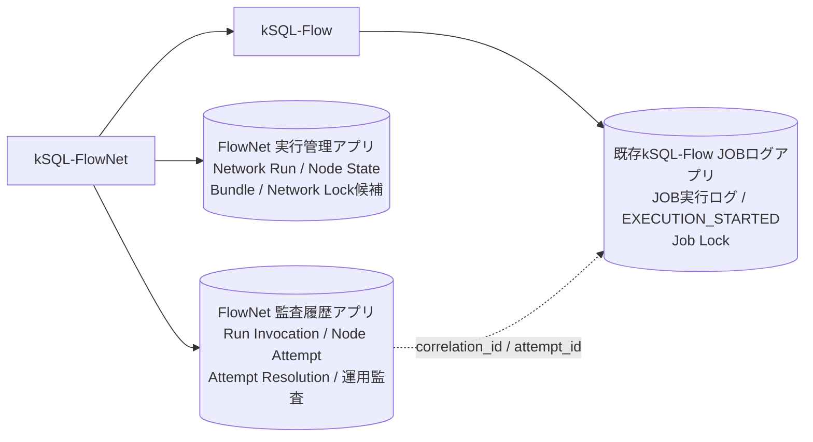

# kSQL-FlowNet Phase 1 Freeze Decision Record

- 状態: **PROPOSED**
- 対象: ジョブネット管理 Phase 1
- 作成日: 2026-08-29
- Accepted への昇格条件: 本書「12. 凍結ゲート」をすべて満たすこと
- 関連仕様: [ジョブネット管理仕様書](./job-network-phase1-spec.md)
- 実行境界: [kSQL-Flow Execution Contract v1](./execution-contract-v1.md)
- 分離判断: [プロジェクト分離ADR](./architecture-separation-adr.md)
- レビュー根拠: [Phase 1仕様レビュー](./phase1-spec-review.md)

---

## 1. 目的

本書は、ジョブネット管理仕様書の「14. 凍結前に残る確認事項」を、次の4種類に分けて管理するArchitecture Decision Recordである。

- `DECIDED`: Phase 1の意味論として採用する
- `PROPOSED`: 推奨案はあるが、実装スパイクまたはレビュー完了前
- `VALIDATION_REQUIRED`: kintone実環境での検証が必要
- `OPERATIONS_REQUIRED`: 保持、権限、移行、復旧の運用決定が必要

本書が`PROPOSED`の間、元仕様は「設計凍結候補」のままとする。未実測事項を保証として扱わず、未決事項がある状態で「リスクを完全に排除した」と表現しない。

---

## 2. 判断一覧

| ID | 状態 | 論点 | 推奨判断 |
| --- | --- | --- | --- |
| D-01 | `DECIDED` | 業務実行と起動の単位 | 同じ業務は同一Network Runを継続し、起動はRun Invocationとして追記 |
| D-02 | `DECIDED` | `--resume` | resume-onlyではなくensure-run semanticsとする |
| D-03 | `DECIDED` | Networkロック粒度 | Phase 1は意図的に`profile + network_id`単位で直列化 |
| D-04 | `DECIDED` | UNKNOWNの履歴 | 元Attemptを上書きせず、Attempt Resolutionを追記 |
| D-05 | `DECIDED` | 実行バンドル | Network Runへ関連付け、resume可能な間は取得可能に保つ |
| D-06 | `DECIDED` | 現行status移行 | status名ではなく現行の発生原因から新status/result_codeへ対応付け |
| D-07 | `PROPOSED` | 永続化の正本 | Node Stateをスケジューラの正、Node Attemptを物理実行の耐久履歴とする |
| D-08 | `PROPOSED` | アプリ構成 | FlowNetの実行管理／監査2アプリと既存kSQL-Flow JOBログアプリの構成を第一候補とし、FlowNet 1アプリ案とスパイク比較 |
| D-09 | `PROPOSED` | 二重書込み | SQL開始前ゲートとrevision付き照合・修復プロトコルを採用 |
| D-10 | `PROPOSED` | canonical lock key | `N1:` / `J1:`等のversion付きbase64url SHA-256形式 |
| D-11 | `DECIDED` | 重複禁止INSERT競合 | 複数プロセス・可能なら複数ホストの実機contract testを実施 |
| D-12 | `OPERATIONS_REQUIRED` | bundle保持 | resume可能期間、archive、外部退避、容量上限を決定 |
| D-13 | `OPERATIONS_REQUIRED` | Node手動解決権限 | UNKNOWN／非冪等FAILEDの認証主体、承認者、証拠、権限分離を決定 |
| D-14 | `OPERATIONS_REQUIRED` | 新旧ロック移行 | 一括切替、二重取得、最低version拒否のいずれかを決定 |
| D-15 | `DECIDED` | CLI所有境界 | Control Planeは`ksql-flownet`、Execution Planeは`ksql-flow` |
| D-16 | `DECIDED` | Nodeとjobの識別 | `node_id`と`job_id`を分離し、Nodeロックは`job_id`から生成 |
| D-17 | `DECIDED` | profile照合 | kSQL-Flowの`describe-profile --json`を正とし、orchestratorはconfigを独自解釈しない |
| D-18 | `DECIDED` | 手動復旧とSKIPPED | 元Attemptを不変とし、手動完遂だけSUCCESSへ解決。SKIPPEDはPhase 1予約値 |
| D-19 | `DECIDED` | 終端Run再実行 | 終端SUCCESS Runの`--rerun-from`を禁止し、correction Runを作る |
| D-20 | `DECIDED` | business key | scheduled periodから決定的に生成し、`max_active_runs`既定1 |
| D-21 | `DECIDED` | 停止スコープ | UNKNOWN／非冪等失敗の子孫だけを停止し、独立系統は継続 |
| D-22 | `PROPOSED` | SQL開始証跡 | kSQL-Flowの耐久`EXECUTION_STARTED`と最終`executionStarted`を分離 |
| D-23 | `PROPOSED` | idempotent検査 | `inspect-job --json`でjob IDと検出可能な非決定要素をbundle作成時に検査 |
| D-24 | `PROPOSED` | 採番と集約更新 | Node State revision採番、canonical key、単一Invocation集約更新 |
| D-25 | `DECIDED` | 製品命名と概念名 | 製品表示名をkSQL-FlowNet、repo／CLIを`ksql-flownet`、npmを`@rex0220/ksql-flownet`とし、Network／Node等の概念名は維持 |
| D-26 | `PROPOSED` | force-unlock所有境界 | Job lockはkSQL-Flowが回復し、FlowNetは直接変更せず停止確認と結果を監査する |
| D-27 | `DECIDED` | 旧run-all移行 | `batch_id`を`run_id`へ変換せず、必要時だけ`legacy_batch_id`付き監査参照として取り込む |
| D-28 | `DECIDED` | read-only CLI | `validate`、`plan`、`status`を外部状態を変更しないControl Planeコマンドとして提供する |
| D-29 | `PROPOSED` | Network lock recovery | FlowNet所有のrenewable leaseとし、heartbeat、lease token、停止確認、監査付き`force-unlock-network`を定義 |
| D-30 | `DECIDED` | 外部ジョブスケジューラ境界 | 外部は論理予定日時による起動、FlowNetはensure-runとDAG順序を担当し、Phase 1ではcron機能を内蔵しない |

---

## 3. 確定するコア意味論

### D-25: 製品名と概念名の分離

製品ブランドと、DAG・永続化スキーマで使う概念名を分離する。

| レベル | 確定名称 |
| --- | --- |
| 製品表示名 | kSQL-FlowNet |
| リポジトリ名 | `ksql-flownet` |
| npmパッケージ | `@rex0220/ksql-flownet` |
| CLIコマンド | `ksql-flownet` |
| 概念名 | Network / Node / Network Run / ジョブネット |

`network_id`、`run_id`、`node_id`等の公開スキーマ・JSONフィールドは、製品名変更を理由に改名しない。文書では製品を指す場合に「kSQL-FlowNet」、コマンド・パッケージ・リポジトリを指す場合にそれぞれのコード表記を使う。

### D-26: force-unlock所有境界

Job lockの所有者はkSQL-Flowのままとし、FlowNetがlockレコードを直接更新・削除してはならない。force-unlockはkSQL-Flowのversion付き回復契約として定義し、旧保持者停止確認を必須にする。FlowNetは認証主体、確認者、理由、証拠、対象、時刻、kSQL-Flow側の結果をNetwork監査へ関連付ける。具体的なCLI、result schema、Exit Code、応答消失時の照会手順がcontract testを通るまでD-26は`PROPOSED`とする。

2026-08-29の追記。参照: `spikes/d-lock-contract/measurements.md`、`spikes/d-lock-contract/results/2026-08-29T10-43-16.516Z-lock-contention.json`。

現行kSQL-FlowのJob lock通常解放は、レコードDELETEではなく、終端status更新、`job_key`の空文字クリア、元キーの`job_key_done`への退避を単一UPDATEで行う。実装根拠は `ksql-flow/src/logapp.ts` の `finishRecord()` である。したがって、本番サービストークンへレコード削除権限を付与しない構成を可能にし、Job lockを含む監査アプリには削除権限を付与しないことを推奨する。

これは通常解放方式の追記であり、D-26のforce-unlock所有境界、旧保持者停止確認、監査、応答消失時のfail-closedを置き換えない。`PROPOSED` を維持する。

### D-27: 旧run-allからの移行境界

旧`run-all --resume`／`--resume-batch`の`batch_id`をPhase 1の`run_id`へ変換しない。旧実行にはbusiness key、不変bundle、Node Stateがないため、同じ業務Runとして安全に継続できない。必要な履歴は`legacy_batch_id`を持つ監査専用データとして参照可能にしてよいが、resume判定へ使用しない。移行後の業務は新しいNetwork Runとして開始する。

### D-28: read-only CLI

`ksql-flownet validate`は定義検証、`ksql-flownet plan`は定義検証に加えてbusiness keyと安定トポロジカル順の表示を行う。`ksql-flownet status`はNetwork lock、Run、Invocation、Node State、active Attempt、reconciliation状態と復旧操作に必要な識別子を返す。3コマンドはNetworkロックを取得せず、Run、Invocation、Node State、Node Attemptを作成・更新しない。`status`は停止を推測せず、秘密情報を出力しない。

### D-29: Network lock recovery所有境界

Network lockはkSQL-FlowNetが所有する。kSQL-FlowはNetwork lockを取得、更新、解放してはならない。

Network lockはジョブネット全体の想定所要時間を固定リースとして使用せず、heartbeatで更新するrenewable leaseとする。Node実行の`batch_timeout_sec`をNetwork leaseへ流用しない。network定義に`network_lock.lease_duration_sec`と`network_lock.heartbeat_interval_sec`を持たせ、少なくとも次を満たす。

- `heartbeat_interval_sec < lease_duration_sec`
- 推奨上限は`heartbeat_interval_sec <= lease_duration_sec / 3`
- FlowNetはkSQL-Flow subprocess実行中もheartbeatを継続する
- heartbeat更新は現在の`lease_token`とrevisionが一致する場合だけ許可する

Network lockには`lock_key`、`owner_invocation_id`、`owner_instance_id`、`lease_token`、`acquired_at`、`heartbeat_at`、`lease_expires_at`、revisionを記録する。FlowNetはNode State更新、Network Run集約更新、次Nodeのsubprocess起動前に、自身の`lease_token`が現在のlockと一致することを確認する。一致しない旧ownerは処理を継続してはならない。

#### heartbeat障害時のdrain protocol

heartbeatが規定回数連続で失敗するか、確認できる残余leaseが安全閾値以下になった時点で、Invocationはローカル制御状態`LEASE_UNCERTAIN`へ入り、drain modeへ移行する。以降は新しいNodeを起動しない。実行中のkSQL-Flow subprocessは原則としてkillせず完走を待つ。自ら強制終了して`UNKNOWN`を作るのは、明示的cancel等の別契約が要求する場合に限定する。

期限超過後もlockレコードのtokenが自分と一致するだけでは、Node State、Network Run集約、Invocation終端を更新してはならない。同じ`lease_token`とrevisionでheartbeatを再更新し、成功応答または再GETで更新成功を確認できた場合だけ、実行中subprocessの結果を永続化できる。結果を保存した後も同じInvocationで次Nodeへ進まず、Invocationを`CANCELLED / NETWORK_LEASE_INTERRUPTED`で終端し、次回ensure-runへ継続を委ねる。

heartbeat再更新を確認できない、または別owner／tokenへ変わっている場合は状態を書き込まない。subprocessの結果ファイルとkSQL-Flow耐久ログをreconciliation材料として保持し、結果を一意に確定できなければNode Attemptを`UNKNOWN`として解決する。

`lease_expires_at`超過はstale候補であり、旧ownerの停止証明ではない。自動回収は、同一ホストPID不在または実行基盤が提供するexecution終了状態など、旧owner停止を確認できる場合だけ許可する。別ホストからの回収では時刻超過だけを停止確認の代用にしない。

Phase 1では停止確認adapterとして少なくとも`local_pid`と`cloud_run_job_execution`を実装する。Cloud Runの場合は`owner_instance_id`へExecutionの完全なresource nameを記録し、Cloud Run Admin API v2のExecution取得結果が成功・失敗・キャンセルのterminal状態である場合だけ停止済みと認める。RUNNING、PENDING、権限不足、通信失敗、未知状態はfail-closedとする。API仕様は[Cloud Run Executions get](https://docs.cloud.google.com/run/docs/reference/rest/v2/projects.locations.jobs.executions/get)を正とし、実行主体に`run.executions.get`だけを含む最小権限を付与する。VPS ownerを別ホストから自動確認できない場合は手動回収を維持する。

heartbeatと停止確認が消費するkintone／外部API callは、kSQL-FlowのNode実行用`max_api_calls`へ含めない。ただしプラットフォーム全体の上限は消費するため、`control_plane_api_calls`として別計測し、heartbeat用の容量を優先確保する。API予算超過を理由にheartbeatを停止してはならない。rate limitまたは到達不能はdrain protocolを発動する。

#### 排他強度と残余リスク

Network lockのtoken照合とNode State等の更新は別レコード操作であり、照合から更新までのTOCTOU窓を完全には除去できない。Job lockは同じ論理`job_id`の重複実行に対する最終防波堤だが、異なるNodeの順序、Network Run集約、Node State整合性は保証しない。このためJob lockを理由にNetwork fencingを省略してはならない。TOCTOU窓はPhase 1の残余リスクとして記録し、障害注入結果とともにrunbookへ残す。

監査付き書込み操作として次を定義する。

```bash
ksql-flownet force-unlock-network <network_id> \
  --profile <profile> \
  --expected-owner-invocation-id <invocation_id> \
  --reason-file <path> \
  --evidence-ref <uri>
```

実行主体は認証環境から取得する。強制回収前に対象lockを再取得し、expected owner、revision、`lease_token`、stale候補、旧owner停止証拠、新しいheartbeatまたはownerがないことを確認する。競合、応答消失、再GET不一致、停止確認不能ではfail-closedとする。

`NETWORK_LOCK_FORCE_RELEASED`監査イベントへ、network、profile、lock key、以前のownerとlease token、認証主体、確認者、理由、証拠、停止確認方法、時刻、結果、回収後revisionを記録する。強制回収はNode Attemptを自動的に`FAILED`または`SUCCESS`へ変更しない。実行中Nodeがあった場合は開始証跡とJob lockを照合し、必要に応じて`UNKNOWN`として解決してからresumeする。

D-29は、lease設定値、heartbeat、stale判定、lease tokenによる旧owner排除、force-unlockの競合・応答消失を実機と障害注入で確認するまで`PROPOSED`とする。

2026-08-29の追記。参照: `spikes/d-lock-contract/measurements.md`、`spikes/d-lock-contract/results/2026-08-29T10-43-16.516Z-lock-contention.json`。

FlowNet所有のNetwork lockでも、通常解放プロトコルは一意キークリアUPDATE方式を第一候補とする。終端・解放情報と一意キーのクリアをrevision付き単一UPDATEにまとめ、通常運用ではDELETEを要求しない。強制回収時も、expected owner、revision、lease token、旧owner停止証拠の確認という既存契約を維持する。

Spike Aでこの方式を実装し、正常解放、revision競合、応答消失、再GET裁定、削除権限なしのサービストークンでの動作を測定する。D-29のrenewable lease、heartbeat、drain、強制回収判断を置き換えず、`PROPOSED` を維持する。

### D-30: 外部ジョブスケジューラとの責務境界

Phase 1のkSQL-FlowNetはcron式、カレンダースケジュール、常駐ポーリング、missed runの自動補完を所有しない。cron、Cloud Scheduler、GitHub Actions、Windows Task Scheduler等を外部Triggerとして扱い、起動時刻、missed run、catch-up、起動リトライの回数・間隔は外部スケジューラが管理する。

定期実行のTriggerは対象期間を表す論理予定日時を`--scheduled-for`へ渡す。同一予定実行を再送またはリトライするときは同じ値を再使用し、リトライ時の現在日時へ置き換えない。FlowNetはその値とnetwork定義からbusiness keyを決定的に生成し、ensure-runとNetworkロックによってNEW／RESUME／NO-OPを判定する。

backfillとcorrectionは暗黙的なcatch-upにせず、明示的なbusiness keyを持つ別の業務実行とする。FlowNet内部のDAG schedulerはNode Stateに基づく依存判定と実行順序を担当し、Phase 1では直列実行する。外部スケジューラと内部DAG schedulerを同一の責務として実装しない。

### D-01: 同一Network Run継続

1つの`profile + network_id + business_key`を1つの業務実行とする。resumeしても`run_id`を変えない。

- CLI・cron等の起動はRun Invocationとして毎回追記する。
- ノードの物理実行はNode Attemptとして毎回採番する。
- 成功済みノードは`SUCCESS`のまま保持し、REUSEレコードを複製しない。
- 定義やas-ofを変える場合は別のbusiness keyで新しいRunを作る。

### D-02: ensure-run semantics

`--resume`はresume-onlyではなく、業務キーに対する冪等なensure-run操作とする。

```text
Networkロック取得
        ↓
profile + network_id + business_keyを検索
        ↓
0件       → NEW
未完了1件 → RESUME
完了済1件 → NO-OP / Exit 0
複数件    → データ不整合 / fail-closed
```

検索してからロックを取ってはならない。0件確認と新規作成の間に別プロセスが入るTOCTOU競合を避けるため、Networkロック取得を先に行う。

初版では「定期実行、ポーラー、`--resume`では`business_key`を明示必須」とした。この入力規則はD-20でSupersededとし、定期実行は`--scheduled-for`とnetwork定義からorchestratorがbusiness keyを生成する。backfill、correction、`business_key_policy.type = explicit`では引き続き明示必須とする。純粋な手動NEWだけは、未指定時にorchestratorが`<network>@manual-<timestamp>`形式を生成してよい。

### D-03: Phase 1のNetworkロック粒度

Phase 1は、同じprofile・networkの異なるbusiness keyも意図的に直列化する。

```text
scope = profile + network_id
```

この制限は安全側の仕様である。business key単位の並行実行は、共有アプリ、Nodeロック、API消費量、同じ更新先に対する意味論を定義したPhase 2以降で検討する。

### D-04: UNKNOWN解決履歴

`status = UNKNOWN`となったNode Attemptは書き換えない。後日の調査結果は独立したAttempt Resolutionとして追記する。

```json
{
  "event_type": "ATTEMPT_RESOLVED",
  "attempt_id": "attempt_...",
  "resolved_outcome": "SUCCESS",
  "evidence_ref": "reconciliation://monthly-close/2026-08/001",
  "service_principal": "ksql-prod-operator",
  "requested_by": "operator@example.jp",
  "approved_by": "supervisor@example.jp",
  "resolved_at": "2026-08-29T10:00:00Z"
}
```

`requested_by`や`approved_by`を自由記述のCLI引数だけで確定してはならない。認証された主体または承認ワークフローから取得する。

### D-05: 実行バンドルとarchive

実行バンドルはRun InvocationではなくNetwork Runへ関連付ける。

実行結果と保管状態を混ぜない。

```json
{
  "execution_status": "SUCCESS",
  "lifecycle_status": "ACTIVE",
  "resume_allowed": true
}
```

- `execution_status`: `CREATED` / `RUNNING` / `SUCCESS` / `FAILED` / `CANCELLED` / `UNKNOWN`
- `lifecycle_status`: `ACTIVE` / `ARCHIVED`
- `resume_allowed = true`のRunは、bundle本体を取得・検証できなければならない。
- bundleを物理削除し、復元可能な外部保管先もないRunは`ARCHIVED`かつ`resume_allowed = false`とする。
- 外部退避する場合はobject version、SHA-256、取得先、定期的な復元確認を保存する。
- archiveしても`execution_status`を`ARCHIVED`へ上書きしない。

### D-06: 現行statusの移行規則

現行statusの名称だけでなく、発生原因と既存`log_detail`から移行する。

| 現行状態・原因 | 新Node State | 新result_code | 備考 |
| --- | --- | --- | --- |
| `SUCCESS` | `SUCCESS` | `OK` | 正常完了 |
| `NO_DATA` | `SUCCESS` | `NO_DATA` | 正常な対象0件。下流の`all_success`を満たす |
| `ABORTED` | `FAILED` | `ASSERT_FAILED` | 現行ではASSERT条件違反。user cancelではない |
| `FAILED` | `FAILED` | 実エラー種別 | `SQL_ERROR` / `API_ERROR` / `AUTH_ERROR`等へ分類 |
| ランナー自身が検知した`TIMEOUT` | `FAILED` | `EXECUTION_TIMEOUT` | ランナーが中断結果を認識している |
| 別実行によるstale回収の`TIMEOUT` | `UNKNOWN` | `LEASE_EXPIRED` | 旧実行の完走・部分適用を確定できない |
| `SKIPPED (filtered)` | 作成しない | Invocationに`LEGACY_FILTERED` | 旧run-allの選抜外として監査移行し、resume可能なPhase 1 Node Stateへ変換しない |
| `SKIPPED (dependency: x)` | `BLOCKED` | `DEPENDENCY_FAILED` | 依存不成立による未着手 |
| `SKIPPED (stop-on-error)` | `CANCELLED` | `BATCH_STOPPED` | グローバル停止方針による未着手 |
| `SKIPPED (batch-timeout)` | `CANCELLED` | `BATCH_TIMEOUT` | バッチ全体停止による未着手 |
| `SKIPPED (LOCKED)` | `WAITING`のまま | Invocationに`LOCK_CONFLICT` | そのNetwork Runのsnapshotでは未実行 |
| 外部からの明示停止 | `CANCELLED` | `USER_CANCELLED` | 認証主体を記録 |

`SKIPPED (LOCKED)`となった単体ジョブの結果を、Network Runの成功として流用しない。snapshot、as-of、business keyが同じとは限らないためである。下流は上流が未確定として待機する。

---

## 4. 永続化モデルの提案

### D-07: Source of Truth

Phase 1では本格的なイベントソーシングを採用しない。

- `Node State`: スケジューラが着手可否を判断する現在状態の正
- `Node Attempt`: 実際に物理実行を開始したか、どう終了したかを示す耐久履歴
- `Run Invocation`: 起動条件、選抜、保持、起動結果の履歴
- `Attempt Resolution`: UNKNOWNを後から解決した監査イベント

Node StateはAttemptだけから完全再構築できるとはみなさない。`WAITING`、`BLOCKED`、`SKIPPED`、trigger rule判定、cancel伝播には、DAG snapshotとInvocation判断が必要だからである。

Node Attemptも「一度作成したら一切更新しないイベント」ではない。次の限定的なlifecycle更新をrevision付きで許可する。

```text
RUNNING (execution_started_at = null)
        ↓ 実行開始直前
RUNNING (execution_started_at = timestamp)
        ↓ 終端確定
SUCCESS / FAILED / CANCELLED / UNKNOWN
```

終端確定後は変更しない。事後判定はAttempt Resolutionへ追記する。

### D-08: アプリ構成

第一候補は、FlowNet用の新規2アプリと既存kSQL-Flow JOBログアプリを組み合わせる構成とする。ここでいう「1アプリ／2アプリ比較」はFlowNetが新設する永続化アプリだけを対象とし、kSQL-Flowが所有する既存JOBログアプリを数に含めない。



#### 実行管理アプリ

- Network Run
- Node State
- 実行バンドル
- Network Lock（第一候補。最終配置はPhase 0スパイクで確定）
- 現在状態の検索、一覧、通知、スケジューリング

#### 監査履歴アプリ

- Run Invocation
- Node Attempt
- Attempt Resolution
- Network Lock強制回収などの運用監査イベント
- 追記履歴、監査、長期保持

#### 既存kSQL-Flow JOBログアプリ

- JOB実行ログと耐久`EXECUTION_STARTED`
- `correlation_id`、`attempt_id`等の相関フィールド
- kSQL-Flowが所有するJob Lock

既存JOBログアプリはFlowNetの新規アプリへ統合しない。FlowNetからJob Lockレコードを直接変更せず、Node AttemptとJOBログは相関IDで追跡する。

Node Stateはサブテーブルではなく、`run_id + node_id`ごとの独立レコードとする。

ただし、FlowNetの2アプリ化とNetwork Lockの配置は実装スパイク後に確定する。次をFlowNet 1アプリ内の別record type案と比較する。

- API呼出し数
- アクセス権分離
- revision競合
- `attempt_key`重複、Attempt INSERT成功応答消失、Node State更新失敗後のreconciliation
- 部分書込みからの復旧
- 検索・一覧・通知
- archiveと保持期間
- テンプレート配布・移行コスト
- Network Lockを実行管理アプリへ含めた場合の競合、ACL、回収操作

「アプリ数が多いほど必ずAPI呼出しが増える」は採用理由にしない。実際のAPI数は書込みプロトコルとレコード件数で測る。

### D-09: 二重書込みプロトコル

#### 実行開始

```text
1. Networkロックを取得する。Nodeロックはorchestratorが取得せず、後段のkSQL-Flow subprocessへ委ねる
2. Node Stateのstatus、revision、active_attempt_idを取得
3. Node Stateの`latest_attempt_no + 1`を候補とし、`run_id + node_id + attempt_no`からcanonicalな`attempt_key`を生成
4. Node AttemptをRUNNINGで作成
   - execution_started_at = null
   - state_revision_before = 2で取得したrevision
5. Node Stateをrevision付きでRUNNINGへ更新
   - active_attempt_id = attempt_id
6. Node Attemptへexecution_started_atをrevision付きで設定
7. kSQL-Flowを起動する。kSQL-FlowがNodeロックを取得し、JOBログの耐久`EXECUTION_STARTED`更新成功を確認
8. 1〜7がすべて成功した場合だけSQLの最初の文を実行
```

5に失敗した場合はSQLを実行しない。Attemptを`CANCELLED / PREPARE_FAILED`で確定する。6の完了を確認できない場合も実行せず、照合対象にする。

kSQL-Flowが有効な`LOCK_CONFLICT`を返した場合もSQLは未実行である。Node Attemptを`CANCELLED / PREPARE_FAILED`で確定し、Node Stateをrevision付きで`WAITING`へ戻す。attempt番号はsubprocess起動試行として保持し、削除・再利用しない。

6の成功直後、kSQL-Flowの耐久`EXECUTION_STARTED`前にプロセスが失われた場合も、起動失敗を別の耐久証跡で確定できなければ安全側に`UNKNOWN`とする。7の成功後はSQL開始の可能性があるため必ず`UNKNOWN`とし、「書込みがなかった」と推測して自動再実行しない。

#### 実行終了

```text
1. Node Attemptをterminal状態へrevision付きで確定
2. Node Stateをrevision付きで同じterminal状態へ更新
   - active_attempt_idが対象attempt_idと一致すること
3. 両方の確定を確認してからNodeロックを解放
```

AttemptがterminalでNode StateがRUNNINGのままなら、次回起動前のreconciliationでAttemptの結果をStateへ反映する。

Node StateがterminalなのにAttemptがRUNNING、active attemptが複数、revision系列が逆転している場合はデータ不整合としてfail-closedする。自動的に成功扱いしない。

#### reconciliation

各Network Runの起動時、DAG評価前に次を検査する。

- `Node State.active_attempt_id`が存在するか
- active AttemptのstatusとStateが整合するか
- terminal Attemptの後に古いStateが残っていないか
- 1ノードに複数のRUNNING Attemptがないか
- UNKNOWN ResolutionがStateへ反映済みか
- Network Run集約状態がNode State集合と一致するか

安全に一意修復できるものだけ自動修復し、それ以外は`RECONCILIATION_REQUIRED`として停止する。自動修復も監査イベントへ記録する。

---

## 5. Canonical lock keyの提案

### D-10: キー形式

Networkキーの候補:

```text
N1:<base64url-no-padding(SHA-256(canonical input))>
```

canonical input:

```text
UTF-8("N1\0" + NFC(profile) + "\0" + NFC(network_id))
```

SHA-256のbase64url表現はpaddingなし43文字で、`N1:`を含む合計は46文字となる。

規則:

- profile、network_id、node_id、job_idにNULを許可しない。
- UnicodeはNFCへ正規化する。
- 大文字小文字を区別する。
- hash algorithm、encoding、canonicalizationを`N1`のversion契約に含める。
- canonical inputの構成要素と実際のlock keyをログに保存する。

Nodeキーをhash化する場合は、`profile + NUL + job_id`をcanonical inputとし、ジョブネット側と単体`run`側を同じ`J1:`アルゴリズムへ同時移行する。`node_id`はDAG上の識別子でありNodeロックの生成材料にしない。片方だけ変更すると相互排他が成立しない。

既存batchロック`{profile}:__batch__`も、必要なら`B1:`として移行対象に含める。

2026-08-29の追記。参照: `spikes/d-lock-contract/measurements.md`。

重複禁止フィールドは実機で64文字まで入力でき、超過時は400 `CB_VA01`、`Enter less than 65 characters.` となることを再確認した。D-10のN1案は `N1:` 3文字とpaddingなしbase64url SHA-256 43文字の合計46文字であり、この実測制限内に収まる。

この記録はキー長の適合性だけを補強する。canonical bytesのtest vector、J1移行、新旧lock protocol移行は未実測である。

### D-14: 新旧versionの切替

新旧キーは互いに競合しないため、旧ランナーと新ランナーを無計画に混在させてはならない。Phase 0で次のいずれかを決定する。

1. 全起動元を止め、旧RUNNINGがないことを確認して一括切替する。
2. 移行期間中、新ランナーが旧キーと新キーの両方を固定順序で取得する。
3. ログアプリに最低lock protocol versionを置き、旧ランナーを開始前に拒否する。

二重取得を選ぶ場合は、全コマンドで同じ取得順序を使用し、deadlock回避と片側取得後のロールバックを試験する。

---

## 6. kintone重複禁止制約への依存

### D-11: 契約表現

次の表現を使用する。

> kintoneの重複禁止制約によるINSERT競合判定を、分散ロック取得の最終裁定として利用する。

「kintoneがCASを公式提供する」「同時INSERTは必ず1件だけ成功することを公式保証する」とは表現しない。

400応答だけでロック競合と断定しない。既存の防御方針を維持する。

```text
INSERT 400
   ↓
同じlock keyを再GET
   ├─ RUNNING holderを確認 → LOCK_CONFLICT
   └─ 確認不能・別原因      → LOCK_UNAVAILABLE / fail-closed
```

### Phase 0 contract test

- barrier同期した2以上のプロセス
- 可能なら異なるホスト・異なる作業ディレクトリ
- 同じlock keyで多数回反復
- 1成功、残り拒否、永続レコード重複0件を確認
- 400後のGETでholderを確認できること
- 成功応答消失、GET遅延、通信断を模擬
- stale回収後に旧保持者が復帰する経路を確認
- `finishRecord()`と回収更新のrevision競合を確認
- ローカルロックあり／なしの経路を分けて記録

試験成功は検証環境での観測であり、公式保証への格上げではない。環境、時刻、回数、レスポンス、残余リスクを記録する。

2026-08-29、kintone検証環境で重複禁止INSERTのcontract testを実施した。結果は検証環境での観測であり、kintoneの公式保証ではない。重複禁止INSERTを分散ロック取得の最終裁定として採用できると判断する。

実行環境は `LAPTOP5 / Windows (win32) / Node v24.14.0 / devenxyfi.cybozu.com / app 4257`、単一ホスト、ローカルロックなしである。results JSONは実行コマンド文字列を保持していないため、以下はJSONと同じworker数・反復数を再現するコマンドとして記録する。

```bash
node --env-file=.env spikes/d-lock-contract/scripts/lock-contention.mjs
node --env-file=.env spikes/d-lock-contract/scripts/lock-contention.mjs --workers 3 --iterations 10
node --env-file=.env spikes/d-lock-contract/scripts/response-loss.mjs
node --env-file=.env spikes/d-lock-contract/scripts/revision-conflict.mjs
node --env-file=.env spikes/d-lock-contract/scripts/stale-reclaim.mjs
```

反復と結果:

- 2 worker × 10反復: INSERT成功10、400 `CB_VA01`拒否10、永続重複0、API 50回、Σ `durationMs` = 10,224.8544 ms、合格
- 3 worker × 10反復: INSERT成功10、400 `CB_VA01`拒否20、永続重複0、API 70回、Σ `durationMs` = 14,482.3754 ms、合格
- 400となった全30件は同じkeyを再GETし、`count=1` とRUNNING holderを確認して `LOCK_CONFLICT` と裁定
- 成功応答消失: API 3回、786.1514 ms。再GETで同一holderを確認し `ACQUIRED_BY_REGET`、合格
- revision競合: API 6回。finish-record更新は200、旧revisionのreclaimer更新は409 `GAIA_CO02`、再GETでfinish-recordを確認、合格
- stale回収後の旧保持者復帰: API 6回。旧revision更新は409 `GAIA_CO02`、再GETでreclaimerとlease identity保持を確認、合格
- 初回2 worker × 10反復ではロック裁定は成功10・拒否10・重複0だったが、cleanup DELETEが全10件403 `GAIA_NO01` となり削除権限不足を発見した。この実行は `passed=false` であり、上記合格集計には含めない

参照results:

- `spikes/d-lock-contract/results/2026-08-29T10-43-16.516Z-lock-contention.json`
- `spikes/d-lock-contract/results/2026-08-29T10-52-31.819Z-lock-contention.json`
- `spikes/d-lock-contract/results/2026-08-29T10-52-32.766Z-response-loss.json`
- `spikes/d-lock-contract/results/2026-08-29T10-52-34.357Z-revision-conflict.json`
- `spikes/d-lock-contract/results/2026-08-29T10-52-35.719Z-stale-reclaim.json`
- `spikes/d-lock-contract/results/2026-08-29T11-05-59.901Z-lock-contention.json`

残余リスクは、複数ホスト、高並列、ネットワーク分断、GET遅延、再GET確認不能分岐が未実測であること。D-14の新旧lock移行は未実施であり、本判断では閉じない。

---

## 7. bundle保持の運用決定

### D-12: 決めること

- kSQL-Flow独自のbundle上限
- kintone添付の実測可能サイズ
- upload/download/hash検証時間
- Runをresume可能とする期間
- 外部immutable storageの有無
- archive後の監査保持期間
- 削除権限と承認
- 定期的な復元試験

10MiBは製品側の暫定候補にできるが、kintoneの公式上限として扱わない。Phase 0で実測し、通常bundleの分布と運用余裕から決める。

最低規則:

> `resume_allowed = true`のRunについて、検証済みbundleを取得不能にする削除を禁止する。

2026-08-29、同じ検証環境とapp 4257で、4KiB / 1MiB / 10MiBを各1回roundtripし、全件でZIP自己検証とSHA-256一致を確認した。API呼出数は各6回、計18回。10MiBではupload 4,301.0974 ms（約4.3秒）、download 7,431.3807 ms（約7.4秒）であり、10MiBはkSQL-FlowNet独自上限候補として実用域と判断する。これはkintoneの公式上限を示さない。

正常download後の1 byteローカル改ざんでは、API 7回のシナリオでhash不一致を検知し、`CORRUPTION_DETECTED_FAIL_CLOSED` となった。

bundle取得契約には、`POST /k/v1/file.json` の `fileKey` が添付専用であることを明記する。添付後にレコードを再GETし、添付フィールド内の新しい `fileKey` を取得してdownloadしなければならない。

実行条件を再現するコマンド（results JSONは実行コマンド文字列を保持しない）:

```bash
node --env-file=.env spikes/b-bundle/scripts/bundle-roundtrip.mjs
node --env-file=.env spikes/b-bundle/scripts/bundle-corruption.mjs
```

参照results:

- `spikes/b-bundle/results/2026-08-29T11-04-00.864Z-bundle-roundtrip.json`
- `spikes/b-bundle/results/2026-08-29T11-04-03.307Z-bundle-corruption.json`

未実施のため残す項目は、添付差替え・削除権限の確認、archive先からの復元、resume可能期間と保持期間の運用、外部immutable storage、監査保持、定期復元試験、通常bundleを含む複数サイズ分布の統計、取得不能時のfail-closedである。

---

## 8. UNKNOWN解決の運用決定

### D-13: 旧コマンド候補（Superseded by D-18）

次の`ksql-flow resolve-unknown`案は、CLI所有境界と非冪等FAILEDの復旧出口を満たさないためD-18で置き換える。履歴として残し、新規実装には使用しない。

```bash
ksql-flow resolve-unknown \
  --run-id netrun_20260829_001 \
  --node-id aggregate_customer \
  --to SUCCESS \
  --reason-file resolution-summary.txt \
  --evidence-ref reconciliation://monthly-close/2026-08/001
```

規則:

- `--resolved-by`の自己申告引数を設けない。
- service principalと人間の依頼者を分けて記録する。
- `--reason`への秘密情報・顧客データ貼付を避け、必要なら管理された証拠への参照を使う。
- 旧保持者の停止確認を必須入力または承認項目にする。
- 非冪等NodeのUNKNOWNは、一者操作だけで自動resume可能にしない。
- 二者承認を要求する場合、別認証主体による独立イベントとして実装する。
- 元AttemptはUNKNOWNのまま保持する。

Phase 1で二者承認基盤を実装しない場合でも、少なくとも認証主体、理由、証拠参照、停止確認、実行時刻を必須記録とする。

### D-13/D-18: 採用コマンド

```bash
ksql-flownet resolve-node \
  --run-id netrun_20260829_001 \
  --node-id aggregate_customer \
  --to SUCCESS \
  --reason-file resolution-summary.txt \
  --evidence-ref reconciliation://monthly-close/2026-08/001
```

対象は`UNKNOWN`または非冪等`FAILED`とする。元Attemptは変更しない。本来の成果物を手動で完成させた`NODE_MANUAL_COMPLETION_CONFIRMED`だけがNode Stateを`SUCCESS`へ進められる。取消・巻戻しだけを表す`NODE_COMPENSATION_COMPLETED`は`SUCCESS`を意味せず、下流を開始しない。非冪等Nodeの`SUCCESS`解決は一者操作を禁止する。

## 8.1 Phase 1レビュー反映判断

### D-15〜D-17: 境界と識別

- Control PlaneのCLIは`ksql-flownet`、Execution PlaneのCLIは`ksql-flow`とする。
- DAG nodeは`node_id`と`job_id`を持ち、NodeロックはSQL論理job IDと一致検証済みの`job_id`から生成する。
- resolved profileの正本は`ksql-flow describe-profile --json`とし、Network Run作成時とresume時にcanonical hashを照合する。

### D-18〜D-21: 復旧とensure-run

- `SKIPPED`はPhase 1予約値とし、定義、CLI、移行処理から生成しない。成功条件は全Node State `SUCCESS`とする。
- 終端`SUCCESS` Runは再オープンせず、`--rerun-from`を拒否する。再処理はcorrection business keyで新しいRunを作る。
- 定期実行は`--scheduled-for`とnetwork定義のtimezone・期間境界からbusiness keyを生成する。`max_active_runs`のPhase 1既定値は1とする。
- `UNKNOWN`または非冪等失敗のNodeと子孫だけを停止し、依存しない系統は継続する。集約状態はNode State集合から別途算出する。

### D-22〜D-24: 実装プロトコル

- Execution Resultへ`executionStarted`を持たせるが、耐久証跡の正本にはしない。kSQL-Flowは最初のSQL文直前にkintone JOBログへ`EXECUTION_STARTED`をrevision付きで永続化する。
- kSQL-Flowの`inspect-job --json`でjob IDと検出可能な非決定要素を取得し、bundle作成時にmanifestへ固定する。静的検査だけで冪等性を証明したとは扱わない。
- attempt番号はNode Stateの`latest_attempt_no + 1`から候補を作り、canonicalな`attempt_key`の重複禁止制約で裁定する。履歴のmax検索へ依存しない。
- Network Run集約状態はNetworkロックを保持するInvocationだけが全Node Stateから計算し、revision付きで更新する。

---

## 9. 棄却する案

### resumeごとに新しいNetwork Runを作る

同じ業務実行が分断され、REUSEレコードが増殖するため不採用。

### Node Stateをサブテーブルへ集約する

`run_id + node_id`単位の検索、revision、ロック、更新、保持管理が難しくなるため不採用。

### Node AttemptだけからNode Stateを再構築する

WAITING、BLOCKED、SKIPPED、Invocation選抜、trigger ruleをAttemptだけでは復元できないため、Phase 1では不採用。

### Attemptをterminal結果で上書きしてUNKNOWNを消す

実行時に結果不明だった事実が失われるため不採用。Resolutionを追記する。

### bundleを固定日数で無条件削除する

resume可能性と矛盾するため不採用。lifecycleとresume可否を明示する。

### `ABORTED → CANCELLED`

現行ABORTEDはASSERT違反による業務異常であり、user cancelではないため不採用。

### 全`TIMEOUT → UNKNOWN`

ランナーが認識したexecution timeoutと、別実行が回収したorphanでは確定度が異なるため不採用。

### `profile:__net__:`にSHA-256 hex全文を連結する

prefix込みで現行の実測64 UTF-16単位を超えるため不採用。

### 重複禁止制約をCASと呼ぶ

公式のCAS契約ではなく、設計上依存する一意制約の競合判定であるため不採用。

---

## 10. Phase 0の実装スパイク

### Spike A: 1アプリ対2アプリ

同じ3ノードDAGを両方式で実装し、次を測る。

- NEW成功時のAPI数
- 中間Node失敗時のAPI数
- resume時のAPI数
- Node Attempt成功後にNode State更新を失敗させた復旧
- revision競合
- ログアプリ一時到達不能
- 一覧、通知、ACL、archive

結果には測定環境とAPI payload数を残す。

### Spike B: 実行バンドル

- 小・中・上限候補サイズのZIPをupload/download
- hash一致と破損検知
- 添付差替え・削除権限
- archive先からの復元
- snapshot取得不能時のfail-closed

### Spike C: status移行

現行ログfixtureから新状態へ変換し、全理由をテーブル駆動テストする。単にstatus文字列だけを入力せず、`record_type`、`log_detail`、実行主体、timeout発生源を含める。

### Spike D: lock protocol

D-11のcontract testを実施し、旧・新キー移行方式を検証する。

### Spike E: Execution Contract拡張

- `describe-profile`のcanonical JSONと秘密情報除外
- `inspect-job`のjob ID、非決定要素code、承認済み例外manifest
- Node Attempt開始マーカー成功後、JOB `EXECUTION_STARTED`前のクラッシュ
- JOB `EXECUTION_STARTED`更新成功後、最初のSQL文前のクラッシュ
- JOB更新応答消失と再GET
- 結果JSONの`executionStarted`との整合

### Spike F: Network lock recovery

- lease設定とheartbeat間隔の境界値
- subprocess実行中のheartbeat継続
- FlowNetプロセスkill後のheartbeat停止とstale候補化
- kintone一時到達不能時のdrain mode、新規Node起動停止、実行中subprocess完走
- 期限超過後のheartbeat再更新成功／失敗／owner変更
- 旧`lease_token`を持つownerの状態更新・次Node起動拒否
- 同一ホストと別ホストでの旧owner停止確認
- Cloud Run Executionのterminal／non-terminal／API障害判定
- heartbeatと停止確認のControl Plane API call測定
- `force-unlock-network`のowner／revision競合と応答消失後の再GET
- 回収後のNode Attempt照合と、未確定時の`UNKNOWN`化

---

## 11. ADRの変更規則

- 判断を変更するときは、以前の判断を削除せず「Superseded」と理由を残す。
- `PROPOSED`を`DECIDED`へ変えるときは、レビュー記録またはスパイク結果を参照する。
- `VALIDATION_REQUIRED`を閉じるときは、実行コマンド、環境、回数、結果、残余リスクを記録する。
- `OPERATIONS_REQUIRED`を閉じるときは、責任者、権限、保持期間、復旧手順を明記する。
- 実装が判断と異なる場合、仕様を黙って実装へ合わせず、ADRを再審議する。

---

## 12. 凍結ゲート

次のすべてを満たすまで、本ADRを`ACCEPTED`へ変更しない。

- [ ] D-07: Source of TruthとNode Attempt lifecycleをレビュー承認
- [ ] D-08: 1アプリ／2アプリのスパイク結果から構成を決定
- [ ] D-09: 開始・終了・reconciliationの障害注入試験に合格
- [ ] D-10: canonical bytesとキーversionをtest vectorで固定
- [x] D-11: kintone実環境の同時INSERT contract testを完了 (2026-08-29実測、単一ホスト。詳細はD-11節)
- [ ] D-12: bundle容量、保持、archive、復元試験を決定
- [ ] D-13: UNKNOWN解決権限と監査主体を決定
- [ ] D-14: 新旧lock protocolの移行方式を決定
- [ ] D-15: 全文書とCLI helpのControl Plane／Execution Planeコマンド所有境界を統一
- [ ] D-16: `node_id != job_id`を含む単体runとのNodeロック競合試験に合格
- [ ] D-17: `describe-profile`のsnapshot照合と不一致fail-closed試験に合格
- [ ] D-18: 非冪等FAILEDの手動完遂と取消補償を区別し、SKIPPED予約化を状態表・移行・試験へ反映
- [ ] D-19: 終端SUCCESS Runへの`--rerun-from`拒否試験に合格
- [ ] D-20: 月跨ぎ・年跨ぎ・timezone境界と`max_active_runs`試験に合格
- [ ] D-21: UNKNOWN経路停止、独立系統継続、集約UNKNOWNの試験に合格
- [ ] D-22: 耐久`EXECUTION_STARTED`の障害注入試験に合格
- [ ] D-23: `inspect-job`のjob ID・非決定要素検査と例外manifestを確定
- [ ] D-24: revision採番、canonical key、集約状態の単一更新主体を障害注入試験で確認
- [ ] D-26: kSQL-Flowのforce-unlock回復契約、旧保持者停止確認、FlowNet監査、応答消失時のfail-closed試験に合格
- [ ] D-27: 旧`batch_id`が`run_id`へ変換されず、監査参照からresumeできないことを確認
- [ ] D-28: `validate`／`plan`／`status`が外部状態を変更せず、`status`が復旧に必要な識別子を返すことを確認
- [ ] D-29: 正常な長時間RunでNetwork leaseを維持し、heartbeat障害時はdrainし、FlowNetプロセスkill後はruntime停止確認と監査を伴って安全に回収できる
- [ ] 現行status移行fixtureの全ケースに合格
- [ ] ensure-runの0件／未完了1件／完了1件／複数件試験に合格
- [ ] snapshot破損・取得不能時のfail-closed試験に合格
- [ ] stale検知から旧保持者停止確認、突合、解決、resumeまでの復旧訓練に合格
- [ ] ジョブネット経由と単体実行経由のNodeロック競合試験に合格
- [ ] 未保証事項と残余リスクを仕様・runbookへ反映

全項目完了後、次を同じ変更で行う。

1. 本ADRを`ACCEPTED`へ変更する。
2. 関連仕様を「Phase 1 凍結版」へ変更する。
3. 実装version、schema version、log app template versionを記録する。
4. 受入試験結果と復旧訓練記録への参照を追加する。
