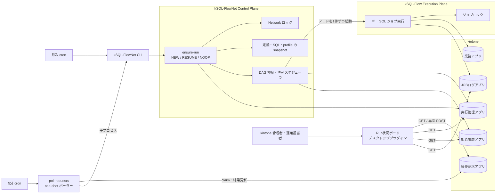
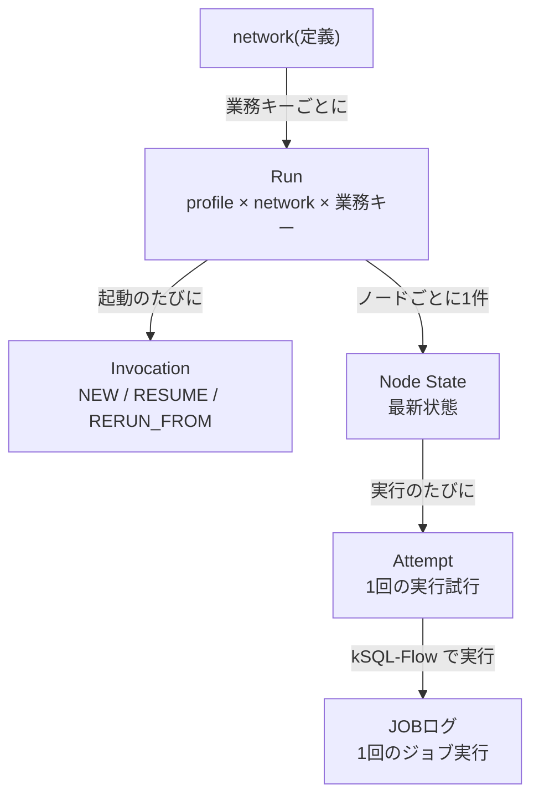
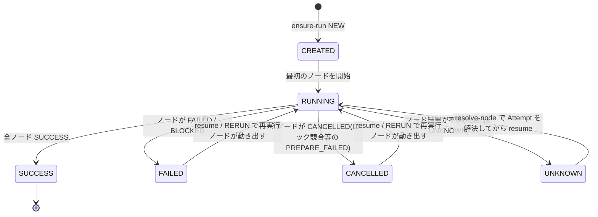
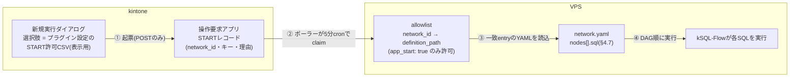
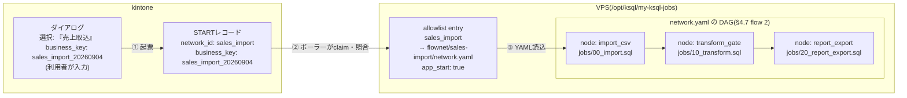
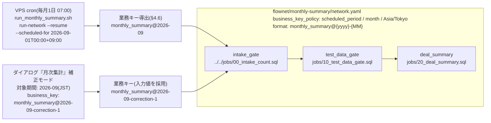

# kSQL-FlowNet 統合仕様

## 1. 概要とアーキテクチャ

### 1.1 目的

kSQL-FlowNet は、複数の kSQL-Flow ジョブを network として管理する Control Plane である。
network 定義の検証、業務キー単位の Run 一意性、DAG の依存関係、実行順序、再開、Network ロック、状態保存、監査を担当する。

現在の実装は DAG を安定したトポロジカル順に並べ、実行可能なノードを 1 件ずつ直列実行する。
分岐・合流を定義できるが、ノードの並列実行は行わない。

### 1.2 構成



図は全体像を示す。矢印は主な呼出しと書込の向きであり、各要素の詳細は §3(アプリ)、§5(CLI)、§6(ポーラー)、§7(プラグイン)で説明する。用語は §1.4 を参照。

月次 cron と5分ポーラーの cron は kSQL-FlowNet の外部にある。
kSQL-FlowNet 自体はカレンダースケジュール、cron 式、常駐ポーリング、未実行期間の自動補完を持たない。

### 1.3 kSQL-Flow との責務分担

| 領域 | kSQL-FlowNet | kSQL-Flow |
| --- | --- | --- |
| 実行単位 | network、Run、Node、Attempt | 単一 SQL ジョブ |
| 定義 | network YAML と DAG | SQL とジョブ定義 |
| 順序制御 | 依存関係を判定し直列起動 | 担当しない |
| 排他 | profile と network 単位の Network ロック | profile と job 単位のジョブロック |
| 再開 | Run snapshot と Node State に基づく | ジョブ内部の途中再開は行わない |
| 実行 | subprocess として kSQL-Flow を起動 | SQL 解析、kintone 読書き、チャンク処理 |
| 結果判定 | Execution Result と JOBログを照合して Attempt を確定 | Execution Result と耐久実行ログを生成 |
| 永続化 | 実行管理、監査履歴、操作要求 | JOBログ、業務データ |

Control Plane と Execution Plane の CLI 境界は [kSQL-Flow Execution Contract v1](./execution-contract-v1.md) に従う。

### 1.4 用語と実行単位の階層

本書で使う主な用語。英字表記(Run、network、Node、Attempt 等)は kintone のレコード種別や CLI 出力と一致させるため、カタカナに置き換えない。

| 用語 | 意味 |
| --- | --- |
| profile | kSQL-Flow の接続先環境の名前(例: `prod`)。kSQL-Flow 設定ファイルで定義され、Run の一意性・ジョブロック・Network ロックの各キーの先頭要素になる |
| network | 複数の kSQL-Flow ジョブを DAG として束ねた定義(1 YAML)。§4 |
| Node(ノード) | network の 1 ステップ。1 つの SQL ファイルを 1 回の kSQL-Flow ジョブとして実行する単位。§4.5 |
| 業務キー(business key) | 「どの処理単位の実行か」を表す文字列(例: `monthly_summary@2026-09`)。同じ profile・network・業務キーの Run は 1 つしか存在できず、これが重複実行防止の基礎になる。§4.3 |
| Run | profile・network・業務キーで一意な実行単位。状態を持ち、失敗しても同じ Run を再開(resume)できる |
| Invocation | Run に対する CLI の 1 回の起動(cron・ポーラー・手動)。1 つの Run は新規起動と再開で複数の Invocation を持つ |
| Node State | Run 内の各ノードの最新状態(1 ノードにつき 1 件) |
| Attempt | ノードの 1 回の実行試行。再試行・再開のたびに増える(1 ノードに複数件) |
| activity | 未終端 Run が「いま動いているか」の判定: `LIVE`(実行中)/`STOPPED`(停止 hold 中)/`IDLE`(未開始)/`INTERRUPTED`(実行主体が失われた)。§5.5 |
| Network ロック | profile・network 単位の実行排他。期限付き lease を heartbeat で更新する。§4.4 |
| ジョブロック | kSQL-Flow 側の profile・job 単位の排他。§1.3 |
| 操作要求 | 人がアプリのレコードとして出す指示(START / RERUN / STOP / RELEASE)。ポーラーが claim して処理する。§6 |
| fail-closed | 判定不能・条件未確認のときは実行も更新もしない方針。本製品全体の基本姿勢 |

実行単位の階層:



Run と Node State は実行管理アプリ、Invocation と Attempt は監査履歴アプリ、JOBログは kSQL-Flow のアプリに保存される(§3)。

読み方の目安: 導入・環境構築は §2・§3、network 定義を書くときは §4、運用と障害対応は §5〜§6 と §10 の運用文書、画面の使い方は §7 を読む。

## 2. 動作環境

### 2.1 kintone

| 項目 | 要件 |
| --- | --- |
| サービス | cybozu.com 上の kintone。アプリの API トークン、プラグイン、関連レコード(REFERENCE_TABLE)、アプリテンプレートを使用する |
| アプリ | 実行管理・監査履歴・操作要求(本製品が管理)。JOBログアプリは kSQL-Flow が所有し、本製品は参照のみ行う。作成はアプリテンプレートのインポート、または [templates/](../templates/README.md) の Console スクリプトで行う |
| プラグイン | PC(デスクトップ)画面向け。実行管理アプリのカスタマイズビュー「00_Run状況」とレコード詳細画面で動作する。モバイル画面は対象外 |
| ブラウザ | kintone が対応する PC ブラウザ |

API トークンに必要な権限:

| アプリ | 用途 | 権限 |
| --- | --- | --- |
| 実行管理 | CLI・ポーラー | レコード追加・閲覧・編集 |
| 監査履歴 | CLI・ポーラー | レコード追加・閲覧・編集 |
| 操作要求 | ポーラー | レコード閲覧・編集(追加・削除は付けない) |
| JOBログ | CLI(Attempt 照合) | レコード閲覧 |

レコード削除権限はどのトークンにも不要である。ロック解放は削除ではなく UPDATE(tombstone)で行う。

### 2.2 実行サーバー(VPS 等)

CLI・cron・ポーラーを動かすサーバーを 1 台用意する。kintone へ HTTPS で発信できれば足り、受信ポートの開放は不要である。

| 項目 | 要件 |
| --- | --- |
| OS | Linux(本番実績: VPS + cron)。開発・検証は Windows でも動作する |
| ランタイム | Node.js 22 以上 |
| 導入物 | kSQL-FlowNet(本リポジトリのビルド)と kSQL-Flow CLI(実行プレーン。`KSQL_FLOW_BIN` で指定) |
| スケジューラ | cron 2 本: 定期実行の `run-network --resume --scheduled-for …` と、5 分間隔の `poll-requests` |
| 設定ファイル | 操作要求 allowlist(YAML・絶対パスで配置)、kSQL-Flow の接続設定 |

主な環境変数(すべて実行サーバー側。トークン値はリポジトリ・文書へ書かない):

| 変数 | 内容 |
| --- | --- |
| `KSQL_FLOWNET_BASE_URL` / `KSQL_FLOWNET_PROFILE` | kintone ベース URL とプロファイル名 |
| `KSQL_FLOWNET_STATE_APP_ID` / `KSQL_FLOWNET_STATE_API_TOKEN` | 実行管理アプリ |
| `KSQL_FLOWNET_AUDIT_APP_ID` / `KSQL_FLOWNET_AUDIT_API_TOKEN` | 監査履歴アプリ |
| `KSQL_FLOWNET_REQUEST_APP_ID` / `KSQL_FLOWNET_REQUEST_API_TOKEN` / `KSQL_FLOWNET_REQUEST_ALLOWLIST_PATH` | ポーラー(操作要求アプリと allowlist) |
| `KSQL_FLOW_BIN` / `KSQL_FLOW_BIN_ARGS` / `KSQL_FLOW_CONFIG` / `KSQL_FLOW_WORKDIR` | kSQL-Flow CLI の起動方法・設定・作業ディレクトリ |
| `KSQL_FLOW_LOG_APP_ID` / `KSQL_FLOW_LOG_API_TOKEN` | JOBログアプリ(閲覧) |
| `KSQL_FLOWNET_IO_DIR` / `KSQL_FLOWNET_IO_RETENTION_DAYS` | CSV 入出力の IO ルート(絶対パス。YAML の `nodes[].inputs` または `nodes[].outputs` を持つ network で必須。入力ファイルは `<IO_DIR>/in`、出力ファイルは `<IO_DIR>/out` 配下)と、入力ファイルの保持日数(既定 90)。§4.5、[CSV入出力の運用](./csv-io-operations.md) |
| 任意: `KSQL_FLOWNET_REQUESTED_BY` / `KSQL_FLOWNET_HOST` / `KSQL_FLOWNET_OWNER_INSTANCE_ID` / `KSQL_FLOW_GRACE_PERIOD_MS` / `KSQL_FLOWNET_REQUEST_HEARTBEAT_INTERVAL_MS` / `KSQL_FLOWNET_REQUEST_STALE_AFTER_MS` | 相関表示・ロック所有者識別・停止猶予・ポーラー間隔の上書き |

運用上の注意:

- トークンを含む環境ファイルはサーバー管理者のみ読める権限(例: root 所有 0600)で置く
- Windows から環境ファイルへ追記すると CRLF が混入し、allowlist 読込失敗の原因になる(実測)。LF で保存する
- cron の発火時刻はサーバーのタイムゾーンに従う。`scheduled_for` からの期間キー導出は network 定義の `timezone`(例: Asia/Tokyo)で行われるため、サーバーのタイムゾーンには依存しない

## 3. kintone アプリ構成

### 3.1 アプリ一覧

| アプリ | 所有者 | 用途 | 主な書込主体 |
| --- | --- | --- | --- |
| kSQL-FlowNet 実行管理 | kSQL-FlowNet | Run、Node State、Network ロック、停止 hold | CLI |
| kSQL-FlowNet 監査履歴 | kSQL-FlowNet | Invocation、Attempt、解決、運用監査 | CLI |
| kSQL-FlowNet 操作要求 | 人と kSQL-FlowNet | START、RERUN、STOP、RELEASE の依頼と結果 | 人・プラグイン、ポーラー |
| kSQL-Flow JOBログ | kSQL-Flow | 単一ジョブの実行ログ、耐久開始証跡、ジョブロック | kSQL-Flow |

JOBログアプリは kSQL-FlowNet から参照するだけであり、kSQL-FlowNet のテンプレート用 Console スクリプトでは作成しない。

### 3.2 実行管理アプリ

実行管理アプリは複数のレコード種別を `record_type` で区別する。
`record_key` は重複禁止の文字列1行フィールドである。

| `record_type` | 意味 | 主なフィールド |
| --- | --- | --- |
| `NETWORK_RUN` | profile、network、業務キーの実行単位 | `run_id`, `network_id`, `business_key`, `max_active_runs`, `status`, `lifecycle_status`, `resume_allowed`, `as_of`, `definition_schema_version`, `definition_sha256`, `source_bundle_sha256`, `source_bundle_attachment`, `resolved_profile_snapshot`, `resolved_profile_sha256`, `ksql_flow_version`, `engine_version`, `dialect`, `created_at`, `started_at`, `finished_at`, `updated_at` |
| `NODE_STATE` | Run 内のノードの最新状態 | `run_id`, `revision`, `node_state_id`, `node_state_key`, `node_id`, `job_id`, `status`, `latest_attempt_no`, `active_attempt_id`, `idempotent`, `trigger_rule`, `blocked_by`, `status_reason`, `started_at`, `finished_at`, `updated_at` |
| `NETWORK_LOCK` | profile と network の renewable lease | `lock_key`, `profile`, `owner_invocation_id`, `lease_token`, `status`, `status_reason`, `lease_expires_at`, `heartbeat_at`, `revision` |
| `CANCEL_REQUEST` | Run 単位の停止 hold | `run_id`, `status_reason` |

`CANCEL_REQUEST.status_reason` は次の内容を持つ JSON 文字列である。

| キー | 意味 |
| --- | --- |
| `state` | `REQUESTED` / `ACCEPTED` / `RELEASED` |
| `requested_by` | 停止要求者の相関値 |
| `reason` | 停止理由 |
| `requested_at` | 停止要求日時 |
| `accepted_at` | スケジューラが停止を受理した日時 |
| `released_at` | hold 解除日時 |
| `release_reason` | 解除理由 |
| `release_requested_by` | 解除要求者の相関値 |

Run の状態は `CREATED` / `RUNNING` / `SUCCESS` / `FAILED` / `CANCELLED` / `UNKNOWN` である。
Node State はこれに `WAITING` / `BLOCKED` / `SKIPPED` を加えた集合を使用する。

Run の状態遷移:



Run の状態はノード状態の集約で決まる(上の行ほど優先)。resume 後の状態もこの集約で再計算される。

| Node State の条件 | Run の状態 |
| --- | --- |
| `UNKNOWN` のノードがある | `UNKNOWN` |
| `RUNNING` のノードがある | `RUNNING` |
| `FAILED` または `BLOCKED` のノードがある | `FAILED` |
| `CANCELLED` のノードがある | `CANCELLED` |
| 全ノードが `SUCCESS` | `SUCCESS` |
| いずれでもない(`WAITING` / `SKIPPED` のみ) | 未開始なら `CREATED`、開始済みなら `RUNNING` |

STOP(停止 hold)は Run の状態を変えない。次ノード境界で Invocation が `CANCELLED / STOP_REQUESTED` として閉じ、Run は `RUNNING` のまま activity が `STOPPED` になる(§5.5)。`SUCCESS` は終端であり、同じ Run を再実行できない(§9)。

### 3.3 監査履歴アプリ

監査履歴アプリも `record_type` でレコード種別を区別する。

| `record_type` | 意味 | 主なフィールド |
| --- | --- | --- |
| `RUN_INVOCATION` | CLI の1回の起動 | `run_id`, `invocation_id`, `mode`, `requested_by`, `host`, `started_at`, `finished_at`, `status`, `result_code`, `selected_node_ids`, `preserved_node_ids`, `blocked_node_ids`, `reason` |
| `NODE_ATTEMPT` | ノードの1回の実行試行 | `run_id`, `node_attempt_id`, `attempt_key`, `node_id`, `job_id`, `invocation_id`, `attempt_no`, `status`, `result_code`, `state_revision_before`, `execution_started_at`, `runner_execution_started_at`, `execution_id`, `finished_at`, `duration_sec`, `error_message`, `read_count`, `written_count`, `last_successful_chunk_no`, `last_written_key` |
| `ATTEMPT_RESOLUTION` | `UNKNOWN` または非冪等 `FAILED` の手動解決 | `event_type`, `attempt_id`, `resolved_outcome`, `reason`, `evidence_ref`, `service_principal`, `requested_by`, `approved_by`, `resolved_at` |
| `OPERATION_AUDIT` | reconciliation、ジョブロック解放記録、Network ロック強制解放 | `run_id`, `result_code`, `reason`, `resolved_at`。操作固有の全内容は `reason` の JSON に保存 |

`RUN_INVOCATION.mode` は `NEW` / `RESUME` / `RERUN_FROM` である。
`selected_node_ids`、`preserved_node_ids`、`blocked_node_ids` は JSON 配列文字列として保存する。
運用監査の詳細は `reason` に JSON 文字列として保存する種別がある。

### 3.4 操作要求アプリ

テンプレートが追加する全業務フィールドは次のとおりである。
kintone の `$id`、`$revision`、`作成者`、`作成日時` もポーラーの識別、競合制御、相関、処理順に使用する。

| フィールド | 型 | 必須設定 | 所有・用途 |
| --- | --- | --- | --- |
| `request_type` | ドロップダウン | 必須 | 人が `RERUN` / `STOP` / `RELEASE` / `START` を指定 |
| `run_id` | 文字列1行 | 任意 | START 以外でポーラーが必須検証。START では空 |
| `network_id` | 文字列1行 | 任意 | START の対象 network |
| `business_key` | 文字列1行 | 任意 | START の明示キーまたは補正キー |
| `scheduled_for` | 日時 | 任意 | START の対象日時 |
| `rerun_from_node` | 文字列1行 | 任意 | RERUN の開始ノード。RERUN 以外では禁止 |
| `reason` | 文字列複数行 | 必須 | 操作理由 |
| `request_state` | ドロップダウン | 必須 | 初期値 `REQUESTED`。機械が状態遷移 |
| `claimed_at` | 日時 | 任意 | ポーラーが claim した日時 |
| `claimed_host` | 文字列1行 | 任意 | claim したホスト |
| `claim_heartbeat_at` | 日時 | 任意 | 子プロセス処理中の生存確認 |
| `result_code` | 文字列1行 | 任意 | 終端結果コード |
| `result_message` | 文字列複数行 | 任意 | 終端結果の説明 |

`run_id`、`network_id`、`business_key`、`rerun_from_node`、`result_code` の入力上限は 128 Unicode 文字である。
`reason` と `result_message` は 65,535 Unicode 文字、`claimed_host` は 256 Unicode 文字まで検証する。

### 3.5 テンプレート配布と関連レコード

本番配布は、実行管理、監査履歴、操作要求、JOBログの4アプリをまとめた kintone アプリテンプレートを使用する。
アプリテンプレートのインポート時にはアプリ間参照が移行先のアプリへ張り替わる。

**所有と配布は別である。** JOBログアプリの所有者(スキーマの正・書込主体)は kSQL-Flow であり、本製品の Console スクリプトは JOBログを作成しない(§2.1・§3.1)。それでも配布テンプレートに JOBログを含めるのは、実行管理アプリの関連レコード `related_job_logs` が JOBログを参照しており、4アプリを1テンプレートでインポートすることで参照が自動で張り替わるためである。既存の JOBログアプリを使う場合は、インポート後に関連レコードの参照先をそのアプリへ付け替える。

実行管理アプリの `NETWORK_RUN` 詳細には次の関連レコード一覧を配置する。

| フィールド | 参照先 | 結合条件 | 表示件数 |
| --- | --- | --- | --- |
| `related_audit_events` | 監査履歴 | `run_id = run_id` | 10 |
| `related_requests` | 操作要求 | `run_id = run_id` | 5 |
| `related_job_logs` | JOBログ | `run_id = correlation_id` | 10 |

プラグインはこの3フィールドの `relatedApp.app` をフォームフィールド API で読み、アプリ ID を自動検出する。
設定画面で ID を明示した場合は明示値を優先する。

## 4. network 定義

### 4.1 YAML の全体形

```yaml
schema_version: 1
network_id: monthly_jobs
description: 月次ジョブ
business_key_policy:
  type: scheduled_period
  period: month
  timezone: Asia/Tokyo
  format: "{network_id}@{yyyy}-{MM}"
max_active_runs: 1
network_lock:
  lease_duration_sec: 180
  heartbeat_interval_sec: 60
nodes:
  - id: extract
    job_id: extract_customer
    sql: jobs/extract.sql
    depends_on: []
    trigger_rule: all_success
    idempotent: true
```

未知プロパティは禁止する。YAML の重複キーもエラーにする。
`retry`、timeout、並列度など、このスキーマにないノードフィールドは指定できない。

### 4.2 ルートフィールド

| フィールド | 必須 | 型・値 | 意味 |
| --- | --- | --- | --- |
| `schema_version` | 必須 | 整数 `1` | 定義スキーマ版 |
| `network_id` | 必須 | 識別子 | network の論理 ID |
| `description` | 任意 | 文字列 | 説明 |
| `business_key_policy` | 必須 | object | 業務キー規則 |
| `max_active_runs` | 任意 | 1以上の整数、既定 `1` | 異なる業務キーの未完了 Run を保持できる数。**同時実行の並列度ではない** — Network ロックは profile・network 単位なので、複数 Run が存在しても Invocation は常に直列実行される |
| `network_lock` | 必須 | object | Network lease の時間設定 |
| `nodes` | 必須 | 1件以上の配列 | DAG ノード |

識別子は1〜128文字で、`:`、NUL、予約値 `__net__` を禁止する。
ロックキー生成時は NFC 正規化後の Unicode コードポイント数も128以下でなければならない。

### 4.3 業務キーポリシー

| `type` | 必須フィールド | 入力規則 |
| --- | --- | --- |
| `explicit` | `type` | `--business-key` が必須。`--scheduled-for` は禁止 |
| `scheduled_period` | `type`, `period`, `timezone`, `format` | `--scheduled-for` または明示 `--business-key` を使用 |

`scheduled_period.period` は `day` または `month`、`timezone` は IANA timezone である。
`format` で使用できるプレースホルダーは `{network_id}`、`{yyyy}`、`{MM}`、`{dd}` だけである。

| period | 必須プレースホルダー | 禁止 |
| --- | --- | --- |
| `day` | `{yyyy}`, `{MM}`, `{dd}` | 未対応プレースホルダー |
| `month` | `{yyyy}`, `{MM}` | `{dd}`、未対応プレースホルダー |

### 4.4 Network ロック

| フィールド | 規則 |
| --- | --- |
| `lease_duration_sec` | 1以上の整数 |
| `heartbeat_interval_sec` | 1以上の整数、lease 未満、かつ lease の3分の1以下 |

### 4.5 ノード

ノードとは network(DAG)の 1 ステップであり、**1 つの SQL ファイルを 1 回の kSQL-Flow ジョブとして実行する単位**である。SQL ファイル内の複数文(SELECT・ASSERT・UPSERT 等)は 1 ノードとして一括実行され、文単位ではノードにならない。ノードは 3 つの識別子を持ち、役割が異なる:

| 識別子 | 役割 |
| --- | --- |
| `id` | DAG 内での名前。`depends_on` の参照先で、Node State / Attempt の `node_id` になる |
| `job_id` | kSQL-Flow 側のジョブ名。SQL ヘッダの `-- @ksql name:` と一致させる。ジョブロック `{profile}:{job_id}` の名前空間(§4.7) |
| `sql` | 実行するファイル(network YAML からの相対パス) |

実行時は、ノード 1 つにつき Node State レコードが 1 件でき、実行のたびに Node Attempt レコードが追加される(§3.2)。§4.1 の例では `id: extract` のノードが `jobs/extract.sql` を job `extract_customer` として実行する。

| フィールド | 必須 | 型・値 | 意味 |
| --- | --- | --- | --- |
| `id` | 必須 | 識別子 | network 内で一意な Node ID |
| `job_id` | 必須 | 識別子 | SQL が宣言する kSQL-Flow job ID と一致させる |
| `sql` | 必須 | 空でない文字列 | network YAML からの相対 SQL パス |
| `depends_on` | 必須 | 識別子配列 | 依存する Node ID |
| `trigger_rule` | 必須 | `all_success` | `none_failed` と `all_done` は予約済みだが現在は拒否 |
| `idempotent` | 必須 | boolean | 自動再試行、RERUN、START の安全判定に使用 |
| `inputs` | 任意 | source名から相対patternへのobject | `<KSQL_FLOWNET_IO_DIR>/in` 配下のCSV入力 |
| `outputs` | 任意 | sink名から相対patternへのobject | `<KSQL_FLOWNET_IO_DIR>/out` 配下のCSV出力 |

自己依存、依存の重複、未知 Node への依存、循環を禁止する。
`validate` は参照 SQL が読める通常ファイルであることも確認する。

`inputs`のplaceholderは`{business_key}`と`{profile}`だけ、`outputs`はそれらに加えて`{run_id}`と`{node_id}`を許可する。validatorの許可集合は文脈別であり、出力専用placeholderを入力へ使用できない。patternは絶対path、NUL、`.` / `..` segment、未知または未閉じplaceholderを拒否する。解決値はUTF-8 percent encodingした単一path segmentとして扱う。

出力先の未存在directoryはFlowNetがIO rootから1段ずつ作成し、各段のsymlink/junctionを拒否する。既存の出力fileは正常であり、同一Runの`--rerun-from`でも同一pathをkSQL-Flowへ渡して全量置換する。出力path違反はsubprocessを起動せず、Node Attemptを`FAILED / OUTPUT_PATH_REJECTED`で確定する。

入力fileは最初の読取時にsha256をNode Attemptのbaselineとして記録し、resume / rerun-fromで**再実行対象になる入力ノード**について同一バイトであることを要求する(SUCCESS済みで保持されるノードは照合しない)。不一致は`INPUT_FILE_MUTATED`、不在は`INPUT_FILE_MISSING`、Run作成からの保持期限(既定90日)超過は`INPUT_RETENTION_EXPIRED`で拒否する。fileの配置・取り出し手順は[CSV入出力の運用](./csv-io-operations.md)を参照。

### 4.6 業務キー導出

| policy | CLI 入力 | 採用結果 |
| --- | --- | --- |
| `explicit` | business key のみ | 指定値をそのまま採用 |
| `explicit` | scheduled-for あり | 拒否 |
| `scheduled_period` | scheduled-for のみ | timezone で暦日に変換し、format を展開 |
| `scheduled_period` | business key のみ | 指定値をそのまま採用 |
| `scheduled_period` | 両方 | **指定 business key を採用**。scheduled-for は Run の `as_of` に保持 |
| `scheduled_period` | 両方なし | 拒否 |

この表は CLI 共通のキー導出規則である。操作要求アプリからの START には、対象期間を監査可能にするため §6.5 の追加制約を適用し、`scheduled_period` で business key を明示する場合(補正キー)は `scheduled_for` も必須とする(欠けると `AS_OF_UNDEFINED`)。CLI ではこの組合せを許可する。

`--scheduled-for` は実在する ISO 8601 日時で、`Z` または明示 offset が必要である。
秒は省略でき、秒を指定する場合は0〜59、offset は最大 `+14:00` / `-14:00` である。

業務キーは空文字、制御文字、128 UTF-16 code unit 超を禁止する。
Run の正準キー生成ではさらに `:`、NUL、予約値 `__net__` を禁止し、NFC 正規化後128 Unicode 文字以内を要求する。

`run-network` の新規手動実行だけは例外として、`--resume`、`--resume-run`、`--business-key`、`--scheduled-for` のいずれもない場合に `<network_id>@manual-<UTC timestamp>` を生成し、明示 business key として上記関数へ渡す。
`plan` はこの補完を行わない。

### 4.7 サーバー上のフォルダー構成(複数 network)

`nodes[].sql` は **network YAML のあるディレクトリからの相対パス**で解決される。ジョブ資材(network 定義・SQL・kSQL-Flow 設定)は 1 つの git リポジトリにまとめ、サーバーへ clone して配置する(本番実績構成)。複数 network を運用する場合の推奨レイアウト:

```
/opt/ksql/
├── ksql-flownet/                      # kSQL-FlowNet本体(clone+build)
├── io/                                # KSQL_FLOWNET_IO_DIR(CSV入出力 — csv-io-operations.md)
│   ├── in/
│   └── out/
└── my-ksql-jobs/                      # ジョブ資材リポジトリ(cron・ポーラーのcwd)
    ├── ksql.config.json               # kSQL-Flowプロファイル・logical app定義
    ├── .env                           # kSQL-Flow用トークン(0600・git管理外)
    ├── jobs/                          # network横断で共用するSQL(共用がある場合のみ)
    │   └── 00_intake_count.sql
    ├── flownet/
    │   ├── monthly-summary/           # flow 1: 月次集計(3 SQL・1本は共用)
    │   │   ├── network.yaml           #   network_id: monthly_summary
    │   │   └── jobs/
    │   │       ├── 10_test_data_gate.sql
    │   │       └── 20_deal_summary.sql
    │   ├── sales-import/              # flow 2: CSV取込→検査→出力(3 SQL)
    │   │   ├── network.yaml           #   network_id: sales_import
    │   │   └── jobs/
    │   │       ├── 00_import.sql
    │   │       ├── 10_transform.sql
    │   │       └── 20_report_export.sql
    │   └── stock-check/               # flow 3: 在庫検査(2 SQL)
    │       ├── network.yaml           #   network_id: stock_check
    │       └── jobs/
    │           ├── 00_extract.sql
    │           └── 10_assert.sql
    ├── run_monthly_summary.sh         # 定期実行の起動スクリプト(定期flow毎に1本)
    └── run_stock_check.sh
/root/.ksql-flownet.env                # FlowNet環境変数(root所有0600)
/root/flownet-request-allowlist.yaml   # 操作要求allowlist(全networkを絶対パスで列挙)
```

flow 1 の `network.yaml` のノード参照は次のようになる(専用SQLは `jobs/…`、共用SQLは `../../jobs/…`):

```yaml
nodes:
  - id: intake_gate
    job_id: ms_intake_gate
    sql: ../../jobs/00_intake_count.sql   # 共用SQL
    depends_on: []
    trigger_rule: all_success
    idempotent: true
  - id: test_data_gate
    job_id: ms_test_data_gate
    sql: jobs/10_test_data_gate.sql       # 専用SQL
    depends_on: [intake_gate]
    trigger_rule: all_success
    idempotent: true
  - id: deal_summary
    job_id: ms_deal_summary
    sql: jobs/20_deal_summary.sql
    depends_on: [test_data_gate]
    trigger_rule: all_success
    idempotent: true
```

allowlist には 3 flow を絶対パスで列挙する:

```yaml
networks:
  - network_id: monthly_summary
    definition_path: /opt/ksql/my-ksql-jobs/flownet/monthly-summary/network.yaml
  - network_id: sales_import
    definition_path: /opt/ksql/my-ksql-jobs/flownet/sales-import/network.yaml
    app_start: true                    # ボードからのSTARTを許可するflowだけ明示
  - network_id: stock_check
    definition_path: /opt/ksql/my-ksql-jobs/flownet/stock-check/network.yaml
```

配置規則:

- **1 network = 1 YAML。** ボード・ポーラーから使う network はすべて allowlist へ `definition_path`(絶対パス)で登録する
- **SQL の置き場所は参照範囲で決める。** 複数 network で共用する SQL は共有 `jobs/` に置き、network YAML からの相対パス(上の構成例では `../../jobs/…`)で参照する。その network 専用の SQL は network フォルダー配下の `jobs/` に置き、他 network から参照しない(変更影響を network 内に閉じる)
- **`job_id` は profile 内で名前空間を共有する**(ジョブロック `{profile}:{job_id}`・64 UTF-16 単位以内 — §9)。別 network に同じ `job_id` を与えると同一ロックを取り合う。同じ SQL・同じ書込先を共有する意図がある場合以外は network ごとに一意にする
- **cron は network ごとに 1 行**(定期実行の起動スクリプト)。`poll-requests` のポーラーは 1 本で全 network を担当する
- cron・ポーラーはジョブ資材リポジトリを cwd として起動する(`KSQL_FLOW_CONFIG` が相対パスのため)
- 定義・SQL の変更は git 経由で配置する(サーバー上で直接編集しない)。resume は Run 作成時に保存された bundle(`source_bundle_attachment` — §3.2)の SQL を再実行するため、配置後の変更は既存 Run に影響しない

## 5. CLI コマンド

### 5.1 コマンド一覧

| コマンド | 引数・オプション | 動作 |
| --- | --- | --- |
| `validate <network>` | network パス1個 | YAML、DAG、業務キーポリシー、ロック設定、SQL ファイルを read-only 検証 |
| `plan <network>` | `--scheduled-for <timestamp>`, `--business-key <key>` | 業務キーと安定トポロジカル実行順を表示。外部書込なし |
| `run-network <network>` | `--business-key`, `--scheduled-for`, `--resume`, `--resume-run`, `--rerun-from`, `--json`, `--ksql-flow-bin`, `--ksql-flow-config`, `--ksql-flow-workdir` | Run を確保し、直列スケジューラで実行 |
| `poll-requests` | `--check` のみ任意 | one-shot で要求を処理。`--check` は構成・定義・要求アプリ GET のみ |
| `resolve-node` | 下表 | `UNKNOWN` または非冪等 `FAILED` ノードを証跡付きで解決 |
| `record-job-unlock` | 下表 | kSQL-Flow のロック解放結果 JSON を監査へ関連付け |
| `force-unlock-network <network_id>` | 下表 | stale Network ロックを確認情報と監査付きで強制解放 |
| `cancel-run` | `--run-id`, `--release`, `--reason-file` | Run hold を要求、または解除 |
| `status <network_id>` | `--profile`, `--run-id`, `--business-key`, `--json` | ロック、Run、activity、reconciliation を read-only 参照 |

全コマンドは成功時 exit code 0、引数不正または処理失敗時 1 を返す。
`--help` / `-h` はヘルプ、`--version` / `-V` は package version を表示する。

### 5.2 run-network

| オプション | 規則 |
| --- | --- |
| `--resume` | 導出した業務キーの既存未完了 Run を再開可能にする |
| `--resume-run <run_id>` | Run ID を直接選ぶ。`--resume`、`--scheduled-for`、`--business-key` と併用不可 |
| `--rerun-from <node_id>` | 指定ノードと子孫を再実行。`--resume` または `--resume-run` が必要 |
| `--json` | stdout を1行 JSON にする |
| `--ksql-flow-bin <path>` | kSQL-Flow 実行コマンドを環境変数より優先 |
| `--ksql-flow-config <path>` | kSQL-Flow 設定パスを環境変数より優先 |
| `--ksql-flow-workdir <path>` | 実行用一時展開先を環境変数より優先 |

`--resume` は「新しい Run を作り直す」指定ではない。
同じ profile、network、business key の Run を検索し、保存済み bundle と profile snapshot を検証して、成功済みノードを保持しながら未完了部分を続行する。
冪等な `FAILED` / `CANCELLED` と `BLOCKED` は再評価される。
`UNKNOWN` と実行済みの非冪等ノードは自動再実行しない。
`--resume-run` は保存済み Run の業務キーを使うため、業務キー入力を受け付けない。
一方、`--resume` は既存 Run を検索する業務キーを `--business-key` または `--scheduled-for` から解決する必要がある。

`--rerun-from` は指定ノードとその子孫を対象にする。
対象内に未解決 `UNKNOWN`、または実行済み `idempotent: false` がある場合は拒否する。

再実行の 3 方式の違い:

| 方式 | 同じ Run か | 業務キー | 何を実行するか | 入口 |
| --- | --- | --- | --- | --- |
| resume(`--resume` / `--resume-run`) | 同じ Run | 変わらない | 未完了・失敗した部分だけを続行。成功済みノードは保持 | `--resume` 付きの定期 cron、ボードの RERUN 要求、CLI |
| rerun-from(`--rerun-from <node>`) | 同じ Run | 変わらない | 指定ノードとその子孫を、成功済みでも再実行 | ボードの RERUN 要求(上級入力)、CLI |
| 補正キー(correction) | **別の Run** | 変わる(例: `…@2026-09-correction-1`) | 全ノードを最初から実行。SUCCESS 済みの期間を再集計したいとき | ボードの新規実行(補正モード)、CLI の `--business-key` + `--scheduled-for` |

`SUCCESS` で終端した Run への resume は `NOOP_ALREADY_SUCCESS`(exit 0)で何も実行せず、rerun-from は `RERUN_FROM_SUCCESS_RUN` で拒否される(exit 1)。どちらもノードを再実行しないため、再集計は補正キーで行う(§9)。

### 5.3 ensure-run の裁定

| 結果・コード | 条件 | 挙動 |
| --- | --- | --- |
| `NEW` | 同じ正準 Run キーが存在せず、上限・ロック・事前検査を通過 | Run、Node State、Invocation、snapshot を作成して実行 |
| `RESUME` | 明示 resume で既存 Run が再開可能 | 保存済み snapshot を使って続行 |
| `NOOP` | 同じ業務キーの Run が `SUCCESS`、かつ rerun-from なし | Invocation を作らず exit 0 |
| `RUN_ALREADY_EXISTS` | resume を指定せず同じ業務キーの未完了 Run が存在 | Invocation を作らず拒否。既存 Run ID を `blocked_run_ids` に返す |
| `MAX_ACTIVE_RUNS` | 別業務キーの active・resume可能・非SUCCESS Run 数が上限以上 | 新規 Run を作らず拒否。阻害 Run ID を返す |
| `LOCK_CONFLICT` | 同じ profile・network の有効な Network lease が存在 | fail-closed で拒否 |
| `RUN_ON_HOLD` | `CANCEL_REQUEST` が `REQUESTED` または `ACCEPTED` | resume を拒否 |

同一 Run の最終一意性は `profile + network_id + business_key` から作る正準 `record_key` の重複禁止 INSERT で裁定する。

NEW の作成は kintone にトランザクションがないため、次の順序と自己修復で原子性を補う:

| 順序 | 処理 | 途中失敗時 |
| --- | --- | --- |
| 1 | bundle(network.yaml・SQL)を添付ファイルとしてアップロード | Run 未作成。一時添付は kintone 側で破棄される |
| 2 | **Run レコードを重複禁止 INSERT(コミットポイント)** | ここで初めて Run が存在する。以後は「既存 Run」として扱われる |
| 3 | 添付を読み戻して sha256 を検証し、各ノードの Node State(`WAITING`)を作成 | 不足分は次回起動(NEW 拒否後の `--resume`)時に同じ関数が補完する。既存 Node State が bundle と食い違う場合は `RUN_SNAPSHOT_MISMATCH` で拒否 |
| 4 | Invocation を作成して実行開始 | Invocation 未作成なら監査に起動記録が残らないが、Run は `CREATED` のまま残る。次回 `--resume` で通常どおり Invocation が作られる |

手順 2 以降で失敗した Run は `status --json` の `reconciliation.inconsistencies[]` で検出でき、`--resume` で続行するか、続行しないなら `resolve-node` / 打ち切り裁定で終端させる。

### 5.4 run-network の JSON 出力

```json
{
  "outcome": "NEW | RESUME | NOOP | REJECTED",
  "run_id": "string | null",
  "invocation_id": "string | null",
  "aggregate_status": "string | null",
  "invocation_result_code": "string",
  "retry_brake_node_ids": ["node_id"],
  "blocked_run_ids": ["run_id"]
}
```

`retry_brake_node_ids` は、同じ空でない failure kind が末尾から3回以上連続したノードを示す。
`PREPARE_FAILED` の `CANCELLED` はこの連続数に含めない。
JSON モードでは事前拒否も stdout に上記スキーマで返し、process exit code は 1 になる。

### 5.5 status と JSON 出力

`--run-id` と `--business-key` は相互排他である。
どちらも省略すると Run 一覧の要約、指定すると1件の詳細を返す。

```json
{
  "network_id": "string",
  "profile": "string",
  "lock": "NetworkLockStatusWithStaleCandidate | null",
  "runs": [
    {
      "run_id": "string",
      "business_key": "string",
      "status": "CREATED | RUNNING | SUCCESS | FAILED | CANCELLED | UNKNOWN",
      "resume_allowed": true,
      "lifecycle_status": "ACTIVE | ARCHIVED",
      "created_at": "string",
      "started_at": "string | null",
      "finished_at": "string | null",
      "updated_at": "string"
    }
  ]
}
```

| JSON フィールド | 内容 |
| --- | --- |
| `network_id`, `profile` | 検索範囲 |
| `lock` | `record_id`, owner IDs, heartbeat、lease、revision、`stale_candidate`。なければ `null` |
| `runs[]` | Run ID、業務キー、状態、resume可否、lifecycle、各時刻、activity |
| `runs[].invocations[]` | 詳細指定時のみ。Invocation ID、mode、status、result code |
| `runs[].node_states[]` | 詳細指定時のみ。Node 状態、理由、冪等性、最新/実行中Attemptの状態とresult code |
| `runs[].reconciliation.inconsistencies[]` | 詳細指定時のみ。不整合 code、Node、detail、Attempt IDs |
| `runs[].recovery_identifiers` | `resolve-node`、`force-unlock-network`、`run-network --resume-run` に渡す識別子 |

activity は未終端 Run だけに付き、停止 hold があれば `STOPPED`、有効 lease の owner Invocation が当該 Run に属すれば `LIVE`、未開始なら `IDLE`、それ以外は `INTERRUPTED` となる。

### 5.6 運用コマンドの必須引数

| コマンド | 必須引数 | 任意引数・補足 |
| --- | --- | --- |
| `resolve-node` | `--run-id`, `--node-id`, `--to SUCCESS\|FAILED\|CANCELLED`, `--reason-file`, `--evidence-ref`, `--stop-confirmed-by`, `--stop-evidence-ref` | `--manual-completion` と `--compensation` は相互排他。`--approved-by` 任意 |
| `record-job-unlock` | `--result-file`, `--run-id`, `--node-id`, `--reason-file`, `--evidence-ref`, `--stop-confirmed-by` | result file は `LOCK_RECOVERY_RESULT` JSON |
| `force-unlock-network` | `<network_id>`, `--profile`, `--expected-owner-invocation-id`, `--reason-file`, `--evidence-ref`, `--stop-confirmed-by`, `--stop-evidence-ref`, `--stop-method` | owner、lease失効、証跡を再確認して解放 |
| `cancel-run` | `--run-id`, `--reason-file` | `--release` なしで hold 要求、ありで解除 |

これらのコマンドと `validate`、`plan`、`poll-requests` は `--json` を実装していない。

## 6. 操作要求とポーラー

### 6.1 状態機械

| 現在状態 | 遷移 | 主体 | 条件 |
| --- | --- | --- | --- |
| `REQUESTED` | `ACCEPTED` | ポーラー | revision を指定した claim PUT に成功 |
| `REQUESTED` | `REJECTED` | ポーラー | レコード構造または入力検証が不正 |
| `ACCEPTED` | `DONE` | ポーラー | 操作が受理され、確定した結果を書ける |
| `ACCEPTED` | `REJECTED` | ポーラー | 事前条件不成立、子起動失敗、結果不明など |

`REQUESTED` では claim・結果フィールドがすべて空でなければならない。
`ACCEPTED` では `claimed_at`、`claimed_host`、`claim_heartbeat_at` がすべて入り、結果フィールドは空である。
終端状態では空でない `result_code` が必要である。

ポーラーは `REQUESTED` を作成日時、レコード ID の昇順で既定100件まで取得する。
claim は取得時 revision を使うため、多重起動時も1台だけが処理を取得する。

### 6.2 heartbeat と stale

子プロセスの実行中は既定60秒ごとに `claim_heartbeat_at` を更新する。
heartbeat 更新に失敗しても子プロセスを kill せず、警告を記録して結果を待つ。

`ACCEPTED` が既定15分に kintone DATETIME 精度余裕60秒を加えた時間を超えた場合、stale 候補になる。
RERUN / STOP / RELEASE は対象 Run、START は再導出した業務キーで Run を照合し、LIVE owner がないと確認できた場合だけ `REJECTED / STALE` にする。
status を取得できない、Run を一意に照合できない、LIVE の可能性がある場合は更新しない。
STALE は実行有無と結果が不明という意味であり、自動再実行しない。

### 6.3 request_type 別の受理条件と処理

| 種別 | 受理条件 | 実行内容 | 成功側の代表 code |
| --- | --- | --- | --- |
| `RERUN` | Run が allowlist 内で一意、`CREATED/RUNNING/FAILED/CANCELLED`、ACTIVE、resume可、非STOPPED、非LIVE | `run-network --resume-run`。指定時は `--rerun-from` も渡す | Invocation の result code、`RETRY_BRAKE` |
| `STOP` | Run が非終端、未hold | `cancel-run` で次ノード境界の hold を要求 | `STOP_REQUESTED` |
| `RELEASE` | Run activity が `STOPPED` | `cancel-run --release`。自動 resume はしない | `RELEASED` |
| `START` | run_id 空、network許可、全ノード冪等、キー規則一致 | resume を付けず `run-network --json` を起動 | Invocation の result code、`NOOP_ALREADY_SUCCESS` |

STOP は実行中 SQL を中断しない。現在のノード完走後、次ノード境界で hold を受理する。
RELEASE は hold を解除するだけであり、その場で Run を再開しない。次回の外部 cron は再開し得る。

### 6.4 START の三重ゲート

| ゲート | 判定場所 | 必須条件 |
| --- | --- | --- |
| 1. 起票権限 | kintone | 操作要求アプリへレコード追加できる |
| 2. network allowlist | ポーラー | 対象 entry に boolean の `app_start: true` がある |
| 3. 冪等性 | network 定義 | 全ノードが明示的に `idempotent: true` |

`app_start` の省略は `false` である。
`app_start: false` でも、その network の既存 Run に対する RERUN / STOP / RELEASE は allowlist 検索対象になる。
START は network 定義を準備時と子起動直前に再読込し、gate から起動までの差を狭める。

### 6.5 START のキー規則

| network policy / 用途 | `business_key` | `scheduled_for` | ポーラーの処理 |
| --- | --- | --- | --- |
| `scheduled_period` 定期キー | 空 | 必須 | 対象日時から定期キーを導出 |
| `scheduled_period` 補正 | 必須 | 必須 | 指定キーを採用し、日時を `as_of` に使用 |
| `explicit` 任意キー | 必須 | 空 | 指定キーを採用 |
| `explicit` で日時あり | 任意 | 入力あり | `KEY_POLICY_MISMATCH` |
| `scheduled_period` で補正キーだけ | 必須 | 空 | `AS_OF_UNDEFINED` |

`scheduled_for` は offset 付きの実在日時として正規化する。
プラグインの datetime-local 入力は日本時間として扱い、分単位の UTC ISO 文字列へ変換する。

### 6.6 allowlist YAML

```yaml
networks:
  - network_id: monthly_jobs
    definition_path: C:/srv/jobs/networks/monthly.yaml
    app_start: true
  - network_id: maintenance_jobs
    definition_path: C:/srv/jobs/networks/maintenance.yaml
    app_start: false
```

ルートには空でない `networks` 配列だけを置く。
各 entry で許可するキーは `network_id`、`definition_path`、`app_start` だけである。
network ID は重複不可、definition path は絶対パス、定義内の network ID と一致させる。

### 6.7 result_code 一覧

| code | 意味 |
| --- | --- |
| `REQUEST_INVALID` | 要求レコードの型、必須値、状態と機械フィールドの組合せが不正 |
| `REQUESTED_BY_INVALID` | 作成者コードから要求相関値を作れない、または長すぎる |
| `RUN_NOT_FOUND` | allowlist 内のどの network にも Run がない |
| `RUN_ID_AMBIGUOUS` | 同じ Run ID が複数の許可 network に一致 |
| `STATUS_UNAVAILABLE` | 受理前 status を確認できない |
| `RUN_STATUS_NOT_RERUNNABLE` | RERUN 対象の Run 状態が許可外 |
| `RUN_NOT_RESUMABLE` | ACTIVE でない、または resume が無効 |
| `RUN_ON_HOLD` | RERUN 対象が停止 hold 中 |
| `RUN_LIVE` | RERUN 対象に生存中 Invocation owner がいる |
| `RUN_TERMINAL` | STOP 対象が終端済み |
| `RUN_ALREADY_ON_HOLD` | STOP 対象が既に hold 中 |
| `RUN_NOT_ON_HOLD` | RELEASE 対象が hold 中でない |
| `RUN_ID_NOT_ALLOWED` | START に run_id が指定された |
| `NETWORK_NOT_ALLOWED` | allowlist 外、または `app_start` が有効でない |
| `NETWORK_DEFINITION_INVALID` | 定義を再読込・検証できない、または ID 不一致 |
| `NETWORK_NOT_IDEMPOTENT` | START 対象に非冪等ノードがある、または冪等性を確認できない |
| `KEY_POLICY_MISMATCH` | policy と business key / scheduled-for の組合せが不正 |
| `AS_OF_UNDEFINED` | scheduled policy の補正キーに対象日時がない |
| `INVALID_TIMESTAMP_FORMAT` | scheduled-for が offset 付き実在日時でない |
| `RUN_ALREADY_EXISTS` | START と同じ業務キーの未完了 Run が存在 |
| `MAX_ACTIVE_RUNS` | active Run 数が network 上限に達した |
| `LOCK_CONFLICT` | Network ロックが競合 |
| `NOOP_ALREADY_SUCCESS` | 同じ業務キーの成功済み Run があり実行を省略 |
| `STOP_REQUESTED` | hold 要求を書込み済み |
| `RELEASED` | hold を解除済み |
| `RETRY_BRAKE` | Invocation は作成されたが連続失敗ブレーキ対象がある |
| `CHILD_SPAWN_FAILED` | CLI 子プロセスを開始できない |
| `CHILD_EXECUTION_FAILED` | 子処理が結果を返す前に失敗 |
| `CHILD_RESULT_INVALID` | `run-network --json` の出力を検証できない |
| `CANCEL_RUN_REJECTED` | cancel-run が非0終了、または操作を完了できない |
| `STALE` | claim 後の実行有無・結果を確定できない |

Invocation が作成された run-network の結果では、上表以外の `invocation_result_code` もそのまま `result_code` に保存する。
**要求の `DONE` は要求処理の終端を表し、Run の `SUCCESS` を意味しない。** Run の結果は `result_code`(Invocation の result code)とボードの Run 状態で確認する。

## 7. ボードプラグイン

### 7.1 対象と基本動作

Run状況プラグインはデスクトップ専用である。mobile bundle はない。
実行管理アプリのカスタマイズビュー `00_Run状況` と `NETWORK_RUN` 詳細画面を拡張する。
画面は補助表示であり、判定不能または競合時は `status --json` を正として確認する。

### 7.2 `00_Run状況` のセクション

| セクション | 対象 | 上限・表示 |
| --- | --- | --- |
| `START要求` | `REQUESTED/ACCEPTED` と最近の `DONE/REJECTED` START | セッション中の折りたたみ状態を保持。終端はレコード ID 降順10件 |
| `進行中のRun` | `SUCCESS/FAILED/CANCELLED/UNKNOWN` 以外 | activity、根拠、状態、業務キー、操作 |
| `終了済み・対応が必要なRun` | ACTIVE の `FAILED/CANCELLED/UNKNOWN` | 更新日時降順20件。残件数も表示 |
| `最近の終了Run（直近10件）` | `SUCCESS/FAILED/CANCELLED/UNKNOWN` | レコード ID 降順10件 |

ツールバーには `新規実行`、処理待ち START 件数へのリンク、判定時刻、再読込を表示する。
操作要求アプリ ID が解決できない場合は新規実行、操作ボタン、pending 表示を無効にする。

### 7.3 activity と操作ボタン

| Run 状態・activity | 表示する操作 |
| --- | --- |
| `CREATED/RUNNING` + `LIVE` | 停止要求 |
| `CREATED/RUNNING` + `STOPPED` | 解除要求 |
| `CREATED/RUNNING` + `INTERRUPTED` | リラン要求 |
| `CREATED/RUNNING` + `IDLE` | なし |
| `FAILED/CANCELLED` | リラン要求。ただし ACTIVE かつ resume可の場合だけ |
| `SUCCESS` | なし |
| `UNKNOWN` | 二次対応者へ連絡、Run ID コピー |
| 判定材料不正・不整合 | 操作を出さず CLI status を案内 |

同じ Run に `REQUESTED/ACCEPTED` の要求があれば、操作ボタンの代わりに最古要求への pending リンクを表示する。
pending GET に失敗した場合は警告を出すが、起票直前にも重複確認する。

RERUN / STOP / RELEASE ダイアログは理由を必須とし、確認画面を経て単票 POST する。
FAILED / CANCELLED の詳細画面だけ `rerun_from_node` の上級入力を表示する。
STOP では実行中 SQL が完走すること、RELEASE では停止要求者・理由と次回 cron が再開し得ることを表示する。

### 7.4 新規実行ダイアログ

| 入力モード | 画面ラベル | 必須入力 |
| --- | --- | --- |
| `scheduled` | 定期キー（対象期間のみ） | network、対象期間、理由 |
| `correction` | 補正（補正キー+対象期間） | network、対象期間、business key、理由 |
| `explicit` | 任意キー（業務キーのみ） | network、business key、理由 |

START許可CSVが設定されている場合、network はグループ対応コンボボックスになる。
表示名と network ID が異なる選択肢では選択中の network ID を補助表示する。
末尾の `その他(自由入力)` で一覧外の network ID も入力できるが、サーバー側 allowlist の判定は迂回できない。

CSV の入力モードは選択時の初期値になる。
business key テンプレートがある場合、補正モードでは network と対象期間から未編集の business key を自動設定する。任意キーモードには対象期間がないため、`{年}` / `{月}` / `{日}` を含むテンプレートは適用せず空欄にし、`{ネットワークID}` だけのテンプレートに限り適用する。
対象期間は日本時間の datetime-local として入力し、対象期間欄を business key 欄より上に置く。

ダイアログを開いた時だけ `START要求実績(DONE)` と `Run実績` を独立取得し、各最大500件から重複を除いた参考候補を表示する。
候補取得失敗時も自由入力できる。
起票前の重複キー照合では、kintone クエリ結果を JavaScript の完全一致で再判定する。

#### ダイアログと VPS 上のジョブの対応

ダイアログはジョブを直接実行しない。**操作要求アプリへ START レコードを1件 POST するだけ**であり、実際に動くジョブは VPS 側の設定が決める。両者は `network_id` という1つのキーで結ばれる:



- **プラグインの START 許可 CSV は表示用の写し**である。ダイアログの選択肢名(ネットワーク名)・初期入力モード・business key テンプレートを決めるだけで、実行可否は決めない
- **実行の正は VPS の allowlist**である。CSV に載っていても allowlist の該当 `network_id` に `app_start: true` がなければ `NETWORK_NOT_ALLOWED` で拒否される(§6.4 の三重ゲート)
- どの SQL が動くかは、allowlist の `definition_path` が指す `network.yaml` の `nodes[].sql`(§4.7 のフォルダー構成)で決まる。ダイアログ側には SQL の情報は存在しない
- したがって新しい flow を画面から起動できるようにする手順は、(1) VPS へ network.yaml と SQL を配置(§4.7)、(2) allowlist へ `app_start: true` で登録、(3) プラグイン設定の CSV へ表示行を追加 — の3点セットになる。CSV と allowlist の `network_id` が一致していることを必ず確認する

#### 具体例: 「売上取込」を画面から実行する

§4.7 の flow 2(`sales_import`・3 SQL)を例にする。プラグイン設定の START 許可 CSV に次の行があるとする:

```
売上取込, sales_import, 任意キー
```

利用者がダイアログで「売上取込」を選び、business key(例: `sales_import_20260904`)を入力して起票すると、次の対応で VPS 上の 3 本の SQL が順に実行される:



画面の入力と VPS 側の実体の対応:

| 画面での選択・入力 | 決めている場所 | VPS 側で対応する実体 |
| --- | --- | --- |
| 選択肢名「売上取込」 | プラグイン CSV 1列目(表示専用) | なし(表示名は VPS に存在しない) |
| network | CSV 2列目 `sales_import` | allowlist の `network_id: sales_import` entry |
| 入力モード「任意キー」が初期選択 | CSV 3列目 | network.yaml の `business_key_policy: explicit` と一致している必要がある(§6.5) |
| business_key `sales_import_20260904` | 利用者の入力(CSV 4列目テンプレートで初期値を補助できるが、`{年}{月}{日}` を含むテンプレートが展開されるのは対象期間を持つ補正モードだけ。定期はテンプレート指定不可、任意キーは `{ネットワークID}` だけのテンプレートなら展開) | Run の業務キー(Run 一意性・IO パス `{business_key}` の展開に使用) |
| 実行される SQL | 画面では選べない | `flownet/sales-import/network.yaml` の `nodes[].sql` 3本を DAG 順に実行 |

実行開始後の進捗はボードの `進行中のRun` に `sales_import_20260904` の Run として現れ、各ノードの結果は Node Attempt と JOBログに記録される。同じ business_key で再起票されても新しい Run は作成されない。処理中(`REQUESTED` / `ACCEPTED`)の要求との重複は起票前ガードが防ぎ、終端後の再起票は ensure-run が既存 Run に基づいて裁定する(成功済みなら `NOOP_ALREADY_SUCCESS`、未完了なら `RUN_ALREADY_EXISTS` — §5.3・§6.7)。

#### 具体例: 月次集計(スケジュールジョブ) — スケジュールとジョブファイルの関係

§4.7 の flow 1(`monthly_summary`・scheduled_period 月次)を例にする。スケジュールジョブには **cron(定期)とダイアログ(補正)の2つの入口**があり、どちらも「対象期間 → 業務キー」を決めるだけで、**実行されるジョブファイルは同じ network.yaml の `nodes[].sql`** である:



スケジュールが決めるもの・決めないもの:

| 項目 | 決まり方 |
| --- | --- |
| いつ動くか | VPS の cron 行(`0 7 1 * *` 等)。kSQL-FlowNet 自体はスケジューラを持たない(§1.2) |
| どの期間の Run か(業務キー) | `--scheduled-for` の日時を network.yaml の `timezone` で暦月に変換し `format` を展開: 2026-09-01 → `monthly_summary@2026-09`。**月が変われば業務キーだけが変わる** |
| 何を実行するか(SQL) | network.yaml の `nodes[].sql`。**cron 側にも画面側にも SQL の情報はなく、毎月同じファイルが実行される** |
| SQL が読む期間断面 | 対象期間は Run の `as_of` として保存され kSQL-Flow へ渡る。SQL は `as_of` 基準で対象期間を集計する |

運用上の帰結:

- **同月に cron が再発火しても安全**である。`--resume` 付きのため、完走済み `monthly_summary@2026-09` に対しては NO-OP(Exit 0)になる(本番実測)
- 月の途中でデータ訂正後に再集計したい場合は、ダイアログの補正モードで同じ対象期間・補正キー(`…@2026-09-correction-1`)を起票する。**定期 Run とは別の Run** として同じ SQL 群が実行される(§6.5)
- ジョブファイルを更新しても、実行中・失敗中の既存 Run の resume には影響しない(Run 作成時の bundle を再実行 — §4.7)。更新後の SQL は次の新規 Run(翌月分または新しい補正キー)から使われる

### 7.5 詳細画面

NETWORK_RUN 詳細では activity または `終端(activityなし)`、状態根拠、エラー概要、操作導線を表示する。
非SUCCESS終端では JOBログを優先してエラー本文を組み立てる。
JOBログ未設定、GET失敗、該当なしの場合は Node Attempt の result code と Node State の status reason にフォールバックする。

### 7.6 設定画面

| タブ | 設定 |
| --- | --- |
| 基本設定 | STARTを許可するネットワークCSV |
| 詳細設定 | 監査履歴アプリID、操作要求アプリID、JOBログアプリID |

アプリ ID は空欄なら関連レコードから自動検出し、入力値があれば正の10進整数として検証して上書きする。

START許可CSVは全体4,000文字、1行128文字以内で、空行を除いて入力順を保持する。

| 行形式 | 意味 |
| --- | --- |
| `network_id` | 表示名と ID が同じ旧形式 |
| `表示名, network_id` | 表示名付き旧形式 |
| `表示名, network_id, 入力モード` | 初期モード付き |
| `表示名, network_id, 入力モード, テンプレート` | business key 自動設定付き |
| `---グループ名` | 以後の選択肢を optgroup 化する区切り行 |

入力モードは `定期` / `補正` / `任意キー` のいずれかである。
テンプレートのプレースホルダーは `{ネットワークID}` / `{年}` / `{月}` / `{日}` だけである。
`定期` にはテンプレートを指定できず、テンプレート指定時は入力モードも必要である。

設定はメタ情報付き JSON としてダウンロードでき、同形式または設定本体だけの JSON を読み込める。
読込みだけでは保存・反映しない。

`保存時に運用環境へ反映` は既定で有効である。
有効時は plugin config 保存後にアプリのデプロイを要求し、最大30秒待つ。
無効時、アプリ ID 取得不能、失敗、タイムアウト時はアプリ設定画面での手動更新を案内する。

### 7.7 runtime の API 境界

| 対象 | 許可する runtime 操作 |
| --- | --- |
| 実行管理 | レコード GET |
| 監査履歴 | レコード GET |
| JOBログ | レコード GET |
| 操作要求 | レコード GET、単票レコード POST |
| 自動検出 | 実行管理アプリのフォームフィールド GET |

runtime は API token、cursor API、Bulk Request、PUT、DELETE を使用しない。
POST は正確に1回だけ行い、作成後に単票を GET して正本 parser で検証する。自動 POST 再試行は行わない。

## 8. セキュリティと運用境界

### 8.1 人と機械の書込分離

- 実行管理アプリと監査履歴アプリは機械専用である。人は状態、revision、ロック、監査を編集しない。
- 通常の運用担当者には実行管理、監査履歴、JOBログの閲覧だけを許可する。
- 人の操作は操作要求アプリへの新規レコード追加として受ける。既存要求を編集して再要求しない。
- 操作要求の `request_state`、claim3フィールド、result2フィールドは機械所有であり、人に編集させない。
- テスト清掃用の削除権限は本番 runtime token と分離する。

### 8.2 API token 権限

| token | 必要権限 | 不要な権限 |
| --- | --- | --- |
| 実行管理 | レコード閲覧・追加・編集 | 削除 |
| 監査履歴 | レコード閲覧・追加・編集 | 削除 |
| 操作要求ポーラー | レコード閲覧・編集 | 追加・削除 |
| JOBログ参照 | レコード閲覧 | kSQL-FlowNet からの追加・編集・削除 |

プラグインはログインユーザーの kintone 権限で動作し、API token を保存しない。
token 値、password、cookie、Authorization header、秘密鍵は Run snapshot、文書、Console 出力、リポジトリへ書かない。

### 8.3 要求者相関

要求者の真正性は自己申告欄ではなく kintone システムフィールド `作成者.code` を使用する。
ポーラーは子プロセスの `KSQL_FLOWNET_REQUESTED_BY` を `app-request:<request_id>:<percent-encoded creatorCode>` に上書きする。
この値が Invocation、停止要求、監査の `requested_by` を要求レコードへ相関させる。

### 8.4 手動フィールド編集

機械所有フィールドを人が編集した要求は、状態との整合を検証し、`REQUEST_INVALID` として拒否するか識別不能としてスキップする。
Run や監査レコードの直接修正は通常運用では行わない。
復旧が必要な場合は証跡必須の CLI コマンドと revision fencing を使用する。

## 9. 制限事項と既知の制約

| 制約 | 影響・扱い |
| --- | --- |
| ジョブロックキーは64 UTF-16単位 | `profile + ":" + job_id` を64単位以内にする。`validate` は未検出で、超過は実行時 `VALIDATION_ERROR` |
| kintone DATETIME は分精度 | 秒以下の順序証明に使わない。lease と stale 判定は60秒の保守余裕を加える |
| 非unique文字列1行の `=` はトークン一致 | START 重複ガードは API 応答を network、business key、scheduled instant の JavaScript 厳密一致で再判定 |
| ポーラーは5分 cron | 起票から処理開始まで最大約5分と処理時間がかかる。即時実行ではない |
| kintone offset は10,000上限 | 全件走査は offset pagination を使わず、`$id` の keyset pagination を使用 |
| レコード GET は1回最大500件 | keyset で複数ページを読む。操作要求ポーラーの1周取得は既定100件、設定上限500件 |
| 文字列一意制約は64文字 | 正準 lock / record key は SHA-256 base64url を含む46文字にする。任意の生 ID を unique key に使わない |
| network / record 識別子は128文字 | network schema、要求入力、正準化で検証単位が異なる。長い非BMP文字列は境界に注意 |
| YAML は schema_version 1 のみ | 未知フィールド、重複キー、未対応 trigger rule を拒否 |
| 実行は直列 | DAG に独立ノードがあっても同時実行しない |
| network 間の依存関係は未対応 | `depends_on` は同一 network 内のみ。「A 成功後に B を自動起動」はできない。回避策: 同一周期なら 1 つの network に統合する。周期が異なる場合は cron の時刻を前後させ、下流 network の先頭ノードに ASSERT ゲート(上流の結果データの充足検証)を置いて fail-closed にする。未充足なら FAILED になり、上流完了後にリランで続行する。詳細は[スケジュール連携の運用パターン](./scheduling-patterns.md) |
| START は全ノード冪等のみ | 非冪等 network の新規実行は直接 CLI の運用判断に限定 |
| STOP は境界停止 | 実行中 SQL は完走し、次ノードを開始しない |
| RELEASE は起動しない | hold 解除後の再開は別の RERUN または外部 cron が行う |
| SUCCESS の同一業務キーは再利用不可 | 通常起動は NOOP。補正実行は別 business key を使う |
| Run snapshot は外部データを固定しない | network、SQL、解決済み非秘密 profile は固定するが、kintone 業務データの時点再現は保証しない |
| plugin はデスクトップ専用 | mobile 画面にはボード・操作ダイアログを提供しない |
| 候補一覧は許可表ではない | プラグインの START CSV と過去候補は入力支援。最終許可はサーバー側 allowlist |
| claim 後の不明結果は自動再実行しない | `STALE` を記録し、Run と監査を照合してから次の操作を判断 |

## 10. 運用文書への参照

| 文書 | 用途 |
| --- | --- |
| [一次対応手順](./ops-first-response.md) | ボード確認、START、RERUN、STOP、RELEASE、結果コードの一次判断 |
| [復旧 runbook](./runbook-recovery.md) | UNKNOWN、stale lock、手動解決、強制解放、復旧判断 |
| [kSQL-Flow Execution Contract v1](./execution-contract-v1.md) | subprocess、Execution Result、exit code、耐久開始証跡の境界 |
| [アプリテンプレート手順](../templates/README.md) | アプリ作成、関連レコード、ACL、token、配布・反映 |
| [Run状況プラグイン手順](../plugin/README.md) | build、pack、インストール、設定、更新、切戻し |
